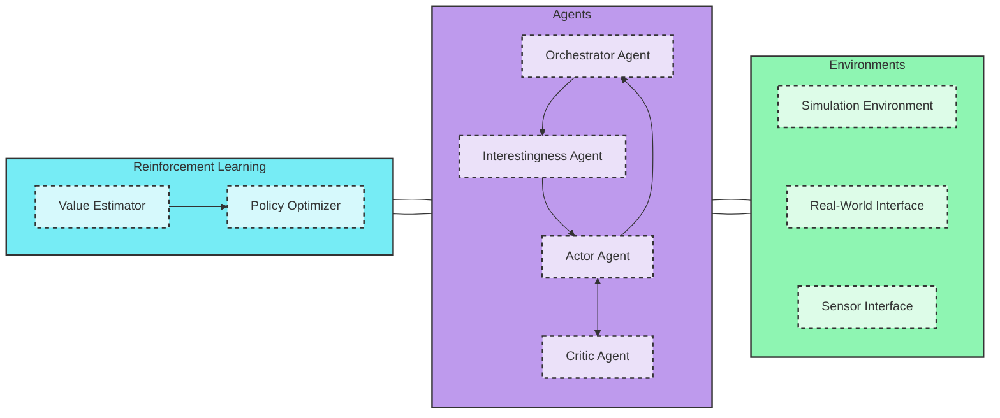

# MARS - Multi-Agent Reasoning Systems

MARS is an open-source framework for training and inferencing multi-agent reasoning systems. It provides a structured approach for managing multi-agent environments, enabling sophisticated reasoning, planning, and autonomous behaviors. Designed for researchers and developers, MARS supports rapid prototyping and advanced experimentation in multi-agent AI.

## Key Capabilities

- **Structured Multi-Agent Framework:** Easily configure and manage multiple autonomous agents.
- **Flexible Integration:** Seamlessly combine reasoning, planning, and autonomous functionalities.
- **Online Learning Mode:** Continuously train and improve agent capabilities as they interact with real-world data.
- **Modular Architecture:** Extend and customize components for specific research or application needs.

## Use Cases

**Reasoning:**  
Solving complex tasks  
Conducting deep scientific research  
Tackling intricate coding and software engineering challenges  
Collaborating with humans to accomplish professional and technical projects  

**Planning:**  
Designing and scheduling a sequence of actions for robotics, e.g., planning the execution of cleaning tasks  
Organizing the experimental steps for addressing sophisticated research questions  

**Autonomy:**  
Assisting users by collecting travel preferences, finding and booking flights and hotels automatically  
Enabling robotics systems to navigate complex environments and complete tasks independently  

## System Architecture

The original system diagram is available [here](https://github.com/rezaho/MARS/blob/main/system_diagram_MARS.jpg).




### Components Overview

- **Reinforcement Learning (RL):**  
  Contains components that support reinforcement learning:
  - **Policy Optimizer:** Optimizes agent policies based on reward signals.
  - **Value Estimator:** Evaluates state or action values to inform decision-making.

- **Agents:**  
  Encompasses a variety of agent types responsible for different roles:
  - **Orchestrator Agent:** Coordinates overall actions among agents.
  - **Interestingness Agent:** Prioritizes significant inputs or events.
  - **Actor Agent:** Executes actions within the environment.
  - **Critic Agent:** Evaluates and provides feedback on agent performance.

- **Environments:**  
  Represents both simulation setups and real-world interfaces:
  - **Simulation Environment:** Provides a controlled setting for experiments and training.
  - **Real-World Interface:** Connects the system to live operational data.

## Repository Structure

```
MARS/
├── docs/                         
│   └── system_diagram_MARS.jpg   # Original system architecture diagram
├── src/                          
│   ├── agents/                  # Implementations of various multi-agent types
│   ├── topology/                # Stores the connections and topology between agents, including orchestrator interactions
│   ├── inference/               # Modules for reasoning and inference
│   ├── learning/                # Online learning components and training scripts
│   └── tasks/                   # Task management and scheduling modules
├── examples/                    
│   ├── reasoning_example/       # Demonstration of a reasoning-based agent
│   ├── planning_example/        # Example for a planning-focused implementation
│   └── autonomy_example/        # Use case for autonomous agents
├── tests/                       # Automated tests and validation suites
├── README.md                    # This documentation file
└── LICENSE                      # MIT License file
```

## Getting Started

1. **Clone the Repository:**
   ```bash
   git clone https://github.com/rezaho/MARS.git
   cd MARS
   ```

2. **Install Dependencies:**
   Refer to the instructions in the `docs/` folder or the README files in the relevant subdirectories under `src/`.

3. **Run Examples:**
   Navigate to the `examples/` directory to see MARS in action. For example, to run a reasoning agent demo:
   ```bash
   cd examples/reasoning_example
   ./run.sh
   ```

4. **Explore Online Learning:**
   Execute training scripts located in the `src/learning/` directory to observe how agents adapt via online learning.

## Contributing

Contributions are welcomed! For significant changes, please open an issue to discuss your ideas before you begin. Fork the repository, implement your modifications, and submit a pull request.

## License

This project is released under the [MIT License](LICENSE).

## Questions and Feedback

For any questions or feedback, please open an issue in the repository or join the discussions on GitHub.

Happy coding and exploring multi-agent reasoning systems with MARS!

