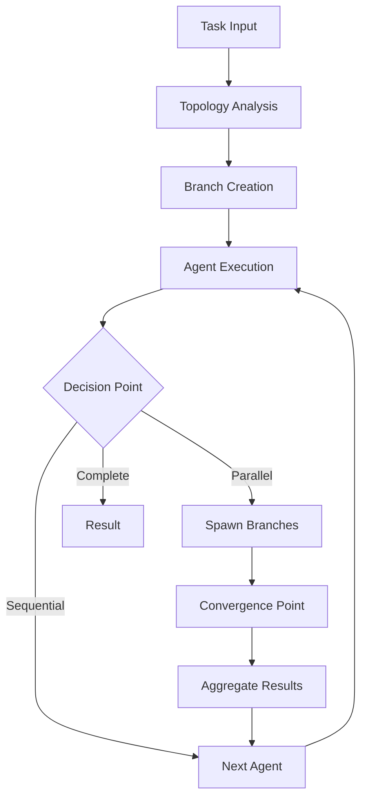

# MARSYS - Multi-Agent Reasoning Systems

<div align="center">


[](https://www.python.org/)
[](LICENSE)
[](https://cla-assistant.io/rezaho/MARSYS)
[](https://marsys.io)
[](tests/)

**A powerful framework for orchestrating collaborative AI agents with sophisticated reasoning, planning, and autonomous capabilities**

[📚 Documentation](https://marsys.io) | [🚀 Quick Start](#quick-start) | [💡 Examples](examples/) | [🤝 Contributing](#contributing)

</div>

---

## 📢 Latest News & Updates

### 🎉 MARSYS v0.1 Beta Released! (January 2025)

We're excited to announce the first beta release of MARSYS with major new features:

- **🌐 Dynamic Branching System**: Revolutionary parallel execution with runtime branch spawning and convergence
- **🔄 Three-Way Topology**: Define workflows using string notation, object-based, or pattern configurations
- **💾 State Persistence**: Full pause/resume capability with checkpointing and recovery
- **👥 User Interaction Nodes**: Built-in human-in-the-loop support for approval workflows and error recovery
- **📊 Enhanced Monitoring**: Real-time execution tracking with StatusManager and comprehensive metrics
- **🎯 Rules Engine**: Flexible constraint system for timeouts, resource limits, and custom business logic
- **🔧 Tool System**: Automatic OpenAI-compatible schema generation from Python functions

[Read the full release notes →](CHANGELOG.md)

---

## 🌟 Key Features

### Core Capabilities

- **🤖 Multi-Agent Orchestration**: Coordinate complex workflows with multiple specialized agents
- **⚡ Parallel Execution**: True parallel processing with AgentPool and dynamic branch spawning
- **🧠 Flexible Topologies**: 7 pre-defined patterns (hub-and-spoke, pipeline, mesh, hierarchical, star, ring, broadcast)
- **💬 Conversation Management**: Sophisticated memory system with retention policies
- **🛠️ Tool Integration**: Seamless integration with external tools and APIs
- **🔐 Error Recovery**: Intelligent error handling with retry strategies and user intervention
- **📈 Error Recovery & Observability**: Advanced error handling, monitoring, and execution tracking

### Advanced Features

- **Dynamic Convergence**: Automatic detection and synchronization of parallel branches
- **Nested Execution**: Hierarchical branch structures with parent-child relationships
- **State Management**: Persist and restore execution state across sessions
- **Rule-Based Control**: Define execution constraints and business logic
- **Multi-Model Support**: Works with OpenAI, Anthropic, Google, Groq, and local models
- **Browser Automation**: Built-in browser agents for web interaction
- **Rich Communication**: Enhanced terminal output with colors and formatting

---

## 🚀 Quick Start

### Installation

#### Recommended Setup with uv (10-100x faster than pip)

**Step 1: Create and activate a virtual environment**

[uv](https://github.com/astral-sh/uv) is the recommended package manager for MARSYS. Install it first if you haven't:
```bash
# Install uv (Unix/macOS)
curl -LsSf https://astral.sh/uv/install.sh | sh

# Or on Windows (PowerShell)
powershell -c "irm https://astral.sh/uv/install.ps1 | iex"
```

Create and activate your virtual environment:
```bash
# Create virtual environment with uv
uv venv

# Activate (Unix/macOS)
source .venv/bin/activate

# Activate (Windows)
.venv\Scripts\activate

# Or use uv run without explicit activation
uv run python your_script.py
```

**Step 2: Install MARSYS**

Basic installation (recommended for most users):
```bash
uv pip install marsys
```

With local model support (PyTorch, Transformers):
```bash
uv pip install marsys[local-models]
```

For production inference (vLLM, Flash Attention):
```bash
uv pip install marsys[production]
```

For development:
```bash
uv pip install marsys[dev]
```

#### Alternative Installation Methods

**Using pip (standard method)**
```bash
# Create virtual environment
python -m venv .venv
source .venv/bin/activate  # Unix/macOS
# .venv\Scripts\activate  # Windows

# Install
pip install marsys
```

**From source**
```bash
git clone https://github.com/rezaho/MARSYS.git
cd MARSYS
pip install -e .[dev]
```

### Required: API Key Configuration

**⚠️ Before running any examples, configure your API keys:**

MARSYS requires API keys for model providers. Choose one of these methods:

**Method 1: Environment variables (recommended for production)**
```bash
# Unix/macOS/Linux
export OPENAI_API_KEY="your-key-here"
export ANTHROPIC_API_KEY="your-key-here"
export GOOGLE_API_KEY="your-key-here"
export OPENROUTER_API_KEY="your-key-here"

# Windows (Command Prompt)
set OPENAI_API_KEY=your-key-here

# Windows (PowerShell)
$env:OPENAI_API_KEY="your-key-here"
```

**Method 2: `.env` file (recommended for development)**
```bash
# Create .env file in your project root
cat > .env << EOF
OPENAI_API_KEY=your-key-here
ANTHROPIC_API_KEY=your-key-here
GOOGLE_API_KEY=your-key-here
OPENROUTER_API_KEY=your-key-here
EOF
```

MARSYS will automatically load `.env` files using `python-dotenv`.

### Optional: Playwright Setup (Only for BrowserAgent)

**⚠️ Only required if you plan to use BrowserAgent for web automation**

After installing the `playwright` package, install browser binaries:
```bash
# Install Chromium (recommended)
playwright install chromium

# Or install all browsers
playwright install

# With system dependencies (Linux)
playwright install --with-deps chromium
```

If you don't use BrowserAgent, you can skip this step entirely.

### Basic Usage

Here's a simple three-agent workflow:

```python
import asyncio
from marsys import Orchestra, Agent
from marsys.models import ModelConfig

async def main():
    # Use a single model configuration
    model_config = ModelConfig(
        type="api",
        name="gpt-4",
        provider="openai"
    )

    # Create three specialized agents
    data_collector = Agent(
        model_config=model_config,
        agent_name="DataCollector",
        description="Collects and gathers relevant data"
    )

    analyzer = Agent(
        model_config=model_config,
        agent_name="Analyzer",
        description="Analyzes collected data and finds patterns"
    )

    reporter = Agent(
        model_config=model_config,
        agent_name="Reporter",
        description="Creates comprehensive reports from analysis"
    )

    # Define sequential workflow
    topology = {
        "nodes": ["DataCollector", "Analyzer", "Reporter"],
        "edges": [
            "DataCollector -> Analyzer",
            "Analyzer -> Reporter"
        ]
    }

    # Run the workflow
    result = await Orchestra.run(
        task="Analyze market trends in the technology sector",
        topology=topology
    )

    print(result.final_response)

asyncio.run(main())
```

### Advanced Example: Parallel Research Team

```python
from marsys import Orchestra, AgentPool, PatternConfig
from marsys.config import ExecutionConfig, StatusConfig

# Create agent pool for parallel execution
research_pool = AgentPool(
    agent_class=ResearchAgent,
    num_instances=3,
    model_config={"model": "gpt-4", "temperature": 0.7}
)

# Define complex topology
topology = PatternConfig.hub_and_spoke(
    hub="Coordinator",
    spokes=["ResearchPool", "Analyzer", "Reporter"],
    parallel_spokes=True
)

# Configure execution
config = ExecutionConfig(
    convergence_timeout=300,
    status=StatusConfig.from_verbosity(2),  # Verbose output
    steering_mode="auto"  # Automatic retry with guidance
)

# Execute with state persistence
result = await Orchestra.run(
    task="Analyze market trends across 5 industries",
    topology=topology,
    execution_config=config,
    state_manager=StateManager(FileStorageBackend("./state"))
)
```

[More examples →](examples/)

---

## 📖 Documentation

Comprehensive documentation is available at [https://marsys.io](https://marsys.io)

### Quick Links

- **Getting Started**
  - [Installation Guide](https://marsys.io/getting-started/installation)
  - [Quick Start Tutorial](https://marsys.io/getting-started/quick-start)
  - [Your First Agent](https://marsys.io/getting-started/first-agent)

- **Core Concepts**
  - [Agents & Memory](https://marsys.io/concepts/agents)
  - [Topology System](https://marsys.io/concepts/topology)
  - [Execution Flow](https://marsys.io/concepts/execution-flow)
  - [Branching Model](https://marsys.io/concepts/branching)

- **API Reference**
  - [Orchestra API](https://marsys.io/api/orchestra)
  - [Agent API](https://marsys.io/api/agent-class)
  - [Configuration API](https://marsys.io/api/configuration)
  - [Complete API Docs](https://marsys.io/api/overview)

---

## 🏗️ System Architecture

MARSYS uses a sophisticated branching execution model that enables true parallel processing and dynamic workflow adaptation:



### Key Components

- **Orchestra**: High-level coordination and workflow management
- **Topology System**: Defines agent relationships and allowed interactions
- **Branch Executor**: Manages parallel execution paths
- **Validation Processor**: Centralizes response parsing and validation
- **Rules Engine**: Enforces constraints and business logic
- **State Manager**: Handles persistence and recovery
- **Communication Manager**: Manages user interactions

[Architecture documentation →](https://marsys.io/concepts/architecture)

---

## 🛣️ Roadmap

### Q1 2025 - Performance & Scale
- **Distributed Execution**: Multi-machine agent coordination with message passing
- **Advanced Caching**: Intelligent result caching and memoization
- **Stream Processing**: Real-time streaming responses for long-running tasks

### Q2 2025 - Intelligence & Learning
- **Self-Optimizing Topologies**: Automatic topology adjustment based on task patterns
- **Agent Fine-tuning**: In-workflow agent specialization and improvement
- **Execution History Learning**: Pattern recognition from historical executions

### Q3 2025 - Advanced Features
- **Workflow Designer UI**: Visual topology builder and execution monitor
- **Production Readiness**: Performance optimizations and scalability improvements
- **Advanced Observability**: OpenTelemetry integration, detailed tracing, and analytics

[Full roadmap →](ROADMAP.md)

---

## 📊 Use Cases

MARSYS excels in complex, multi-step workflows requiring coordination between specialized agents:

### Research & Analysis
- Multi-source information gathering
- Comparative analysis across domains
- Report generation with fact-checking

### Software Development
- Code generation with review cycles
- Bug analysis and fixing
- Architecture design and validation

### Business Automation
- Document processing pipelines
- Customer support workflows
- Data extraction and transformation

### Creative Applications
- Content generation with editing loops
- Multi-perspective storytelling
- Design iteration with feedback

[More use cases →](https://marsys.io/use-cases)

---

## 🤝 Contributing

We welcome contributions from the community! MARSYS is an open-source project that thrives on collaboration.

### 📝 Contributor License Agreement (CLA)

**Before your first contribution can be merged, you must sign our CLA.** This is a one-time, automated process:

1. Open a pull request
2. CLA Assistant bot will comment with a link
3. Click the link and sign (takes 1 minute)
4. Your PR will be automatically unblocked

**Why a CLA?** The CLA ensures we can maintain flexible licensing while keeping MARSYS open-source:
- Enables potential dual-licensing in the future
- Protects the project's sustainability and long-term development
- Maintains licensing flexibility for the project

You retain ownership of your code and can use it elsewhere. Read the [full CLA details](docs/CLA.md) and [copyright information](COPYRIGHT).

### How to Contribute

1. **Sign the CLA** (automatic on first PR - see above)
2. **Fork the repository** and create your branch from `main`
3. **Make your changes** and ensure tests pass
4. **Write/update tests** for your changes
5. **Update documentation** as needed
6. **Submit a pull request** with clear description

### Development Setup

```bash
# Clone the repository
git clone https://github.com/rezaho/MARSYS.git
cd MARSYS

# Install in development mode
pip install -e ".[dev]"

# Run tests
pytest tests/

# Run linting
flake8 src/
black src/ --check
```

### Areas for Contribution

- 🐛 Bug fixes and improvements
- 📚 Documentation enhancements
- 🧪 Test coverage expansion
- 🎨 New agent implementations
- 🔌 Integration with external services
- 🌐 Internationalization support

[Contributing guide →](CONTRIBUTING.md)

---

## 📚 Citation

If you use MARSYS in your research or projects, please cite:

```bibtex
@software{marsys2025,
  author = {Hosseini, Reza},
  title = {MARSYS: Multi-Agent Reasoning Systems Framework},
  year = {2025},
  publisher = {GitHub},
  url = {https://github.com/rezaho/MARSYS}
}
```

### Academic Paper

```bibtex
@article{hosseini2025marsys,
  title={MARSYS: A Framework for Orchestrating Multi-Agent Reasoning Systems with Dynamic Branching and Convergence},
  author={Hosseini, Reza},
  journal={arXiv preprint arXiv:2025.xxxxx},
  year={2025}
}
```

---

## 🛡️ License

MARSYS is released under the **Apache License 2.0**. See [LICENSE](LICENSE) for full terms.

### Copyright & Ownership

Copyright © 2025 **Marsys Project**
Original Author: [rezaho](https://github.com/rezaho) (reza@marsys.io)

**Important:** The copyright is held solely by the original author. Contributors grant a license to their contributions but do not transfer copyright ownership. See [COPYRIGHT](COPYRIGHT) for details.

### Contributing

By contributing to MARSYS, you agree that your contributions will be licensed under the Apache License 2.0, subject to our [Contributor License Agreement](docs/CLA.md). See [CONTRIBUTING.md](CONTRIBUTING.md) for full contribution guidelines.

---

## 🙏 Acknowledgments

Special thanks to:
- The open-source community for invaluable feedback and contributions
- Model providers (OpenAI, Anthropic, Google) for their powerful APIs
- Early adopters and testers who helped shape MARSYS

---

## 📮 Contact & Support

- **Documentation**: [https://marsys.io](https://marsys.io)
- **GitHub Issues**: [Bug reports and feature requests](https://github.com/rezaho/MARSYS/issues)
- **Discussions**: [Community forum](https://github.com/rezaho/MARSYS/discussions)
- **Email**: reza.hosseini@marsys.io
- **Twitter**: [@marsys_ai](https://twitter.com/marsys_ai)

---

<div align="center">

**Built with ❤️ by [Reza Hosseini](https://github.com/rezaho) and contributors**

⭐ Star us on GitHub — it helps!

[Website](https://marsys.io) • [Documentation](https://marsys.io/docs) • [Examples](examples/) • [Blog](https://marsys.io/blog)

</div>