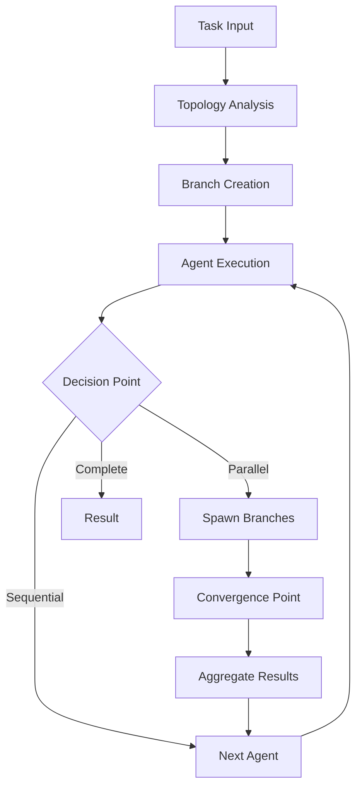

# MARSYS - Multi-Agent Reasoning Systems

<div align="center">


[](https://www.python.org/)
[](LICENSE)
[](https://marsys.io)
[](tests/)

**A powerful framework for orchestrating collaborative AI agents with sophisticated reasoning, planning, and autonomous capabilities**

[📚 Documentation](https://marsys.io) | [🚀 Quick Start](#quick-start) | [💡 Examples](examples/) | [🤝 Contributing](#contributing)

</div>

---

## 📢 Latest News & Updates

### 🎉 MARSYS v0.1 Beta Released! (January 2025)

We're excited to announce the first beta release of MARSYS with major new features:

- **🌐 Dynamic Branching System**: Revolutionary parallel execution with runtime branch spawning and convergence
- **🔄 Three-Way Topology**: Define workflows using string notation, object-based, or pattern configurations
- **💾 State Persistence**: Full pause/resume capability with checkpointing and recovery
- **👥 User Interaction Nodes**: Built-in human-in-the-loop support for approval workflows and error recovery
- **📊 Enhanced Monitoring**: Real-time execution tracking with StatusManager and comprehensive metrics
- **🎯 Rules Engine**: Flexible constraint system for timeouts, resource limits, and custom business logic
- **🔧 Tool System**: Automatic OpenAI-compatible schema generation from Python functions

[Read the full release notes →](CHANGELOG.md)

---

## 🌟 Key Features

### Core Capabilities

- **🤖 Multi-Agent Orchestration**: Coordinate complex workflows with multiple specialized agents
- **⚡ Parallel Execution**: True parallel processing with AgentPool and dynamic branch spawning
- **🧠 Flexible Topologies**: 7 pre-defined patterns (hub-and-spoke, pipeline, mesh, hierarchical, star, ring, broadcast)
- **💬 Conversation Management**: Sophisticated memory system with retention policies
- **🛠️ Tool Integration**: Seamless integration with external tools and APIs
- **🔐 Error Recovery**: Intelligent error handling with retry strategies and user intervention
- **📈 Error Recovery & Observability**: Advanced error handling, monitoring, and execution tracking

### Advanced Features

- **Dynamic Convergence**: Automatic detection and synchronization of parallel branches
- **Nested Execution**: Hierarchical branch structures with parent-child relationships
- **State Management**: Persist and restore execution state across sessions
- **Rule-Based Control**: Define execution constraints and business logic
- **Multi-Model Support**: Works with OpenAI, Anthropic, Google, Groq, and local models
- **Browser Automation**: Built-in browser agents for web interaction
- **Rich Communication**: Enhanced terminal output with colors and formatting

---

## 🚀 Quick Start

### Installation

MARSYS offers flexible installation options based on your needs:

#### Basic Installation (Recommended)
Includes core framework, browser automation, UI, and tools - everything you need for most use cases:
```bash
pip install marsys
```

This installs:
- ✅ API-based models (OpenAI, Anthropic, Google, Groq)
- ✅ Browser automation with BrowserAgent
- ✅ Rich terminal UI and formatting
- ✅ Web scraping and document tools
- ✅ State persistence and checkpointing

#### With Local Model Support
For running local LLMs/VLMs with PyTorch and Transformers:
```bash
pip install marsys[local-models]
```

Additional features:
- 🤖 Local model inference (Transformers, PEFT)
- 🎓 Fine-tuning and reinforcement learning (TRL)
- 📹 Vision model support (including Qwen-VL)

#### For Production Inference
High-performance inference with vLLM and Flash Attention:
```bash
pip install marsys[production]
```

#### For Development
Complete installation with testing tools and documentation builders:
```bash
pip install marsys[dev]
```

#### Using uv (Faster)
[uv](https://github.com/astral-sh/uv) is a blazing-fast Python package installer (10-100x faster than pip):
```bash
# Install uv first
curl -LsSf https://astral.sh/uv/install.sh | sh

# Install marsys with local models
uv pip install marsys[local-models]
```

#### From Source
```bash
git clone https://github.com/rezaho/MARSYS.git
cd MARSYS
pip install -e .[dev]
```

### Post-Installation Setup

#### Playwright Browsers (for BrowserAgent)
```bash
playwright install
```

#### API Keys (for API-based models)
Set environment variables for your API provider:
```bash
export OPENAI_API_KEY="your-key-here"
export ANTHROPIC_API_KEY="your-key-here"
export GOOGLE_API_KEY="your-key-here"
export OPENROUTER_API_KEY="your-key-here"
```

Or use a `.env` file with `python-dotenv`.

### Basic Usage

Here's a simple three-agent workflow:

```python
import asyncio
from marsys import Orchestra, Agent
from marsys.models import ModelConfig

async def main():
    # Use a single model configuration
    model_config = ModelConfig(
        type="api",
        name="gpt-4",
        provider="openai"
    )

    # Create three specialized agents
    data_collector = Agent(
        model_config=model_config,
        agent_name="DataCollector",
        description="Collects and gathers relevant data"
    )

    analyzer = Agent(
        model_config=model_config,
        agent_name="Analyzer",
        description="Analyzes collected data and finds patterns"
    )

    reporter = Agent(
        model_config=model_config,
        agent_name="Reporter",
        description="Creates comprehensive reports from analysis"
    )

    # Define sequential workflow
    topology = {
        "nodes": ["DataCollector", "Analyzer", "Reporter"],
        "edges": [
            "DataCollector -> Analyzer",
            "Analyzer -> Reporter"
        ]
    }

    # Run the workflow
    result = await Orchestra.run(
        task="Analyze market trends in the technology sector",
        topology=topology
    )

    print(result.final_response)

asyncio.run(main())
```

### Advanced Example: Parallel Research Team

```python
from marsys import Orchestra, AgentPool, PatternConfig
from marsys.config import ExecutionConfig, StatusConfig

# Create agent pool for parallel execution
research_pool = AgentPool(
    agent_class=ResearchAgent,
    num_instances=3,
    model_config={"model": "gpt-4", "temperature": 0.7}
)

# Define complex topology
topology = PatternConfig.hub_and_spoke(
    hub="Coordinator",
    spokes=["ResearchPool", "Analyzer", "Reporter"],
    parallel_spokes=True
)

# Configure execution
config = ExecutionConfig(
    convergence_timeout=300,
    status=StatusConfig.from_verbosity(2),  # Verbose output
    steering_mode="auto"  # Automatic retry with guidance
)

# Execute with state persistence
result = await Orchestra.run(
    task="Analyze market trends across 5 industries",
    topology=topology,
    execution_config=config,
    state_manager=StateManager(FileStorageBackend("./state"))
)
```

[More examples →](examples/)

---

## 📖 Documentation

Comprehensive documentation is available at [https://marsys.io](https://marsys.io)

### Quick Links

- **Getting Started**
  - [Installation Guide](https://marsys.io/getting-started/installation)
  - [Quick Start Tutorial](https://marsys.io/getting-started/quick-start)
  - [Your First Agent](https://marsys.io/getting-started/first-agent)

- **Core Concepts**
  - [Agents & Memory](https://marsys.io/concepts/agents)
  - [Topology System](https://marsys.io/concepts/topology)
  - [Execution Flow](https://marsys.io/concepts/execution-flow)
  - [Branching Model](https://marsys.io/concepts/branching)

- **API Reference**
  - [Orchestra API](https://marsys.io/api/orchestra)
  - [Agent API](https://marsys.io/api/agent-class)
  - [Configuration API](https://marsys.io/api/configuration)
  - [Complete API Docs](https://marsys.io/api/overview)

---

## 🏗️ System Architecture

MARSYS uses a sophisticated branching execution model that enables true parallel processing and dynamic workflow adaptation:



### Key Components

- **Orchestra**: High-level coordination and workflow management
- **Topology System**: Defines agent relationships and allowed interactions
- **Branch Executor**: Manages parallel execution paths
- **Validation Processor**: Centralizes response parsing and validation
- **Rules Engine**: Enforces constraints and business logic
- **State Manager**: Handles persistence and recovery
- **Communication Manager**: Manages user interactions

[Architecture documentation →](https://marsys.io/concepts/architecture)

---

## 🛣️ Roadmap

### Q1 2025 - Performance & Scale
- **Distributed Execution**: Multi-machine agent coordination with message passing
- **Advanced Caching**: Intelligent result caching and memoization
- **Stream Processing**: Real-time streaming responses for long-running tasks

### Q2 2025 - Intelligence & Learning
- **Self-Optimizing Topologies**: Automatic topology adjustment based on task patterns
- **Agent Fine-tuning**: In-workflow agent specialization and improvement
- **Execution History Learning**: Pattern recognition from historical executions

### Q3 2025 - Advanced Features
- **Workflow Designer UI**: Visual topology builder and execution monitor
- **Production Readiness**: Performance optimizations and scalability improvements
- **Advanced Observability**: OpenTelemetry integration, detailed tracing, and analytics

[Full roadmap →](ROADMAP.md)

---

## 📊 Use Cases

MARSYS excels in complex, multi-step workflows requiring coordination between specialized agents:

### Research & Analysis
- Multi-source information gathering
- Comparative analysis across domains
- Report generation with fact-checking

### Software Development
- Code generation with review cycles
- Bug analysis and fixing
- Architecture design and validation

### Business Automation
- Document processing pipelines
- Customer support workflows
- Data extraction and transformation

### Creative Applications
- Content generation with editing loops
- Multi-perspective storytelling
- Design iteration with feedback

[More use cases →](https://marsys.io/use-cases)

---

## 🤝 Contributing

We welcome contributions from the community! MARSYS is an open-source project that thrives on collaboration.

### How to Contribute

1. **Fork the repository** and create your branch from `main`
2. **Make your changes** and ensure tests pass
3. **Write/update tests** for your changes
4. **Update documentation** as needed
5. **Submit a pull request** with clear description

### Development Setup

```bash
# Clone the repository
git clone https://github.com/rezaho/MARSYS.git
cd MARSYS

# Install in development mode
pip install -e ".[dev]"

# Run tests
pytest tests/

# Run linting
flake8 src/
black src/ --check
```

### Areas for Contribution

- 🐛 Bug fixes and improvements
- 📚 Documentation enhancements
- 🧪 Test coverage expansion
- 🎨 New agent implementations
- 🔌 Integration with external services
- 🌐 Internationalization support

[Contributing guide →](CONTRIBUTING.md)

---

## 📚 Citation

If you use MARSYS in your research or projects, please cite:

```bibtex
@software{marsys2025,
  author = {Hosseini, Reza},
  title = {MARSYS: Multi-Agent Reasoning Systems Framework},
  year = {2025},
  publisher = {GitHub},
  url = {https://github.com/rezaho/MARSYS}
}
```

### Academic Paper

```bibtex
@article{hosseini2025marsys,
  title={MARSYS: A Framework for Orchestrating Multi-Agent Reasoning Systems with Dynamic Branching and Convergence},
  author={Hosseini, Reza},
  journal={arXiv preprint arXiv:2025.xxxxx},
  year={2025}
}
```

---

## 🛡️ License

MARSYS is released under the MIT License. See [LICENSE](LICENSE) for details.

---

## 🙏 Acknowledgments

Special thanks to:
- The open-source community for invaluable feedback and contributions
- Model providers (OpenAI, Anthropic, Google) for their powerful APIs
- Early adopters and testers who helped shape MARSYS

---

## 📮 Contact & Support

- **Documentation**: [https://marsys.io](https://marsys.io)
- **GitHub Issues**: [Bug reports and feature requests](https://github.com/rezaho/MARSYS/issues)
- **Discussions**: [Community forum](https://github.com/rezaho/MARSYS/discussions)
- **Email**: reza.hosseini@marsys.io
- **Twitter**: [@marsys_ai](https://twitter.com/marsys_ai)

---

<div align="center">

**Built with ❤️ by [Reza Hosseini](https://github.com/rezaho) and contributors**

⭐ Star us on GitHub — it helps!

[Website](https://marsys.io) • [Documentation](https://marsys.io/docs) • [Examples](examples/) • [Blog](https://marsys.io/blog)

</div>