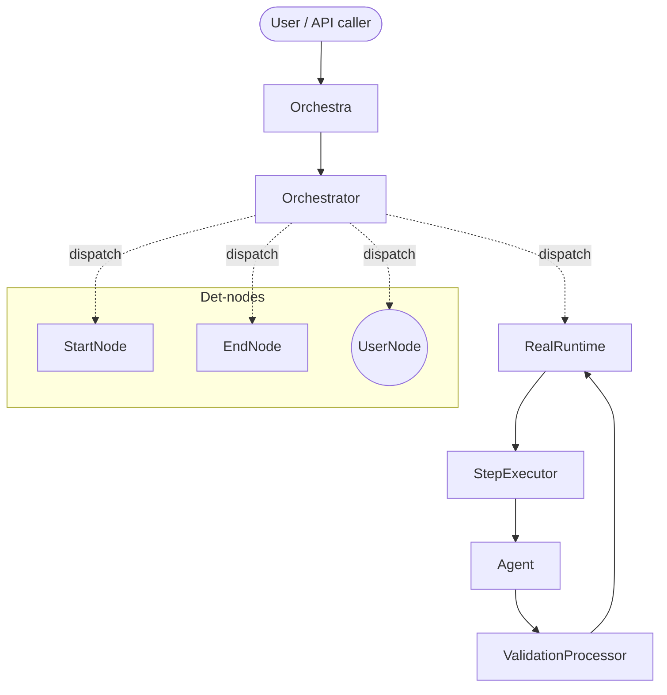

# MARSYS Framework Architecture Overview

!!! info "Updated for v0.3.0"
    The execution stack documented here was rebuilt in commits `bc19b98` (Phase 3 cutover) and `2689a39` … `402b223` (Phase 3.5). `BranchSpawner` / `DynamicBranchSpawner` / `BranchExecutor` were replaced by `Orchestrator` (event loop) + `RealRuntime` (per-branch driver). Deterministic node kinds (`NodeKind.START`/`END`/`USER`; behaviour classes `StartNode`/`EndNode`/`UserNode` — exactly one Start, zero-or-more End/User) drive workflow entry, exit, and human-in-the-loop. See [ADR-006](decisions/ADR-006-deprecation-timeline.md) for the v0.2.x → v0.3.0 migration table and [ADR-008](decisions/ADR-008-unified-node-kind-model.md) for the unified node-kind model.

## 1. System context

MARSYS (Multi-Agent Reasoning Systems) is a framework for orchestrating multiple AI agents to solve complex tasks. It addresses the multi-agent coordination problem with a unified-barrier execution engine that manages dynamic branching, parallelism, convergence, validation, and routing across a topology of agents.

Primary actors:

- **Developers** define topologies (peer agents + det-nodes) and agent instructions.
- **The system** executes agent workflows, coordinating tools and responses.
- **End users** receive final responses (optionally via the `UserNode` det-node for bidirectional human Q&A).

## 2. High-level architecture

`Orchestra` is the public facade. Per workflow run it constructs an `Orchestrator` (the unified-barrier event loop) and a `RealRuntime` (the per-branch step driver), then calls `Orchestrator.run`. The orchestrator drives every active branch through `Runtime.step`, drains its fire queue between ticks, and dispatches det-node hooks (`on_workflow_start`, `on_single_invoke`, `on_dispatch`) inline. `ValidationProcessor` is the single source of truth for parsing coordination tool calls.

## 3. Core components

| Component | Location | Purpose | Criticality |
|-----------|----------|---------|-------------|
| `Orchestra` | `src/marsys/coordination/orchestra.py` | Public facade. Per-run wires Orchestrator + RealRuntime + ValidationProcessor + RulesEngine; applies the legacy migration shim; translates `WorkflowResult` → `OrchestraResult` | TRUNK-CRITICAL |
| `Orchestrator` | `src/marsys/coordination/execution/orchestrator.py` | Unified-barrier event loop. Owns `Branch` and `Barrier` pools, dispatches branches as `asyncio.Task`s, applies the six fire gates in order. Implements `DetNodeContext`. | TRUNK-CRITICAL |
| `RealRuntime` | `src/marsys/coordination/execution/real_runtime.py` | Per-branch step driver. Implements the `Runtime` Protocol: agent acquisition, memory rehydration, validation invocation, coordination-action translation, content-only loop detection. | TRUNK-CRITICAL |
| `DeterministicNode` family | `src/marsys/coordination/execution/det_nodes.py` | Behaviour classes `StartNode` / `EndNode` / `UserNode`, selected from `NodeKind` via the `NODE_KIND_BEHAVIOUR` registry. Non-LLM nodes with explicit lifecycle hooks. | TRUNK-CRITICAL |
| `ValidationProcessor` | `src/marsys/coordination/validation/response_validator.py` | Single source of truth for coordination tool call validation against topology. | TRUNK-CRITICAL |
| `TopologyGraph` | `src/marsys/coordination/topology/graph.py` | Runtime adjacency graph; reachability, rendezvous detection, edge-to-det-node gating (`has_edge_to_endnode`, `has_edge_to_usernode`). | TRUNK-CRITICAL |
| `StepExecutor` | `src/marsys/coordination/execution/step_executor.py` | One model turn per call. Builds the topology-gated coordination tool schema and invokes the agent. | TRUNK-STABLE |
| `AgentInput` | `src/marsys/agents/agent_input.py` | Canonical wrapper for agent step input; `aggregate(...)` produces typed-text-block content lists for multi-source barrier arrivals. | LOAD-BEARING |
| `TraceCollector` | `src/marsys/coordination/tracing/collector.py` | EventBus consumer that builds hierarchical span trees for observability. | BRANCH |

## 4. Execution flow

A typical parallel-aggregation workflow (Coordinator dispatches to two workers, then synthesizes their replies and terminates) flows as follows:

1. **`Orchestra.run(task, topology, …)`** builds an `OrchestraConfig`, normalizes the topology (string / dict / object / pattern → canonical `Topology`), and calls `Orchestra.execute`.
2. **`Orchestra.execute`** invokes `_apply_legacy_topology_shim` (`Orchestra._apply_legacy_topology_shim`, `REMOVE-IN-V0.4`) to translate any `entry_point` / `exit_points` / legacy `Node(kind=USER)` metadata into explicit `Start` / `End` / `User` det-node edges (with `DeprecationWarning` per legacy concept), then binds `UserNode` handlers via `_bind_user_node_handlers`. It then constructs `ValidationProcessor`, `Router`, `RulesEngine`, `RealRuntime`, and `Orchestrator`.
3. **`Orchestrator.init_workflow(task)`** creates the unique ROOT barrier and calls `topology.get_start_node().on_workflow_start(self, task)`. `StartNode` dispatches a branch to each of its outgoing peer agents (the Coordinator, in this example) with `delivery_target = ROOT`.
4. **`Orchestrator.run`** enters its event loop: every `RUNNING` branch is dispatched as an `asyncio.Task` calling `RealRuntime.step(branch)`. The loop awaits `FIRST_COMPLETED`, applies side effects from the returned `StepResult` inline, and re-dispatches newly-runnable branches.
5. **`RealRuntime.step(branch)`** acquires the agent instance from `AgentRegistry`, rehydrates `branch.memory`, calls `StepExecutor.execute_step` (which builds the topology-gated coordination tool schema via `_build_coordination_context` at `step_executor.py:768`), invokes the model, captures any tool calls, and asks `ValidationProcessor.validate_coordination_action(...)` to validate the coordination tool call.
6. **The Coordinator's first step** emits `invoke_agent` with two invocations (the two workers). `RealRuntime._translate` produces an orchestrator `StepResult(kind="PARALLEL_INVOKE", invocations=[…])`.
7. **The Orchestrator** creates a fork barrier with `resolver_branch` = invoking Coordinator branch, transitions Coordinator to `WAITING`, and spawns the two worker branches with `delivery_target` = the new fork barrier.
8. **The two worker branches** run concurrently. Each worker eventually emits `invoke_agent("Coordinator", …)`. Because Coordinator is a convergence point in the topology graph (multiple incoming edges), the orchestrator creates a rendezvous barrier at Coordinator. The workers terminate, delivering their values to that rendezvous.
9. **When both workers have delivered**, the rendezvous barrier passes its six fire gates and fires. The orchestrator calls `_aggregate(barrier)` (`orchestrator.py:1091`), which returns `AgentInput.aggregate({"Worker1": v1, "Worker2": v2})` — a single user `Message` with typed-text-blocks per source. A fresh Coordinator branch is spawned at the rendezvous with that `AgentInput` as input.
10. **The resumed Coordinator** synthesizes the replies and emits `terminate_workflow(answer=…)`. `RealRuntime._translate` produces `StepResult(kind="FINAL_RESPONSE", value=answer)`. The Coordinator branch transitions to `TERMINATED` and delivers `answer` to ROOT.
11. **ROOT fires** (it has no upstream barriers and now has its arrived candidate). `Orchestrator.run` returns a `WorkflowResult`. `Orchestra.execute` translates that into an `OrchestraResult`, emits a `FinalResponseEvent`, finalizes any active `TraceCollector` (writing the JSON trace), and runs auto-cleanup. `Orchestra.run` returns the result.

## 5. Unified barrier

The orchestrator's algorithm is captured as **DP-003: Unified-barrier orchestration** (see [design-principles.md](design-principles.md#dp-003-unified-barrier-orchestration)) and formalized in [ADR-005](decisions/ADR-005-unified-barrier-algorithm.md).

### Data model

`Branch` and `Barrier` are dataclasses defined in `src/marsys/coordination/execution/orchestrator_types.py`:

- **`Branch`** — one execution thread. Fields: `id`, `current_agent`, `status` (`RUNNING` / `WAITING` / `TERMINATED` / `FAILED` / `ABANDONED`), `delivery_target` (single barrier id), `candidate_of`, `step_count`, `memory`. Lifecycle: `RUNNING → WAITING → RUNNING → … → settled`.
- **`Barrier`** — one synchronization point. Fields: `id`, `status` (`OPEN` / `FIRED` / `CANCELLED`), `resolver_branch`, `candidates`, `arrived`, `failed`, `policy`, `rendezvous_node`. ROOT is the unique workflow sink (`resolver_branch=None`).
- **`ConvergencePolicy`** — when to fire (default: `ratio = 1.0`, all candidates required).

### Two creation paths, one shape

**Parallel-fork** — an agent emits `invoke_agent` with multiple invocations. The orchestrator creates a fork barrier with `resolver_branch` = the invoking branch (which transitions to `WAITING`), spawns child branches, and awaits delivery.

**Rendezvous** — an agent in branch B invokes a target Y. If Y is a convergence point (multiple incoming edges in the topology graph), the orchestrator creates a rendezvous barrier at Y via `ensure_barrier` with `resolver_branch` = a freshly-spawned branch at Y. B delivers its value to that barrier and terminates.

Both paths produce identical `Barrier` shapes — there is no `BarrierType` enum.

### The six fire gates

A barrier fires only when ALL of these gates pass, evaluated in order:

1. **status** — barrier is `OPEN`.
2. **ROOT-defer** — for ROOT only: at least one branch has been `RUNNING` since workflow start (prevents premature ROOT-fire on initial dispatch).
3. **upstream** — every upstream barrier has fired (or there is no upstream wiring).
4. **pending** — no expected candidate is still in the pending pool.
5. **vestigial-cancel** — if the barrier has zero arrivals AND no live candidates, it cancels rather than fires.
6. **ratio** — `ConvergencePolicy` is satisfied (default: `arrived / candidates ≥ 1.0`).

### Failure cascade

When a branch fails (via `_fail_to`), the failure propagates up the `delivery_target` chain. Each barrier the failure reaches enters `_fire_with_failure`, which abandons orphan branches per `ConvergencePolicy.terminate_orphans` and propagates the error to the next resolver. ROOT failure sets `_workflow_error` and ends the run.

## 6. Key abstractions

- **`Branch`** — execution unit with isolated memory, single `delivery_target`, and lifecycle status. Lives in `src/marsys/coordination/execution/orchestrator_types.py`.
- **`Barrier`** — synchronization point. Two creation paths (fork vs. rendezvous) produce one shape; ROOT is the unique sink.
- **`Topology`** — canonical node/edge structure (`coordination/topology/core.py`). `TopologyGraph` provides runtime adjacency, divergence/convergence analysis, and the edge-to-det-node gating (`has_edge_to_endnode`, `has_edge_to_usernode`).
- **`DeterministicNode`** — non-LLM behaviour with three lifecycle hooks: `on_workflow_start`, `on_single_invoke`, `on_dispatch`. Behaviour classes `StartNode` / `EndNode` / `UserNode` in `det_nodes.py`, selected from `NodeKind` by the single authoritative `NODE_KIND_BEHAVIOUR` registry (the `RESERVED_NAME_TO_KIND` name→kind lookup is derived from it). Nodes are uniform `Node(kind=…)`; the behaviour instance is materialized at `analyzer._add_nodes`, never stored in `Topology.nodes`.
- **`AgentInput`** — canonical wrapper for input to an agent's step (`src/marsys/agents/agent_input.py`). Factories: `from_text`, `from_message`, `from_messages`, `coerce`, `aggregate`. The `aggregate` path produces typed-text-block content lists (Anthropic-native, OpenAI-compat) for multi-source barrier arrivals.
- **Coordination tools** — four reserved tool names that drive orchestrator state: `invoke_agent`, `terminate_workflow`, `ask_user`, `end_conversation`. Topology gating (in `step_executor._build_coordination_context`) determines which an agent sees in its schema.
- **`Agent`** — `BaseAgent` and `Agent` implement pure `_run()` logic and tool schemas; orchestration is handled externally by `RealRuntime` + `StepExecutor`.
- **Model** — `BaseAPIModel` / `BaseLocalModel` provide unified model invocation via adapter patterns.

## 7. Module boundaries

| Module | Responsible for | NOT responsible for |
|--------|-----------------|---------------------|
| `coordination/` | Orchestration, branching, routing, validation, topology | Agent reasoning logic, provider API calls |
| `coordination/execution/` | Orchestrator, RealRuntime, StepExecutor, det-nodes | Response parsing rules (→ `validation/`), prompt construction (→ `formats/`) |
| `agents/` | `BaseAgent` contract, pure `_run()`, tool schemas, memory policy, `AgentInput` | Coordination tool parsing, tool execution, routing |
| `environment/` | Tool implementations (bash, browser, file ops, search) | Orchestration, validation, topology decisions |
| `models/` | Provider adapters, model invocation, response harmonization | Routing, branching, coordination policies |

## 8. Extension points

- **Add new agents** — subclass `BaseAgent` / `Agent` in `src/marsys/agents/`, implement `_run()`, register via `AgentRegistry`. The orchestrator handles all coordination via topology and coordination tools — agents don't need to know about branching.
- **Add coordination tools** (rare) — extend `CoordinationToolSchemaBuilder` (`coordination/formats/coordination_tools.py:75`) and add a validator method in `ValidationProcessor`. Update `_build_coordination_context` to gate the new tool by topology condition.
- **Add response formats** (advanced) — implement a `BaseResponseFormat` and `ResponseProcessor`, then register via `register_format()` in `coordination/formats/registry.py`. Note: native tool calls are the orchestrator default; custom formats are opt-in.
- **Add det-node kinds** — add a `NodeKind` member, subclass `DeterministicNode` (`coordination/execution/det_nodes.py`), add one `NODE_KIND_BEHAVIOUR` entry, implement the lifecycle hooks. Extension-open: no dispatch-site edits, no `RESERVED_DETNODE_NAMES` (removed — collapsed into `NODE_KIND_BEHAVIOUR`). Add gating helpers on `TopologyGraph` if the new det-node should expose a coordination tool to upstream agents.
- **Add topology patterns** — extend `PatternConfig` in `coordination/topology/patterns.py` or add converters in `coordination/topology/converters/`.
- **Add model providers** — implement a new adapter and register it in `ProviderAdapterFactory` (`models/models.py`).

## 9. Related documentation

### Authoritative refs

| Document | Purpose |
|---|---|
| [Design Principles](design-principles.md) | DP-001 to DP-007 with CORRECT/WRONG examples. **DP-003: Unified-barrier orchestration** is the principle behind this overview. |
| [ADR-001](decisions/ADR-001-branch-based-parallel-execution.md) | Original branch-based execution decision (preserved as historical record; superseded in implementation). |
| [ADR-002](decisions/ADR-002-centralized-response-validation.md) | Centralized response validation (decision still in force; implementation moved to RealRuntime). |
| [ADR-005](decisions/ADR-005-unified-barrier-algorithm.md) | Full unified-barrier algorithm spec (data model, fire gates, failure cascade). |
| [ADR-006](decisions/ADR-006-deprecation-timeline.md) | v0.2.x → v0.3.0 migration table; removal target v0.4. |

### API references

| Document | Purpose |
|---|---|
| [Execution API](../../api/execution.md) | `Orchestrator`, `RealRuntime`, `StepExecutor`, `Branch`, `Barrier`. |
| [Validation API](../../api/validation.md) | `ValidationProcessor`, `ActionType`, `ValidationResult`. |
| [Topology API](../../api/topology.md) | Topology, Node, Edge, det-node helpers. |

### Concept docs

| Document | Purpose |
|---|---|
| [Coordination Tools](../../concepts/coordination-tools.md) | The four tools and topology gating rules. |
| [Det-nodes](../../concepts/det-nodes.md) | StartNode, EndNode, UserNode. |
| [Messages](../../concepts/messages.md#agentinput-the-orchestrator-agent-boundary) | AgentInput at the orchestrator-agent boundary. |
| [Steering and Error Recovery](../../guides/steering-and-error-recovery.md) | Retry tiers and `CONTENT_ONLY_HARD_LIMIT`. |

### Component registry

YAML files under [`components/`](components/) document responsibilities, dependencies, and boundaries for each TRUNK-CRITICAL and TRUNK-STABLE component.
