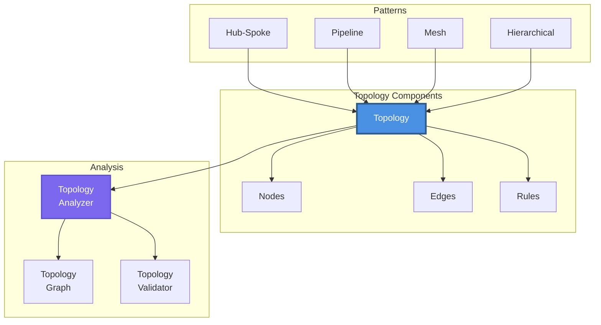
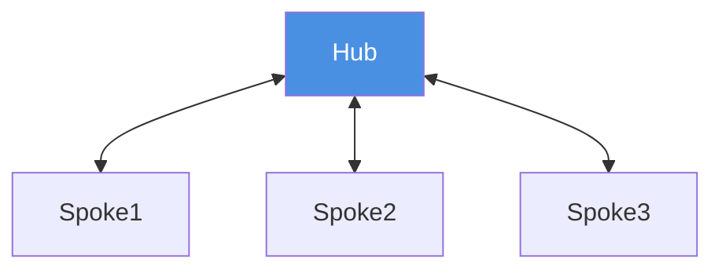
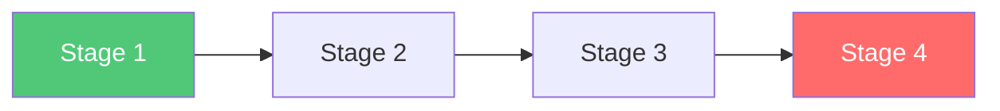
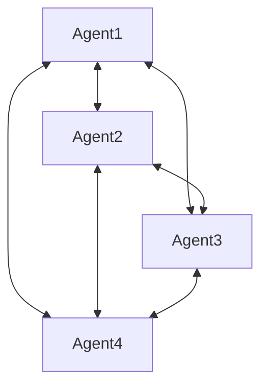
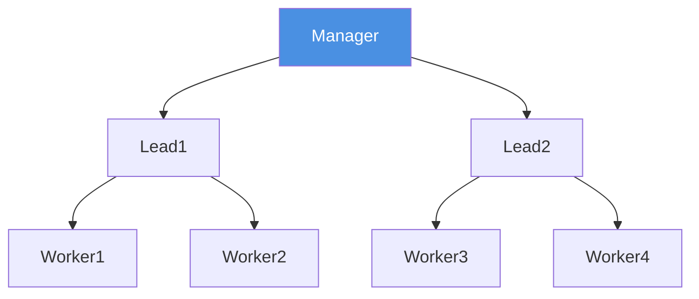

# Topology System

Master the powerful topology system that defines how agents interact, communicate, and collaborate in complex workflows.

## 🎯 Overview

The topology system is the heart of MARSYS's orchestration capabilities. It defines:

- **Agent Relationships**: Who can communicate with whom
- **Execution Flow**: Sequential, parallel, or mixed patterns
- **Permission Management**: Control agent invocation rights
- **Convergence Points**: Where parallel branches merge
- **Rules and Constraints**: Execution policies and limits

## 🏗️ Architecture



## 📝 Four Ways to Define Multi-Agent Systems

MARSYS provides four different approaches to define how agents interact, from simple to sophisticated. We'll demonstrate each approach using the same example: a Researcher agent that gathers information and passes it to a Writer agent.

### 1️⃣ Peer-Based with Auto-Run (Simplest)

Perfect for quick prototyping and simple agent interactions. The topology is automatically created from the `allowed_peers` configuration:

```python
from marsys.agents import Agent
from marsys.models import ModelConfig

# Configure the model
model_config = ModelConfig(
    type="api",
    name="gpt-5",
    provider="openai"
)

# Create agents with allowed_peers
researcher = Agent(
    model_config=model_config,
    name="Researcher",
    goal="Expert at finding and analyzing information",
    instruction="You are a research specialist. Find and analyze information thoroughly.",
    allowed_peers=["Writer"]  # Can invoke Writer
)

writer = Agent(
    model_config=model_config,
    name="Writer",
    goal="Skilled at creating clear, engaging content",
    instruction="You are a skilled writer. Create clear, engaging content based on research.",
    allowed_peers=[]  # Cannot invoke other agents
)

# Run with automatic topology creation
result = await researcher.auto_run(
    task="Research AI trends and write a report",
    max_steps=20,
    verbosity=1
)
```

**Key Features**:
- Topology is auto-generated from `allowed_peers`
- No need to explicitly define nodes and edges
- Great for simple workflows and testing
- Supports user interaction when "User" is in `allowed_peers`

### 2️⃣ String Notation Topology (Clear & Visual)

Define topology using simple string notation with Orchestra:

```python
from marsys.coordination import Orchestra
from marsys.agents import Agent
from marsys.models import ModelConfig

# Create the same agents
model_config = ModelConfig(type="api", name="gpt-5", provider="openai")

researcher = Agent(
    model_config=model_config,
    name="Researcher",
    goal="Expert at finding and analyzing information",
    instruction="You are a research specialist. Find and analyze information thoroughly."
)

writer = Agent(
    model_config=model_config,
    name="Writer",
    goal="Skilled at creating clear, engaging content",
    instruction="You are a skilled writer. Create clear, engaging content based on research."
)

# Define topology with string notation
topology = {
    "nodes": ["Researcher", "Writer"],
    "edges": ["Researcher -> Writer"],  # Researcher can invoke Writer
    "rules": ["max_steps(20)", "timeout(300)"]
}

# Run with Orchestra
result = await Orchestra.run(
    task="Research AI trends and write a report",
    topology=topology
)
```

**Special Notation**:
- `->`: Unidirectional edge
- `<->`: Bidirectional edge (conversation)
- `User`: Special node for human interaction

### 3️⃣ Canonical Object-Based (Type-Safe)

For production systems with full control and type safety:

```python
from marsys.coordination import Orchestra
from marsys.coordination.topology import Topology, Node, Edge, NodeType, EdgeType
from marsys.coordination.rules import TimeoutRule, MaxStepsRule
from marsys.agents import Agent
from marsys.models import ModelConfig

# Create the same agents
model_config = ModelConfig(type="api", name="gpt-5", provider="openai")

researcher = Agent(
    model_config=model_config,
    name="Researcher",
    goal="Expert at finding and analyzing information",
    instruction="You are a research specialist. Find and analyze information thoroughly."
)

writer = Agent(
    model_config=model_config,
    name="Writer",
    goal="Skilled at creating clear, engaging content",
    instruction="You are a skilled writer. Create clear, engaging content based on research."
)

# Define nodes with full control
nodes = [
    Node(
        name="Researcher",
        node_type=NodeType.AGENT,
        metadata={"role": "information_gatherer"}
    ),
    Node(
        name="Writer",
        node_type=NodeType.AGENT,
        metadata={"role": "content_creator"}
    )
]

# Define edges with specific types
edges = [
    Edge(
        source="Researcher",
        target="Writer",
        edge_type=EdgeType.INVOKE,
        metadata={"pass_context": True}
    )
]

# Define rules
rules = [
    TimeoutRule(max_duration_seconds=300),
    MaxStepsRule(max_steps=20)
]

# Create topology
topology = Topology(nodes=nodes, edges=edges, rules=rules)

# Run with Orchestra
result = await Orchestra.run(
    task="Research AI trends and write a report",
    topology=topology
)
```

### 4️⃣ Pattern Configuration (Pre-defined)

Use battle-tested patterns for common multi-agent scenarios:

```python
from marsys.coordination import Orchestra
from marsys.coordination.topology.patterns import PatternConfig
from marsys.agents import Agent
from marsys.models import ModelConfig

# Create the same agents
model_config = ModelConfig(type="api", name="gpt-5", provider="openai")

researcher = Agent(
    model_config=model_config,
    name="Researcher",
    goal="Expert at finding and analyzing information",
    instruction="You are a research specialist. Find and analyze information thoroughly."
)

writer = Agent(
    model_config=model_config,
    name="Writer",
    goal="Skilled at creating clear, engaging content",
    instruction="You are a skilled writer. Create clear, engaging content based on research."
)

# Use Pipeline Pattern for our workflow
topology = PatternConfig.pipeline(
    stages=[
        {"name": "research", "agents": ["Researcher"]},
        {"name": "writing", "agents": ["Writer"]}
    ],
    parallel_within_stage=False  # Sequential stage execution
)

# Run with Orchestra
result = await Orchestra.run(
    task="Research AI trends and write a report",
    topology=topology
)
```

**Other Available Patterns:**
- **Hub-and-Spoke**: Central coordinator with spoke agents
- **Mesh**: Fully connected network where all agents can communicate
- **Hierarchical**: Tree-based delegation structure
- **Ring**: Circular agent chain
- **Star**: Similar to hub-and-spoke with bidirectional edges
- **Broadcast**: One-to-many notification pattern

## 📊 Comparison: Which Approach to Use?

| Method | Best For | Complexity | Key Features |
|--------|----------|------------|--------------|
| **Way 1: allowed_peers + auto_run** | Quick prototyping, simple flows | ⭐ Simplest | Auto-topology, minimal setup, great for testing |
| **Way 2: String notation** | Clear visual flows, medium complexity | ⭐⭐ Moderate | Easy to read, supports bidirectional edges |
| **Way 3: Object-based** | Type-safe production systems | ⭐⭐⭐ Complex | Full control, metadata support, type checking |
| **Way 4: PatternConfig** | Common team structures | ⭐⭐ Moderate | Pre-tested patterns, quick setup for standard workflows |

### Decision Guide:

- **Start with Way 1** if you're:
  - Prototyping or testing
  - Building simple agent chains
  - Want minimal boilerplate

- **Use Way 2** if you:
  - Need clear, readable topology definitions
  - Have moderate complexity (5-10 agents)
  - Want to visualize agent relationships easily

- **Choose Way 3** if you:
  - Building production systems
  - Need type safety and validation
  - Want full control over metadata and edge properties

- **Select Way 4** if you:
  - Have a standard pattern (hub-spoke, pipeline, etc.)
  - Want battle-tested configurations
  - Need to implement common team structures quickly

## 🎨 Available Patterns

### Hub-and-Spoke
Central coordinator with satellite agents:



**Use Cases**: Research teams, customer support, data aggregation

### Pipeline
Sequential stages with optional parallelism:



**Use Cases**: Data processing, content creation, ETL workflows

### Mesh
Fully connected network:



**Use Cases**: Collaborative problem solving, consensus building

### Hierarchical
Tree-based delegation:



**Use Cases**: Organization simulation, cascading tasks

## 🔧 Advanced Features

### Dynamic Topology Mutation

Modify topologies at runtime:

```python
# Start with basic topology
topology = Topology(
    nodes=["Coordinator", "Worker1"],
    edges=["Coordinator -> Worker1"]
)

# Add nodes dynamically
topology.add_node("Worker2")
topology.add_node(Node("Analyzer", node_type=NodeType.AGENT))

# Add edges
topology.add_edge("Coordinator", "Worker2")
topology.add_edge(Edge("Worker2", "Analyzer", bidirectional=True))

# Add rules
topology.add_rule(TimeoutRule(300))
topology.add_rule("max_steps(100)")

# Remove components
topology.remove_node("Worker1")
topology.remove_edge("Coordinator", "Worker1")
```

### Convergence Points

Define where parallel branches merge:

```python
# Manual convergence point
topology = Topology(
    nodes=[
        Node("Splitter", node_type=NodeType.AGENT),
        Node("Worker1", node_type=NodeType.AGENT),
        Node("Worker2", node_type=NodeType.AGENT),
        Node("Worker3", node_type=NodeType.AGENT),
        Node("Aggregator",
             node_type=NodeType.AGENT,
             is_convergence_point=True)  # Convergence point
    ],
    edges=[
        "Splitter -> Worker1",
        "Splitter -> Worker2",
        "Splitter -> Worker3",
        "Worker1 -> Aggregator",
        "Worker2 -> Aggregator",
        "Worker3 -> Aggregator"
    ]
)

# Automatic detection
config = ExecutionConfig(
    auto_detect_convergence=True,  # Auto-detect from topology
    dynamic_convergence_enabled=True,  # Runtime convergence
    convergence_timeout=300.0  # Max wait time
)
```

### Edge Patterns

Special edge behaviors:

```python
from marsys.coordination.topology import EdgePattern

# Alternating conversation
Edge(
    source="Negotiator1",
    target="Negotiator2",
    bidirectional=True,
    pattern=EdgePattern.ALTERNATING,  # Strict turn-taking
    metadata={"max_turns": 5}
)

# Symmetric communication
Edge(
    source="Peer1",
    target="Peer2",
    bidirectional=True,
    pattern=EdgePattern.SYMMETRIC,  # Equal communication rights
)

# Conditional edge
Edge(
    source="Checker",
    target="Escalator",
    metadata={
        "condition": "error_rate > 0.1",  # Only if condition met
        "priority": "high"
    }
)
```

### Rules System

Control execution behavior:

```python
from marsys.coordination.rules import (
    Rule, RuleType, RuleResult, RuleContext,
    TimeoutRule, MaxAgentsRule, MaxStepsRule,
    MemoryLimitRule, ConditionalRule
)

# Built-in rules
rules = [
    TimeoutRule(max_duration_seconds=600),
    MaxAgentsRule(max_agents=20),
    MaxStepsRule(max_steps=100),
    MemoryLimitRule(max_memory_mb=2048),
    ConditionalRule(
        condition=lambda ctx: ctx.error_count < 3,
        action="continue"
    )
]

# Custom rule
class BusinessHoursRule(Rule):
    def __init__(self):
        super().__init__(
            name="business_hours",
            rule_type=RuleType.PRE_EXECUTION,
            priority=10
        )

    async def check(self, context: RuleContext) -> RuleResult:
        from datetime import datetime
        hour = datetime.now().hour

        if 9 <= hour < 17:  # Business hours
            return RuleResult(
                rule_name=self.name,
                passed=True,
                action="allow"
            )
        else:
            return RuleResult(
                rule_name=self.name,
                passed=False,
                action="defer",
                reason="Outside business hours",
                metadata={"retry_at": "09:00"}
            )

# Use custom rule
topology.add_rule(BusinessHoursRule())
```

## 📊 Topology Analysis

The framework provides powerful analysis tools:

```python
from marsys.coordination.topology import TopologyAnalyzer

analyzer = TopologyAnalyzer(topology)

# Find entry points (nodes with no incoming edges)
entry_points = analyzer.get_entry_points()
print(f"Entry points: {entry_points}")  # e.g., ["User", "Scheduler"]

# Find convergence points
convergence_points = analyzer.get_convergence_points()
print(f"Convergence: {convergence_points}")  # e.g., ["Aggregator"]

# Check if conversation pattern exists
has_conversation = analyzer.has_conversation_pattern()
print(f"Has conversation: {has_conversation}")

# Get agent permissions
permissions = analyzer.get_agent_permissions("Coordinator")
print(f"Coordinator can invoke: {permissions}")  # e.g., ["Worker1", "Worker2"]

# Validate topology
is_valid, errors = analyzer.validate()
if not is_valid:
    print(f"Topology errors: {errors}")

# Get execution order (topological sort)
order = analyzer.get_execution_order()
print(f"Execution order: {order}")

# Detect cycles
has_cycles = analyzer.has_cycles()
print(f"Has cycles: {has_cycles}")

# Get shortest path
path = analyzer.get_shortest_path("User", "Reporter")
print(f"Shortest path: {path}")
```

## 🎯 Best Practices

### 1. **Start Simple**
Begin with basic patterns and add complexity as needed:
```python
# Start with this
topology = PatternConfig.hub_and_spoke("Coordinator", ["Worker1", "Worker2"])

# Evolve to this
topology.add_node("Analyzer")
topology.add_edge("Worker1", "Analyzer")
```

### 2. **Use Convergence Points**
Always define clear convergence for parallel work:
```python
Node("Aggregator", is_convergence_point=True)
```

### 3. **Set Appropriate Timeouts**
Different timeouts for different scenarios:
```python
rules = [
    TimeoutRule(60),    # Quick task
    TimeoutRule(3600),  # Long research
]
```

### 4. **Validate Before Execution**
Always validate topology before running:
```python
analyzer = TopologyAnalyzer(topology)
is_valid, errors = analyzer.validate()
assert is_valid, f"Invalid topology: {errors}"
```

### 5. **Document Intent**
Use metadata to document topology purpose:
```python
topology = Topology(
    nodes=[...],
    edges=[...],
    metadata={
        "purpose": "Customer support escalation",
        "version": "2.0",
        "author": "Team Lead"
    }
)
```

## 🚦 Common Patterns

### Research Team
```python
topology = PatternConfig.hub_and_spoke(
    hub="LeadResearcher",
    spokes=["DataCollector", "FactChecker", "Analyst", "Writer"],
    parallel_spokes=True
)
```

### Customer Support
```python
topology = PatternConfig.hierarchical(
    tree={
        "Dispatcher": ["L1Support"],
        "L1Support": ["L2Support"],
        "L2Support": ["Engineering", "Management"]
    }
)
```

### Data Pipeline
```python
topology = PatternConfig.pipeline(
    stages=[
        {"name": "extract", "agents": ["Scraper"]},
        {"name": "transform", "agents": ["Parser", "Cleaner"]},
        {"name": "load", "agents": ["Database"]}
    ],
    parallel_within_stage=True
)
```

### Consensus Building
```python
topology = PatternConfig.mesh(
    agents=["Expert1", "Expert2", "Expert3", "Moderator"],
    fully_connected=True
)
```

## 🔄 Dynamic Behavior

### Runtime Parallel Invocation

Agents can spawn parallel branches dynamically:

```python
# In agent response
{
    "next_action": "parallel_invoke",
    "agents": ["Analyst1", "Analyst2", "Analyst3"],
    "agent_requests": {
        "Analyst1": "Analyze financial data",
        "Analyst2": "Analyze market trends",
        "Analyst3": "Analyze competition"
    }
}
```

### Conditional Routing

Route based on conditions:

```python
# In agent response
{
    "next_action": "invoke_agent",
    "action_input": "ErrorHandler" if error else "NextStep"
}
```

### Dynamic Agent Discovery

Agents can discover peers at runtime:

```python
# Through context
available_agents = context.get("available_agents", [])
specialist = next((a for a in available_agents if "expert" in a.lower()), None)
```

## 🚦 Next Steps

Master topology patterns:

<div class="grid cards" markdown="1">

- :material-code-tags:{ .lg .middle } **[See Examples](../../use-cases/)**

    ---

    Real-world topology implementations

- :material-api:{ .lg .middle } **[API Reference](../../api/)**

    ---

    Detailed topology API documentation

- :material-robot:{ .lg .middle } **[Agent Development](../agents/)**

    ---

    Build agents that work with topologies

- :material-cog:{ .lg .middle } **[Configuration](../../getting-started/configuration/)**

    ---

    Configure execution behavior

</div>

---

!!! success "Topology Mastered!"
    You now understand the topology system! Use it to build complex multi-agent workflows with confidence.