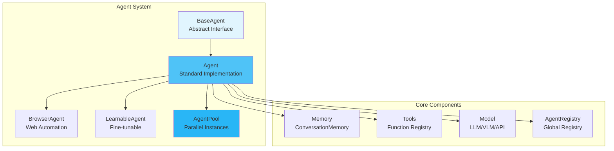

# Agents

Agents are the fundamental building blocks of MARSYS - autonomous AI entities that can perceive, reason, and take actions to accomplish tasks.

!!! info "See Also"
    For detailed class signatures, method parameters, and API reference, see [Agent API Reference](../api/agent-class.md).

## 🎯 Overview

Agents in MARSYS are designed with a **pure execution model** - they implement stateless `_run()` methods with no side effects, enabling:

- **True Parallel Execution**: Multiple instances run concurrently without conflicts
- **Branch Isolation**: Each execution branch maintains independent state
- **State Persistence**: Clean serialization for pause/resume capabilities
- **Testability**: Pure functions are easier to test and debug

## 🏗️ Architecture



## 📦 Agent Classes

### BaseAgent (Abstract)

The foundation interface all agents must implement:

```python
from abc import ABC, abstractmethod
from marsys.agents.memory import Message

class BaseAgent(ABC):
    def __init__(
        self,
        model: Union[BaseLocalModel, BaseAPIModel],
        name: str,
        goal: str,
        instruction: str,
        tools: Optional[Dict[str, Callable]] = None,
        max_tokens: Optional[int] = 10000,
        allowed_peers: Optional[List[str]] = None,
        bidirectional_peers: bool = False,
        is_convergence_point: Optional[bool] = None,
        input_schema: Optional[Any] = None,
        output_schema: Optional[Any] = None,
        memory_retention: str = "session",
        memory_storage_path: Optional[str] = None
    ):
        # Auto-generates tool schemas from function signatures
        # Registers with AgentRegistry
        # Initializes memory manager
        pass

    @abstractmethod
    async def _run(
        self,
        prompt: Any,
        context: Dict[str, Any],
        **kwargs
    ) -> Message:
        """Pure execution logic - NO side effects"""
        pass
```

!!! warning "Pure Execution Rule"
    The `_run()` method must be **pure** - no memory manipulation, no logging to files, no global state changes. All side effects are handled by the coordination layer.

### Agent (Standard Implementation)

The standard agent with built-in capabilities:

```python
from marsys.agents import Agent
from marsys.models import ModelConfig

agent = Agent(
    model_config=ModelConfig(
        type="api",
        name="anthropic/claude-opus-4.6",
        provider="openrouter",
        api_key=os.getenv("OPENROUTER_API_KEY"),
        parameters={"temperature": 0.7},
        max_tokens=12000
    ),
    name="DataAnalyst",
    goal="Analyze data and extract meaningful trends and insights",
    instruction="You are a thorough data analyst...",
    tools={"analyze_data": analyze_data, "create_chart": create_chart},
    memory_retention="session"
)
```

### BrowserAgent

Specialized for web automation tasks:

```python
from marsys.agents import BrowserAgent

browser = await BrowserAgent.create_safe(
    model_config=config,
    name="WebResearcher",
    goal="Research and extract information from web pages",
    instruction="Web research specialist with browser access and automation capabilities",
    headless=True,
    viewport_width=1920,
    viewport_height=1080
)

# Browser-specific capabilities (via browser_tool)
await browser.browser_tool.goto("https://example.com")
await browser.browser_tool.mouse_click(x=500, y=300)  # Click by coordinates
content = await browser.browser_tool.fetch_url("https://example.com")
```

### LearnableAgent

Supports fine-tuning with PEFT methods:

```python
from marsys.agents import LearnableAgent

learnable = LearnableAgent(
    model_config=config,
    name="AdaptiveAssistant",
    goal="Learn from interactions and adapt to user preferences",
    instruction="Adaptive assistant that improves through fine-tuning",
    learning_config={
        "method": "lora",
        "rank": 8,
        "alpha": 32,
        "dropout": 0.1
    }
)

# Fine-tune on examples
await learnable.learn_from_examples(training_data)
```

## 🔄 AgentPool

For true parallel execution with isolated instances:

```python
from marsys.agents.agent_pool import AgentPool

# Create pool of 3 browser agents
pool = AgentPool(
    agent_class=BrowserAgent,
    num_instances=3,
    model_config=config,
    name="BrowserPool",
    goal="Perform parallel web automation tasks",
    instruction="Browser automation agents for concurrent web operations",
    headless=True
)

# Acquire instance for branch (automatic queue management)
async with pool.acquire(branch_id="branch_123") as agent:
    result = await agent.run(task)

# Pool handles:
# - Instance creation with unique names (BrowserPool_0, BrowserPool_1, etc.)
# - Fair allocation with queue-based waiting
# - Automatic release after use
# - Statistics tracking
# - Cleanup on destruction
```

!!! tip "When to Use AgentPool"
    Use AgentPool when you need:
    - True parallel execution of the same agent type
    - Resource isolation (browser instances, API connections)
    - Fair allocation across multiple branches
    - Prevent state conflicts between parallel executions

## 🎯 Creating Agents

### Basic Agent

```python
from marsys.agents import Agent
from marsys.models import ModelConfig

# Simple agent
assistant = Agent(
    model_config=ModelConfig(
        type="api",
        name="anthropic/claude-opus-4.6",
        provider="openrouter",
        max_tokens=12000
    ),
    name="Assistant",
    goal="Provide helpful assistance to users",
    instruction="A helpful AI assistant that responds thoughtfully to queries"
)

# Run the agent
response = await assistant.run(
    prompt="Explain quantum computing",
    context={"user_id": "123"}
)
```

### Agent with Tools

```python
def search_web(query: str, max_results: int = 5) -> List[Dict]:
    """
    Search the web for information.

    Args:
        query: Search query string
        max_results: Maximum number of results

    Returns:
        List of search results with title, url, snippet
    """
    # Implementation here
    return results

def analyze_data(data: List[float], method: str = "mean") -> float:
    """
    Analyze numerical data.

    Args:
        data: List of numerical values
        method: Analysis method (mean, median, std)

    Returns:
        Analysis result
    """
    # Implementation here
    return result

researcher = Agent(
    model_config=config,
    name="Researcher",
    goal="Research specialist with web search and analysis capabilities",
    instruction="You are a research specialist. Use search_web to find information and analyze_data to process results.",
    tools={"search_web": search_web, "analyze_data": analyze_data}  # Auto-generates OpenAI-compatible schemas
)
```

!!! info "Automatic Schema Generation"
    Tool schemas are automatically generated from function signatures and docstrings. Ensure your functions have proper type hints and docstrings for accurate schema generation.

### Custom Agent Class

```python
from marsys.agents import BaseAgent
from marsys.agents.memory import Message

class CustomAnalyzer(BaseAgent):
    def __init__(self, model, **kwargs):
        super().__init__(model, **kwargs)
        # NO instance variables that change during execution
        self.analysis_patterns = self._load_patterns()  # OK - static config

    async def _run(self, prompt, context, **kwargs):
        """Pure execution - no side effects"""

        # Prepare messages
        messages = self._prepare_messages(prompt)

        # Add analysis context
        if context.get("analysis_type") == "detailed":
            messages.append({
                "role": "system",
                "content": "Provide detailed analysis with examples"
            })

        # Call model (pure)
        response = await self.model.run(messages)

        # Return pure Message
        return Message(
            role="assistant",
            content=response.content,
            structured_data={"analyzed": True}
        )
```

## 💬 Response Formats

Agents communicate using standardized response formats:

### Sequential Agent Invocation

```python
{
    "thought": "I need help from the DataAnalyzer",
    "next_action": "invoke_agent",
    "action_input": "DataAnalyzer"
}
```

### Parallel Agent Invocation

```python
{
    "thought": "These analyses can run in parallel",
    "next_action": "parallel_invoke",
    "agents": ["Analyzer1", "Analyzer2", "Analyzer3"],
    "agent_requests": {
        "Analyzer1": "Analyze sales data for Q1",
        "Analyzer2": "Analyze sales data for Q2",
        "Analyzer3": "Analyze sales data for Q3"
    }
}
```

### Tool Call

```python
{
    "next_action": "call_tool",
    "tool_calls": [
        {
            "id": "call_abc123",
            "type": "function",
            "function": {
                "name": "search_web",
                "arguments": "{\"query\": \"latest AI research\", \"max_results\": 10}"
            }
        }
    ]
}
```

### Final Response

```python
{
    "next_action": "final_response",
    "content": "Here is my analysis..."
}

# Or structured response
{
    "next_action": "final_response",
    "content": {
        "summary": "Key findings",
        "details": [...],
        "recommendations": [...]
    }
}
```

## 🧠 Memory Management

Each agent maintains its conversation history through a `ConversationMemory`:

```python
# Memory retention policies
agent = Agent(
    model_config=config,
    name="Assistant",
    goal="Provide general assistance",
    instruction="Answer user requests clearly and accurately.",
    memory_retention="session"  # Options: single_run, session, persistent
)

# Memory is automatically managed during execution
# - single_run: Cleared after each run
# - session: Maintained for workflow duration
# - persistent: Saved to disk for long-term retention
```

For more details, see [Memory Documentation](memory.md).

## 📋 Task Planning

Agents can use task planning to organize complex multi-step operations. Planning is **enabled by default**.

```python
from marsys.agents import Agent
from marsys.agents.planning import PlanningConfig

# Default: planning enabled
agent = Agent(
    model_config=config,
    name="Researcher",
    goal="Research and analyze topics",
    instruction="..."
)

# Disable planning for simple agents
simple_agent = Agent(
    model_config=config,
    name="Calculator",
    goal="Perform calculations",
    instruction="...",
    plan_config=False  # Disable planning
)

# Custom configuration
custom_agent = Agent(
    model_config=config,
    name="Analyst",
    goal="Analyze data",
    instruction="...",
    plan_config=PlanningConfig(
        min_plan_items=3,
        max_plan_items=15,
        compact_mode=True
    )
)
```

Planning provides:

- **Progress tracking** during multi-step tasks
- **Error recovery** context for retries
- **Status visualization** in CLI/web interfaces
- **Automatic cleanup** when memory resets

When planning is enabled, agents have access to tools like `plan_create`, `plan_read`, `plan_update`, `plan_add_item`, `plan_remove_item`, and `plan_clear`.

For detailed documentation, see [Task Planning](planning.md).

## 🔧 Agent Configuration

### Model Configuration

```python
from marsys.models import ModelConfig

# API Model (OpenAI, Anthropic, Google)
api_config = ModelConfig(
    type="api",
    provider="openrouter",
    name="anthropic/claude-opus-4.6",
    api_key=os.getenv("OPENROUTER_API_KEY"),
    parameters={
        "temperature": 0.7
    },
    max_tokens=12000
)

# Local LLM
local_config = ModelConfig(
    type="local",
    name="llama-2-7b",
    model_path="/models/llama-2-7b",
    device="cuda",
    parameters={
        "temperature": 0.8,
        "max_length": 1024
    }
)

# Vision-Language Model
vlm_config = ModelConfig(
    type="api",
    provider="openrouter",
    name="google/gemini-3-pro-preview",
    max_tokens=12000
)
```

### Agent Parameters

```python
agent = Agent(
    model_config=config,
    name="Expert",  # Unique identifier
    goal="Domain expert in...",  # Role definition
    instruction="Detailed instructions...",  # System message
    tools={"tool_name": tool_func},  # Available functions (dict format)
    max_tokens=2000,  # Response limit
    allowed_peers=["Agent1", "Agent2"],  # Can invoke these agents
    memory_retention="session",  # Memory policy
    input_schema=InputSchema,  # Validate inputs
    output_schema=OutputSchema  # Validate outputs
)
```

## 📋 Best Practices

### 1. **Keep _run() Pure**

```python
# ✅ GOOD - Pure function
async def _run(self, prompt, context, **kwargs):
    messages = self._prepare_messages(prompt)
    response = await self.model.run(messages)
    return Message(role="assistant", content=response.content)

# ❌ BAD - Side effects
async def _run(self, prompt, context, **kwargs):
    self.memory.add_message(...)  # NO! Memory handled externally
    await self.save_to_database(...)  # NO! Side effects
    self.state_counter += 1  # NO! Mutable state
    return response
```

### 2. **Clear Agent Descriptions**

```python
# ✅ GOOD - Specific and actionable
goal="""
You are a Python code reviewer specializing in security and performance.
Your responsibilities:
1. Identify security vulnerabilities (SQL injection, XSS, etc.)
2. Suggest performance optimizations
3. Ensure PEP 8 compliance
4. Provide actionable feedback with code examples
Output format: Markdown with code blocks
"""

# ❌ BAD - Vague
goal="You review code"
```

### 3. **Robust Tool Design**

```python
# ✅ GOOD - Type hints, docstring, error handling
def fetch_data(
    source: str,
    filters: Optional[Dict[str, Any]] = None,
    limit: int = 100
) -> List[Dict[str, Any]]:
    """
    Fetch data from specified source.

    Args:
        source: Data source identifier
        filters: Optional filtering criteria
        limit: Maximum records to return

    Returns:
        List of data records

    Raises:
        ValueError: If source is invalid
        ConnectionError: If source is unreachable
    """
    try:
        # Implementation
        return data
    except Exception as e:
        logger.error(f"Failed to fetch data: {e}")
        raise

# ❌ BAD - No types, poor docs, no error handling
def fetch_data(source, filters=None):
    """Get data"""
    return get_from_db(source)
```

### 4. **Use AgentPool for Parallelism**

```python
# ✅ GOOD - Pool for parallel execution
pool = AgentPool(BrowserAgent, num_instances=3, ...)
tasks = ["url1", "url2", "url3"]

async def process_url(url, branch_id):
    async with pool.acquire(branch_id) as agent:
        return await agent.scrape(url)

results = await asyncio.gather(*[
    process_url(url, f"branch_{i}")
    for i, url in enumerate(tasks)
])

# ❌ BAD - Reusing single instance
agent = await BrowserAgent.create_safe(
    model_config=config,
    name="SharedBrowser",
    mode="advanced",
    headless=True,
)
# This will have conflicts with parallel execution
results = await asyncio.gather(*[
    agent.scrape(url) for url in tasks
])
```

## 🎯 Common Patterns

### Research Team Pattern

```python
# Specialized agents
data_collector = Agent(
    model_config=config,
    name="DataCollector",
    goal="Collect data from web sources",
    instruction="You collect data by searching the web and scraping pages.",
    tools={"search_web": search_web, "scrape_page": scrape_page}
)
analyzer = Agent(
    model_config=config,
    name="Analyzer",
    goal="Analyze data statistically",
    instruction="You analyze data using statistical methods and create charts.",
    tools={"statistical_analysis": statistical_analysis, "create_charts": create_charts}
)
writer = Agent(
    model_config=config,
    name="Writer",
    goal="Technical writer creating reports",
    instruction="You write clear technical reports based on analyzed data."
)

# Coordinator orchestrates them
coordinator = Agent(
    model_config=config,
    name="Coordinator",
    goal="Coordinate research projects between specialized agents",
    instruction="""You coordinate research projects. Your workflow:
    1. Ask DataCollector to gather information
    2. Ask Analyzer to process the data
    3. Ask Writer to create the report""",
    allowed_peers=["DataCollector", "Analyzer", "Writer"]
)
```

### Error Recovery Pattern

```python
class ResilientAgent(BaseAgent):
    async def _run(self, prompt, context, **kwargs):
        try:
            # Primary logic
            response = await self.primary_approach(prompt)
            return Message(role="assistant", content=response)
        except SpecificError as e:
            # Fallback approach
            response = await self.fallback_approach(prompt)
            return Message(
                role="assistant",
                content=response,
                metadata={"fallback_used": True}
            )
```

### Validation Pattern

```python
from pydantic import BaseModel, Field

class AnalysisInput(BaseModel):
    data: List[float] = Field(..., min_items=1)
    method: str = Field(..., pattern="^(mean|median|std)$")

class AnalysisOutput(BaseModel):
    result: float
    confidence: float = Field(..., ge=0, le=1)
    metadata: Dict[str, Any]

validator_agent = Agent(
    model_config=config,
    name="ValidatedAnalyzer",
    goal="Run validated statistical analysis",
    instruction="Validate inputs and return structured analysis outputs.",
    input_schema=AnalysisInput,
    output_schema=AnalysisOutput
)
```

## 🚦 Next Steps

<div class="grid cards" markdown="1">

- :material-memory:{ .lg .middle } **[Memory System](memory.md)**

    ---

    Learn how agents maintain context and conversation history

- :material-tools:{ .lg .middle } **[Tool Integration](tools.md)**

    ---

    Extend agent capabilities with custom functions

- :material-message:{ .lg .middle } **[Messages](messages.md)**

    ---

    Understand the message format and types

- :material-api:{ .lg .middle } **[Agent API Reference](../api/agent-class.md)**

    ---

    Complete API documentation for agent classes

</div>

---

!!! success "Agent System Ready!"
    You now understand the agent architecture in MARSYS. Agents provide the intelligence, while the Orchestra provides the coordination.
