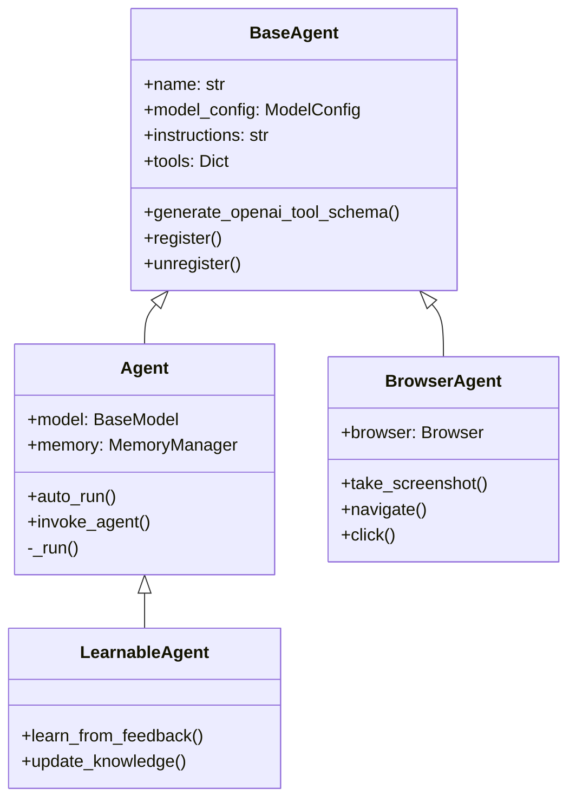

# Agents

Agents are the core building blocks of the Multi-Agent Reasoning Systems (MARSYS) framework. They are autonomous entities that can perceive their environment, make decisions, and take actions.

## What is an Agent?

An agent in this framework is:
- An autonomous entity with its own identity (name)
- Powered by an AI model (LLM/VLM)
- Capable of using tools and invoking other agents
- Maintains conversation history through memory

## Agent Hierarchy



## Creating an Agent

### Basic Agent

```python
from src.agents.agent import Agent
from src.utils.config import ModelConfig

agent = Agent(
    name="assistant",
    model_config=ModelConfig(
        provider="openai",
        model_name="gpt-4",
        temperature=0.7
    ),
    instructions="You are a helpful AI assistant"
)
```

### Agent with Tools

```python
def custom_tool(query: str) -> str:
    """Search for information."""
    return f"Results for: {query}"

agent = Agent(
    name="researcher",
    model_config=ModelConfig(provider="openai", model_name="gpt-4"),
    instructions="You research topics using available tools",
    tools={"search": custom_tool}
)
```

## Agent Capabilities

### 1. **Autonomous Execution**

Agents can work autonomously through multiple steps:

```python
response = await agent.auto_run(
    task="Research AI trends and summarize findings",
    max_steps=5
)
```

### 2. **Tool Usage**

Agents automatically discover and use tools:

```python
# Agent will use the calculate tool when needed
response = await agent.auto_run(
    task="What is 25% of 840?",
    max_steps=2
)
```

### 3. **Inter-Agent Communication**

Agents can invoke other registered agents:

```python
# Agent can call other agents by name
response = await agent.auto_run(
    task="Ask the researcher agent about quantum computing",
    max_steps=3
)
```

## Agent Instructions

Instructions define an agent's behavior and personality:

```python
instructions = """
You are a Python code reviewer. Your responsibilities:
1. Review code for best practices
2. Identify potential bugs
3. Suggest improvements
4. Be constructive and helpful

Always format code suggestions in markdown code blocks.
"""

code_reviewer = Agent(
    name="code_reviewer",
    model_config=ModelConfig(provider="openai", model_name="gpt-4"),
    instructions=instructions
)
```

## Agent Registration

Agents can be registered for discovery by other agents:

```python
# Auto-register on creation
agent = Agent(name="helper", model_config=config, register=True)

# Manual registration
agent = Agent(name="helper", model_config=config, register=False)
agent.register()

# Check if registered
from src.agents.registry import AgentRegistry
if AgentRegistry.get_agent("helper"):
    print("Agent is registered")
```

## Agent Memory

Each agent maintains its own conversation history:

```python
# Memory is automatically managed
response1 = await agent.auto_run(task="Remember the number 42")
response2 = await agent.auto_run(task="What number did I ask you to remember?")
# Agent will remember: "42"
```

## Best Practices

1. **Clear Instructions**: Provide specific, actionable instructions
2. **Appropriate Models**: Choose models based on task complexity
3. **Tool Selection**: Only include necessary tools
4. **Memory Management**: Clear memory for long-running agents
5. **Error Handling**: Agents return error messages gracefully

## Advanced Usage

### Custom Agent Class

```python
from src.agents.base_agent import BaseAgent
from src.models.message import Message

class CustomAgent(BaseAgent):
    async def process(self, task: str) -> Message:
        # Custom processing logic
        result = await self.some_custom_method(task)
        return Message(
            role="assistant",
            content=result,
            name=self.name
        )
    
    async def some_custom_method(self, task: str) -> str:
        # Your custom implementation
        return f"Processed: {task}"
```

### Agent Composition

```python
# Create a team of specialized agents
researcher = Agent(name="researcher", ...)
writer = Agent(name="writer", ...)
editor = Agent(name="editor", ...)

# Orchestrator agent that coordinates the team
orchestrator = Agent(
    name="orchestrator",
    instructions="Coordinate the research, writing, and editing team",
    register=True
)
```

## Next Steps

- Learn about [Messages](messages.md) - How agents communicate
- Explore [Memory](memory.md) - How agents remember context
- Understand [Tools](tools.md) - Extending agent capabilities
