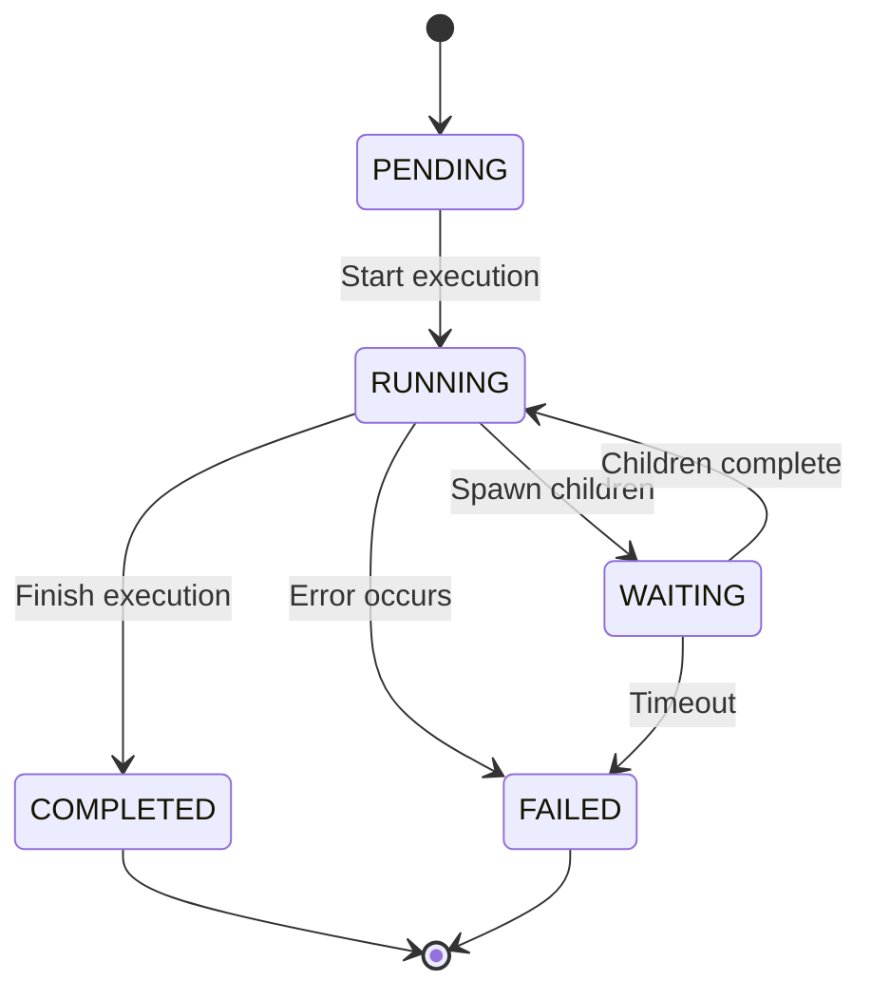

# Branching

Understanding the sophisticated branching model that enables parallel execution and dynamic workflow patterns in MARSYS.

## Overview

Branching is the core mechanism that allows MARSYS to execute complex multi-agent workflows with parallelism, nested execution, and dynamic spawning. Each branch represents an independent execution path that can spawn child branches, wait for convergence, and aggregate results.

## Branch Fundamentals

### What is a Branch?

A branch is an isolated execution context that:
- Maintains its own memory and state
- Executes a sequence of agents
- Can spawn child branches dynamically
- Manages convergence and result aggregation

```python
# Branch structure
ExecutionBranch(
    id="branch_abc123",
    branch_type=BranchType.SIMPLE,
    status=BranchStatus.RUNNING,
    agent_sequence=["Agent1", "Agent2", "Agent3"],
    current_step=1,
    memory={"Agent1": [...], "Agent2": [...]},
    metadata={...}
)
```

## Branch Types

### 1. Simple Branch

Linear execution of agents in sequence:

```python
# Simple branch pattern
Agent1 → Agent2 → Agent3 → Complete

# Configuration
branch = ExecutionBranch(
    branch_type=BranchType.SIMPLE,
    agent_sequence=["Agent1", "Agent2", "Agent3"]
)
```

**Use Cases:**
- Sequential data processing
- Step-by-step analysis
- Linear workflows

### 2. Conversation Branch

Bidirectional dialogue between agents:

```python
# Conversation pattern
Agent1 ↔ Agent2 (multiple turns)

# Configuration
branch = ExecutionBranch(
    branch_type=BranchType.CONVERSATION,
    agent_sequence=["Agent1", "Agent2"],
    metadata={"max_turns": 5}
)
```

**Use Cases:**
- Agent negotiation
- Iterative refinement
- Q&A dialogues

### 3. Nested Branch

Hierarchical branches with parent-child relationships:

```python
# Nested pattern
Parent Branch
├── Child Branch 1
├── Child Branch 2
└── Convergence → Resume Parent

# Parent spawns children
parent_branch = ExecutionBranch(
    branch_type=BranchType.NESTED,
    status=BranchStatus.WAITING  # While children execute
)
```

**Use Cases:**
- Parallel subtasks
- Map-reduce patterns
- Hierarchical workflows

### 4. User Interaction Branch

Human-in-the-loop execution:

```python
# User interaction pattern
Agent → User → Agent

# Configuration
branch = ExecutionBranch(
    branch_type=BranchType.USER_INTERACTION,
    metadata={"user_prompt": "Please review"}
)
```

**Use Cases:**
- Approval workflows
- Error recovery
- Interactive assistance

## Branch Lifecycle

### Branch States

```python
class BranchStatus(Enum):
    PENDING = "pending"        # Not yet started
    RUNNING = "running"        # Currently executing
    WAITING = "waiting"        # Waiting for children
    COMPLETED = "completed"    # Successfully finished
    FAILED = "failed"          # Terminated with error
```

### State Transitions



## Dynamic Branch Spawning

### Parallel Invocation

Agents can spawn parallel branches at runtime:

```python
# Agent response triggers parallel execution
response = {
    "next_action": "parallel_invoke",
    "agents": ["Worker1", "Worker2", "Worker3"],
    "agent_requests": {
        "Worker1": "Process dataset A",
        "Worker2": "Process dataset B",
        "Worker3": "Process dataset C"
    }
}

# System creates child branches
child_branches = [
    ExecutionBranch(id="child_1", parent_id="parent_123"),
    ExecutionBranch(id="child_2", parent_id="parent_123"),
    ExecutionBranch(id="child_3", parent_id="parent_123")
]
```

### Spawning Process

```python
async def spawn_child_branches(parent_branch, agents, requests):
    child_branches = []

    for agent_name in agents:
        # Create child branch
        child = ExecutionBranch(
            branch_type=BranchType.SIMPLE,
            parent_id=parent_branch.id,
            agent_sequence=[agent_name],
            initial_request=requests[agent_name]
        )

        # Start execution
        task = asyncio.create_task(
            execute_branch(child)
        )

        child_branches.append((child, task))

    # Parent enters waiting state
    parent_branch.status = BranchStatus.WAITING
    parent_branch.waiting_for = [c[0].id for c in child_branches]

    return child_branches
```

## Convergence Mechanisms

### Convergence Points

Where parallel branches synchronize:

```python
# Topology defines convergence
topology = {
    "nodes": ["Hub", "W1", "W2", "W3", "Aggregator"],
    "edges": [
        "Hub -> W1", "Hub -> W2", "Hub -> W3",
        "W1 -> Aggregator",  # Convergence point
        "W2 -> Aggregator",
        "W3 -> Aggregator"
    ]
}
```

### Convergence Waiting

```python
async def wait_for_convergence(
    parent_branch,
    child_tasks,
    timeout=300.0
):
    try:
        # Wait for all children with timeout
        results = await asyncio.wait_for(
            asyncio.gather(*child_tasks),
            timeout=timeout
        )

        # Aggregate results
        aggregated = aggregate_results(results)

        # Resume parent with results
        parent_branch.status = BranchStatus.RUNNING
        parent_branch.resume_with = aggregated

        return aggregated

    except asyncio.TimeoutError:
        # Handle convergence timeout
        parent_branch.status = BranchStatus.FAILED
        raise ConvergenceTimeout()
```

### Result Aggregation

Different aggregation strategies:

```python
# List aggregation
def aggregate_as_list(results):
    return [r.data for r in results]

# Dictionary aggregation
def aggregate_as_dict(results):
    return {
        r.branch_id: r.data
        for r in results
    }

# Custom aggregation
def aggregate_custom(results):
    return {
        "success_count": sum(1 for r in results if r.success),
        "data": [r.data for r in results if r.success],
        "errors": [r.error for r in results if not r.success]
    }
```

## Branch Memory

### Memory Isolation

Each branch maintains separate memory:

```python
# Branch memory structure
branch.memory = {
    "Agent1": [
        Message(role="user", content="Start"),
        Message(role="assistant", content="Processing")
    ],
    "Agent2": [
        Message(role="user", content="Analyze"),
        Message(role="assistant", content="Complete")
    ]
}
```

### Memory Inheritance

Child branches can inherit parent memory:

```python
def create_child_branch(parent, agent_name):
    child = ExecutionBranch(
        parent_id=parent.id,
        agent_sequence=[agent_name]
    )

    # Inherit relevant memory
    if inherit_memory:
        parent_agent = parent.get_current_agent()
        child.memory[agent_name] = parent.memory.get(
            parent_agent, []
        ).copy()

    return child
```

## Branch Patterns

### Map-Reduce Pattern

```python
# Map phase: parallel branches
map_branches = spawn_parallel(
    agents=["Mapper1", "Mapper2", "Mapper3"],
    data_chunks=split_data(input_data)
)

# Wait for completion
map_results = await wait_for_all(map_branches)

# Reduce phase: single branch
reduce_branch = ExecutionBranch(
    agent_sequence=["Reducer"],
    initial_request=map_results
)

final_result = await execute_branch(reduce_branch)
```

### Fork-Join Pattern

```python
# Fork into parallel paths
branches = fork_execution(
    paths=[
        ["Analyzer", "Validator"],
        ["Processor", "Optimizer"],
        ["Monitor", "Logger"]
    ]
)

# Join at convergence
combined = await join_branches(branches)
```

### Recursive Pattern

```python
async def recursive_branch(data, depth=0, max_depth=5):
    if depth >= max_depth:
        return process_leaf(data)

    # Split data
    chunks = split_data(data)

    # Spawn child branches recursively
    child_branches = []
    for chunk in chunks:
        child = spawn_branch(
            recursive_branch(chunk, depth+1, max_depth)
        )
        child_branches.append(child)

    # Wait and aggregate
    results = await wait_for_all(child_branches)
    return aggregate(results)
```

## Branch Management

### Branch Registry

Track active branches:

```python
class BranchRegistry:
    def __init__(self):
        self.branches = {}
        self.parent_child_map = {}
        self.child_parent_map = {}

    def register_branch(self, branch):
        self.branches[branch.id] = branch

    def register_parent_child(self, parent_id, child_id):
        if parent_id not in self.parent_child_map:
            self.parent_child_map[parent_id] = []
        self.parent_child_map[parent_id].append(child_id)
        self.child_parent_map[child_id] = parent_id

    def get_children(self, parent_id):
        return self.parent_child_map.get(parent_id, [])

    def get_parent(self, child_id):
        return self.child_parent_map.get(child_id)
```

### Branch Cleanup

Clean up completed branches:

```python
async def cleanup_branches(registry):
    completed = []

    for branch_id, branch in registry.branches.items():
        if branch.status in [BranchStatus.COMPLETED,
                            BranchStatus.FAILED]:
            completed.append(branch_id)

    for branch_id in completed:
        # Clean up memory
        branch = registry.branches[branch_id]
        branch.memory.clear()

        # Remove from registry
        del registry.branches[branch_id]

        # Clean up relationships
        cleanup_relationships(registry, branch_id)
```

## Performance Considerations

### Branch Pool

Limit concurrent branches:

```python
class BranchPool:
    def __init__(self, max_branches=50):
        self.max_branches = max_branches
        self.active_branches = 0
        self.queue = asyncio.Queue()

    async def acquire(self):
        while self.active_branches >= self.max_branches:
            await asyncio.sleep(0.1)
        self.active_branches += 1

    def release(self):
        self.active_branches -= 1
```

### Branch Optimization

```python
# Good: Reuse branches where possible
branch = get_or_create_branch(agent_sequence)

# Good: Limit branch depth
MAX_NESTING_DEPTH = 10

# Good: Set convergence timeouts
CONVERGENCE_TIMEOUT = 300.0

# Bad: Unlimited branch spawning
while True:
    spawn_branch()  # Can exhaust resources
```

## Debugging Branches

### Branch Visualization

```python
def visualize_branch_tree(registry, parent_id=None, indent=0):
    if parent_id is None:
        # Find root branches
        roots = [b for b in registry.branches.values()
                if b.parent_id is None]
        for root in roots:
            visualize_branch_tree(registry, root.id, 0)
    else:
        branch = registry.branches[parent_id]
        print("  " * indent + f"├── {branch.id} [{branch.status}]")

        children = registry.get_children(parent_id)
        for child_id in children:
            visualize_branch_tree(registry, child_id, indent + 1)
```

### Branch Metrics

```python
def collect_branch_metrics(registry):
    return {
        "total_branches": len(registry.branches),
        "active_branches": sum(
            1 for b in registry.branches.values()
            if b.status == BranchStatus.RUNNING
        ),
        "waiting_branches": sum(
            1 for b in registry.branches.values()
            if b.status == BranchStatus.WAITING
        ),
        "max_depth": calculate_max_depth(registry),
        "avg_branch_duration": calculate_avg_duration(registry)
    }
```

## Best Practices

### ✅ DO:
- Set maximum nesting depth
- Use convergence timeouts
- Clean up completed branches
- Monitor branch metrics
- Use branch pools for resource limiting

### ❌ DON'T:
- Create unlimited branches
- Ignore convergence failures
- Keep branches in memory forever
- Skip error handling in branches
- Use deep nesting without limits

## Related Documentation

- [Execution API](../api/execution.md) - Branch execution API
- [Execution Flow](execution-flow.md) - Overall execution
- [Topology](advanced/topology.md) - Topology patterns
- [Parallel Patterns](../usage/advanced_patterns.md) - Parallel execution patterns