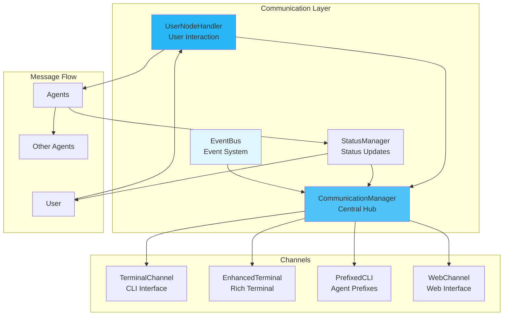

# Communication

The communication system in MARSYS enables agents to coordinate, collaborate, and interact with users through structured messaging and event-driven patterns.

## 🎯 Overview

MARSYS communication provides:

- **User Interaction**: Human-in-the-loop capabilities with multiple channels
- **Agent Coordination**: Inter-agent messaging and task delegation
- **Event System**: Pub/sub for decoupled communication
- **Status Updates**: Real-time progress and status reporting
- **Error Routing**: Intelligent error handling and recovery

## 🏗️ Architecture



## 📦 Core Components

### CommunicationManager

Central hub for all communication:

```python
from src.coordination.communication import CommunicationManager
from src.coordination.config import CommunicationConfig

# Configure communication
comm_config = CommunicationConfig(
    use_rich_formatting=True,
    theme_name="modern",
    prefix_width=20,
    show_timestamps=True,
    enable_history=True,
    use_colors=True
)

# Initialize manager
comm_manager = CommunicationManager(config=comm_config)

# Register channels
comm_manager.register_channel("terminal", TerminalChannel())
comm_manager.register_channel("web", WebChannel())

# Send messages
await comm_manager.send_message(
    channel="terminal",
    message="Processing request...",
    metadata={"agent": "Coordinator", "level": "info"}
)

# Receive input
user_input = await comm_manager.receive_input(
    channel="terminal",
    prompt="Enter your choice: "
)
```

### UserNodeHandler

Manages User node execution in topology:

```python
from src.coordination.communication import UserNodeHandler

class UserNodeHandler:
    """Handles User node interactions in workflow."""

    async def handle_user_node(
        self,
        branch: ExecutionBranch,
        incoming_message: Any,
        context: Dict[str, Any]
    ) -> StepResult:
        """Process User node interaction."""

        # Format message for user
        formatted = self._format_for_user(incoming_message)

        # Get user response
        user_response = await self._get_user_input(
            prompt=formatted,
            context=context
        )

        # Process response
        return StepResult(
            success=True,
            result=user_response,
            metadata={"source": "user", "timestamp": datetime.now()}
        )

    async def _get_user_input(
        self,
        prompt: str,
        context: Dict[str, Any]
    ) -> str:
        """Get input from user with proper formatting."""

        # Show context if available
        if context.get("show_context"):
            await self._display_context(context)

        # Get input based on mode
        if self.mode == "sync":
            return await self._sync_input(prompt)
        elif self.mode == "async":
            return await self._async_input(prompt)
```

### StatusManager

Real-time status updates:

```python
from src.coordination.communication import StatusManager
from src.coordination.config import StatusConfig

class StatusManager:
    """Manages status updates and progress reporting."""

    def __init__(self, config: StatusConfig):
        self.config = config
        self.aggregator = MessageAggregator(
            window_ms=config.aggregation_window_ms
        )

    async def update_status(
        self,
        agent_name: str,
        status: str,
        progress: Optional[float] = None,
        metadata: Optional[Dict] = None
    ):
        """Send status update."""

        if not self.config.enabled:
            return

        # Create status message
        message = StatusMessage(
            agent=agent_name,
            status=status,
            progress=progress,
            timestamp=datetime.now(),
            metadata=metadata or {}
        )

        # Aggregate if configured
        if self.config.aggregate_parallel:
            self.aggregator.add(message)
            if self.aggregator.should_flush():
                await self._flush_aggregated()
        else:
            await self._send_immediate(message)

    def format_status(self, message: StatusMessage) -> str:
        """Format status message for display."""
        if self.config.show_agent_prefixes:
            prefix = f"[{message.agent:>{self.config.prefix_width}}]"
        else:
            prefix = ""

        if message.progress is not None:
            progress_bar = self._create_progress_bar(message.progress)
            return f"{prefix} {message.status} {progress_bar}"
        else:
            return f"{prefix} {message.status}"
```

## 🎯 Communication Patterns

### User Interaction Pattern

Enable human-in-the-loop workflows:

```python
# Topology with User node
topology = {
    "nodes": ["User", "Assistant", "Reviewer"],
    "edges": [
        "User -> Assistant",     # User provides input
        "Assistant -> Reviewer",  # Assistant processes
        "Reviewer -> User"        # User reviews result
    ]
}

# Execution with user interaction
result = await Orchestra.run(
    task="Help me write a report",
    topology=topology,
    execution_config=ExecutionConfig(
        user_interaction="terminal",
        user_first=True,  # Start with user
        initial_user_msg="Welcome! What report would you like to write?"
    )
)
```

### Event-Driven Communication

Decoupled pub/sub messaging:

```python
from src.coordination.communication import EventBus

class EventBus:
    """Publish/subscribe event system."""

    def __init__(self):
        self.subscribers: Dict[str, List[Callable]] = {}

    def subscribe(self, event_type: str, handler: Callable):
        """Subscribe to event type."""
        if event_type not in self.subscribers:
            self.subscribers[event_type] = []
        self.subscribers[event_type].append(handler)

    async def publish(self, event_type: str, data: Any):
        """Publish event to subscribers."""
        if event_type in self.subscribers:
            for handler in self.subscribers[event_type]:
                try:
                    if asyncio.iscoroutinefunction(handler):
                        await handler(data)
                    else:
                        handler(data)
                except Exception as e:
                    logger.error(f"Event handler error: {e}")

# Usage
event_bus = EventBus()

# Subscribe to events
event_bus.subscribe("agent.completed", handle_completion)
event_bus.subscribe("error.occurred", handle_error)

# Publish events
await event_bus.publish("agent.completed", {
    "agent": "DataAnalyzer",
    "result": analysis_result
})
```

### Status Aggregation Pattern

Aggregate parallel status updates:

```python
class MessageAggregator:
    """Aggregate status messages for cleaner output."""

    def __init__(self, window_ms: int = 500):
        self.window_ms = window_ms
        self.messages: List[StatusMessage] = []
        self.last_flush = time.time() * 1000

    def add(self, message: StatusMessage):
        """Add message to aggregation window."""
        self.messages.append(message)

    def should_flush(self) -> bool:
        """Check if window expired."""
        now = time.time() * 1000
        return (now - self.last_flush) >= self.window_ms

    def flush(self) -> List[StatusMessage]:
        """Get and clear aggregated messages."""
        messages = self.messages.copy()
        self.messages.clear()
        self.last_flush = time.time() * 1000
        return messages

# Usage in parallel execution
aggregator = MessageAggregator(window_ms=500)

# Multiple agents updating in parallel
for agent in parallel_agents:
    message = StatusMessage(agent=agent.name, status="Processing...")
    aggregator.add(message)

if aggregator.should_flush():
    # Display all updates together
    messages = aggregator.flush()
    display_aggregated(messages)
```

## 🔧 Communication Channels

### TerminalChannel

Basic terminal I/O:

```python
class TerminalChannel(Channel):
    """Basic terminal communication channel."""

    async def send(self, message: str, **kwargs):
        """Send message to terminal."""
        print(message)

    async def receive(self, prompt: str = "", **kwargs) -> str:
        """Receive input from terminal."""
        return input(prompt)

    def format_message(self, message: str, metadata: Dict) -> str:
        """Format message for terminal display."""
        if metadata.get("error"):
            return f"ERROR: {message}"
        elif metadata.get("warning"):
            return f"WARNING: {message}"
        else:
            return message
```

### EnhancedTerminalChannel

Rich terminal with colors and formatting:

```python
from rich.console import Console
from rich.prompt import Prompt
from rich.progress import Progress

class EnhancedTerminalChannel(Channel):
    """Enhanced terminal with Rich formatting."""

    def __init__(self):
        self.console = Console()
        self.progress = Progress()

    async def send(self, message: str, **kwargs):
        """Send formatted message."""
        style = kwargs.get("style", "default")

        if kwargs.get("is_error"):
            self.console.print(f"[red]✗[/red] {message}")
        elif kwargs.get("is_success"):
            self.console.print(f"[green]✓[/green] {message}")
        else:
            self.console.print(message, style=style)

    async def receive(self, prompt: str = "", **kwargs) -> str:
        """Get input with enhanced prompt."""
        choices = kwargs.get("choices")
        if choices:
            return Prompt.ask(prompt, choices=choices)
        else:
            return Prompt.ask(prompt)

    def display_progress(self, task_id: str, total: int):
        """Show progress bar."""
        return self.progress.add_task(task_id, total=total)
```

### PrefixedCLIChannel

Agent-prefixed output:

```python
class PrefixedCLIChannel(Channel):
    """Terminal channel with agent prefixes."""

    def __init__(self, prefix_width: int = 20):
        self.prefix_width = prefix_width
        self.colors = {
            "Coordinator": "blue",
            "Worker": "green",
            "User": "yellow",
            "Error": "red"
        }

    def format_with_prefix(
        self,
        agent_name: str,
        message: str
    ) -> str:
        """Format message with agent prefix."""
        # Create colored prefix
        color = self.colors.get(agent_name, "white")
        prefix = f"[{agent_name:>{self.prefix_width}}]"

        if self.use_colors:
            from colorama import Fore, Style
            color_code = getattr(Fore, color.upper(), Fore.WHITE)
            prefix = f"{color_code}{prefix}{Style.RESET_ALL}"

        # Split multi-line messages
        lines = message.split('\n')
        formatted_lines = []

        for i, line in enumerate(lines):
            if i == 0:
                formatted_lines.append(f"{prefix} {line}")
            else:
                # Indent continuation lines
                indent = " " * (self.prefix_width + 3)
                formatted_lines.append(f"{indent}{line}")

        return '\n'.join(formatted_lines)
```

## 📋 Configuration

### CommunicationConfig

```python
from src.coordination.config import CommunicationConfig

config = CommunicationConfig(
    # Formatting
    use_rich_formatting=True,
    theme_name="modern",  # modern, classic, minimal
    prefix_width=20,
    prefix_alignment="right",  # left, center, right

    # Display
    show_timestamps=True,
    timestamp_format="%H:%M:%S",
    use_colors=True,
    color_depth="truecolor",  # truecolor, 256, 16, none

    # History
    enable_history=True,
    history_size=1000,
    persist_history=False,
    history_file=".marsys_history",

    # Input
    enable_tab_completion=True,
    input_timeout=None,  # Seconds or None

    # Channels
    channels=["terminal"],  # Active channels
    default_channel="terminal",

    # Error handling
    fallback_on_error=True,
    use_enhanced_terminal=True
)
```

## 🎯 Advanced Patterns

### Multi-Channel Broadcasting

Send to multiple channels simultaneously:

```python
class MultiChannelManager:
    """Broadcast to multiple channels."""

    def __init__(self):
        self.channels: Dict[str, Channel] = {}

    def register(self, name: str, channel: Channel):
        """Register communication channel."""
        self.channels[name] = channel

    async def broadcast(
        self,
        message: str,
        channels: Optional[List[str]] = None,
        **kwargs
    ):
        """Broadcast message to channels."""
        target_channels = channels or list(self.channels.keys())

        tasks = []
        for channel_name in target_channels:
            if channel_name in self.channels:
                channel = self.channels[channel_name]
                task = channel.send(message, **kwargs)
                tasks.append(task)

        await asyncio.gather(*tasks, return_exceptions=True)

# Usage
manager = MultiChannelManager()
manager.register("terminal", TerminalChannel())
manager.register("web", WebChannel())
manager.register("log", LogChannel())

# Broadcast to all
await manager.broadcast("System starting...")

# Broadcast to specific channels
await manager.broadcast(
    "Error occurred",
    channels=["terminal", "log"],
    is_error=True
)
```

### Interactive Prompts

Get structured input from users:

```python
class InteractivePrompt:
    """Interactive user prompts."""

    async def choice(
        self,
        question: str,
        options: List[str],
        default: Optional[str] = None
    ) -> str:
        """Present multiple choice."""
        print(f"\n{question}")
        for i, option in enumerate(options, 1):
            print(f"  {i}. {option}")

        while True:
            response = input(f"Choice [1-{len(options)}]: ")
            try:
                index = int(response) - 1
                if 0 <= index < len(options):
                    return options[index]
            except (ValueError, IndexError):
                pass

            print("Invalid choice. Please try again.")

    async def confirm(
        self,
        question: str,
        default: bool = False
    ) -> bool:
        """Get yes/no confirmation."""
        default_str = "Y/n" if default else "y/N"
        response = input(f"{question} [{default_str}]: ").lower()

        if not response:
            return default

        return response in ['y', 'yes', 'true', '1']

    async def multi_input(
        self,
        prompt: str,
        min_items: int = 1,
        max_items: Optional[int] = None
    ) -> List[str]:
        """Get multiple inputs."""
        print(prompt)
        print("Enter items (empty line to finish):")

        items = []
        while True:
            item = input(f"  [{len(items) + 1}] ")
            if not item:
                if len(items) >= min_items:
                    break
                print(f"Need at least {min_items} items")
            else:
                items.append(item)
                if max_items and len(items) >= max_items:
                    break

        return items
```

### Error Recovery Communication

Route errors to User node for recovery:

```python
class ErrorRoutingHandler:
    """Route errors to User for recovery."""

    async def handle_error(
        self,
        error: Exception,
        context: Dict[str, Any],
        topology: Topology
    ) -> Optional[str]:
        """Route error to User node if available."""

        # Check if User node exists in topology
        if not topology.has_node("User"):
            return None

        # Format error for user
        error_msg = self._format_error(error, context)

        # Create error recovery message
        recovery_prompt = f"""
An error occurred during execution:

{error_msg}

How would you like to proceed?
1. Retry the operation
2. Skip and continue
3. Provide alternative input
4. Abort execution

Your choice: """

        # Get user decision
        user_response = await self._get_user_input(recovery_prompt)

        # Process decision
        return self._process_recovery_decision(user_response, context)

    def _format_error(self, error: Exception, context: Dict) -> str:
        """Format error for user display."""
        agent = context.get("agent", "Unknown")
        operation = context.get("operation", "Unknown")

        return f"""
Agent: {agent}
Operation: {operation}
Error Type: {type(error).__name__}
Details: {str(error)}
"""
```

## 🚦 Next Steps

<div class="grid cards" markdown="1">

- :material-account-group:{ .lg .middle } **[User Node Guide](../docs/USER_NODE_GUIDE.md)**

    ---

    Complete guide to User node integration

- :material-broadcast:{ .lg .middle } **[Event System](../api/events.md)**

    ---

    Event-driven communication patterns

- :material-monitor:{ .lg .middle } **[Status Management](../api/status.md)**

    ---

    Status updates and progress tracking

- :material-message:{ .lg .middle } **[Messages](messages.md)**

    ---

    Message types and patterns

</div>

---

!!! success "Communication System Ready!"
    You now understand the communication system in MARSYS. Effective communication enables seamless coordination between agents and intuitive user interaction.