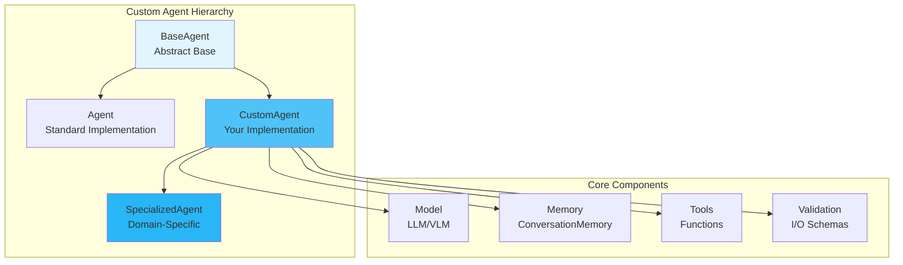

# Custom Agents

Learn how to create custom agents that extend the MARSYS framework with specialized capabilities and behaviors.

## 🎯 Overview

Custom agents enable you to:

- **Extend BaseAgent**: Create agents with specialized behavior
- **Add Domain Knowledge**: Incorporate specific expertise
- **Implement State Machines**: Complex multi-step workflows
- **Custom Response Processing**: Specialized output formats
- **Advanced Memory Patterns**: Sophisticated context management

## 🏗️ Architecture



## 📦 Creating Custom Agents

### Extending BaseAgent

The fundamental pattern for custom agents:

```python
from src.agents import BaseAgent
from src.agents.memory import Message
from typing import Dict, Any, Optional

class CustomAgent(BaseAgent):
    """Custom agent with specialized behavior."""

    def __init__(
        self,
        model,
        specialized_knowledge: Optional[Dict] = None,
        **kwargs
    ):
        super().__init__(
            model=model,
            description="Custom specialized agent",
            **kwargs
        )
        self.specialized_knowledge = specialized_knowledge or {}
        self.processing_state = "ready"

    async def _run(
        self,
        prompt: Any,
        context: Dict[str, Any],
        **kwargs
    ) -> Message:
        """
        Pure execution logic - NO side effects!

        Important: This method must be stateless and pure.
        All state changes should happen outside this method.
        """

        # Prepare messages with base functionality
        messages = self._prepare_messages(prompt)

        # Add custom logic
        if self._should_use_knowledge(prompt):
            messages.append(Message(
                role="system",
                content=f"Use this knowledge: {self.specialized_knowledge}"
            ))

        # Call model
        response = await self.model.run(messages)

        # Return pure Message object
        return Message(
            role="assistant",
            content=response.content,
            tool_calls=response.tool_calls if hasattr(response, 'tool_calls') else None,
            metadata={"processing_state": self.processing_state}
        )

    def _should_use_knowledge(self, prompt: str) -> bool:
        """Determine if specialized knowledge is relevant."""
        # Your logic here
        return True
```

### Domain-Specific Agents

Create agents with domain expertise:

```python
class FinancialAnalyst(BaseAgent):
    """Financial analysis specialist."""

    def __init__(self, model, market_data_api=None, **kwargs):
        super().__init__(
            model=model,
            description="Expert financial analyst with real-time market access",
            tools={
                "get_stock_price": self._get_stock_price,
                "calculate_metrics": self._calculate_metrics
            },
            **kwargs
        )
        self.market_data_api = market_data_api

        # Domain-specific prompting
        self.system_prompt = """You are a senior financial analyst with expertise in:
        - Equity valuation and fundamental analysis
        - Technical indicators and chart patterns
        - Risk assessment and portfolio optimization
        - Market trends and economic indicators

        Always provide data-driven insights with confidence levels."""

    async def _run(self, prompt, context, **kwargs):
        """Analyze financial data with expertise."""

        # Check for financial context
        if self._is_financial_query(prompt):
            # Add market context
            market_context = await self._get_market_context()
            enriched_prompt = f"{prompt}\n\nCurrent market: {market_context}"
        else:
            enriched_prompt = prompt

        messages = self._prepare_messages(enriched_prompt)
        response = await self.model.run(messages)

        # Structure financial responses
        if self._should_structure_response(response.content):
            structured = self._structure_financial_response(response.content)
            return Message(
                role="assistant",
                content=response.content,
                structured_data=structured
            )

        return Message(role="assistant", content=response.content)

    def _get_stock_price(self, symbol: str) -> Dict:
        """Get real-time stock price."""
        if self.market_data_api:
            return self.market_data_api.get_price(symbol)
        return {"error": "No market data API configured"}

    def _calculate_metrics(self, data: Dict) -> Dict:
        """Calculate financial metrics."""
        # Implementation
        return {"pe_ratio": 15.2, "roi": 0.12}
```

## 🎯 Advanced Patterns

### State Machine Agent

Implement complex workflows with state transitions:

```python
from enum import Enum

class ProcessingState(Enum):
    INITIAL = "initial"
    ANALYZING = "analyzing"
    VALIDATING = "validating"
    COMPLETE = "complete"
    ERROR = "error"

class StateMachineAgent(BaseAgent):
    """Agent with state-based processing."""

    def __init__(self, model, **kwargs):
        super().__init__(model, **kwargs)
        self.state = ProcessingState.INITIAL
        self.state_data = {}

    async def _run(self, prompt, context, **kwargs):
        """Execute based on current state."""

        # State-based routing
        handlers = {
            ProcessingState.INITIAL: self._handle_initial,
            ProcessingState.ANALYZING: self._handle_analyzing,
            ProcessingState.VALIDATING: self._handle_validating,
            ProcessingState.COMPLETE: self._handle_complete,
            ProcessingState.ERROR: self._handle_error
        }

        handler = handlers.get(self.state, self._handle_error)
        return await handler(prompt, context)

    async def _handle_initial(self, prompt, context):
        """Initial state processing."""

        # Validate input
        if not self._validate_input(prompt):
            self.state = ProcessingState.ERROR
            return Message(
                role="error",
                content="Invalid input format"
            )

        # Transition to analyzing
        self.state = ProcessingState.ANALYZING
        self.state_data["start_time"] = time.time()

        messages = self._prepare_messages(
            f"Starting analysis of: {prompt}"
        )
        response = await self.model.run(messages)

        return Message(
            role="assistant",
            content=response.content,
            metadata={"state": self.state.value}
        )

    async def _handle_analyzing(self, prompt, context):
        """Analysis state processing."""

        # Perform analysis
        analysis_prompt = f"""Analyze this in detail: {prompt}

        Consider:
        1. Key components
        2. Relationships
        3. Potential issues
        4. Recommendations"""

        messages = self._prepare_messages(analysis_prompt)
        response = await self.model.run(messages)

        # Store analysis results
        self.state_data["analysis"] = response.content

        # Transition to validation
        self.state = ProcessingState.VALIDATING

        return Message(
            role="assistant",
            content=response.content,
            metadata={"state": self.state.value}
        )
```

### Composite Agent

Combine multiple specialized agents:

```python
class CompositeResearchAgent(BaseAgent):
    """Agent composed of multiple specialists."""

    def __init__(self, model, **kwargs):
        super().__init__(model, **kwargs)

        # Create internal specialists
        self.specialists = {
            "web": WebSearchSpecialist(model),
            "academic": AcademicResearchSpecialist(model),
            "data": DataAnalysisSpecialist(model)
        }

    async def _run(self, prompt, context, **kwargs):
        """Coordinate specialists for comprehensive research."""

        # Classify research type
        research_type = self._classify_research(prompt)

        if research_type == "comprehensive":
            # Use all specialists
            results = await self._parallel_research(prompt)
            synthesis = await self._synthesize_results(results)

            return Message(
                role="assistant",
                content=synthesis,
                structured_data={"sources": results}
            )

        elif research_type in self.specialists:
            # Use specific specialist
            specialist = self.specialists[research_type]
            response = await specialist.run_step(prompt, context)

            return Message(
                role="assistant",
                content=response.response
            )

        else:
            # Fallback to general research
            return await super()._run(prompt, context, **kwargs)

    async def _parallel_research(self, prompt):
        """Run all specialists in parallel."""
        tasks = []
        for name, specialist in self.specialists.items():
            task = specialist.run_step(prompt, {})
            tasks.append((name, task))

        results = {}
        for name, task in tasks:
            response = await task
            results[name] = response.response

        return results

    async def _synthesize_results(self, results):
        """Synthesize findings from all specialists."""
        synthesis_prompt = f"""Synthesize these research findings:

        {json.dumps(results, indent=2)}

        Create a comprehensive summary that:
        1. Identifies common themes
        2. Resolves contradictions
        3. Highlights key insights
        4. Provides actionable conclusions"""

        messages = self._prepare_messages(synthesis_prompt)
        response = await self.model.run(messages)
        return response.content
```

### Learning Agent

Agent that improves over time:

```python
class LearningAgent(BaseAgent):
    """Agent that learns from interactions."""

    def __init__(self, model, learning_rate=0.1, **kwargs):
        super().__init__(model, **kwargs)
        self.learning_rate = learning_rate
        self.performance_history = []
        self.learned_patterns = {}

    async def _run(self, prompt, context, **kwargs):
        """Execute with learning."""

        # Check for learned patterns
        pattern_match = self._find_pattern_match(prompt)
        if pattern_match:
            # Use learned response strategy
            strategy = self.learned_patterns[pattern_match]
            enhanced_prompt = self._apply_strategy(prompt, strategy)
        else:
            enhanced_prompt = prompt

        # Execute
        messages = self._prepare_messages(enhanced_prompt)
        response = await self.model.run(messages)

        # Learn from outcome (in post-processing, not here!)
        # Note: Actual learning happens outside _run() to keep it pure

        return Message(
            role="assistant",
            content=response.content,
            metadata={
                "pattern_used": pattern_match,
                "confidence": self._calculate_confidence()
            }
        )

    def learn_from_feedback(self, prompt, response, feedback):
        """Update learned patterns based on feedback."""
        # This happens OUTSIDE _run() method

        pattern = self._extract_pattern(prompt)

        if feedback["success"]:
            # Reinforce successful patterns
            if pattern not in self.learned_patterns:
                self.learned_patterns[pattern] = {
                    "strategy": self._extract_strategy(response),
                    "success_rate": 1.0,
                    "usage_count": 1
                }
            else:
                # Update success rate
                stats = self.learned_patterns[pattern]
                stats["usage_count"] += 1
                stats["success_rate"] = (
                    stats["success_rate"] * (1 - self.learning_rate) +
                    1.0 * self.learning_rate
                )
        else:
            # Adjust unsuccessful patterns
            if pattern in self.learned_patterns:
                stats = self.learned_patterns[pattern]
                stats["success_rate"] *= (1 - self.learning_rate)

                # Remove if consistently unsuccessful
                if stats["success_rate"] < 0.3:
                    del self.learned_patterns[pattern]

        # Record performance
        self.performance_history.append({
            "timestamp": time.time(),
            "pattern": pattern,
            "success": feedback["success"]
        })
```

## 🔧 Implementation Patterns

### Validation and Error Handling

```python
class ValidatedAgent(BaseAgent):
    """Agent with comprehensive validation."""

    def __init__(self, model, input_schema=None, output_schema=None, **kwargs):
        super().__init__(model, **kwargs)
        self.input_schema = input_schema
        self.output_schema = output_schema

    async def _run(self, prompt, context, **kwargs):
        """Execute with validation."""

        # Validate input
        if self.input_schema:
            try:
                validated_input = self.input_schema.parse_obj(prompt)
                prompt = validated_input.dict()
            except ValidationError as e:
                return Message(
                    role="error",
                    content=f"Input validation failed: {e}",
                    metadata={"validation_errors": e.errors()}
                )

        # Process
        messages = self._prepare_messages(str(prompt))
        response = await self.model.run(messages)

        # Validate output
        if self.output_schema:
            try:
                # Parse response as JSON
                output_data = json.loads(response.content)
                validated_output = self.output_schema.parse_obj(output_data)

                return Message(
                    role="assistant",
                    content=json.dumps(validated_output.dict()),
                    structured_data=validated_output.dict()
                )
            except (json.JSONDecodeError, ValidationError) as e:
                # Fallback to unstructured response
                return Message(
                    role="assistant",
                    content=response.content,
                    metadata={"validation_warning": str(e)}
                )

        return Message(role="assistant", content=response.content)
```

### Monitoring and Metrics

```python
class MonitoredAgent(BaseAgent):
    """Agent with built-in monitoring."""

    def __init__(self, model, **kwargs):
        super().__init__(model, **kwargs)
        self.metrics = {
            "total_requests": 0,
            "total_tokens": 0,
            "average_latency": 0.0,
            "error_rate": 0.0,
            "success_rate": 0.0
        }

    async def _run(self, prompt, context, **kwargs):
        """Execute with metrics tracking."""

        start_time = time.time()

        try:
            # Execute
            messages = self._prepare_messages(prompt)
            response = await self.model.run(messages)

            # Update success metrics (in post-processing)
            latency = time.time() - start_time

            return Message(
                role="assistant",
                content=response.content,
                metadata={
                    "latency": latency,
                    "token_count": self._estimate_tokens(response.content)
                }
            )

        except Exception as e:
            # Track error (in post-processing)
            return Message(
                role="error",
                content=str(e),
                metadata={"error_type": type(e).__name__}
            )

    def update_metrics(self, metadata):
        """Update metrics based on execution metadata."""
        # This happens OUTSIDE _run() method
        self.metrics["total_requests"] += 1

        if "latency" in metadata:
            # Update average latency
            prev_avg = self.metrics["average_latency"]
            n = self.metrics["total_requests"]
            self.metrics["average_latency"] = (
                (prev_avg * (n - 1) + metadata["latency"]) / n
            )

        if "token_count" in metadata:
            self.metrics["total_tokens"] += metadata["token_count"]
```

## 📋 Best Practices

### 1. **Keep _run() Pure**

```python
# ✅ GOOD - Pure function, no side effects
async def _run(self, prompt, context, **kwargs):
    messages = self._prepare_messages(prompt)
    response = await self.model.run(messages)
    return Message(role="assistant", content=response.content)

# ❌ BAD - Side effects in _run()
async def _run(self, prompt, context, **kwargs):
    self.state = "processing"  # NO! State change
    self.memory.add(...)  # NO! Memory manipulation
    await self.log(...)  # NO! External I/O
    return response
```

### 2. **Use Composition Over Inheritance**

```python
# ✅ GOOD - Composition
class ResearchAgent(BaseAgent):
    def __init__(self, model, **kwargs):
        super().__init__(model, **kwargs)
        self.web_searcher = WebSearcher()
        self.summarizer = Summarizer()

# ❌ BAD - Deep inheritance
class AdvancedResearchAgent(ResearchAgent):
    class SuperAdvancedResearchAgent(AdvancedResearchAgent):
        # Too deep!
```

### 3. **Proper Error Handling**

```python
# ✅ GOOD - Graceful error handling
async def _run(self, prompt, context, **kwargs):
    try:
        result = await self.process(prompt)
        return Message(role="assistant", content=result)
    except SpecificError as e:
        return Message(
            role="error",
            content=f"Processing failed: {e}",
            metadata={"recoverable": True}
        )

# ❌ BAD - Swallowing errors
async def _run(self, prompt, context, **kwargs):
    try:
        return await self.process(prompt)
    except:
        return "Error occurred"  # Lost error details!
```

### 4. **Document Capabilities**

```python
# ✅ GOOD - Clear documentation
class DataAnalyst(BaseAgent):
    """
    Specialized agent for data analysis.

    Capabilities:
    - Statistical analysis
    - Data visualization recommendations
    - Trend detection
    - Anomaly identification

    Limitations:
    - Requires structured data
    - Maximum 10MB datasets
    """
```

## 🎯 Testing Custom Agents

### Unit Testing

```python
import pytest
from unittest.mock import Mock, AsyncMock

@pytest.mark.asyncio
async def test_custom_agent():
    # Create mock model
    mock_model = Mock()
    mock_model.run = AsyncMock(return_value=Mock(
        content="Test response"
    ))

    # Create custom agent
    agent = CustomAgent(
        model=mock_model,
        specialized_knowledge={"domain": "test"}
    )

    # Test execution
    response = await agent._run(
        "Test prompt",
        {"test": "context"}
    )

    # Assertions
    assert response.role == "assistant"
    assert "Test response" in response.content
    mock_model.run.assert_called_once()
```

### Integration Testing

```python
@pytest.mark.asyncio
async def test_agent_in_workflow():
    # Create custom agent
    agent = CustomAgent(
        model_config=test_config,
        agent_name="CustomTest"
    )

    # Define test topology
    topology = {
        "nodes": ["CustomTest"],
        "edges": []
    }

    # Run in Orchestra
    result = await Orchestra.run(
        task="Test task",
        topology=topology
    )

    # Validate result
    assert result.success
    assert "CustomTest" in result.metadata
```

## 🚦 Next Steps

<div class="grid cards" markdown="1">

- :material-robot:{ .lg .middle } **[Agents](agents.md)**

    ---

    Core agent concepts

- :material-memory:{ .lg .middle } **[Memory Patterns](memory-patterns.md)**

    ---

    Advanced memory strategies

- :material-brain:{ .lg .middle } **[Learning Agents](learning-agents.md)**

    ---

    Agents that improve over time

- :material-api:{ .lg .middle } **[Agent API](../api/agent-class.md)**

    ---

    Complete API reference

</div>

---

!!! success "Custom Agents Ready!"
    You now understand how to create custom agents in MARSYS. Build specialized agents that extend the framework with domain-specific capabilities while maintaining pure execution principles.