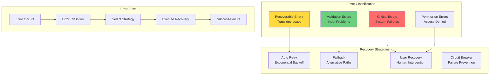

# Error Handling

MARSYS provides a comprehensive error handling system that ensures robust operation, graceful degradation, and intelligent recovery in multi-agent workflows.

## 🎯 Overview

The error handling system provides:

- **Hierarchical Exceptions**: Granular error categorization with rich context
- **Intelligent Recovery**: Automatic retry strategies and fallback mechanisms
- **Error Routing**: Route errors to User nodes for human intervention
- **Provider-Specific Handling**: Tailored strategies for different AI providers
- **Comprehensive Logging**: Detailed error tracking and monitoring

## 🏗️ Architecture



## 📦 Exception Hierarchy

### Base Exception

All MARSYS exceptions inherit from `MarsysError`:

```python
from src.coordination.exceptions import MarsysError

class MarsysError(Exception):
    """Base exception for all MARSYS errors."""

    def __init__(
        self,
        message: str,
        error_code: Optional[str] = None,
        context: Optional[Dict[str, Any]] = None,
        suggestion: Optional[str] = None,
        recoverable: bool = False
    ):
        self.message = message
        self.error_code = error_code or self.__class__.__name__
        self.context = context or {}
        self.suggestion = suggestion
        self.recoverable = recoverable
        self.timestamp = datetime.now()
        super().__init__(message)

    def to_dict(self) -> Dict[str, Any]:
        """Convert to dictionary for logging/serialization."""
        return {
            "error_type": self.__class__.__name__,
            "error_code": self.error_code,
            "message": self.message,
            "context": self.context,
            "suggestion": self.suggestion,
            "recoverable": self.recoverable,
            "timestamp": self.timestamp.isoformat()
        }
```

### Error Categories

```python
# Validation Errors
class ValidationError(MarsysError):
    """Input validation failures."""
    pass

class MessageFormatError(ValidationError):
    """Message parsing/formatting errors."""
    pass

class ActionValidationError(ValidationError):
    """Invalid agent actions."""
    pass

# Configuration Errors
class ConfigurationError(MarsysError):
    """Configuration problems."""
    pass

class AgentConfigurationError(ConfigurationError):
    """Agent setup errors."""
    pass

class TopologyError(ConfigurationError):
    """Topology definition errors."""
    pass

# Execution Errors
class ExecutionError(MarsysError):
    """Runtime execution failures."""
    pass

class AgentExecutionError(ExecutionError):
    """Agent execution failures."""
    pass

class TimeoutError(ExecutionError):
    """Operation timeout."""
    pass

# Permission Errors
class PermissionError(MarsysError):
    """Access control violations."""
    pass

class AgentPermissionError(PermissionError):
    """Agent invocation denied."""
    pass

# API Errors
class APIError(MarsysError):
    """External API failures."""
    pass

class RateLimitError(APIError):
    """API rate limit exceeded."""
    recoverable = True
```

## 🎯 Error Handling Patterns

### Try-Catch with Context

```python
async def execute_agent_task(agent, task, context):
    """Execute task with comprehensive error handling."""
    try:
        result = await agent.run(task, context)
        return result

    except ValidationError as e:
        # Handle validation errors
        logger.warning(f"Validation error: {e.message}")
        if e.suggestion:
            logger.info(f"Suggestion: {e.suggestion}")
        # Try with corrected input
        corrected_task = correct_validation_issues(task, e)
        return await agent.run(corrected_task, context)

    except RateLimitError as e:
        # Handle rate limits with backoff
        wait_time = e.context.get("retry_after", 60)
        logger.info(f"Rate limited. Waiting {wait_time}s...")
        await asyncio.sleep(wait_time)
        return await execute_agent_task(agent, task, context)

    except AgentPermissionError as e:
        # Route to user for permission
        if context.get("user_recovery"):
            return await route_to_user_for_permission(e, context)
        raise

    except TimeoutError as e:
        # Handle timeout with retry or cancellation
        if e.recoverable and context.get("retry_count", 0) < 3:
            context["retry_count"] = context.get("retry_count", 0) + 1
            return await execute_agent_task(agent, task, context)
        raise

    except MarsysError as e:
        # Log framework errors
        logger.error(f"Framework error: {e.to_dict()}")
        raise

    except Exception as e:
        # Wrap unexpected errors
        wrapped = ExecutionError(
            f"Unexpected error: {str(e)}",
            context={"original_error": str(e), "type": type(e).__name__}
        )
        logger.error(f"Unexpected error: {wrapped.to_dict()}")
        raise wrapped
```

### Retry with Exponential Backoff

```python
class RetryHandler:
    """Intelligent retry with exponential backoff."""

    def __init__(
        self,
        max_retries: int = 3,
        base_delay: float = 1.0,
        max_delay: float = 60.0,
        exponential_base: float = 2.0
    ):
        self.max_retries = max_retries
        self.base_delay = base_delay
        self.max_delay = max_delay
        self.exponential_base = exponential_base

    async def execute_with_retry(
        self,
        func: Callable,
        *args,
        **kwargs
    ) -> Any:
        """Execute function with retry logic."""
        last_exception = None

        for attempt in range(self.max_retries):
            try:
                return await func(*args, **kwargs)

            except RateLimitError as e:
                # Use API-provided retry delay if available
                delay = e.context.get("retry_after", self._calculate_delay(attempt))
                logger.info(f"Rate limited. Retry {attempt + 1}/{self.max_retries} in {delay}s")
                await asyncio.sleep(delay)
                last_exception = e

            except TimeoutError as e:
                if not e.recoverable:
                    raise
                delay = self._calculate_delay(attempt)
                logger.warning(f"Timeout. Retry {attempt + 1}/{self.max_retries} in {delay}s")
                await asyncio.sleep(delay)
                last_exception = e

            except APIError as e:
                if e.context.get("status_code") in [500, 502, 503, 504]:
                    # Retry on server errors
                    delay = self._calculate_delay(attempt)
                    logger.warning(f"Server error. Retry {attempt + 1}/{self.max_retries} in {delay}s")
                    await asyncio.sleep(delay)
                    last_exception = e
                else:
                    raise

            except Exception as e:
                # Don't retry unexpected errors
                raise

        # Max retries exceeded
        raise ExecutionError(
            f"Max retries ({self.max_retries}) exceeded",
            context={"last_error": str(last_exception)},
            suggestion="Consider increasing timeout or using a different approach"
        )

    def _calculate_delay(self, attempt: int) -> float:
        """Calculate exponential backoff delay."""
        delay = self.base_delay * (self.exponential_base ** attempt)
        # Add jitter
        delay = delay * (0.5 + random.random())
        return min(delay, self.max_delay)
```

### Circuit Breaker Pattern

```python
class CircuitBreaker:
    """Prevent cascading failures with circuit breaker."""

    def __init__(
        self,
        failure_threshold: int = 5,
        recovery_timeout: float = 60.0,
        expected_exception: type = APIError
    ):
        self.failure_threshold = failure_threshold
        self.recovery_timeout = recovery_timeout
        self.expected_exception = expected_exception
        self.failure_count = 0
        self.last_failure_time = None
        self.state = "closed"  # closed, open, half-open

    async def call(self, func: Callable, *args, **kwargs) -> Any:
        """Execute function with circuit breaker protection."""

        # Check circuit state
        if self.state == "open":
            if self._should_attempt_reset():
                self.state = "half-open"
            else:
                raise ExecutionError(
                    "Circuit breaker is open",
                    context={"failure_count": self.failure_count},
                    suggestion=f"Wait {self.recovery_timeout}s for recovery"
                )

        # Execute function
        try:
            result = await func(*args, **kwargs)

            # Success - reset circuit
            if self.state == "half-open":
                self._reset()

            return result

        except self.expected_exception as e:
            self._record_failure()

            if self.failure_count >= self.failure_threshold:
                self._trip()

            raise

    def _should_attempt_reset(self) -> bool:
        """Check if we should try to reset circuit."""
        return (
            self.last_failure_time and
            (datetime.now() - self.last_failure_time).total_seconds() >= self.recovery_timeout
        )

    def _record_failure(self):
        """Record a failure."""
        self.failure_count += 1
        self.last_failure_time = datetime.now()

    def _reset(self):
        """Reset circuit to closed state."""
        self.failure_count = 0
        self.last_failure_time = None
        self.state = "closed"

    def _trip(self):
        """Trip circuit to open state."""
        self.state = "open"
        logger.warning(f"Circuit breaker tripped after {self.failure_count} failures")
```

## 🔧 Error Configuration

### ErrorHandlingConfig

```python
from src.coordination.config import ErrorHandlingConfig

config = ErrorHandlingConfig(
    # Classification
    use_error_classification=True,
    classify_as_critical=["PermissionError", "ConfigurationError"],
    classify_as_recoverable=["RateLimitError", "TimeoutError"],

    # Notifications
    notify_on_critical_errors=True,
    notification_channels=["terminal", "log"],

    # Recovery
    enable_error_routing=True,  # Route to User node
    error_recovery_timeout=300.0,

    # Retry settings
    auto_retry_on_rate_limits=True,
    max_rate_limit_retries=3,
    base_retry_delay=1.0,
    max_retry_delay=60.0,

    # Circuit breaker
    enable_circuit_breaker=True,
    circuit_breaker_threshold=5,
    circuit_breaker_timeout=60.0,

    # Provider-specific
    provider_settings={
        "openai": {
            "max_retries": 3,
            "base_retry_delay": 60,
            "rate_limit_strategy": "exponential_backoff",
            "insufficient_quota_action": "fallback"
        },
        "anthropic": {
            "max_retries": 2,
            "base_retry_delay": 30,
            "rate_limit_strategy": "fixed_delay",
            "insufficient_quota_action": "raise"
        },
        "google": {
            "max_retries": 3,
            "base_retry_delay": 45,
            "rate_limit_strategy": "exponential_backoff",
            "insufficient_quota_action": "queue"
        }
    }
)
```

## 🎯 Error Recovery Strategies

### User-Driven Recovery

Route errors to User node for human intervention:

```python
class UserRecoveryHandler:
    """Handle error recovery through user interaction."""

    async def handle_error_with_user(
        self,
        error: MarsysError,
        context: Dict[str, Any],
        topology: Topology
    ) -> Optional[Any]:
        """Route error to User node for recovery."""

        if not topology.has_node("User"):
            return None

        # Format error for user
        error_message = self._format_error_for_user(error)

        # Create recovery options
        options = self._get_recovery_options(error)

        # Ask user for decision
        user_prompt = f"""
{error_message}

How would you like to proceed?
{self._format_options(options)}
"""

        # Get user response
        response = await self._get_user_input(user_prompt, context)

        # Execute recovery based on user choice
        return await self._execute_recovery(response, error, context)

    def _get_recovery_options(self, error: MarsysError) -> List[str]:
        """Get recovery options based on error type."""
        options = ["Abort execution"]

        if error.recoverable:
            options.insert(0, "Retry operation")

        if isinstance(error, ValidationError):
            options.insert(0, "Provide corrected input")

        if isinstance(error, PermissionError):
            options.insert(0, "Grant permission")

        if isinstance(error, RateLimitError):
            options.insert(0, "Wait and retry")

        return options
```

### Fallback Strategies

```python
class FallbackHandler:
    """Implement fallback strategies for errors."""

    def __init__(self, fallback_map: Dict[str, List[str]]):
        self.fallback_map = fallback_map  # Primary -> [fallbacks]

    async def execute_with_fallback(
        self,
        primary_agent: str,
        task: str,
        context: Dict[str, Any]
    ) -> Any:
        """Execute with fallback agents on failure."""

        agents_to_try = [primary_agent] + self.fallback_map.get(primary_agent, [])

        for agent_name in agents_to_try:
            try:
                agent = AgentRegistry.get_agent(agent_name)
                if not agent:
                    continue

                result = await agent.run(task, context)
                if agent_name != primary_agent:
                    logger.info(f"Fallback to {agent_name} succeeded")
                return result

            except MarsysError as e:
                logger.warning(f"Agent {agent_name} failed: {e.message}")
                if agent_name == agents_to_try[-1]:
                    # No more fallbacks
                    raise ExecutionError(
                        f"All agents failed: {', '.join(agents_to_try)}",
                        context={"last_error": str(e)},
                        suggestion="Consider revising the task or adding more fallback agents"
                    )
                continue
```

## 📋 Best Practices

### 1. **Use Specific Exceptions**

```python
# ✅ GOOD - Specific exception with context
raise MessageFormatError(
    "Invalid JSON in model response",
    context={
        "response": response[:200],
        "expected": "JSON object with 'next_action' field"
    },
    suggestion="Ensure model is prompted to return valid JSON",
    recoverable=True
)

# ❌ BAD - Generic exception
raise Exception("Invalid response")
```

### 2. **Provide Recovery Information**

```python
# ✅ GOOD - Actionable error
raise RateLimitError(
    "OpenAI API rate limit exceeded",
    context={
        "limit": "10000 tokens/min",
        "used": "10500 tokens",
        "retry_after": 60
    },
    suggestion="Wait 60 seconds or use a different API key",
    recoverable=True
)

# ❌ BAD - No recovery info
raise APIError("Rate limit hit")
```

### 3. **Chain Exceptions**

```python
# ✅ GOOD - Preserve original context
try:
    result = await risky_operation()
except ValueError as e:
    raise ValidationError(
        f"Operation failed: {str(e)}",
        context={"original_error": str(e), "traceback": traceback.format_exc()}
    ) from e

# ❌ BAD - Lost context
try:
    result = await risky_operation()
except:
    raise ValidationError("Operation failed")
```

### 4. **Log at Appropriate Levels**

```python
# ✅ GOOD - Appropriate logging
try:
    result = await operation()
except ValidationError as e:
    logger.warning(f"Validation failed: {e.message}")  # Warning for recoverable
except PermissionError as e:
    logger.error(f"Permission denied: {e.message}")  # Error for critical
except Exception as e:
    logger.exception(f"Unexpected error: {e}")  # Full traceback for unexpected
```

## 🚦 Next Steps

<div class="grid cards" markdown="1">

- :material-shield:{ .lg .middle } **[Validation](../api/validation.md)**

    ---

    Input and output validation

- :material-refresh:{ .lg .middle } **[Retry Strategies](../guides/retry-strategies.md)**

    ---

    Advanced retry patterns

- :material-account:{ .lg .middle } **[User Recovery](../docs/USER_NODE_GUIDE.md)**

    ---

    Human-in-the-loop error handling

- :material-api:{ .lg .middle } **[API Reference](../api/exceptions.md)**

    ---

    Complete exception API

</div>

---

!!! success "Error Handling Ready!"
    You now understand MARSYS error handling. Robust error management ensures your multi-agent workflows are resilient and maintainable.