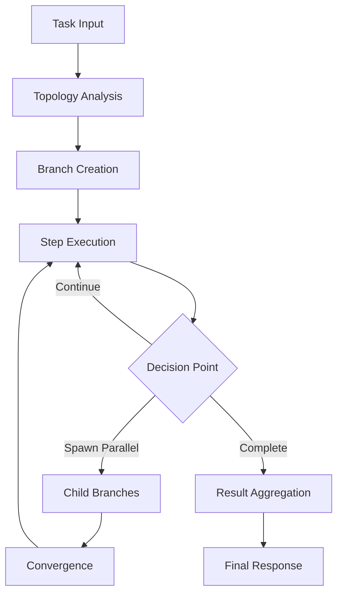
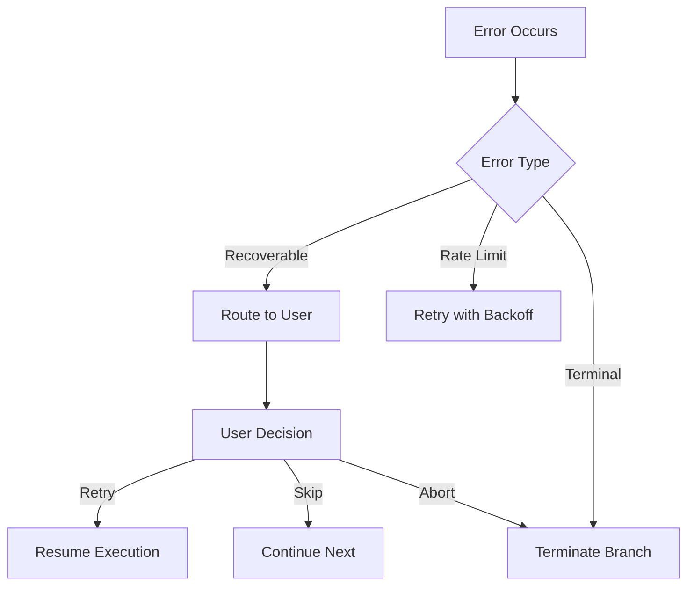

# Execution Flow

Understanding how MARSYS orchestrates multi-agent workflows through its execution system.

## Overview

The execution flow in MARSYS follows a sophisticated branching model that enables parallel execution, dynamic spawning, and convergence patterns. This guide explains how workflows execute from start to finish.

## Core Execution Concepts

### Execution Lifecycle



### 1. **Initialization Phase**

When Orchestra.run() is called:

```python
result = await Orchestra.run(
    task="Analyze market data",
    topology=topology
)
```

The system:
1. Validates the topology structure
2. Identifies entry points (nodes with no incoming edges)
3. Creates initial execution branches
4. Initializes memory and context

### 2. **Branch Execution**

Each branch represents an independent execution path:

```python
# Branch types determine execution pattern
class BranchType(Enum):
    SIMPLE = "simple"                # Linear execution
    CONVERSATION = "conversation"    # Back-and-forth dialogue
    NESTED = "nested"                # Hierarchical sub-branches
    USER_INTERACTION = "user_interaction"  # Human-in-the-loop
```

**Simple Branch Flow:**
```
Agent1 → Agent2 → Agent3 → Complete
```

**Conversation Branch Flow:**
```
Agent1 ↔ Agent2 (multiple turns) → Complete
```

**Nested Branch Flow:**
```
Parent Branch
    ├── Child Branch 1
    ├── Child Branch 2
    └── Convergence → Resume Parent
```

### 3. **Step Execution**

Each step in a branch involves:

1. **Validation**: Check if agent can be invoked
2. **Memory Injection**: Add conversation context
3. **Agent Invocation**: Call agent.run()
4. **Response Processing**: Validate and parse response
5. **Routing Decision**: Determine next action

```python
# Step execution process
step_result = await step_executor.execute_step(
    agent_name="Analyzer",
    request=request,
    context=context,
    branch=current_branch,
    memory=conversation_memory
)
```

### 4. **Dynamic Branching**

Agents can spawn parallel branches at runtime:

```python
# Agent response triggers parallel execution
{
    "next_action": "parallel_invoke",
    "agents": ["Worker1", "Worker2", "Worker3"],
    "agent_requests": {
        "Worker1": "Process segment A",
        "Worker2": "Process segment B",
        "Worker3": "Process segment C"
    }
}
```

This creates:
- Parent branch enters WAITING state
- Child branches execute in parallel
- Results collected at convergence point
- Parent resumes with aggregated results

### 5. **Convergence Points**

Convergence points synchronize parallel execution:

```python
# Automatic convergence detection
if topology.is_convergence_point(node):
    # Wait for all incoming branches
    await wait_for_branches(incoming_branches)
    # Aggregate results
    combined_results = aggregate_results(branch_results)
    # Continue execution
```

## Execution Patterns

### Sequential Pattern

```python
topology = {
    "nodes": ["A", "B", "C"],
    "edges": ["A -> B", "B -> C"]
}
# Execution: A → B → C
```

### Parallel Pattern

```python
topology = PatternConfig.hub_and_spoke(
    hub="Coordinator",
    spokes=["W1", "W2", "W3"],
    parallel_spokes=True
)
# Execution: Coordinator → (W1 || W2 || W3) → Coordinator
```

### Conversation Pattern

```python
topology = {
    "nodes": ["Agent1", "Agent2"],
    "edges": ["Agent1 <-> Agent2"]  # Bidirectional
}
# Execution: Agent1 ↔ Agent2 (multiple turns)
```

## Execution Context

### Context Propagation

Context flows through the execution:

```python
context = {
    "session_id": "abc123",
    "user_data": {...},
    "metadata": {...}
}

# Context available at every step
async def execute_step(context):
    # Access session data
    session_id = context["session_id"]
    # Add step-specific data
    context["current_step"] = step_number
```

### Memory Management

Each branch maintains agent memory:

```python
# Per-agent memory in branch
branch.memory = {
    "Agent1": [Message(...), Message(...)],
    "Agent2": [Message(...), Message(...)]
}

# Memory injected before agent execution
agent_memory = branch.memory.get(agent_name, [])
response = await agent.run(prompt, memory=agent_memory)
```

## Error Handling

### Error Recovery Flow



### Retry Logic

```python
# Automatic retry with steering
if error.is_recoverable():
    # Apply steering guidance
    steering_prompt = generate_steering(error)
    # Retry with guidance
    result = await retry_with_steering(
        agent=agent,
        steering=steering_prompt,
        max_retries=3
    )
```

## Performance Optimization

### Parallel Execution

Maximize parallelism where possible:

```python
# Good: Parallel branches for independent tasks
tasks = ["analyze_sales", "analyze_costs", "analyze_trends"]
parallel_results = await spawn_parallel_branches(tasks)

# Bad: Sequential when parallel is possible
for task in tasks:
    await execute_task(task)  # Slower
```

### Branch Pooling

Use agent pools for true parallelism:

```python
# Create pool for parallel execution
pool = AgentPool(
    agent_class=Worker,
    num_instances=5
)

# Pool handles concurrent requests
results = await pool.execute_parallel(requests)
```

## Monitoring Execution

### Execution Metrics

Track key metrics:

```python
metrics = {
    "total_steps": 0,
    "branch_count": 0,
    "parallel_branches": 0,
    "convergence_wait_time": 0,
    "total_duration": 0
}

# Available in OrchestraResult
result.total_steps
result.total_duration
result.branch_results
```

### Status Updates

Monitor execution progress:

```python
config = ExecutionConfig(
    status=StatusConfig.from_verbosity(2)  # Verbose
)

# Shows:
# - Agent transitions
# - Branch creation/completion
# - Convergence points
# - Timing information
```

## Advanced Features

### State Persistence

Save and resume execution:

```python
# Save state during execution
await state_manager.create_checkpoint(
    session_id="abc123",
    checkpoint_name="before_analysis"
)

# Resume from checkpoint
state = await state_manager.restore_checkpoint(checkpoint_id)
result = await Orchestra.resume(state, topology)
```

### Custom Execution Rules

Control execution with rules:

```python
# Add execution constraints
rules = [
    TimeoutRule(max_duration_seconds=300),
    MaxStepsRule(max_steps=100),
    ConditionalRule(
        condition=lambda ctx: ctx.metadata.get("priority") == "high",
        action="allow"
    )
]

topology.rules = rules
```

## Best Practices

### ✅ DO:
- Design topology for maximum parallelism
- Use convergence points appropriately
- Set reasonable timeouts
- Monitor execution metrics
- Handle errors gracefully

### ❌ DON'T:
- Create unnecessary sequential dependencies
- Ignore convergence timeout settings
- Skip error handling
- Use infinite loops without max_turns
- Block on long-running operations

## Common Patterns

### Map-Reduce Pattern

```python
# Map phase: parallel processing
map_results = await parallel_invoke(
    agents=["Mapper1", "Mapper2", "Mapper3"],
    tasks=data_chunks
)

# Reduce phase: aggregation
final_result = await invoke_agent(
    "Reducer",
    request=map_results
)
```

### Pipeline Pattern

```python
# Stage-based processing
stages = [
    {"name": "extract", "agents": ["Extractor"]},
    {"name": "transform", "agents": ["T1", "T2"]},
    {"name": "load", "agents": ["Loader"]}
]

topology = PatternConfig.pipeline(
    stages=stages,
    parallel_within_stage=True
)
```

## Debugging Execution

### Execution Trace

Access detailed execution history:

```python
# From OrchestraResult
for branch_result in result.branch_results:
    print(f"Branch {branch_result.branch_id}:")
    for step in branch_result.execution_trace:
        print(f"  Step {step.step_number}: {step.agent_name}")
        print(f"    Duration: {step.duration}s")
```

### Common Issues

1. **Convergence Timeout**: Increase `convergence_timeout` in config
2. **Memory Overflow**: Set `max_messages` limit
3. **Infinite Loops**: Add `max_turns` rule for conversations
4. **Branch Explosion**: Limit parallel branches with rules

## Related Documentation

- [Execution API](../api/execution.md) - Detailed API reference
- [Branching](branching.md) - Branch types and patterns
- [Topology](advanced/topology.md) - Topology design
- [Configuration](../api/configuration.md) - Execution configuration