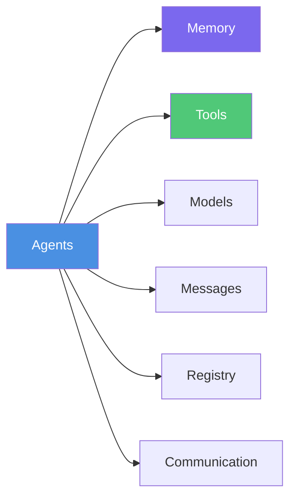
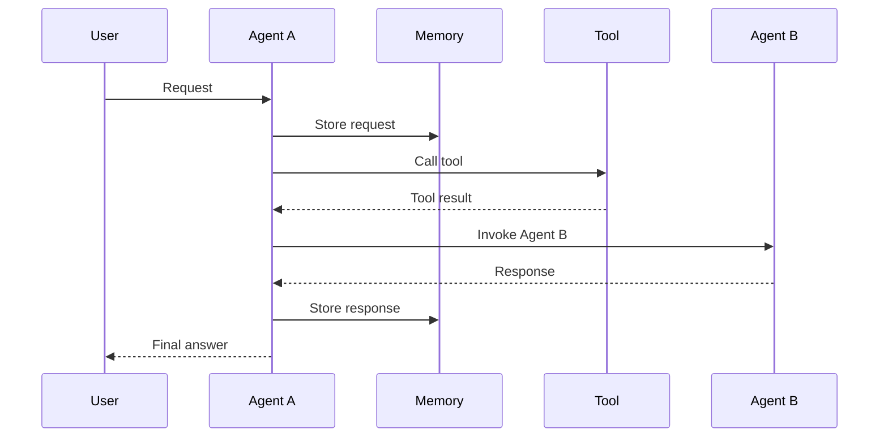

# Core Components

Essential building blocks and fundamental concepts that power the MARSYS framework.

## 🎯 Overview

These core components form the foundation of every MARSYS application. Understanding how they work together is crucial for building effective multi-agent systems.

## 🧩 Component Architecture



## 📚 Core Components

<div class="grid cards" markdown="1">

- :material-robot:{ .lg .middle } **[Agents](agents/)**

    ---

    **The fundamental building blocks** - Autonomous entities that perceive, think, and act

    ```python
    from marsys.agents import Agent
    agent = Agent(model_config, agent_name="Assistant")
    ```

- :material-brain:{ .lg .middle } **[Memory](memory/)**

    ---

    **Conversation and context storage** - How agents remember and learn from interactions

    ```python
    agent.memory.add_message(message)
    history = agent.memory.get_messages()
    ```

- :material-message:{ .lg .middle } **[Messages](messages/)**

    ---

    **Communication protocol** - Standardized format for agent-to-agent and agent-to-model communication

    ```python
    from marsys.agents.memory import Message
    msg = Message(role="assistant", content="Hello!")
    ```

- :material-tools:{ .lg .middle } **[Tools](tools/)**

    ---

    **Extended capabilities** - Functions that agents can call to interact with external systems

    ```python
    agent = Agent(tools=[search_tool, calculate_tool])
    ```

- :material-api:{ .lg .middle } **[Models](models/)**

    ---

    **AI model integration** - Unified interface for various LLM providers

    ```python
    from marsys.models import ModelConfig
    config = ModelConfig(type="api", provider="openai")
    ```

- :material-database:{ .lg .middle } **[Registry](registry/)**

    ---

    **Agent discovery** - Global registry for agent lookup and management

    ```python
    from marsys.agents import AgentRegistry
    agent = AgentRegistry.get("AgentName")
    ```

- :material-account-multiple:{ .lg .middle } **[Communication](communication/)**

    ---

    **Interaction patterns** - How agents communicate with each other and users

    ```python
    # Agent-to-agent communication
    {"next_action": "invoke_agent", "action_input": "Helper"}
    ```

</div>

## 🔄 How Components Work Together

### Agent Creation Flow
```python
# 1. Configure model
model_config = ModelConfig(
    type="api",
    name="anthropic/claude-haiku-4.5",
    provider="openrouter",
    max_tokens=12000
)

# 2. Create agent with components
agent = Agent(
    model_config=model_config,      # Model
    agent_name="DataAnalyst",       # Registry name
    description="Analyzes data",    # Role
    tools=[analyze_tool],          # Tools
    memory_retention="session"      # Memory policy
)

# 3. Agent auto-registers
# AgentRegistry now contains "DataAnalyst"

# 4. Execute with memory
response = await agent.run(
    prompt="Analyze sales data",
    context={"period": "Q1"}
)

# 5. Memory updated automatically
# agent.memory now contains the interaction
```

### Communication Flow


## 🎓 Learning Path

### Beginner Path
1. **[Agents](agents/)** - Start here to understand the core building blocks
2. **[Memory](memory/)** - Learn how agents retain information
3. **[Messages](messages/)** - Understand the communication format
4. **[Tools](tools/)** - Extend agent capabilities

### Intermediate Path
1. **[Models](models/)** - Configure different AI providers
2. **[Registry](registry/)** - Manage agent discovery
3. **[Communication](communication/)** - Master interaction patterns

## 💡 Key Concepts

### 1. **Agent Autonomy**
Agents are self-contained units with their own:
- Memory context
- Tool access
- Communication permissions
- Execution logic

### 2. **Memory Isolation**
Each agent maintains its own memory:
- `single_run`: No memory between invocations
- `session`: Memory within a session
- `persistent`: Long-term memory storage

### 3. **Tool Integration**
Tools extend agent capabilities:
```python
def search(query: str) -> str:
    """Search the web."""
    return search_results

agent = Agent(tools=[search])  # Auto-schema generation
```

### 4. **Model Abstraction**
Unified interface for all models:
```python
# Same interface, different providers
openrouter_config = ModelConfig(provider="openrouter", name="openai/gpt-5", max_tokens=12000)
anthropic_config = ModelConfig(provider="openrouter", name="anthropic/claude-sonnet-4.5", max_tokens=12000)
local_config = ModelConfig(provider="ollama", name="llama2")
```

### 5. **Registry Pattern**
Global agent discovery:
```python
# Agents auto-register on creation
agent = Agent(agent_name="Helper")

# Access from anywhere
helper = AgentRegistry.get("Helper")
all_agents = AgentRegistry.list()
```

## 📊 Component Dependencies

| Component | Depends On | Used By |
|-----------|------------|---------|
| **Agents** | Models, Memory, Tools | Orchestra, Registry |
| **Memory** | Messages | Agents |
| **Messages** | None | Memory, Communication |
| **Tools** | None | Agents |
| **Models** | None | Agents |
| **Registry** | Agents | Orchestra, Router |
| **Communication** | Messages | Agents, Orchestra |

## 🚀 Quick Examples

### Basic Agent with Memory
```python
agent = Agent(
    model_config=ModelConfig(
        type="api",
        name="anthropic/claude-haiku-4.5",
        provider="openrouter",
        max_tokens=12000
    ),
    agent_name="Assistant",
    memory_retention="session"
)

# Memory persists across calls in session
await agent.run("Remember my name is Alice")
await agent.run("What's my name?")  # Remembers "Alice"
```

### Agent with Tools
```python
def calculate(expression: str) -> float:
    """Evaluate mathematical expression."""
    return eval(expression)  # Simplified

agent = Agent(
    model_config=config,
    agent_name="Calculator",
    tools=[calculate]
)

await agent.run("What's 15% of 200?")  # Uses tool
```

### Agent Communication
```python
# Agent A can invoke Agent B
agent_a = Agent(
    model_config=config,
    agent_name="Coordinator",
    allowed_peers=["Researcher"]
)

agent_b = Agent(
    model_config=config,
    agent_name="Researcher"
)

# Coordinator can now invoke Researcher
```

## 🎯 Best Practices

1. **Choose appropriate memory retention**
   - Use `single_run` for stateless operations
   - Use `session` for most workflows
   - Use `persistent` only when necessary

2. **Design focused tools**
   - Single responsibility per tool
   - Clear input/output types
   - Proper error handling

3. **Configure models wisely**
   - Match model to task complexity
   - Consider cost vs capability
   - Use local models for privacy

4. **Use registry for discovery**
   - Don't hardcode agent references
   - Use `AgentRegistry.get()` for flexibility

5. **Structure messages properly**
   - Use standard Message format
   - Include relevant metadata
   - Maintain conversation flow

## 🚦 Next Steps

Ready to dive deeper?

<div class="grid cards" markdown="1">

- :material-robot:{ .lg .middle } **[Start with Agents](agents/)**

    ---

    Learn about agent creation and configuration

- :material-brain:{ .lg .middle } **[Explore Memory](memory/)**

    ---

    Understand memory management patterns

- :material-tools:{ .lg .middle } **[Add Tools](tools/)**

    ---

    Extend agents with custom capabilities

- :material-graph:{ .lg .middle } **[Advanced Topics](../advanced/topology/)**

    ---

    Master complex multi-agent patterns

</div>

---

!!! tip "Start Here"
    If you're new to MARSYS, begin with the [Agents](agents/) documentation to understand the fundamental building blocks of the framework.