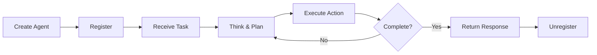

# Basic Concepts

Understanding the core concepts of the Multi-Agent Reasoning Systems (MARSYS) framework.

## Core Components

  <a href="agents/" class="concept-card">
    <h3>🤖 Agents</h3>
    
The fundamental building blocks - autonomous entities that can perceive, think, and act

  </a>
  
  <a href="memory/" class="concept-card">
    <h3>🧠 Memory</h3>
    
How agents store and retrieve conversation history and context

  </a>
  
  <a href="messages/" class="concept-card">
    <h3>💬 Messages</h3>
    
The communication protocol between agents and models

  </a>
  
  <a href="tools/" class="concept-card">
    <h3>🔧 Tools</h3>
    
Extending agent capabilities with custom functions

  </a>
  
  <a href="models/" class="concept-card">
    <h3>🎯 Models</h3>
    
The AI models that power agent intelligence

  </a>
  
  <a href="registry/" class="concept-card">
    <h3>📋 Registry</h3>
    
How agents discover and communicate with each other

  </a>

## Framework Philosophy

The Multi-Agent Reasoning Systems (MARSYS) framework is built on several key principles:

### 1. **Modularity**
Each component is designed to be independent and composable. Agents, models, tools, and memory systems can be mixed and matched.

### 2. **Standardization**
All components follow consistent interfaces and patterns, making the framework predictable and easy to extend.

### 3. **Asynchronous by Design**
Built for performance and scalability with async/await patterns throughout.

### 4. **OpenAI Compatibility**
Message formats and tool schemas follow OpenAI standards for maximum compatibility.

## The Agent Lifecycle

## Getting Started with Concepts

We recommend reading the concepts in this order:

1. **[Agents](agents.md)** - Understand the agent architecture
2. **[Messages](messages.md)** - Learn how agents communicate
3. **[Memory](memory.md)** - See how context is maintained
4. **[Tools](tools.md)** - Extend agent capabilities
5. **[Models](models.md)** - Understand the AI backend
6. **[Registry](registry.md)** - Enable multi-agent systems

Each concept builds on the previous ones to give you a complete understanding of the framework.
