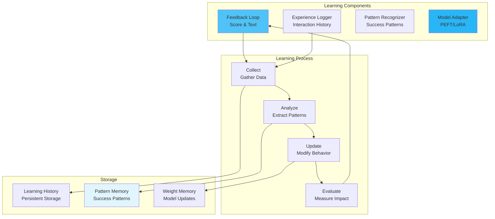

# Learning Agents

Create agents that adapt and improve their performance over time through various learning mechanisms.

## 🎯 Overview

Learning agents in MARSYS extend the base agent capabilities with:

- **Feedback Learning**: Adapt based on explicit feedback
- **Experience Learning**: Learn from interaction history
- **Pattern Recognition**: Identify and leverage successful patterns
- **Fine-tuning**: Model adaptation through PEFT techniques
- **Reinforcement Learning**: Optimize behavior through rewards
- **Transfer Learning**: Apply knowledge across domains

## 🏗️ Architecture



## 📦 Basic Learning Agent

### LearnableAgent Class

The base class for all learning agents:

```python
from marsys.agents import LearnableAgent
from marsys.models import ModelConfig
from typing import Dict, List, Optional, Any
from datetime import datetime
import json

class LearnableAgent(BaseAgent):
    """Base class for agents with learning capabilities."""

    def __init__(
        self,
        model,
        learning_rate: float = 0.1,
        memory_size: int = 1000,
        **kwargs
    ):
        super().__init__(model, **kwargs)
        self.learning_rate = learning_rate
        self.memory_size = memory_size

        # Learning components
        self.experience_buffer = []
        self.pattern_library = {}
        self.performance_metrics = {
            "success_rate": 0.0,
            "average_score": 0.0,
            "total_interactions": 0
        }

    def record_experience(
        self,
        prompt: str,
        response: str,
        outcome: Dict[str, Any]
    ):
        """Record an interaction for learning."""
        experience = {
            "prompt": prompt,
            "response": response,
            "outcome": outcome,
            "timestamp": datetime.now(),
            "patterns_used": self._get_active_patterns()
        }

        self.experience_buffer.append(experience)

        # Maintain memory size
        if len(self.experience_buffer) > self.memory_size:
            self.experience_buffer.pop(0)

    def learn_from_experiences(self):
        """Analyze experiences and update patterns."""
        if len(self.experience_buffer) < 10:
            return  # Need minimum experiences

        # Extract successful patterns
        successful_experiences = [
            exp for exp in self.experience_buffer
            if exp["outcome"].get("success", False)
        ]

        # Update pattern library
        self._extract_patterns(successful_experiences)

        # Update performance metrics
        self._update_metrics()

    def _extract_patterns(self, experiences: List[Dict]):
        """Extract successful patterns from experiences."""
        # Pattern extraction logic
        pass

    def _update_metrics(self):
        """Update performance metrics."""
        if not self.experience_buffer:
            return

        successes = sum(
            1 for exp in self.experience_buffer
            if exp["outcome"].get("success", False)
        )

        self.performance_metrics["success_rate"] = (
            successes / len(self.experience_buffer)
        )
        self.performance_metrics["total_interactions"] = (
            len(self.experience_buffer)
        )
```

## 🎯 Learning Mechanisms

### Feedback-Based Learning

Learn from explicit user feedback:

```python
class FeedbackLearningAgent(LearnableAgent):
    """Agent that learns from feedback scores."""

    def __init__(self, model, **kwargs):
        super().__init__(model, **kwargs)
        self.feedback_history = []
        self.response_strategies = {}
        self.preference_model = PreferenceModel()

    async def process_feedback(
        self,
        task: str,
        response: str,
        feedback_score: float,  # 0.0 to 1.0
        feedback_text: Optional[str] = None
    ):
        """Process feedback and update behavior."""

        # Record feedback
        feedback_entry = {
            "task": task,
            "response": response,
            "score": feedback_score,
            "text": feedback_text,
            "timestamp": datetime.now()
        }
        self.feedback_history.append(feedback_entry)

        # Update preference model
        self.preference_model.update(task, response, feedback_score)

        # Adjust response strategies
        if feedback_score > 0.7:
            # Reinforce successful strategy
            strategy = self._extract_strategy(response)
            self._reinforce_strategy(task, strategy, feedback_score)
        elif feedback_score < 0.3:
            # Avoid unsuccessful strategy
            strategy = self._extract_strategy(response)
            self._penalize_strategy(task, strategy, feedback_score)

        # Learn from feedback text if provided
        if feedback_text:
            self._process_textual_feedback(feedback_text)

    def _reinforce_strategy(self, task: str, strategy: Dict, score: float):
        """Strengthen successful strategies."""
        task_type = self._classify_task(task)

        if task_type not in self.response_strategies:
            self.response_strategies[task_type] = {}

        strategy_key = json.dumps(strategy, sort_keys=True)

        if strategy_key in self.response_strategies[task_type]:
            # Update existing strategy
            current = self.response_strategies[task_type][strategy_key]
            current["score"] = (
                current["score"] * (1 - self.learning_rate) +
                score * self.learning_rate
            )
            current["count"] += 1
        else:
            # Add new strategy
            self.response_strategies[task_type][strategy_key] = {
                "strategy": strategy,
                "score": score,
                "count": 1
            }

    async def _run(self, prompt, context, **kwargs):
        """Execute with learned strategies."""

        task_type = self._classify_task(prompt)

        # Apply learned strategies
        if task_type in self.response_strategies:
            best_strategy = self._select_best_strategy(task_type)
            if best_strategy:
                prompt = self._apply_strategy(prompt, best_strategy)

        # Generate response
        messages = self._prepare_messages(prompt)
        response = await self.model.run(messages)

        return Message(
            role="assistant",
            content=response.content,
            metadata={
                "task_type": task_type,
                "strategy_applied": best_strategy is not None
            }
        )


class PreferenceModel:
    """Model user preferences based on feedback."""

    def __init__(self):
        self.preferences = {}
        self.feature_weights = {}

    def update(self, task: str, response: str, score: float):
        """Update preference model with new feedback."""
        features = self._extract_features(task, response)

        for feature, value in features.items():
            if feature not in self.feature_weights:
                self.feature_weights[feature] = 0.5

            # Update weight based on score
            self.feature_weights[feature] += (score - 0.5) * 0.1
            self.feature_weights[feature] = max(
                0.0, min(1.0, self.feature_weights[feature])
            )

    def predict_preference(self, task: str, response: str) -> float:
        """Predict preference score for a response."""
        features = self._extract_features(task, response)
        score = 0.5  # Neutral baseline

        for feature, value in features.items():
            if feature in self.feature_weights:
                score += (self.feature_weights[feature] - 0.5) * value

        return max(0.0, min(1.0, score))

    def _extract_features(self, task: str, response: str) -> Dict[str, float]:
        """Extract features from task-response pair."""
        features = {
            "length": len(response) / 1000.0,  # Normalized length
            "has_code": 1.0 if "```" in response else 0.0,
            "has_list": 1.0 if any(x in response for x in ["1.", "- ", "* "]) else 0.0,
            "formal_tone": self._measure_formality(response),
            "technical_depth": self._measure_technicality(response)
        }
        return features

    def _measure_formality(self, text: str) -> float:
        """Measure formality level (0-1)."""
        formal_indicators = ["therefore", "furthermore", "however", "consequently"]
        informal_indicators = ["gonna", "wanna", "yeah", "ok"]

        formal_count = sum(1 for word in formal_indicators if word in text.lower())
        informal_count = sum(1 for word in informal_indicators if word in text.lower())

        if formal_count + informal_count == 0:
            return 0.5

        return formal_count / (formal_count + informal_count)

    def _measure_technicality(self, text: str) -> float:
        """Measure technical depth (0-1)."""
        technical_terms = ["algorithm", "implementation", "architecture",
                          "optimization", "framework", "protocol"]
        count = sum(1 for term in technical_terms if term in text.lower())
        return min(1.0, count / 10.0)
```

### Experience-Based Learning

Learn from interaction history:

```python
class ExperienceLearningAgent(LearnableAgent):
    """Agent that learns from past experiences."""

    def __init__(self, model, **kwargs):
        super().__init__(model, **kwargs)
        self.experience_index = ExperienceIndex()
        self.success_patterns = {}

    def learn_from_episode(self, episode: Dict[str, Any]):
        """Learn from a complete interaction episode."""

        # Index the experience
        self.experience_index.add(episode)

        # Extract patterns if successful
        if episode.get("success", False):
            patterns = self._extract_episode_patterns(episode)
            for pattern in patterns:
                self._add_success_pattern(pattern)

        # Update strategy based on outcome
        self._update_strategy_from_outcome(episode)

    def _extract_episode_patterns(self, episode: Dict) -> List[Dict]:
        """Extract reusable patterns from successful episode."""
        patterns = []

        # Extract task-response patterns
        if "interactions" in episode:
            for interaction in episode["interactions"]:
                if interaction.get("effective", False):
                    pattern = {
                        "trigger": self._generalize_trigger(interaction["prompt"]),
                        "response_template": self._extract_template(interaction["response"]),
                        "context_requirements": self._extract_context(interaction),
                        "confidence": 0.7
                    }
                    patterns.append(pattern)

        return patterns

    def _add_success_pattern(self, pattern: Dict):
        """Add or update a success pattern."""
        pattern_key = pattern["trigger"]

        if pattern_key in self.success_patterns:
            # Update existing pattern
            existing = self.success_patterns[pattern_key]
            existing["confidence"] = min(
                1.0,
                existing["confidence"] + 0.05
            )
            existing["usage_count"] += 1
        else:
            # Add new pattern
            self.success_patterns[pattern_key] = {
                **pattern,
                "usage_count": 1,
                "success_count": 1
            }

    async def _run(self, prompt, context, **kwargs):
        """Execute using learned experiences."""

        # Find relevant past experiences
        similar_experiences = self.experience_index.find_similar(
            prompt, top_k=3
        )

        # Apply successful patterns
        applied_patterns = []
        for pattern_key, pattern in self.success_patterns.items():
            if self._pattern_matches(prompt, pattern["trigger"]):
                applied_patterns.append(pattern)

        # Enhance prompt with experience
        if similar_experiences:
            context_info = self._summarize_experiences(similar_experiences)
            enhanced_prompt = f"{prompt}\n\nBased on past experience: {context_info}"
        else:
            enhanced_prompt = prompt

        # Generate response
        messages = self._prepare_messages(enhanced_prompt)
        response = await self.model.run(messages)

        # Apply learned templates if applicable
        if applied_patterns:
            response_content = self._apply_templates(
                response.content,
                applied_patterns
            )
        else:
            response_content = response.content

        return Message(
            role="assistant",
            content=response_content,
            metadata={
                "patterns_applied": len(applied_patterns),
                "experience_used": len(similar_experiences) > 0
            }
        )


class ExperienceIndex:
    """Index for efficient experience retrieval."""

    def __init__(self):
        self.experiences = []
        self.keyword_index = defaultdict(list)

    def add(self, experience: Dict):
        """Add experience to index."""
        exp_id = len(self.experiences)
        self.experiences.append(experience)

        # Index by keywords
        keywords = self._extract_keywords(experience)
        for keyword in keywords:
            self.keyword_index[keyword].append(exp_id)

    def find_similar(self, query: str, top_k: int = 5) -> List[Dict]:
        """Find experiences similar to query."""
        query_keywords = set(query.lower().split())
        scores = []

        for i, experience in enumerate(self.experiences):
            exp_keywords = self._extract_keywords(experience)
            similarity = len(query_keywords & exp_keywords) / max(
                len(query_keywords), 1
            )
            scores.append((similarity, experience))

        # Sort by similarity and return top-k
        scores.sort(key=lambda x: x[0], reverse=True)
        return [exp for _, exp in scores[:top_k]]

    def _extract_keywords(self, experience: Dict) -> set:
        """Extract keywords from experience."""
        text = str(experience.get("prompt", "")) + " " + str(experience.get("task", ""))
        return set(text.lower().split())
```

### PEFT Fine-tuning Agent

Agent with parameter-efficient fine-tuning:

```python
class PEFTAgent(LearnableAgent):
    """Agent with PEFT (LoRA) fine-tuning capabilities."""

    def __init__(self, model, lora_rank: int = 16, **kwargs):
        super().__init__(model, **kwargs)
        self.lora_rank = lora_rank
        self.lora_adapters = {}
        self.training_data = []

    def collect_training_data(
        self,
        prompt: str,
        ideal_response: str,
        metadata: Optional[Dict] = None
    ):
        """Collect data for fine-tuning."""
        self.training_data.append({
            "prompt": prompt,
            "response": ideal_response,
            "metadata": metadata or {},
            "timestamp": datetime.now()
        })

    async def fine_tune(self, task_type: str):
        """Fine-tune model on collected data."""

        if len(self.training_data) < 10:
            raise ValueError("Insufficient training data")

        # Filter data for task type
        task_data = [
            d for d in self.training_data
            if d.get("metadata", {}).get("task_type") == task_type
        ]

        # Create LoRA adapter for task
        adapter = self._create_lora_adapter(task_type, task_data)
        self.lora_adapters[task_type] = adapter

        # Training would happen here in real implementation
        # This is a simplified version
        return {
            "task_type": task_type,
            "samples_used": len(task_data),
            "adapter_rank": self.lora_rank
        }

    def _create_lora_adapter(self, task_type: str, data: List[Dict]):
        """Create LoRA adapter for specific task."""
        # Simplified LoRA adapter representation
        adapter = {
            "task_type": task_type,
            "rank": self.lora_rank,
            "trained_on": len(data),
            "weights": self._initialize_lora_weights(),
            "active": True
        }
        return adapter

    def _initialize_lora_weights(self):
        """Initialize LoRA weight matrices."""
        # Simplified - in practice would be actual weight tensors
        return {
            "A": np.random.randn(self.lora_rank, 768) * 0.01,
            "B": np.random.randn(768, self.lora_rank) * 0.01
        }

    async def _run(self, prompt, context, **kwargs):
        """Execute with LoRA adaptation."""

        task_type = self._classify_task(prompt)

        # Check for applicable LoRA adapter
        if task_type in self.lora_adapters and self.lora_adapters[task_type]["active"]:
            # Apply LoRA adapter (simplified)
            adapter_info = f"[Using fine-tuned adapter for {task_type}]"
            enhanced_prompt = f"{adapter_info}\n{prompt}"
        else:
            enhanced_prompt = prompt

        messages = self._prepare_messages(enhanced_prompt)
        response = await self.model.run(messages)

        return Message(
            role="assistant",
            content=response.content,
            metadata={
                "lora_applied": task_type in self.lora_adapters,
                "task_type": task_type
            }
        )
```

## 🎯 Advanced Learning Patterns

### Reinforcement Learning Agent

Learn through reward signals:

```python
class RLAgent(LearnableAgent):
    """Agent using reinforcement learning principles."""

    def __init__(
        self,
        model,
        epsilon: float = 0.1,  # Exploration rate
        gamma: float = 0.95,    # Discount factor
        **kwargs
    ):
        super().__init__(model, **kwargs)
        self.epsilon = epsilon
        self.gamma = gamma
        self.q_table = {}  # State-action values
        self.episode_buffer = []

    def get_state_representation(self, prompt: str, context: Dict) -> str:
        """Create state representation."""
        # Simplified state representation
        state_features = {
            "task_type": self._classify_task(prompt),
            "prompt_length": len(prompt) // 100,
            "has_context": bool(context),
            "complexity": self._estimate_complexity(prompt)
        }
        return json.dumps(state_features, sort_keys=True)

    def select_action(self, state: str) -> str:
        """Select action using epsilon-greedy policy."""

        if np.random.random() < self.epsilon:
            # Exploration: random action
            return self._get_random_action()

        # Exploitation: best known action
        if state in self.q_table:
            actions = self.q_table[state]
            best_action = max(actions, key=actions.get)
            return best_action
        else:
            return self._get_random_action()

    def update_q_value(
        self,
        state: str,
        action: str,
        reward: float,
        next_state: str
    ):
        """Update Q-value using Q-learning."""

        if state not in self.q_table:
            self.q_table[state] = {}

        if action not in self.q_table[state]:
            self.q_table[state][action] = 0.0

        # Q-learning update
        current_q = self.q_table[state][action]

        # Get max Q-value for next state
        if next_state in self.q_table:
            max_next_q = max(self.q_table[next_state].values())
        else:
            max_next_q = 0.0

        # Update Q-value
        new_q = current_q + self.learning_rate * (
            reward + self.gamma * max_next_q - current_q
        )
        self.q_table[state][action] = new_q

    def process_episode(self, episode: List[Dict]):
        """Process complete episode for learning."""

        for i in range(len(episode) - 1):
            step = episode[i]
            next_step = episode[i + 1]

            self.update_q_value(
                step["state"],
                step["action"],
                step["reward"],
                next_step["state"]
            )

        # Decay exploration rate
        self.epsilon = max(0.01, self.epsilon * 0.995)

    def _get_random_action(self) -> str:
        """Get random action for exploration."""
        actions = [
            "detailed_analysis",
            "concise_summary",
            "step_by_step",
            "examples_first",
            "theory_first"
        ]
        return np.random.choice(actions)

    def _estimate_complexity(self, prompt: str) -> str:
        """Estimate task complexity."""
        if len(prompt) > 500 or any(word in prompt.lower() for word in
                                    ["complex", "detailed", "comprehensive"]):
            return "high"
        elif len(prompt) > 200:
            return "medium"
        else:
            return "low"
```

### Meta-Learning Agent

Learn how to learn:

```python
class MetaLearningAgent(LearnableAgent):
    """Agent that learns how to learn efficiently."""

    def __init__(self, model, **kwargs):
        super().__init__(model, **kwargs)
        self.learning_strategies = {}
        self.strategy_performance = {}
        self.meta_optimizer = MetaOptimizer()

    def learn_learning_strategy(
        self,
        task_domain: str,
        learning_examples: List[Dict]
    ):
        """Learn optimal learning strategy for domain."""

        # Try different learning strategies
        strategies = [
            "few_shot",
            "analogy",
            "decomposition",
            "pattern_matching"
        ]

        best_strategy = None
        best_performance = -float('inf')

        for strategy in strategies:
            performance = self._evaluate_strategy(
                strategy,
                task_domain,
                learning_examples
            )

            if performance > best_performance:
                best_performance = performance
                best_strategy = strategy

        # Store best strategy for domain
        self.learning_strategies[task_domain] = best_strategy
        self.strategy_performance[task_domain] = best_performance

        return best_strategy

    def _evaluate_strategy(
        self,
        strategy: str,
        domain: str,
        examples: List[Dict]
    ) -> float:
        """Evaluate learning strategy effectiveness."""

        if len(examples) < 2:
            return 0.0

        # Split examples for training and testing
        train_size = len(examples) // 2
        train_examples = examples[:train_size]
        test_examples = examples[train_size:]

        # Apply strategy to learn from training examples
        learned_patterns = self._apply_learning_strategy(
            strategy,
            train_examples
        )

        # Test on remaining examples
        correct_predictions = 0
        for test_ex in test_examples:
            prediction = self._predict_with_patterns(
                test_ex["prompt"],
                learned_patterns
            )
            if self._is_similar(prediction, test_ex["response"]):
                correct_predictions += 1

        return correct_predictions / len(test_examples)

    def _apply_learning_strategy(
        self,
        strategy: str,
        examples: List[Dict]
    ) -> Dict:
        """Apply specific learning strategy."""

        if strategy == "few_shot":
            return self._few_shot_learning(examples)
        elif strategy == "analogy":
            return self._analogy_learning(examples)
        elif strategy == "decomposition":
            return self._decomposition_learning(examples)
        elif strategy == "pattern_matching":
            return self._pattern_matching_learning(examples)
        else:
            return {}

    def _few_shot_learning(self, examples: List[Dict]) -> Dict:
        """Learn from few examples."""
        patterns = {
            "examples": examples,
            "strategy": "few_shot",
            "prompt_template": self._extract_common_template(examples)
        }
        return patterns

    def _analogy_learning(self, examples: List[Dict]) -> Dict:
        """Learn through analogies."""
        analogies = []
        for i, ex1 in enumerate(examples):
            for ex2 in examples[i+1:]:
                analogy = self._find_analogy(ex1, ex2)
                if analogy:
                    analogies.append(analogy)

        return {
            "analogies": analogies,
            "strategy": "analogy"
        }

    def _find_analogy(self, ex1: Dict, ex2: Dict) -> Optional[Dict]:
        """Find analogy between examples."""
        # Simplified analogy detection
        common_structure = self._extract_structure(ex1["prompt"])
        if common_structure == self._extract_structure(ex2["prompt"]):
            return {
                "source": ex1,
                "target": ex2,
                "mapping": common_structure
            }
        return None


class MetaOptimizer:
    """Optimizer for meta-learning strategies."""

    def __init__(self):
        self.strategy_history = []
        self.optimization_params = {
            "learning_rate_mult": 1.0,
            "exploration_bonus": 0.1
        }

    def optimize_strategy(self, strategy: Dict, performance: float):
        """Optimize learning strategy based on performance."""
        self.strategy_history.append({
            "strategy": strategy,
            "performance": performance,
            "timestamp": datetime.now()
        })

        # Adjust optimization parameters
        if performance > 0.7:
            # Good performance - reduce exploration
            self.optimization_params["exploration_bonus"] *= 0.95
        else:
            # Poor performance - increase exploration
            self.optimization_params["exploration_bonus"] *= 1.05

        return self.optimization_params
```

## 📋 Best Practices

### 1. **Continuous Learning Loop**

```python
# ✅ GOOD - Structured learning loop
class ContinuousLearner(LearnableAgent):
    async def learning_loop(self):
        while True:
            # Collect experiences
            experiences = self.collect_recent_experiences()

            # Learn from experiences
            if len(experiences) >= 10:
                self.learn_from_experiences()

            # Evaluate performance
            metrics = self.evaluate_performance()

            # Adjust learning parameters
            if metrics["success_rate"] < 0.5:
                self.learning_rate *= 1.1  # Learn faster
            else:
                self.learning_rate *= 0.99  # Stabilize

            await asyncio.sleep(3600)  # Learn every hour

# ❌ BAD - No structured learning
class UnstructuredAgent(BaseAgent):
    def maybe_learn(self):
        if random.random() < 0.1:  # Random learning
            # Learn something...
            pass
```

### 2. **Experience Management**

```python
# ✅ GOOD - Managed experience buffer
class ManagedExperienceAgent(LearnableAgent):
    def __init__(self, model, **kwargs):
        super().__init__(model, **kwargs)
        self.experience_buffer = deque(maxlen=1000)  # Limited size
        self.important_experiences = []  # Keep important ones

    def add_experience(self, exp: Dict):
        self.experience_buffer.append(exp)

        if exp.get("importance", 0) > 0.8:
            self.important_experiences.append(exp)

# ❌ BAD - Unbounded experience storage
class UnboundedAgent(LearnableAgent):
    def __init__(self, model, **kwargs):
        super().__init__(model, **kwargs)
        self.all_experiences = []  # Grows forever!
```

### 3. **Learning Rate Management**

```python
# ✅ GOOD - Adaptive learning rate
class AdaptiveLearner(LearnableAgent):
    def adjust_learning_rate(self, performance: float):
        if performance > self.target_performance:
            # Reduce learning rate when performing well
            self.learning_rate = max(
                0.01,
                self.learning_rate * 0.9
            )
        else:
            # Increase learning rate when underperforming
            self.learning_rate = min(
                0.5,
                self.learning_rate * 1.1
            )

# ❌ BAD - Fixed learning rate
class FixedLearner(LearnableAgent):
    def __init__(self, model):
        super().__init__(model)
        self.learning_rate = 0.1  # Never changes
```

## 🚦 Next Steps

<div class="grid cards" markdown="1">

- :material-robot:{ .lg .middle } **[Custom Agents](custom-agents.md)**

    ---

    Build specialized agents

- :material-memory:{ .lg .middle } **[Memory Patterns](memory-patterns.md)**

    ---

    Advanced memory for learning

- :material-chart-line:{ .lg .middle } **[Performance Monitoring](../guides/performance.md)**

    ---

    Track learning progress

- :material-api:{ .lg .middle } **[Agent API](../api/agent-class.md)**

    ---

    Complete API reference

</div>

---

!!! success "Learning Agents Ready!"
    You now understand how to create learning agents in MARSYS. Build adaptive agents that improve their performance through feedback, experience, and advanced learning techniques.