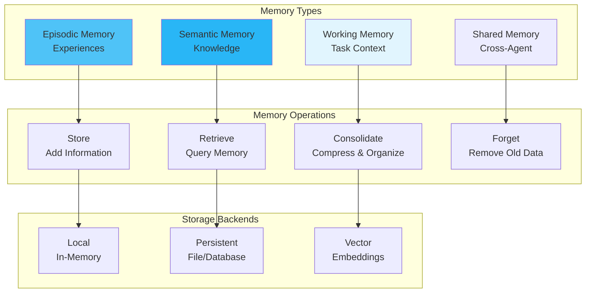

# Memory Patterns

Advanced memory management strategies for sophisticated multi-agent systems in MARSYS.

## 🎯 Overview

Memory patterns extend beyond basic conversation history to enable:

- **Episodic Memory**: Store discrete experiences and episodes
- **Semantic Memory**: Long-term knowledge representation
- **Working Memory**: Short-term task-focused storage
- **Shared Memory**: Cross-agent knowledge sharing
- **Hierarchical Memory**: Layered memory structures
- **Memory Optimization**: Efficient storage and retrieval

## 🏗️ Architecture



## 📦 Memory Types

### Episodic Memory

Store and retrieve specific experiences:

```python
from datetime import datetime
from typing import List, Dict, Optional
import json
import uuid

class EpisodicMemory:
    """Memory system for storing discrete episodes."""

    def __init__(self, max_episodes: int = 100):
        self.episodes: List[Dict] = []
        self.max_episodes = max_episodes
        self.episode_index = {}  # Fast lookup by ID

    def start_episode(self, context: str, metadata: Optional[Dict] = None) -> str:
        """Start a new episode."""
        episode_id = str(uuid.uuid4())
        episode = {
            "id": episode_id,
            "context": context,
            "metadata": metadata or {},
            "start_time": datetime.now(),
            "end_time": None,
            "messages": [],
            "outcome": None,
            "importance": 0.5  # 0-1 scale
        }

        self.episodes.append(episode)
        self.episode_index[episode_id] = episode

        # Maintain size limit
        if len(self.episodes) > self.max_episodes:
            self._consolidate_old_episodes()

        return episode_id

    def add_to_episode(self, episode_id: str, message: Message):
        """Add message to current episode."""
        if episode_id in self.episode_index:
            episode = self.episode_index[episode_id]
            episode["messages"].append({
                "timestamp": datetime.now().isoformat(),
                "role": message.role,
                "content": message.content,
                "metadata": message.metadata
            })

    def end_episode(self, episode_id: str, outcome: str, importance: float = 0.5):
        """Complete an episode with outcome."""
        if episode_id in self.episode_index:
            episode = self.episode_index[episode_id]
            episode["end_time"] = datetime.now()
            episode["outcome"] = outcome
            episode["importance"] = importance

    def retrieve_similar_episodes(self, query: str, limit: int = 5) -> List[Dict]:
        """Find episodes similar to query."""
        # Simple keyword matching (extend with embeddings for semantic search)
        scores = []
        for episode in self.episodes:
            score = self._calculate_similarity(query, episode)
            scores.append((score, episode))

        # Sort by score and importance
        scores.sort(key=lambda x: x[0] * x[1]["importance"], reverse=True)
        return [episode for _, episode in scores[:limit]]

    def _calculate_similarity(self, query: str, episode: Dict) -> float:
        """Calculate similarity between query and episode."""
        # Simple implementation - extend with proper similarity metrics
        query_words = set(query.lower().split())
        episode_text = f"{episode['context']} {episode.get('outcome', '')}"
        episode_words = set(episode_text.lower().split())

        if not episode_words:
            return 0.0

        intersection = query_words & episode_words
        return len(intersection) / len(episode_words)

    def _consolidate_old_episodes(self):
        """Compress or remove old episodes."""
        # Sort by importance and recency
        self.episodes.sort(
            key=lambda e: e["importance"] * 0.7 +
                         (1.0 if e["end_time"] else 0.5) * 0.3,
            reverse=True
        )

        # Keep top episodes
        self.episodes = self.episodes[:self.max_episodes]

        # Rebuild index
        self.episode_index = {ep["id"]: ep for ep in self.episodes}
```

### Semantic Memory

Long-term knowledge storage:

```python
from typing import Dict, List, Set, Optional
import json

class SemanticMemory:
    """Long-term knowledge representation."""

    def __init__(self):
        self.concepts: Dict[str, Dict] = {}  # Concept definitions
        self.relationships: List[Dict] = []   # Concept relationships
        self.facts: List[Dict] = []          # Stored facts

    def add_concept(self, name: str, definition: str,
                    properties: Optional[Dict] = None):
        """Add a concept to semantic memory."""
        self.concepts[name] = {
            "definition": definition,
            "properties": properties or {},
            "created": datetime.now(),
            "access_count": 0,
            "last_accessed": None
        }

    def add_relationship(self, source: str, relation: str, target: str,
                         strength: float = 1.0):
        """Add relationship between concepts."""
        self.relationships.append({
            "source": source,
            "relation": relation,
            "target": target,
            "strength": strength,  # Relationship strength
            "created": datetime.now()
        })

    def add_fact(self, fact: str, source: Optional[str] = None,
                 confidence: float = 1.0):
        """Store a fact with confidence level."""
        self.facts.append({
            "content": fact,
            "source": source,
            "confidence": confidence,
            "created": datetime.now(),
            "verification_count": 0
        })

    def query_concept(self, name: str) -> Optional[Dict]:
        """Retrieve concept information."""
        if name in self.concepts:
            concept = self.concepts[name]
            concept["access_count"] += 1
            concept["last_accessed"] = datetime.now()

            # Get related concepts
            related = self._get_related_concepts(name)

            return {
                "concept": concept,
                "related": related
            }
        return None

    def query_facts(self, topic: str, min_confidence: float = 0.5) -> List[Dict]:
        """Retrieve facts about a topic."""
        relevant_facts = []
        topic_words = set(topic.lower().split())

        for fact in self.facts:
            if fact["confidence"] < min_confidence:
                continue

            fact_words = set(fact["content"].lower().split())
            if topic_words & fact_words:  # Intersection
                relevant_facts.append(fact)

        # Sort by confidence and verification
        relevant_facts.sort(
            key=lambda f: f["confidence"] * (1 + f["verification_count"] * 0.1),
            reverse=True
        )

        return relevant_facts

    def _get_related_concepts(self, name: str) -> List[Dict]:
        """Find concepts related to given concept."""
        related = []

        for rel in self.relationships:
            if rel["source"] == name:
                related.append({
                    "concept": rel["target"],
                    "relation": rel["relation"],
                    "strength": rel["strength"]
                })
            elif rel["target"] == name:
                related.append({
                    "concept": rel["source"],
                    "relation": f"inverse_{rel['relation']}",
                    "strength": rel["strength"]
                })

        # Sort by relationship strength
        related.sort(key=lambda r: r["strength"], reverse=True)
        return related

    def consolidate(self):
        """Consolidate and optimize memory."""
        # Remove low-confidence, unverified facts
        self.facts = [
            f for f in self.facts
            if f["confidence"] > 0.3 or f["verification_count"] > 2
        ]

        # Remove unused concepts
        accessed_recently = datetime.now() - timedelta(days=30)
        self.concepts = {
            name: concept
            for name, concept in self.concepts.items()
            if concept["access_count"] > 0 or
               concept.get("last_accessed", concept["created"]) > accessed_recently
        }
```

### Working Memory

Short-term task-focused storage:

```python
from collections import deque
from typing import Any, Optional

class WorkingMemory:
    """Short-term memory for active task processing."""

    def __init__(self, capacity: int = 7):  # Miller's Law: 7±2 items
        self.capacity = capacity
        self.items = deque(maxlen=capacity)
        self.focus_stack = []  # Current focus items
        self.context = {}  # Task context

    def add(self, item: Any, priority: float = 0.5):
        """Add item to working memory."""
        self.items.append({
            "content": item,
            "priority": priority,
            "timestamp": datetime.now(),
            "access_count": 0
        })

        # Maintain capacity by removing lowest priority items
        if len(self.items) >= self.capacity:
            self._evict_lowest_priority()

    def focus_on(self, item: Any):
        """Focus on specific item (moves to focus stack)."""
        self.focus_stack.append(item)

        # Limit focus stack size
        if len(self.focus_stack) > 3:
            self.focus_stack.pop(0)

    def get_focused(self) -> List[Any]:
        """Get currently focused items."""
        return self.focus_stack.copy()

    def set_context(self, key: str, value: Any):
        """Set task context variable."""
        self.context[key] = value

    def get_context(self, key: str) -> Optional[Any]:
        """Get task context variable."""
        return self.context.get(key)

    def retrieve_recent(self, n: int = 3) -> List[Any]:
        """Get n most recent items."""
        items = list(self.items)
        items.sort(key=lambda x: x["timestamp"], reverse=True)
        return [item["content"] for item in items[:n]]

    def retrieve_important(self, n: int = 3) -> List[Any]:
        """Get n most important items."""
        items = list(self.items)
        items.sort(
            key=lambda x: x["priority"] * (1 + x["access_count"] * 0.1),
            reverse=True
        )
        return [item["content"] for item in items[:n]]

    def clear(self):
        """Clear working memory."""
        self.items.clear()
        self.focus_stack.clear()
        self.context.clear()

    def _evict_lowest_priority(self):
        """Remove lowest priority item."""
        if not self.items:
            return

        items = list(self.items)
        items.sort(key=lambda x: x["priority"])
        lowest = items[0]
        self.items.remove(lowest)
```

## 🎯 Advanced Patterns

### Shared Memory

Enable knowledge sharing between agents:

```python
import threading
from typing import Dict, List, Any, Optional

class SharedMemory:
    """Thread-safe shared memory for multi-agent systems."""

    def __init__(self):
        self.memory_pools: Dict[str, Dict] = {}  # Named memory pools
        self.global_facts = []  # Global knowledge base
        self.agent_memories: Dict[str, Any] = {}  # Per-agent private memory
        self._lock = threading.RLock()

    def create_pool(self, pool_name: str, access_list: List[str] = None):
        """Create a named memory pool with access control."""
        with self._lock:
            self.memory_pools[pool_name] = {
                "data": {},
                "access_list": access_list or [],  # Empty = public
                "created": datetime.now(),
                "last_modified": datetime.now()
            }

    def write_to_pool(self, pool_name: str, key: str, value: Any,
                      agent_name: str):
        """Write to shared memory pool."""
        with self._lock:
            if pool_name not in self.memory_pools:
                raise ValueError(f"Pool {pool_name} does not exist")

            pool = self.memory_pools[pool_name]

            # Check access permissions
            if pool["access_list"] and agent_name not in pool["access_list"]:
                raise PermissionError(f"Agent {agent_name} cannot access pool {pool_name}")

            pool["data"][key] = {
                "value": value,
                "writer": agent_name,
                "timestamp": datetime.now()
            }
            pool["last_modified"] = datetime.now()

    def read_from_pool(self, pool_name: str, key: str,
                       agent_name: str) -> Optional[Any]:
        """Read from shared memory pool."""
        with self._lock:
            if pool_name not in self.memory_pools:
                return None

            pool = self.memory_pools[pool_name]

            # Check access permissions
            if pool["access_list"] and agent_name not in pool["access_list"]:
                raise PermissionError(f"Agent {agent_name} cannot access pool {pool_name}")

            if key in pool["data"]:
                return pool["data"][key]["value"]
            return None

    def broadcast_fact(self, fact: str, source_agent: str,
                      confidence: float = 1.0):
        """Broadcast a fact to all agents."""
        with self._lock:
            self.global_facts.append({
                "content": fact,
                "source": source_agent,
                "confidence": confidence,
                "timestamp": datetime.now(),
                "confirmations": [source_agent]
            })

    def confirm_fact(self, fact_index: int, agent_name: str):
        """Confirm a global fact (increases confidence)."""
        with self._lock:
            if 0 <= fact_index < len(self.global_facts):
                fact = self.global_facts[fact_index]
                if agent_name not in fact["confirmations"]:
                    fact["confirmations"].append(agent_name)
                    # Increase confidence based on confirmations
                    fact["confidence"] = min(
                        1.0,
                        fact["confidence"] + 0.1
                    )

    def get_global_facts(self, min_confidence: float = 0.5) -> List[Dict]:
        """Get all global facts above confidence threshold."""
        with self._lock:
            return [
                f for f in self.global_facts
                if f["confidence"] >= min_confidence
            ]

    def get_agent_memory(self, agent_name: str) -> Any:
        """Get agent's private memory."""
        with self._lock:
            return self.agent_memories.get(agent_name)

    def set_agent_memory(self, agent_name: str, memory: Any):
        """Set agent's private memory."""
        with self._lock:
            self.agent_memories[agent_name] = memory
```

### Hierarchical Memory

Layered memory structure for complex reasoning:

```python
class HierarchicalMemory:
    """Multi-level memory hierarchy."""

    def __init__(self):
        self.levels = {
            "sensory": SensoryBuffer(capacity=100, duration_ms=500),
            "short_term": WorkingMemory(capacity=7),
            "long_term": SemanticMemory(),
            "episodic": EpisodicMemory(max_episodes=1000)
        }
        self.attention_filter = AttentionFilter()

    def process_input(self, input_data: Any):
        """Process input through memory hierarchy."""

        # 1. Sensory buffer (very short retention)
        self.levels["sensory"].add(input_data)

        # 2. Attention filter determines what moves to STM
        if self.attention_filter.is_relevant(input_data):
            self.levels["short_term"].add(
                input_data,
                priority=self.attention_filter.calculate_priority(input_data)
            )

        # 3. Consolidation to long-term memory
        if self._should_consolidate(input_data):
            self._consolidate_to_ltm(input_data)

    def _should_consolidate(self, data: Any) -> bool:
        """Determine if data should be moved to LTM."""
        # Factors: repetition, importance, emotional salience
        # Simplified version:
        return self.attention_filter.calculate_priority(data) > 0.7

    def _consolidate_to_ltm(self, data: Any):
        """Move information to long-term memory."""
        # Extract concepts and facts
        if isinstance(data, dict):
            if "concept" in data:
                self.levels["long_term"].add_concept(
                    data["concept"]["name"],
                    data["concept"]["definition"]
                )
            if "fact" in data:
                self.levels["long_term"].add_fact(
                    data["fact"],
                    confidence=data.get("confidence", 0.8)
                )

    def recall(self, query: str, memory_type: str = "all") -> Dict:
        """Recall information from specified memory level."""
        results = {}

        if memory_type in ["all", "working"]:
            results["working"] = self.levels["short_term"].retrieve_recent(5)

        if memory_type in ["all", "semantic"]:
            results["semantic"] = self.levels["long_term"].query_facts(query)

        if memory_type in ["all", "episodic"]:
            results["episodic"] = self.levels["episodic"].retrieve_similar_episodes(query)

        return results


class SensoryBuffer:
    """Very short-term sensory memory."""

    def __init__(self, capacity: int, duration_ms: int):
        self.capacity = capacity
        self.duration_ms = duration_ms
        self.buffer = deque(maxlen=capacity)

    def add(self, item: Any):
        """Add to sensory buffer."""
        self.buffer.append({
            "content": item,
            "timestamp": datetime.now()
        })

        # Remove expired items
        self._cleanup_expired()

    def _cleanup_expired(self):
        """Remove items older than duration_ms."""
        cutoff = datetime.now() - timedelta(milliseconds=self.duration_ms)
        while self.buffer and self.buffer[0]["timestamp"] < cutoff:
            self.buffer.popleft()


class AttentionFilter:
    """Filter for determining memory relevance."""

    def __init__(self):
        self.keywords = set()  # Important keywords
        self.patterns = []      # Important patterns

    def is_relevant(self, data: Any) -> bool:
        """Determine if data is relevant."""
        # Simplified relevance check
        if isinstance(data, str):
            data_words = set(data.lower().split())
            return bool(data_words & self.keywords)
        return True

    def calculate_priority(self, data: Any) -> float:
        """Calculate priority score (0-1)."""
        # Simplified priority calculation
        if isinstance(data, dict):
            if "importance" in data:
                return data["importance"]
        return 0.5
```

### Memory with Vector Embeddings

Semantic search using embeddings:

```python
import numpy as np
from typing import List, Tuple

class VectorMemory:
    """Memory system using vector embeddings for semantic search."""

    def __init__(self, embedding_dim: int = 768):
        self.embedding_dim = embedding_dim
        self.memories = []
        self.embeddings = []

    def add_memory(self, content: str, embedding: np.ndarray,
                   metadata: Optional[Dict] = None):
        """Add memory with its embedding."""
        if embedding.shape[0] != self.embedding_dim:
            raise ValueError(f"Embedding dimension mismatch")

        self.memories.append({
            "content": content,
            "metadata": metadata or {},
            "timestamp": datetime.now()
        })
        self.embeddings.append(embedding)

    def search(self, query_embedding: np.ndarray,
              top_k: int = 5) -> List[Tuple[Dict, float]]:
        """Search for similar memories using cosine similarity."""
        if not self.embeddings:
            return []

        # Convert to numpy array for efficient computation
        embeddings_matrix = np.array(self.embeddings)

        # Calculate cosine similarities
        similarities = self._cosine_similarity(query_embedding, embeddings_matrix)

        # Get top-k indices
        top_indices = np.argsort(similarities)[-top_k:][::-1]

        # Return memories with similarity scores
        results = [
            (self.memories[i], similarities[i])
            for i in top_indices
        ]

        return results

    def _cosine_similarity(self, query: np.ndarray,
                          matrix: np.ndarray) -> np.ndarray:
        """Calculate cosine similarity between query and all memories."""
        # Normalize query
        query_norm = query / np.linalg.norm(query)

        # Normalize matrix rows
        matrix_norms = np.linalg.norm(matrix, axis=1, keepdims=True)
        matrix_norm = matrix / matrix_norms

        # Calculate similarities
        similarities = np.dot(matrix_norm, query_norm)

        return similarities

    def cluster_memories(self, n_clusters: int = 5):
        """Cluster memories for organization."""
        from sklearn.cluster import KMeans

        if len(self.embeddings) < n_clusters:
            return

        # Perform clustering
        kmeans = KMeans(n_clusters=n_clusters, random_state=42)
        clusters = kmeans.fit_predict(self.embeddings)

        # Add cluster information to memories
        for i, cluster_id in enumerate(clusters):
            self.memories[i]["cluster"] = int(cluster_id)

        return clusters
```

## 📋 Best Practices

### 1. **Memory Lifecycle Management**

```python
# ✅ GOOD - Proper memory lifecycle
class ManagedAgent(BaseAgent):
    def __init__(self, model, **kwargs):
        super().__init__(model, **kwargs)
        self.episodic = EpisodicMemory(max_episodes=100)
        self.working = WorkingMemory(capacity=7)

    async def _run(self, prompt, context, **kwargs):
        # Start episode
        episode_id = self.episodic.start_episode(prompt)

        # Use working memory for task
        self.working.add(prompt, priority=1.0)

        # Process...
        response = await self.model.run(...)

        # End episode (outside _run in actual implementation)
        # self.episodic.end_episode(episode_id, "success")

        return response

# ❌ BAD - No memory management
class UnmanagedAgent(BaseAgent):
    def __init__(self, model, **kwargs):
        super().__init__(model, **kwargs)
        self.all_memories = []  # Grows indefinitely!
```

### 2. **Memory Access Patterns**

```python
# ✅ GOOD - Efficient memory access
def retrieve_relevant_context(self, query: str) -> List[Any]:
    # Search different memory types in parallel
    recent = self.working_memory.retrieve_recent(3)
    episodic = self.episodic_memory.retrieve_similar_episodes(query, 2)
    semantic = self.semantic_memory.query_facts(query, min_confidence=0.7)

    # Combine and prioritize
    return self._merge_memories(recent, episodic, semantic)

# ❌ BAD - Inefficient sequential search
def get_all_memories(self):
    all_mem = []
    for memory in self.all_memories:  # O(n) operation
        all_mem.append(memory)
    return all_mem
```

### 3. **Memory Consolidation**

```python
# ✅ GOOD - Regular consolidation
class ConsolidatingMemory:
    def consolidate(self):
        # Remove duplicates
        self._deduplicate()

        # Compress old memories
        self._compress_old()

        # Update indices
        self._rebuild_indices()

# ❌ BAD - No consolidation
class UnoptimizedMemory:
    def add(self, item):
        self.items.append(item)  # Grows forever
```

## 🚦 Next Steps

<div class="grid cards" markdown="1">

- :material-memory:{ .lg .middle } **[Memory](memory.md)**

    ---

    Core memory concepts

- :material-brain:{ .lg .middle } **[Learning Agents](learning-agents.md)**

    ---

    Agents that learn from memory

- :material-database:{ .lg .middle } **[State Management](state-management.md)**

    ---

    Persistent state storage

- :material-robot:{ .lg .middle } **[Custom Agents](custom-agents.md)**

    ---

    Building agents with advanced memory

</div>

---

!!! success "Memory Patterns Ready!"
    You now understand advanced memory patterns in MARSYS. Build sophisticated memory systems that enable agents to remember, learn, and share knowledge effectively.