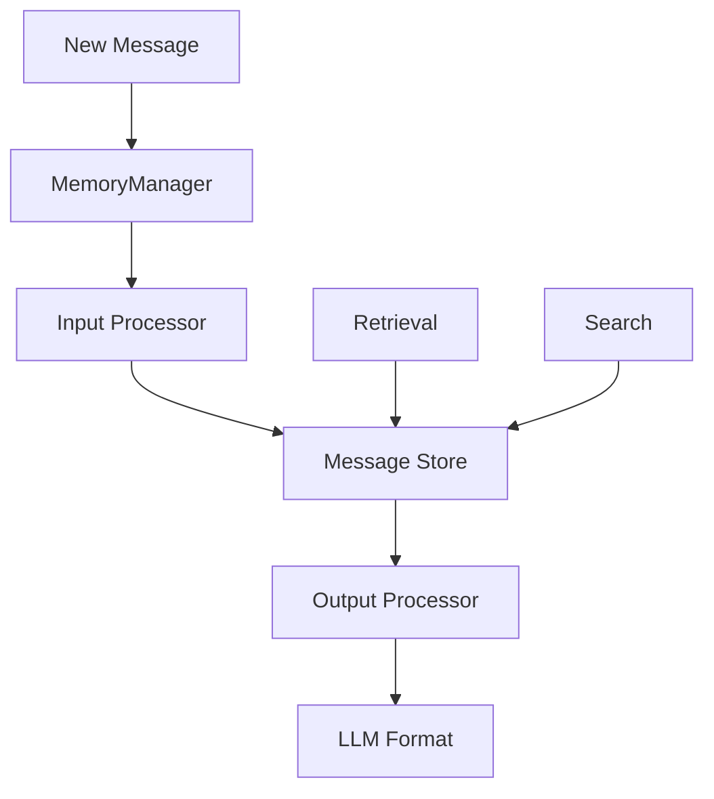

# Memory

Memory is crucial for agents to maintain context and have coherent conversations. The framework provides a sophisticated memory management system that handles message storage, retrieval, and transformation.

## Memory Architecture



## MemoryManager

The `MemoryManager` class handles all memory operations:

```python
from src.agents.memory import MemoryManager

# Create memory manager
memory = MemoryManager(
    input_processor=agent._input_message_processor(),
    output_processor=agent._output_message_processor()
)

# Add messages
memory.update_memory(message)

# Retrieve all messages
all_messages = memory.retrieve_all()

# Get messages for LLM
llm_messages = memory.to_llm_format()
```

## Message Storage

### Append-Only Design

Messages are immutable once stored:

```python
# Messages are added, never modified
memory.update_memory(Message(
    role="user",
    content="Hello, agent!",
    message_id="msg_123"
))

# Original message is preserved
stored_msg = memory.retrieve_by_id("msg_123")
# stored_msg is identical to original
```

### Chronological Order

Messages maintain chronological order:

```python
# Messages are stored in order of addition
memory.update_memory(msg1)  # timestamp: T1
memory.update_memory(msg2)  # timestamp: T2
memory.update_memory(msg3)  # timestamp: T3

messages = memory.retrieve_all()
# messages = [msg1, msg2, msg3]
```

## Message Processors

Processors transform messages between different formats:

### Input Processor

Transforms LLM responses into Message objects:

```python
def input_processor(response_dict: Dict) -> Optional[Message]:
    """Transform LLM response to Message format."""
    if response_dict.get("role") == "assistant":
        content = response_dict.get("content", "")
        # Handle tool calls
        if "tool_calls" in response_dict:
            return Message(
                role="assistant",
                content=content,
                tool_calls=response_dict["tool_calls"]
            )
        return Message(role="assistant", content=content)
    return None
```

### Output Processor

Transforms Messages for LLM consumption:

```python
def output_processor(message: Message) -> Optional[Dict]:
    """Transform Message to LLM format."""
    if message.role == "agent_call":
        # Transform to user message for LLM
        return {
            "role": "user",
            "content": f"[Agent {message.name}]: {message.content}"
        }
    return message.to_llm_dict()
```

## Memory Operations

### Adding Messages

```python
# From LLM response
llm_response = await model.run(messages)
memory.update_from_response(llm_response)

# Direct message
memory.update_memory(Message(
    role="user",
    content="What's the weather?"
))
```

### Retrieving Messages

```python
# Get all messages
all_messages = memory.retrieve_all()

# Get by ID
specific_message = memory.retrieve_by_id("msg_123")

# Get recent messages
recent_messages = memory.retrieve_recent(5)
```

### Memory for LLM

```python
# Get messages formatted for LLM
llm_messages = memory.to_llm_format()

# This applies output processors automatically
# agent_call -> user messages
# tool results properly formatted
# etc.
```

## Memory Patterns

### Conversation Memory

Standard conversation pattern:

```python
# User input
memory.update_memory(Message(role="user", content="Hello"))

# Agent thinking (optional)
memory.update_memory(Message(role="assistant", content="Let me help..."))

# Tool usage
memory.update_memory(Message(
    role="assistant",
    content="",
    tool_calls=[{"id": "call_1", "function": {"name": "search"}}]
))

# Tool result
memory.update_memory(Message(
    role="tool",
    content="Search results...",
    tool_call_id="call_1"
))
```

### Multi-Agent Memory

When agents communicate:

```python
# Agent A calls Agent B
memory.update_memory(Message(
    role="agent_call",
    content="Research this topic",
    name="agent_b",
    metadata={"caller": "agent_a"}
))

# Agent B's response
memory.update_memory(Message(
    role="agent_response",
    content="Here's what I found...",
    name="agent_b"
))
```

## Memory Limits

### Token Management

```python
# Limit memory to recent messages
def get_context_window(memory: MemoryManager, max_tokens: int):
    messages = memory.retrieve_all()
    total_tokens = 0
    context = []
    
    for msg in reversed(messages):
        tokens = estimate_tokens(msg.content)
        if total_tokens + tokens > max_tokens:
            break
        context.insert(0, msg)
        total_tokens += tokens
    
    return context
```

### Memory Pruning

```python
# Clear old messages
def prune_memory(memory: MemoryManager, keep_last_n: int):
    all_messages = memory.retrieve_all()
    if len(all_messages) > keep_last_n:
        # Keep system messages and last N
        system_msgs = [m for m in all_messages if m.role == "system"]
        recent_msgs = all_messages[-keep_last_n:]
        # Recreate memory with pruned messages
```

## Best Practices

1. **Preserve Context**: Always maintain message IDs when forwarding
2. **Use Processors**: Define appropriate processors for message transformation
3. **Monitor Size**: Track memory size for long-running agents
4. **Clear Strategically**: Clear memory at logical boundaries, not mid-conversation
5. **Search Efficiently**: Use search for retrieval-augmented generation

## Advanced Memory Patterns

### Episodic Memory

```python
class EpisodicMemory:
    def __init__(self):
        self.episodes = []
        self.current_episode = MemoryManager()
    
    def end_episode(self):
        self.episodes.append(self.current_episode)
        self.current_episode = MemoryManager()
    
    def recall_episode(self, query: str):
        # Find episodes containing messages with query content
        for i, episode in enumerate(self.episodes):
            messages = episode.retrieve_all()
            for msg in messages:
                if query.lower() in msg.content.lower():
                    return i, episode
        return None, None
```

### Shared Memory

```python
# Global memory for agent coordination
shared_memory = MemoryManager()

class CoordinatedAgent(Agent):
    def __init__(self, shared_memory: MemoryManager, **kwargs):
        super().__init__(**kwargs)
        self.shared_memory = shared_memory
    
    async def share_insight(self, insight: str):
        self.shared_memory.update_memory(Message(
            role="agent_insight",
            content=insight,
            name=self.name
        ))
```

## Working with Memory

```python
from src.agents import Agent
from src.models.models import ModelConfig
from src.agents.memory import Message
import asyncio

async def memory_example():
    agent = Agent(
        name="memory_agent",
        model_config=ModelConfig(
            type="api",
            provider="openai",
            name="gpt-4"
        )
    )
    
    # First interaction
    response1 = await agent.auto_run(
        initial_request="Remember that my favorite color is blue",
        max_steps=1
    )
    
    # Second interaction - agent should remember
    response2 = await agent.auto_run(
        initial_request="What is my favorite color?",
        max_steps=1
    )
    
    print(response2)  # Should mention blue

asyncio.run(memory_example())
```

### Custom Memory Processors

```python
from typing import Dict, Any, Optional
from src.agents import Agent
from src.models.models import ModelConfig
from src.agents.memory import Message

class CustomMemoryAgent(Agent):
    def _input_message_processor(self) -> Optional[callable]:
        """Transform LLM responses to Message format"""
        def processor(response_dict: Dict[str, Any]) -> Dict[str, Any]:
            # Custom transformation logic
            if "function_call" in response_dict:
                # Handle function calls specially
                return {
                    "role": "assistant",
                    "content": response_dict.get("content", ""),
                    "tool_calls": [{
                        "function": response_dict["function_call"]
                    }]
                }
            return response_dict
        return processor
    
    def _output_message_processor(self) -> Optional[callable]:
        """Transform Messages to LLM format"""
        def processor(message: Message) -> Dict[str, Any]:
            # Custom transformation for LLM
            llm_dict = message.to_llm_dict()
            # Add custom fields if needed
            return llm_dict
        return processor
```

## Next Steps

- Understand [Messages](messages.md) - The data structure for memory
- Learn about [Tools](tools.md) - How tool results are stored
- Explore [Advanced Concepts](../ - Complex memory patterns
