# Memory

Memory management is crucial for agents to maintain context, learn from interactions, and provide coherent responses across multi-turn conversations.

## 🎯 Overview

MARSYS provides a sophisticated memory system that:

- **Maintains Context**: Preserves conversation history within branches
- **Enables Continuity**: Supports multi-turn dialogues and follow-ups
- **Manages Retention**: Configurable policies for memory persistence
- **Handles Isolation**: Each branch maintains independent memory state
- **Supports Patterns**: Episodic, shared, and hierarchical memory structures

## 🏗️ Architecture

```mermaid
graph TB
    subgraph "Memory System"
        MM[MemoryManager<br/>Central Manager]
        CM[ConversationMemory<br/>Standard Implementation]
        EM[EpisodicMemory<br/>Episode-based]
        SM[SharedMemory<br/>Cross-agent]
    end

    subgraph "Components"
        MS[Message Store<br/>Chronological Storage]
        IP[Input Processor<br/>Response → Message]
        OP[Output Processor<br/>Message → LLM Format]
        MF[Message Filters<br/>Retrieval Logic]
    end

    subgraph "Retention Policies"
        SR[Single Run<br/>Cleared after run]
        SS[Session<br/>Workflow duration]
        PS[Persistent<br/>Long-term storage]
    end

    MM --> CM
    CM --> MS
    CM --> IP
    CM --> OP
    MS --> MF

    MM --> SR
    MM --> SS
    MM --> PS

    style MM fill:#4fc3f7
    style CM fill:#29b6f6
    style MS fill:#e1f5fe
```



## 📦 Core Components

### Message Structure

The fundamental unit of memory:

```python
from dataclasses import dataclass
from typing import Optional, Union, Dict, List, Any

@dataclass
class Message:
    role: str  # user, assistant, system, tool, agent_call, agent_response
    content: Optional[Union[str, Dict]]
    message_id: str  # Unique identifier
    name: Optional[str] = None  # Tool/agent name
    tool_calls: Optional[List[ToolCallMsg]] = None
    tool_call_id: Optional[str] = None  # For tool responses
    agent_calls: Optional[List[AgentCallMsg]] = None
    structured_data: Optional[Dict] = None  # For dict responses
    images: Optional[List[str]] = None  # For vision models
    metadata: Dict[str, Any] = field(default_factory=dict)
    timestamp: datetime = field(default_factory=datetime.now)
```

### ConversationMemory

Standard memory implementation:

```python
from marsys.agents.memory import ConversationMemory

class ConversationMemory:
    def __init__(self):
        self.messages: List[Message] = []
        self.message_index: Dict[str, Message] = {}

    def add_message(self, message: Message) -> None:
        """Add message to memory (immutable once added)"""
        self.messages.append(message)
        self.message_index[message.message_id] = message

    def get_messages(self) -> List[Message]:
        """Get all messages in chronological order"""
        return self.messages.copy()

    def get_recent(self, n: int) -> List[Message]:
        """Get last n messages"""
        return self.messages[-n:] if n > 0 else []

    def clear(self) -> None:
        """Clear all messages"""
        self.messages.clear()
        self.message_index.clear()

    def to_llm_format(self) -> List[Dict]:
        """Convert to LLM-compatible format"""
        return [msg.to_llm_dict() for msg in self.messages]
```

### MemoryManager

Manages memory lifecycle and policies:

```python
from marsys.agents.memory import MemoryManager

class MemoryManager:
    def __init__(
        self,
        retention_policy: str = "session",  # single_run, session, persistent
        max_messages: Optional[int] = None,
        auto_summarize: bool = False,
        summarize_threshold: int = 100
    ):
        self.memory = ConversationMemory()
        self.retention_policy = retention_policy
        self.max_messages = max_messages
        self.auto_summarize = auto_summarize

    def get_memory(self, agent_name: str) -> ConversationMemory:
        """Get or create memory for agent"""
        if agent_name not in self.agent_memories:
            self.agent_memories[agent_name] = ConversationMemory()
        return self.agent_memories[agent_name]

    def apply_retention_policy(self) -> None:
        """Apply configured retention policy"""
        if self.retention_policy == "single_run":
            self.memory.clear()
        elif self.retention_policy == "session":
            # Maintained for workflow duration
            pass
        elif self.retention_policy == "persistent":
            self.save_to_disk()
```

## 🔄 Memory Flow

### 1. Message Addition

```python
# User input
memory.add_message(Message(
    role="user",
    content="Analyze the quarterly sales data",
    message_id=generate_id()
))

# Agent response
memory.add_message(Message(
    role="assistant",
    content="I'll analyze the quarterly sales data for you.",
    message_id=generate_id()
))

# Tool call
memory.add_message(Message(
    role="assistant",
    content="",
    tool_calls=[{
        "id": "call_123",
        "type": "function",
        "function": {
            "name": "analyze_sales",
            "arguments": '{"quarter": "Q4"}'
        }
    }],
    message_id=generate_id()
))

# Tool result
memory.add_message(Message(
    role="tool",
    content='{"total_sales": 1500000, "growth": "15%"}',
    tool_call_id="call_123",
    name="analyze_sales",
    message_id=generate_id()
))
```

### 2. Memory Retrieval

```python
# Get all messages
all_messages = memory.get_messages()

# Get recent context
recent_context = memory.get_recent(10)

# Get messages for LLM
llm_messages = memory.to_llm_format()
# Automatically handles role transformations:
# - agent_call → user (with [Agent X] prefix)
# - agent_response → assistant
# - tool results properly formatted
```

### 3. Memory Processing

```python
# Input processor: LLM response → Message
def process_llm_response(response: Dict) -> Message:
    if "tool_calls" in response:
        return Message(
            role="assistant",
            content=response.get("content", ""),
            tool_calls=response["tool_calls"]
        )
    return Message(
        role="assistant",
        content=response["content"]
    )

# Output processor: Message → LLM format
def process_for_llm(message: Message) -> Dict:
    if message.role == "agent_call":
        # Transform to user message with agent context
        return {
            "role": "user",
            "content": f"[Request from {message.metadata.get('caller')}]: {message.content}"
        }
    return message.to_llm_dict()
```

## 🎯 Memory Patterns

### Episodic Memory

Organize memory into logical episodes:

```python
class EpisodicMemory:
    def __init__(self):
        self.episodes: List[ConversationMemory] = []
        self.current_episode = ConversationMemory()
        self.episode_metadata: List[Dict] = []

    def start_new_episode(self, metadata: Dict = None):
        """Begin a new episode"""
        if self.current_episode.messages:
            self.episodes.append(self.current_episode)
            self.episode_metadata.append(metadata or {})
        self.current_episode = ConversationMemory()

    def recall_episode(self, query: str) -> Optional[ConversationMemory]:
        """Find episodes containing relevant information"""
        for episode in self.episodes:
            for msg in episode.get_messages():
                if query.lower() in str(msg.content).lower():
                    return episode
        return None

    def summarize_episodes(self) -> List[str]:
        """Generate summaries of past episodes"""
        summaries = []
        for i, episode in enumerate(self.episodes):
            messages = episode.get_messages()
            summary = f"Episode {i+1}: {len(messages)} messages"
            # Add first and last message preview
            if messages:
                summary += f"\nStarted: {messages[0].content[:50]}..."
                summary += f"\nEnded: {messages[-1].content[:50]}..."
            summaries.append(summary)
        return summaries
```

### Shared Memory

Enable cross-agent knowledge sharing:

```python
class SharedMemoryPool:
    def __init__(self):
        self.global_memory = ConversationMemory()
        self.agent_memories: Dict[str, ConversationMemory] = {}
        self.shared_insights: List[Message] = []

    def share_insight(self, agent_name: str, insight: str):
        """Share an insight with all agents"""
        message = Message(
            role="system",
            content=f"[Shared by {agent_name}]: {insight}",
            metadata={"shared": True, "source": agent_name}
        )
        self.shared_insights.append(message)

    def get_shared_context(self) -> List[Message]:
        """Get shared insights for all agents"""
        return self.shared_insights.copy()

    def broadcast_message(self, message: Message):
        """Broadcast message to all agent memories"""
        for agent_memory in self.agent_memories.values():
            agent_memory.add_message(message)
```

### Hierarchical Memory

Organize memory by importance levels:

```python
class HierarchicalMemory:
    def __init__(self):
        self.core_memory = ConversationMemory()  # Critical info
        self.working_memory = ConversationMemory()  # Current context
        self.episodic_memory = ConversationMemory()  # Past events
        self.importance_threshold = 0.7

    def add_message_with_importance(self, message: Message, importance: float):
        """Add message to appropriate memory level"""
        if importance >= self.importance_threshold:
            self.core_memory.add_message(message)
        self.working_memory.add_message(message)

        # Move old working memory to episodic
        if len(self.working_memory.messages) > 50:
            old_messages = self.working_memory.messages[:25]
            for msg in old_messages:
                self.episodic_memory.add_message(msg)
            self.working_memory.messages = self.working_memory.messages[25:]

    def get_context_for_llm(self) -> List[Dict]:
        """Combine memories for LLM context"""
        context = []
        # Always include core memory
        context.extend(self.core_memory.to_llm_format())
        # Add working memory
        context.extend(self.working_memory.to_llm_format())
        return context
```

## 🔧 Memory Management

### Token Limit Management

```python
def manage_token_limit(
    memory: ConversationMemory,
    max_tokens: int = 4000,
    preserve_system: bool = True
) -> List[Message]:
    """Keep memory within token limits"""
    messages = memory.get_messages()

    # Separate system messages
    system_msgs = [m for m in messages if m.role == "system"]
    other_msgs = [m for m in messages if m.role != "system"]

    # Estimate tokens (rough approximation)
    def estimate_tokens(text: str) -> int:
        return len(text) // 4  # Rough estimate

    result = system_msgs if preserve_system else []
    token_count = sum(estimate_tokens(str(m.content)) for m in result)

    # Add messages from most recent
    for msg in reversed(other_msgs):
        msg_tokens = estimate_tokens(str(msg.content))
        if token_count + msg_tokens > max_tokens:
            break
        result.insert(len(system_msgs), msg)
        token_count += msg_tokens

    return result
```

### Memory Summarization

```python
async def summarize_memory(
    memory: ConversationMemory,
    summarizer_agent: Agent,
    chunk_size: int = 20
) -> str:
    """Summarize long conversation history"""
    messages = memory.get_messages()

    if len(messages) <= chunk_size:
        return ""  # No need to summarize

    # Get messages to summarize
    to_summarize = messages[:-chunk_size]  # Keep recent messages intact

    # Create summary prompt
    conversation_text = "\n".join([
        f"{msg.role}: {msg.content}"
        for msg in to_summarize
    ])

    summary_prompt = f"""
    Summarize this conversation, preserving key information:

    {conversation_text}

    Provide a concise summary focusing on:
    1. Main topics discussed
    2. Key decisions made
    3. Important facts mentioned
    """

    summary = await summarizer_agent.run(summary_prompt)

    # Replace old messages with summary
    memory.clear()
    memory.add_message(Message(
        role="system",
        content=f"Previous conversation summary: {summary.content}"
    ))

    # Add back recent messages
    for msg in messages[-chunk_size:]:
        memory.add_message(msg)

    return summary.content
```

## 📋 Best Practices

### 1. **Preserve Message IDs**

```python
# ✅ GOOD - Maintain IDs for tracking
message = Message(
    role="user",
    content="Hello",
    message_id=generate_unique_id()
)
memory.add_message(message)

# Reference later
related_message = Message(
    role="assistant",
    content="Response",
    metadata={"in_reply_to": message.message_id}
)

# ❌ BAD - No tracking
memory.add_message(Message(role="user", content="Hello"))
```

### 2. **Use Appropriate Retention**

```python
# ✅ GOOD - Match retention to use case
# Short task
quick_agent = Agent(memory_retention="single_run")

# Workflow that needs context
workflow_agent = Agent(memory_retention="session")

# Long-term assistant
persistent_agent = Agent(memory_retention="persistent")

# ❌ BAD - Wrong retention
long_research_agent = Agent(memory_retention="single_run")  # Loses context!
```

### 3. **Handle Tool Results Properly**

```python
# ✅ GOOD - Proper tool result handling
# Tool call
memory.add_message(Message(
    role="assistant",
    tool_calls=[{...}],
    message_id="msg_1"
))

# Tool result with reference
memory.add_message(Message(
    role="tool",
    content=result,
    tool_call_id="call_123",
    name="tool_name"
))

# ❌ BAD - No association
memory.add_message(Message(role="tool", content=result))
```

### 4. **Monitor Memory Size**

```python
# ✅ GOOD - Active memory management
class ManagedMemoryAgent(Agent):
    def __init__(self, max_memory_size=100, **kwargs):
        super().__init__(**kwargs)
        self.max_memory_size = max_memory_size

    async def _run(self, prompt, context, **kwargs):
        # Check memory size
        if len(self.memory.messages) > self.max_memory_size:
            # Summarize or prune old messages
            await self._compress_memory()

        return await super()._run(prompt, context, **kwargs)
```

## 🎯 Common Patterns

### Multi-Agent Memory Coordination

```python
class CoordinatedMemorySystem:
    def __init__(self):
        self.agent_memories: Dict[str, ConversationMemory] = {}
        self.shared_facts = ConversationMemory()

    def register_fact(self, agent_name: str, fact: str):
        """Register a fact discovered by an agent"""
        self.shared_facts.add_message(Message(
            role="system",
            content=fact,
            metadata={"discovered_by": agent_name}
        ))

    def get_agent_context(self, agent_name: str) -> List[Message]:
        """Get context including shared facts"""
        context = []
        # Add shared facts
        context.extend(self.shared_facts.get_messages())
        # Add agent-specific memory
        if agent_name in self.agent_memories:
            context.extend(self.agent_memories[agent_name].get_messages())
        return context
```

### Retrieval-Augmented Memory

```python
class RAGMemory:
    def __init__(self, embedding_model):
        self.memory = ConversationMemory()
        self.embedding_model = embedding_model
        self.embeddings: List[np.ndarray] = []

    async def add_with_embedding(self, message: Message):
        """Add message with embedding for later retrieval"""
        self.memory.add_message(message)
        embedding = await self.embedding_model.embed(str(message.content))
        self.embeddings.append(embedding)

    async def retrieve_relevant(self, query: str, k: int = 5) -> List[Message]:
        """Retrieve k most relevant messages"""
        query_embedding = await self.embedding_model.embed(query)

        # Calculate similarities
        similarities = [
            cosine_similarity(query_embedding, emb)
            for emb in self.embeddings
        ]

        # Get top k indices
        top_indices = np.argsort(similarities)[-k:][::-1]

        # Return corresponding messages
        all_messages = self.memory.get_messages()
        return [all_messages[i] for i in top_indices]
```

## 🚦 Next Steps

<div class="grid cards" markdown="1">

- :material-message:{ .lg .middle } **[Messages](messages.md)**

    ---

    Understand message types and formats

- :material-brain:{ .lg .middle } **[Memory Patterns](memory-patterns.md)**

    ---

    Advanced memory strategies and patterns

- :material-robot:{ .lg .middle } **[Agents](agents.md)**

    ---

    How agents use memory systems

- :material-tools:{ .lg .middle } **[Tools](tools.md)**

    ---

    Tool results in memory

</div>

---

!!! success "Memory System Ready!"
    You now understand how MARSYS manages agent memory. Proper memory management is key to building coherent, context-aware multi-agent systems.