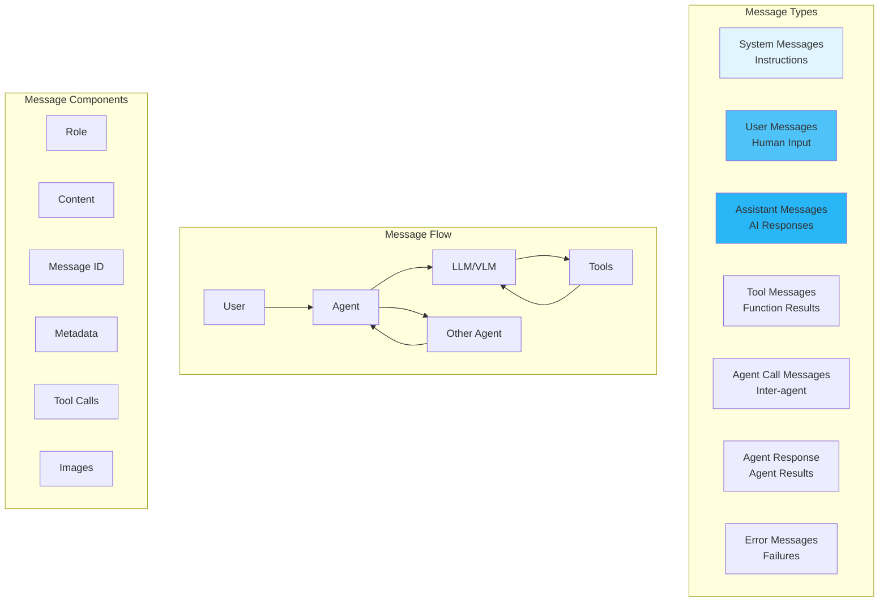

# Messages

Messages are the fundamental communication units that enable agents, models, and tools to exchange information in a structured format.

## 🎯 Overview

Messages in MARSYS:

- **Follow OpenAI Format**: Compatible with standard LLM APIs
- **Support Multi-Agent**: Extended for agent-to-agent communication
- **Handle Tools**: Built-in support for function calling
- **Track Context**: Maintain conversation history and metadata
- **Enable Traceability**: Unique IDs for debugging and tracking

## 🏗️ Architecture



## 📦 Message Structure

### Core Message Class

```python
from dataclasses import dataclass, field
from typing import Optional, Union, Dict, List, Any
from datetime import datetime
import uuid

@dataclass
class Message:
    # Core fields
    role: str                                      # Message role/type
    content: Optional[Union[str, Dict, List]]      # Main content
    message_id: str = field(default_factory=lambda: str(uuid.uuid4()))

    # Extended fields
    name: Optional[str] = None                     # Tool/agent name
    tool_calls: Optional[List[ToolCallMsg]] = None # Tool invocations
    tool_call_id: Optional[str] = None            # For tool responses
    agent_calls: Optional[List[AgentCallMsg]] = None  # Agent invocations

    # Additional data
    structured_data: Optional[Dict] = None         # Structured responses
    images: Optional[List[str]] = None            # For vision models
    reasoning_details: Optional[List[Dict]] = None # Model thinking/reasoning traces

    # Methods
    def to_llm_dict(self) -> Dict[str, Any]
```

### Message Roles

| Role | Description | Usage |
|------|-------------|-------|
| `system` | System instructions | Initial agent configuration |
| `user` | User input | Human queries, requests |
| `assistant` | AI response | Model/agent responses |
| `tool` | Tool result | Function execution results |
| `agent_call` | Agent invocation | One agent calling another |
| `agent_response` | Agent reply | Response from invoked agent |
| `error` | Error message | Failures and exceptions |

## 🎯 Creating Messages

### Basic Messages

```python
from marsys.agents.memory import Message

# User message
user_msg = Message(
    role="user",
    content="Analyze the quarterly sales data"
)

# System message
system_msg = Message(
    role="system",
    content="You are a data analyst specializing in sales trends."
)

# Assistant response
assistant_msg = Message(
    role="assistant",
    content="I'll analyze the quarterly sales data for you.",
    name="DataAnalyst"
)

# Error message
error_msg = Message(
    role="error",
    content="Failed to connect to database",
    structured_data={
        "error_type": "ConnectionError",
        "retry_count": 3
    }
)
```

### Tool Messages

```python
# Tool call message
tool_call_msg = Message(
    role="assistant",
    content="",  # Can be empty when calling tools
    tool_calls=[
        ToolCallMsg(
            id="call_abc123",
            call_id="call_abc123",
            type="function",
            name="analyze_data",
            arguments='{"dataset": "sales_q4", "metrics": ["revenue", "growth"]}'
        )
    ]
)

# Tool response
tool_response = Message(
    role="tool",
    content='{"revenue": 1500000, "growth": "15%", "trend": "positive"}',
    name="analyze_data",
    tool_call_id="call_abc123"
)
```

### Multi-Agent Messages

```python
# Agent A calling Agent B
agent_call = Message(
    role="agent_call",
    content="Research the latest AI trends for 2025",
    name="Researcher",
    agent_calls=[
        AgentCallMsg(
            agent_name="Researcher",
            request="Research the latest AI trends for 2025"
        )
    ]
)

# Agent B's response
agent_response = Message(
    role="agent_response",
    content="Here are the top AI trends for 2025:\n1. Multimodal AI...",
    name="Researcher",
    structured_data={
        "trends": [
            {"name": "Multimodal AI", "impact": "high"},
            {"name": "Edge AI", "impact": "medium"}
        ],
        "sources": ["arxiv.org", "nature.com"]
    }
)
```

### Multimodal Messages

MARSYS supports multimodal messages with images for vision models like GPT-4V, Gemini, and Claude.

#### User Messages with Images

```python
# Message with images (for vision models)
vision_msg = Message(
    role="user",
    content="What objects are in these images?",
    images=[
        "base64_encoded_image_1",
        "https://example.com/image.jpg",
        "/path/to/local/image.png"
    ]
)

# Mixed content message
mixed_msg = Message(
    role="user",
    content=[
        {"type": "text", "text": "Analyze this chart:"},
        {"type": "image_url", "image_url": {"url": "data:image/png;base64,..."}}
    ]
)
```

#### Tool Results with Images

Tools can return images alongside text results. The framework automatically handles image injection into agent memory:

```python
# Tool that extracts images from a PDF
def extract_pdf_content(pdf_path: str) -> Dict[str, Any]:
    """
    Extract text and images from a PDF file.

    Returns:
        Dictionary with 'result' (text) and 'images' (list of paths)
    """
    text = extract_text(pdf_path)
    image_paths = extract_images_to_temp(pdf_path)

    return {
        "result": f"Extracted {len(image_paths)} pages from PDF",
        "images": image_paths  # List of file paths
    }

# The tool result message created automatically:
tool_result_msg = Message(
    role="tool",
    content="Extracted 3 pages from PDF",
    name="extract_pdf_content",
    tool_call_id="call_123",
    images=[
        "./outputs/pdf_page_1.png",
        "./outputs/pdf_page_2.png",
        "./outputs/pdf_page_3.png"
    ]
)
```

Use virtual paths from the run filesystem (e.g., `./outputs`, `./downloads`, `./screenshots`) so other agents can access the same files. See [Run Filesystem](run-filesystem.md).

#### Task Descriptions with Images

You can include images directly in task descriptions:

```python
# Task with images
task = {
    "content": "What is shown in these screenshots? Provide a detailed analysis.",
    "images": [
        "/path/to/screenshot1.png",
        "/path/to/screenshot2.png"
    ]
}

# Images are automatically added to the first agent's memory
result = await Orchestra.run(task=task, topology=topology)
```

## 🔄 Message Conversion

### To LLM Format

```python
# Convert for OpenAI-compatible APIs
message = Message(
    role="assistant",
    content="I found the information you requested.",
    tool_calls=[...]
)

llm_dict = message.to_llm_dict()
# Result:
{
    "role": "assistant",
    "content": "I found the information you requested.",
    "tool_calls": [...]
}

# Special conversions
agent_call_msg = Message(role="agent_call", content="Task", name="Agent2")
llm_dict = agent_call_msg.to_llm_dict()
# Converts to user message for LLM:
{
    "role": "user",
    "content": "[Request from Agent1]: Task"
}
```

### From LLM Response

```python
# Parse LLM response into Message
llm_response = {
    "role": "assistant",
    "content": "Here's the analysis:",
    "tool_calls": [{
        "id": "call_123",
        "type": "function",
        "function": {
            "name": "create_chart",
            "arguments": '{"data": [1,2,3]}'
        }
    }]
}

message = Message.from_llm_response(llm_response)
# Automatically parses tool calls, content, etc.
```

## 🎯 Message Patterns

### Conversation Pattern

```python
# Standard conversation flow
conversation = [
    Message(role="system", content="You are a helpful assistant."),
    Message(role="user", content="What's the capital of France?"),
    Message(role="assistant", content="The capital of France is Paris."),
    Message(role="user", content="What about Germany?"),
    Message(role="assistant", content="The capital of Germany is Berlin.")
]

# Convert for LLM
llm_messages = [msg.to_llm_dict() for msg in conversation]
```

### Tool Usage Pattern

```python
# Complete tool usage flow
tool_flow = [
    # 1. User request
    Message(role="user", content="What's the weather in Tokyo?"),

    # 2. Assistant decides to use tool
    Message(
        role="assistant",
        content="I'll check the weather in Tokyo for you.",
        tool_calls=[ToolCallMsg(
            id="call_weather_1",
            call_id="call_weather_1",
            type="function",
            name="get_weather",
            arguments='{"city": "Tokyo", "units": "celsius"}'
        )]
    ),

    # 3. Tool returns result
    Message(
        role="tool",
        content='{"temp": 22, "conditions": "sunny", "humidity": 65}',
        name="get_weather",
        tool_call_id="call_weather_1"
    ),

    # 4. Assistant incorporates result
    Message(
        role="assistant",
        content="The weather in Tokyo is currently 22°C and sunny with 65% humidity."
    )
]
```

### Error Handling Pattern

```python
def handle_with_error_message(func):
    """Decorator to convert exceptions to Messages."""
    async def wrapper(*args, **kwargs):
        try:
            return await func(*args, **kwargs)
        except Exception as e:
            return Message(
                role="error",
                content=str(e),
                metadata={
                    "error_type": type(e).__name__,
                    "traceback": traceback.format_exc(),
                    "function": func.__name__,
                    "timestamp": datetime.now().isoformat()
                }
            )
    return wrapper

@handle_with_error_message
async def risky_operation():
    # Operation that might fail
    pass
```

### Multi-Agent Communication Pattern

```python
# Agent coordination flow
coordination_flow = [
    # 1. Coordinator assigns task
    Message(
        role="agent_call",
        content="Analyze market data for Q4",
        name="DataAnalyst",
        agent_calls=[AgentCallMsg(
            agent_name="DataAnalyst",
            request="Analyze market data for Q4",
            context={"priority": "high"}
        )]
    ),

    # 2. DataAnalyst processes
    Message(
        role="agent_response",
        content="Analysis complete. Key findings:",
        name="DataAnalyst",
        structured_data={
            "revenue": 2500000,
            "growth": "18%",
            "top_products": ["A", "B", "C"]
        }
    ),

    # 3. Coordinator requests visualization
    Message(
        role="agent_call",
        content="Create charts for this data",
        name="Visualizer",
        structured_data={"data": {...}}
    ),

    # 4. Visualizer responds
    Message(
        role="agent_response",
        content="Charts created successfully",
        name="Visualizer",
        images=["chart1.png", "chart2.png"]
    )
]
```

## 📋 Best Practices

### 1. **Preserve Message IDs**

```python
# ✅ GOOD - Maintain IDs for tracking
original_msg = Message(role="user", content="Hello")
print(f"Tracking ID: {original_msg.message_id}")

# When forwarding or referencing
response = Message(
    role="assistant",
    content="Hello! How can I help?",
    metadata={"in_reply_to": original_msg.message_id}
)

# ❌ BAD - Creating new ID for same message
forwarded = Message(
    role=original_msg.role,
    content=original_msg.content
    # Lost original message_id!
)
```

### 2. **Use Appropriate Roles**

```python
# ✅ GOOD - Correct role usage
tool_result = Message(
    role="tool",  # Correct role for tool results
    content=json.dumps(result),
    name="calculator",
    tool_call_id="call_123"
)

# ❌ BAD - Wrong role
tool_result = Message(
    role="assistant",  # Wrong! Tools aren't assistants
    content=str(result)
)
```

### 3. **Structure Tool Responses**

```python
# ✅ GOOD - Structured tool response
tool_response = Message(
    role="tool",
    content=json.dumps({
        "success": True,
        "result": calculation_result,
        "metadata": {"precision": "high", "method": "numpy"}
    }),
    name="advanced_calculator",
    tool_call_id=call_id
)

# ❌ BAD - Unstructured response
tool_response = Message(
    role="tool",
    content=f"The answer is {result}"  # Not JSON!
)
```

### 4. **Handle Errors Gracefully**

```python
# ✅ GOOD - Error as message
try:
    result = await process_data()
except DataError as e:
    return Message(
        role="error",
        content=f"Data processing failed: {e}",
        metadata={
            "error_code": "DATA_001",
            "recoverable": True,
            "suggestion": "Check data format"
        }
    )

# ❌ BAD - Raw exception
try:
    result = await process_data()
except DataError as e:
    raise  # Don't propagate raw exceptions
```

## 🎯 Advanced Patterns

### Message Validation

```python
from typing import Set
from pydantic import BaseModel, validator

class ValidatedMessage(BaseModel):
    role: str
    content: Optional[str] = None
    tool_calls: Optional[List[Dict]] = None

    @validator('role')
    def validate_role(cls, v):
        valid_roles = {'system', 'user', 'assistant', 'tool', 'error'}
        if v not in valid_roles:
            raise ValueError(f"Invalid role: {v}")
        return v

    @validator('tool_calls')
    def validate_tool_calls(cls, v):
        if v:
            for call in v:
                if 'id' not in call or 'function' not in call:
                    raise ValueError("Invalid tool call format")
        return v
```

### Message Filtering

```python
class MessageFilter:
    @staticmethod
    def by_role(messages: List[Message], role: str) -> List[Message]:
        """Filter messages by role."""
        return [m for m in messages if m.role == role]

    @staticmethod
    def by_agent(messages: List[Message], agent_name: str) -> List[Message]:
        """Filter messages by agent name."""
        return [m for m in messages if m.name == agent_name]

    @staticmethod
    def recent(messages: List[Message], minutes: int = 5) -> List[Message]:
        """Get messages from last N minutes."""
        cutoff = datetime.now() - timedelta(minutes=minutes)
        return [m for m in messages if m.timestamp > cutoff]

    @staticmethod
    def with_tools(messages: List[Message]) -> List[Message]:
        """Get messages with tool calls."""
        return [m for m in messages if m.tool_calls]
```

### Message Chaining

```python
class MessageChain:
    """Track related messages in a conversation chain."""

    def __init__(self, initial: Message):
        self.chain_id = str(uuid.uuid4())
        self.messages: List[Message] = [initial]
        initial.metadata["chain_id"] = self.chain_id

    def add(self, message: Message) -> None:
        """Add message to chain."""
        message.metadata["chain_id"] = self.chain_id
        message.metadata["chain_position"] = len(self.messages)
        self.messages.append(message)

    def get_context(self, max_messages: int = 10) -> List[Message]:
        """Get recent context from chain."""
        return self.messages[-max_messages:]

    def summarize(self) -> Dict[str, Any]:
        """Get chain summary."""
        return {
            "chain_id": self.chain_id,
            "message_count": len(self.messages),
            "roles": list(set(m.role for m in self.messages)),
            "has_errors": any(m.role == "error" for m in self.messages),
            "tool_calls": sum(1 for m in self.messages if m.tool_calls)
        }
```

## 🚦 Next Steps

<div class="grid cards" markdown="1">

- :material-memory:{ .lg .middle } **[Memory](memory.md)**

    ---

    How messages are stored and managed

- :material-robot:{ .lg .middle } **[Agents](agents.md)**

    ---

    How agents create and process messages

- :material-chat:{ .lg .middle } **[Communication](communication.md)**

    ---

    Multi-agent message patterns

- :material-api:{ .lg .middle } **[Message API Reference](../api/messages.md)**

    ---

    Complete API documentation

</div>

---

!!! success "Message System Ready!"
    You now understand the message system in MARSYS. Messages are the lingua franca that enables all components to communicate effectively.
