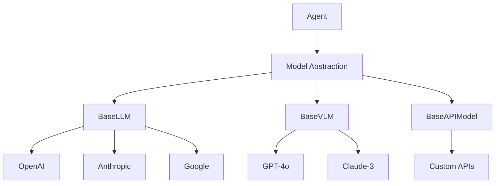

# Models

Models are the AI backends that power agent intelligence. The framework provides a unified abstraction layer for different model providers and types.

## Model Architecture



## Model Types

### Language Models (LLM)

Standard text-based models:

```python
from src.models.models import ModelConfig

# Create model config
model_config = ModelConfig(
    type="api",
    provider="openai",
    name="gpt-4.1-mini,
    temperature=0.7,
    max_tokens=2000
)

# Model is created internally by Agent
```

### Vision-Language Models (VLM)

Models that can process both text and images:

```python
from src.models.models import ModelConfig
from src.agents.memory import Message

# Create vision model config
vlm_config = ModelConfig(
    type="api",
    provider="openai",
    name="gpt-4-vision-preview",
    max_tokens=4096
)

# Include image in message
messages = [
    Message(
        role="user",
        content=[
            {"type": "text", "text": "What's in this image?"},
            {"type": "image_url", "image_url": {"url": image_data}}
        ]
    )
]
```

### API Models

Custom model endpoints:

```python
from src.models.models import BaseAPIModel

class CustomModel(BaseAPIModel):
    def run(
        self,
        messages: List[Dict[str, str]],
        json_mode: bool = False,
        max_tokens: Optional[int] = None,
        temperature: Optional[float] = None,
        **kwargs
    ) -> Dict[str, Any]:
        # Custom API implementation
        response = self._call_api(messages)
        return self._format_response(response)
```

## Model Configuration

### ModelConfig

Central configuration for all models:

```python
from pydantic import BaseModel, Field
from typing import Literal, Optional, Dict, Any

class ModelConfig(BaseModel):
    type: Literal["local", "api"]                           # Required: model type
    name: str                                               # Model identifier  
    provider: Optional[str] = None                          # "openai", "anthropic", "google", "groq"
    api_key: Optional[str] = None                          # Auto-loaded from env if None
    base_url: Optional[str] = None                         # Auto-set from provider if None
    max_tokens: int = 1024                                 # Default maximum tokens
    temperature: float = 0.7                               # Sampling temperature (0.0-2.0)
    
    # Local model specific fields
    model_class: Optional[Literal["llm", "vlm"]] = None   # Required for local models
    torch_dtype: Optional[str] = "auto"                   # PyTorch dtype
    device_map: Optional[str] = "auto"                    # Device mapping
    quantization_config: Optional[Dict[str, Any]] = None  # Quantization settings
```

### Provider-Specific Configs

```python
# OpenAI
openai_config = ModelConfig(
    type="api",
    provider="openai",
    name="gpt-4-turbo-preview",
    temperature=0.7,
    max_tokens=4096
)

# Anthropic
anthropic_config = ModelConfig(
    type="api",
    provider="anthropic",
    name="claude-3-opus-20240229",
    temperature=0.5,
    max_tokens=4096
)

# Google
google_config = ModelConfig(
    type="api",
    provider="google",
    name="gemini-pro",
    temperature=0.8,
    max_tokens=2048
)

# Local model
local_config = ModelConfig(
    type="local",
    model_class="llm",
    name="mistralai/Mistral-7B-Instruct-v0.2",
    max_tokens=1024
)
```

## Model Features

### Tool Calling

Models support OpenAI-compatible function calling:

```python
# Tools are passed as schemas via agent.tools_schema
tools_schema = [
    {
        "type": "function",
        "function": {
            "name": "get_weather",
            "description": "Get weather information",
            "parameters": {
                "type": "object",
                "properties": {
                    "location": {"type": "string"}
                },
                "required": ["location"]
            }
        }
    }
]

# BaseAPIModel.run() can receive tools via kwargs
response = model.run(messages, tools=tools_schema)

# Check for tool calls in response
if isinstance(response, dict) and "tool_calls" in response:
    for tool_call in response["tool_calls"]:
        # Execute tool
        result = execute_tool(tool_call)
```

### JSON Mode

Force structured output:

```python
response = model.run(
    messages,
    json_mode=True  # Note: parameter name is json_mode, not output_json
)

# Response will contain JSON content
if isinstance(response, dict):
    content = response.get("content")
    data = json.loads(content) if content else {}
```

### Response Handling

Models return structured responses:

```python
# For synchronous models (BaseAPIModel, BaseLLM, BaseVLM)
response = model.run(messages)

# BaseAPIModel returns dict with role, content, tool_calls
if isinstance(response, dict):
    role = response.get("role", "assistant")
    content = response.get("content", "")
    tool_calls = response.get("tool_calls", [])
    
# Local models (BaseLLM, BaseVLM) return string content
elif isinstance(response, str):
    content = response
```

## Model Selection

### Choosing the Right Model

| Use Case | Recommended Model | Reasoning |
|----------|-------------------|-----------|
| General conversation | GPT-4 | Best overall performance |
| Code generation | Claude-3 | Strong coding abilities |
| Quick responses | gpt-4.1-mini | Fast and cost-effective |
| Image analysis | GPT-4o | Vision capabilities |
| Long context | Claude-3 (100k) | Extended context window |

### Performance Considerations

```python
from src.agents.agents import Agent
from src.models.models import ModelConfig

# Fast model for simple tasks
fast_agent = Agent(
    agent_name="fast_assistant",
    model_config=ModelConfig(
        type="api",
        provider="openai",
        name="gpt-4.1-mini",
        temperature=0.3
    )
)

# Powerful model for complex tasks
smart_agent = Agent(
    agent_name="smart_assistant",
    model_config=ModelConfig(
        type="api",
        provider="openai", 
        name="gpt-4-turbo-preview",
        temperature=0.7
    )
)
```

## Error Handling

Models handle errors at the framework level:

```python
from src.agents.memory import Message
import requests

try:
    response = model.run(messages)
except requests.exceptions.Timeout:
    # Handle timeout (BaseAPIModel uses 180s timeout)
    return Message(
        role="error", 
        content="Request timed out",
        name="model_error"
    )
except requests.exceptions.RequestException as e:
    # Handle API errors
    return Message(
        role="error",
        content=f"API Error: {str(e)}",
        name="model_error"  
    )
```

## Model Abstraction Benefits

1. **Provider Independence**: Switch providers without changing agent code
2. **Consistent Interface**: All models follow the same API
3. **Automatic Retries**: Built-in retry logic for transient failures
4. **Error Standardization**: Consistent error handling across providers
5. **Configuration Management**: Centralized configuration

## Advanced Usage

### Custom Model Wrapper

```python
from src.models.models import BaseLLM, ModelConfig

class CustomLLM(BaseLLM):
    def __init__(self, model_name: str, max_tokens: int = 1024, **kwargs):
        super().__init__(model_name, max_tokens, **kwargs)
        self.custom_client = self._init_custom_client()
    
    def run(
        self,
        messages: List[Dict[str, str]],
        json_mode: bool = False,
        max_tokens: Optional[int] = None
    ) -> str:
        # Convert messages to custom format
        formatted_messages = self._format_messages(messages)
        
        # Make custom call
        response = self.custom_client.generate(
            messages=formatted_messages,
            max_tokens=max_tokens or self._max_tokens
        )
        
        return response.text
```

### Model Pooling

```python
from src.models.models import ModelConfig

class ModelPool:
    def __init__(self, configs: List[ModelConfig]):
        from src.agents.agents import Agent
        self.models = [
            Agent(agent_name=f"pool_{i}", model_config=config)._create_model_from_config(config)
            for i, config in enumerate(configs)
        ]
        self.current = 0
    
    def run(self, messages: List[Dict[str, str]]) -> Dict[str, Any]:
        """Round-robin through models."""
        model = self.models[self.current]
        self.current = (self.current + 1) % len(self.models)
        
        return model.run(messages)
```

### Model Caching

```python
from functools import lru_cache
import hashlib
import json

class CachedModel:
    def __init__(self, base_model, cache_size: int = 128):
        self.base_model = base_model
        self.cache = {}
        self.max_cache_size = cache_size
    
    def run(self, messages: List[Dict[str, str]], **kwargs) -> Dict[str, Any]:
        # Create cache key
        cache_key = self._create_cache_key(messages, kwargs)
        
        # Check cache
        if cache_key in self.cache:
            return self.cache[cache_key]
        
        # Run model
        response = self.base_model.run(messages, **kwargs)
        
        # Cache response (with size limit)
        if len(self.cache) >= self.max_cache_size:
            # Remove oldest entry
            oldest_key = next(iter(self.cache))
            del self.cache[oldest_key]
            
        self.cache[cache_key] = response
        return response
    
    def _create_cache_key(self, messages: List[Dict[str, str]], kwargs: Dict) -> str:
        content = json.dumps(messages, sort_keys=True)
        content += json.dumps(kwargs, sort_keys=True)
        return hashlib.sha256(content.encode()).hexdigest()
```

## Best Practices

1. **Choose Appropriate Models**: Use powerful models only when needed
2. **Set Reasonable Limits**: Configure appropriate max_tokens for your use case
3. **Handle API Errors**: Implement proper error handling for network issues
4. **Monitor Costs**: Track token usage across models
5. **Use Type Validation**: Let ModelConfig validate your configurations
6. **Environment Variables**: Store API keys securely in environment variables

## Next Steps

- Learn about [Registry](registry.md) - How agents discover and communicate
- Explore [Tools](tools.md) - Extending model capabilities with tools
- See [Agent Implementation](../api/index.md) - How agents use models
