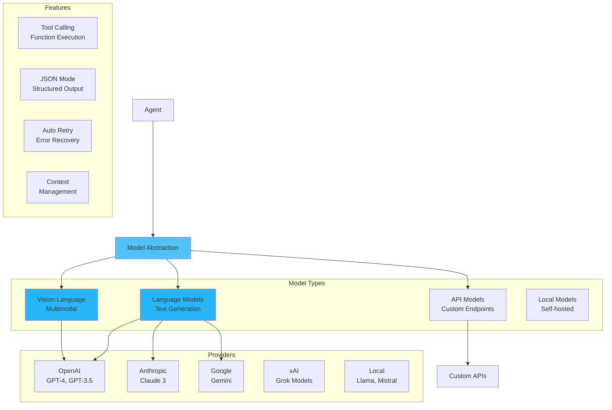

# Models

Models are the AI backends that power agent intelligence, providing a unified interface for different providers and model types.

!!! info "See Also"
    For ModelConfig class definition and provider-specific parameters, see [Models API Reference](../api/models.md).


## 🎯 Overview

MARSYS provides a flexible model abstraction layer that:

- **Unifies Providers**: Single interface for OpenAI, Anthropic, Google, and more
- **Supports Multiple Types**: LLMs, VLMs, custom APIs, and local models
- **Handles Complexity**: Automatic retry, error handling, and response formatting
- **Enables Tool Calling**: OpenAI-compatible function calling across providers
- **Manages Configuration**: Centralized settings with environment variable support

## 🏗️ Architecture



## 📦 Model Configuration

### ModelConfig

Central configuration for all models:

```python
from marsys.models import ModelConfig
from typing import Literal, Optional, Dict, Any

class ModelConfig(BaseModel):
    # Core settings
    type: Literal["api", "local"]           # Model type
    name: str                               # Model identifier
    provider: Optional[str] = None          # openai, anthropic, google, xai, openrouter, openai-oauth, anthropic-oauth

    # API settings
    api_key: Optional[str] = None           # Auto-loaded from env if None
    base_url: Optional[str] = None          # Custom endpoint
    oauth_profile: Optional[str] = None     # Optional OAuth profile for openai-oauth / anthropic-oauth

    # Generation parameters
    max_tokens: int = 8192                  # Maximum output tokens
    temperature: float = 0.7                # Sampling temperature (0.0-2.0)
    thinking_budget: Optional[int] = 1024   # Token budget for thinking (Gemini, Claude, Qwen)
    reasoning_effort: Optional[str] = "low" # Reasoning level for OpenAI/Grok (minimal, low, medium, high)

    # Local model settings
    model_class: Optional[Literal["llm", "vlm"]] = None
    torch_dtype: Optional[str] = "auto"     # PyTorch dtype (bfloat16, float16, auto)
    device_map: Optional[str] = "auto"      # Device map (auto, cuda:0)
    quantization_config: Optional[Dict] = None
```

### Provider Configurations

```python
# OpenRouter (Recommended - unified access to all models)
openrouter_config = ModelConfig(
    type="api",
    provider="openrouter",
    name="anthropic/claude-opus-4.6",
    temperature=0.7,
    max_tokens=12000,
    # api_key loaded from OPENROUTER_API_KEY env var
)

# OpenAI GPT-5 Codex
gpt5_config = ModelConfig(
    type="api",
    provider="openrouter",
    name="openai/gpt-5-codex",
    temperature=0.7,
    max_tokens=12000,
    # api_key loaded from OPENROUTER_API_KEY env var
)

# Anthropic Claude Opus 4.6
claude_opus_config = ModelConfig(
    type="api",
    provider="openrouter",
    name="anthropic/claude-opus-4.6",
    temperature=0.5,
    max_tokens=12000,
    # api_key loaded from OPENROUTER_API_KEY env var
)

# Google Gemini 3 Pro Preview
gemini_config = ModelConfig(
    type="api",
    provider="openrouter",
    name="google/gemini-3-pro-preview",
    temperature=0.8,
    max_tokens=12000,
    # api_key loaded from OPENROUTER_API_KEY env var
)

# Local Model - HuggingFace Backend (Development/Research)
local_hf_config = ModelConfig(
    type="local",
    model_class="llm",
    name="Qwen/Qwen3-4B-Instruct-2507",
    backend="huggingface",  # Default backend (can be omitted)
    torch_dtype="bfloat16",
    device_map="auto",
    max_tokens=4096
)

# Local Model - vLLM Backend (Production/High-Throughput)
local_vllm_config = ModelConfig(
    type="local",
    model_class="vlm",
    name="Qwen/Qwen3-VL-8B-Instruct",
    backend="vllm",  # High-throughput production backend
    tensor_parallel_size=2,  # Multi-GPU inference
    gpu_memory_utilization=0.9,
    quantization="fp8",  # Optional: awq, gptq, fp8
    max_tokens=4096
)
```

### OAuth Providers (No API Keys)

MARSYS also supports OAuth-backed providers that use CLI logins instead of API keys:

- **`openai-oauth`**: ChatGPT subscription via Codex CLI (`codex login`)
- **`anthropic-oauth`**: Claude Max subscription via Claude CLI (`claude login`)

Supported model families:

- OpenAI OAuth: `gpt-5.3-codex`
- Anthropic OAuth: `claude-opus-4-6` (aliases like `opus` also work)

Credentials are read from local CLI files and can be overridden with environment variables:

- OpenAI OAuth: `~/.codex/auth.json` (override with `CODEX_AUTH_PATH`)
- Anthropic OAuth: `~/.claude/.credentials.json` (override with `CLAUDE_AUTH_PATH`)

Profile resolution order:
1. Explicit `credentials_path`
2. `oauth_profile`
3. Provider default profile (`marsys oauth set-default ...`)

```python
# OpenAI ChatGPT (OAuth via Codex CLI)
openai_oauth_config = ModelConfig(
    type="api",
    provider="openai-oauth",
    name="gpt-5.3-codex",
    # Optional override:
    # credentials_path="~/.codex/auth.json"
)

# Anthropic Claude Max (OAuth via Claude CLI)
anthropic_oauth_config = ModelConfig(
    type="api",
    provider="anthropic-oauth",
    name="claude-opus-4-6",
    # Optional override:
    # credentials_path="~/.claude/.credentials.json"
)
```

!!! note "OAuth-Specific Behavior"
    - OAuth providers do **not** require API keys.
    - Anthropic OAuth reserves certain tool names (e.g., `read`, `write`, `bash`). MARSYS transparently transforms these for compatibility.

!!! warning "Use At Your Own Risk (Anthropic OAuth)"
    `anthropic-oauth` relies on a non-official integration path and may violate provider Terms of Service. Use at your own risk.

!!! note "OpenAI OAuth Compliance"
    MARSYS does not make a legal determination about OpenAI ToS coverage for this OAuth path. Review OpenAI terms for your use case.

## 🎯 Model Types

### Language Models (LLM)

Standard text generation models:

```python
from marsys.agents import Agent
from marsys.models import ModelConfig

# Create agent with LLM
agent = Agent(
    model_config=ModelConfig(
        type="api",
        provider="openrouter",
        name="anthropic/claude-opus-4.6",
        temperature=0.7
    ),
    name="Assistant",
    goal="A helpful assistant",
    instruction="You are a helpful AI assistant that provides clear, accurate responses."
)

# Agent uses model internally
response = await agent.run("Explain quantum computing")
```

### Vision-Language Models (VLM)

Multimodal models that process text and images:

```python
# Configure vision model
vlm_config = ModelConfig(
    type="api",
    provider="openrouter",
    name="google/gemini-3-pro-preview",
    max_tokens=12000
)

# Create vision-capable agent
vision_agent = Agent(
    model_config=vlm_config,
    name="ImageAnalyzer",
    goal="Analyze images and answer questions about visual content",
    instruction="You are an image analysis specialist. Describe and analyze visual content in detail."
)

# Process image
from marsys.agents.memory import Message

message = Message(
    role="user",
    content="What's in this image?",
    images=["base64_encoded_image_data"]  # Or URLs
)

response = await vision_agent.run(message)
```

#### BrowserAgent Vision Models

For browser automation with visual interaction, use separate models for the main agent (planning/decision-making) and vision analysis (screenshot understanding):

```python
from marsys.agents import BrowserAgent
from marsys.models import ModelConfig

# Create BrowserAgent with vision capabilities
browser_agent = await BrowserAgent.create_safe(
    name="WebNavigator",
    # Main model: Any text-based model for planning and decision-making
    model_config=ModelConfig(
        type="api",
        provider="openrouter",
        name="anthropic/claude-opus-4.6",
        temperature=0.3
    ),
    mode="advanced",
    auto_screenshot=True,
    # Vision model: Use Gemini for screenshot analysis
    vision_model_config=ModelConfig(
        type="api",
        provider="openrouter",
        name="google/gemini-3-flash-preview",  # Recommended: fast and cost-effective
        # For complex UI tasks, use: "google/gemini-3-pro-preview"
        temperature=0,
        thinking_budget=0  # Disable thinking for faster vision responses
    ),
    headless=True
)
```

**Vision Model Recommendations for BrowserAgent**:

| Task Complexity | Recommended Model | Characteristics |
|-----------------|-------------------|-----------------|
| **Standard browsing** | `google/gemini-3-flash-preview` | Fast, cost-effective, handles most UI detection tasks |
| **Complex UIs** | `google/gemini-3-pro-preview` | Higher accuracy for complex layouts, anti-bot challenges |

**Note**: While Claude Opus 4.6 and other models work well for the main BrowserAgent planning logic, **Gemini models are specifically recommended for the vision component** due to superior performance in browser control and UI element detection tasks.

### Local Models

MARSYS supports running models locally using two backends:

#### HuggingFace Backend (Development/Research)

The default backend using HuggingFace transformers. Ideal for development, debugging, and research:

```python
from marsys.models import ModelConfig

# Text-only LLM
llm_config = ModelConfig(
    type="local",
    model_class="llm",
    name="Qwen/Qwen3-4B-Instruct-2507",
    backend="huggingface",  # Default, can be omitted
    torch_dtype="bfloat16",
    device_map="auto",
    trust_remote_code=True,
    max_tokens=4096
)

# Vision-Language Model
vlm_config = ModelConfig(
    type="local",
    model_class="vlm",
    name="Qwen/Qwen3-VL-8B-Instruct",
    backend="huggingface",
    torch_dtype="bfloat16",
    device_map="auto",
    thinking_budget=256,  # Token budget for thinking models
    max_tokens=4096
)
```

**Installation:**
```bash
pip install marsys[local-models]
# or
uv pip install marsys[local-models]
```

#### vLLM Backend (Production/High-Throughput)

For production deployments with high throughput requirements:

```python
from marsys.models import ModelConfig

vlm_config = ModelConfig(
    type="local",
    model_class="vlm",
    name="Qwen/Qwen3-VL-8B-Instruct",
    backend="vllm",
    tensor_parallel_size=2,  # Multi-GPU inference
    gpu_memory_utilization=0.9,
    quantization="fp8",  # Optional: awq, gptq, fp8
    max_tokens=4096
)
```

**vLLM Features:**

- **Continuous batching** for high throughput
- **PagedAttention** for memory efficiency
- **FP8/AWQ/GPTQ quantization** support
- **Tensor parallelism** for multi-GPU inference

**Installation:**
```bash
pip install marsys[production]
# or
uv pip install marsys[production]
```

#### Backend Comparison

| Feature | HuggingFace | vLLM |
|---------|-------------|------|
| **Use Case** | Development/Research | Production |
| **Throughput** | Lower | Higher (continuous batching) |
| **Memory Efficiency** | Standard | Optimized (PagedAttention) |
| **Quantization** | BitsAndBytes | FP8, AWQ, GPTQ |
| **Multi-GPU** | device_map="auto" | Tensor parallelism |
| **Training Support** | ✅ Yes | ❌ No |
| **Debugging** | Easier | Harder |

!!! tip "Choosing a Backend"
    Use **HuggingFace** for development, debugging, and training integration.
    Use **vLLM** for production deployments requiring high throughput.

### Custom API Models

For proprietary or specialized endpoints:

```python
from marsys.models import BaseAPIModel
from typing import List, Dict, Any, Optional

class CustomAPIModel(BaseAPIModel):
    def __init__(self, api_key: str, endpoint: str):
        super().__init__(api_key=api_key, base_url=endpoint)
        self.endpoint = endpoint

    def run(
        self,
        messages: List[Dict[str, str]],
        json_mode: bool = False,
        max_tokens: Optional[int] = None,
        temperature: Optional[float] = None,
        tools: Optional[List[Dict]] = None,
        **kwargs
    ) -> Dict[str, Any]:
        """Custom API implementation."""

        # Prepare request
        payload = {
            "messages": messages,
            "max_tokens": max_tokens or 1024,
            "temperature": temperature or 0.7,
            "response_format": {"type": "json"} if json_mode else None
        }

        # Make API call
        response = self._make_request(payload)

        # Format response to standard format
        return {
            "role": "assistant",
            "content": response.get("text", ""),
            "tool_calls": response.get("functions", [])
        }

# Use custom model
custom_config = ModelConfig(
    type="api",
    name="custom-model-v1",
    base_url="https://api.custom.ai/v1"
)
```

## 🔧 Model Features

### Tool Calling

Enable function execution across all providers:

```python
# Define tools
def search_web(query: str) -> str:
    """Search the web for information."""
    return f"Results for: {query}"

def calculate(expression: str) -> float:
    """Evaluate mathematical expression."""
    return eval(expression)  # Simplified example

# Agent with tools
agent = Agent(
    model_config=gpt4_config,
    name="ToolUser",
    goal="Use tools to search and calculate",
    instruction="You are an agent that uses tools to find information and perform calculations.",
    tools={"search_web": search_web, "calculate": calculate}
)

# Model automatically handles tool calls
response = await agent.run(
    "Search for 'quantum computing' and calculate 2^10"
)
# Agent will:
# 1. Decide to call search_web("quantum computing")
# 2. Decide to call calculate("2**10")
# 3. Incorporate results in response
```

### JSON Mode

Use JSON mode when you need JSON output but not strict schema validation:

```python
from marsys.models import BaseAPIModel

model = BaseAPIModel(
    provider="openrouter",
    model_name="anthropic/claude-opus-4.6",
)

response = await model.run(
    messages=[{"role": "user", "content": "Return JSON with answer and confidence."}],
    json_mode=True,
)
```

### Structured Output (`response_schema`)

Use `response_schema` for strict, reliable structured outputs:

```python
schema = {
    "type": "object",
    "properties": {
        "answer": {"type": "string"},
        "confidence": {"type": "number"},
    },
    "required": ["answer", "confidence"],
}

response = await model.run(
    messages=[{"role": "user", "content": "What is 2+2?"}],
    response_schema=schema,
)
```

Provider handling:

- OpenAI / OpenRouter / OpenAI OAuth: native JSON schema format
- Google: native `responseSchema`
- Anthropic / Anthropic OAuth: native `output_config.format` JSON schema
- If both are provided, `response_schema` takes precedence over `json_mode`

Schema note:

- MARSYS enforces `additionalProperties: false` on object nodes for strict providers (without mutating your original schema object).

### Streaming Responses

For real-time output (when supported):

```python
# Streaming configuration
stream_config = ModelConfig(
    type="api",
    provider="openrouter",
    name="anthropic/claude-opus-4.6",
    parameters={"stream": True}
)

# Note: Full streaming support coming soon
# Currently, responses are collected and returned complete
```

## 📊 Model Selection Guide

### By Use Case

| Use Case | Recommended Model | Why |
|----------|-------------------|-----|
| **General Chat** | Claude Opus 4.6 | Strong overall understanding |
| **Code Generation** | GPT-5 Codex | Strong coding ability |
| **Fast Responses** | Gemini 3 Flash Preview | Low latency, cost-effective |
| **Long Context** | Gemini 3 Pro Preview | Broad multimodal context handling |
| **Image Analysis** | Gemini 3 Pro Preview | Strong multimodal capabilities |
| **Browser Vision** | Gemini 3 Flash Preview | Fast screenshot analysis for BrowserAgent |
| **Complex Browser Vision** | Gemini 3 Pro Preview | Advanced UI understanding for BrowserAgent |
| **Critical Reasoning** | GPT-5.3 Codex | Advanced reasoning |
| **Writing & Analysis** | Claude Opus 4.6, GPT-5.3 Codex | High-quality content generation |
| **Local/Private** | Llama 2, Mistral | Data privacy, no API costs |

### By Requirements

```python
# High accuracy, cost not a concern
premium_config = ModelConfig(
    type="api",
    provider="openrouter",
    name="anthropic/claude-opus-4.6",
    temperature=0.3,
    max_tokens=12000,
    thinking_budget=4096  # Enable extended thinking for complex reasoning
)

# Balance of cost and performance
balanced_config = ModelConfig(
    type="api",
    provider="openrouter",
    name="anthropic/claude-opus-4.6",
    temperature=0.5,
    max_tokens=12000
)

# Maximum speed
speed_config = ModelConfig(
    type="api",
    provider="openrouter",
    name="google/gemini-3-flash-preview",
    temperature=0.7,
    max_tokens=12000
)

# Data privacy with local model
private_config = ModelConfig(
    type="local",
    model_class="llm",
    name="Qwen/Qwen3-4B-Instruct-2507",
    backend="huggingface",
    torch_dtype="bfloat16",
    device_map="auto"
)
```

## 🛡️ Error Handling

Models include comprehensive error handling:

```python
from marsys.coordination.config import ErrorHandlingConfig

error_config = ErrorHandlingConfig(
    # Automatic retry on rate limits
    auto_retry_on_rate_limits=True,
    max_rate_limit_retries=3,

    # Provider-specific settings
    provider_settings={
        "openai": {
            "max_retries": 3,
            "base_retry_delay": 60,
            "insufficient_quota_action": "fallback"
        },
        "anthropic": {
            "max_retries": 2,
            "base_retry_delay": 30,
            "insufficient_quota_action": "raise"
        }
    }
)

# Error types handled:
# - RateLimitError: Automatic backoff and retry
# - AuthenticationError: Clear error message
# - InvalidRequestError: Validation feedback
# - TimeoutError: Configurable timeout (default 180s)
# - NetworkError: Connection retry logic
```

## 📋 Best Practices

### 1. **Environment Variables**

```python
# ✅ GOOD - Use environment variables
import os

os.environ["OPENROUTER_API_KEY"] = "sk-or-..."
os.environ["OPENAI_API_KEY"] = "sk-..."
os.environ["ANTHROPIC_API_KEY"] = "sk-ant-..."

config = ModelConfig(
    type="api",
    provider="openrouter",
    name="anthropic/claude-opus-4.6"
    # api_key automatically loaded
)

# ❌ BAD - Hardcoded keys
config = ModelConfig(
    type="api",
    provider="openrouter",
    name="anthropic/claude-opus-4.6",
    api_key="sk-or-..."  # Don't hardcode!
)
```

### 2. **Temperature Settings**

```python
# ✅ GOOD - Match temperature to task
# Creative tasks
creative_config = ModelConfig(
    provider="openrouter",
    name="anthropic/claude-opus-4.6",
    temperature=0.8  # Higher for creativity
)

# Analytical tasks
analytical_config = ModelConfig(
    provider="openrouter",
    name="anthropic/claude-opus-4.6",
    temperature=0.2  # Lower for consistency
)

# ❌ BAD - Same temperature for all tasks
config = ModelConfig(
    provider="openrouter",
    name="anthropic/claude-opus-4.6",
    temperature=1.5  # Too high for most tasks
)
```

### 3. **Token Management**

```python
# ✅ GOOD - Appropriate token limits
config = ModelConfig(
    provider="openrouter",
    name="anthropic/claude-opus-4.6",
    max_tokens=12000
)

# Consider context window
# GPT-5.3 Codex, Claude Opus 4.6, and Gemini 3 have different context limits.
# Check provider docs for exact context windows before setting max_tokens.
# Plan accordingly:
short_context = ModelConfig(
    provider="openrouter",
    name="google/gemini-3-flash-preview",
    max_tokens=12000
)
long_context = ModelConfig(
    provider="openrouter",
    name="google/gemini-3-pro-preview",
    max_tokens=12000
)
```

### 4. **Fallback Models**

```python
class ModelWithFallback:
    def __init__(self):
        self.primary = ModelConfig(
            type="api",
            provider="openrouter",
            name="anthropic/claude-opus-4.6"
        )
        self.fallback = ModelConfig(
            type="api",
            provider="openrouter",
            name="openai/gpt-5-codex"
        )

    async def run(self, prompt):
        try:
            return await self.run_with_model(self.primary, prompt)
        except Exception as e:
            print(f"Primary failed: {e}, using fallback")
            return await self.run_with_model(self.fallback, prompt)
```

## 🎯 Advanced Patterns

### Model Pooling

```python
class ModelPool:
    """Load balance across multiple models."""

    def __init__(self, configs: List[ModelConfig]):
        self.agents = [
            Agent(
                model_config=config,
                name=f"pool_{i}",
                goal="Handle pooled model requests",
                instruction="Process prompts and return concise results."
            )
            for i, config in enumerate(configs)
        ]
        self.current = 0

    async def run(self, prompt: str) -> str:
        """Round-robin execution."""
        agent = self.agents[self.current]
        self.current = (self.current + 1) % len(self.agents)
        return await agent.run(prompt)

# Create pool
pool = ModelPool([
    ModelConfig(provider="openrouter", name="anthropic/claude-opus-4.6", max_tokens=12000),
    ModelConfig(provider="openrouter", name="openai/gpt-5-codex", max_tokens=12000),
    ModelConfig(provider="openrouter", name="google/gemini-3-flash-preview", max_tokens=12000)
])
```

### Response Caching

```python
import hashlib
from functools import lru_cache

class CachedModel:
    def __init__(self, model_config: ModelConfig, cache_size: int = 100):
        self.agent = Agent(
            model_config=model_config,
            name="cached",
            goal="Serve cached model responses",
            instruction="Return accurate responses while leveraging cache hits."
        )
        self.cache = {}

    def _cache_key(self, prompt: str) -> str:
        return hashlib.md5(prompt.encode()).hexdigest()

    async def run(self, prompt: str) -> str:
        key = self._cache_key(prompt)

        if key in self.cache:
            return self.cache[key]

        response = await self.agent.run(prompt)

        if len(self.cache) >= 100:  # Simple LRU
            self.cache.pop(next(iter(self.cache)))

        self.cache[key] = response
        return response
```

## 🚦 Next Steps

<div class="grid cards" markdown="1">

- :material-robot:{ .lg .middle } **[Agents](agents.md)**

    ---

    How agents use models

- :material-tools:{ .lg .middle } **[Tools](tools.md)**

    ---

    Extend model capabilities

- :material-api:{ .lg .middle } **[Model API Reference](../api/models.md)**

    ---

    Complete API documentation

- :material-cog:{ .lg .middle } **[Configuration](../getting-started/configuration.md)**

    ---

    Advanced configuration options

</div>

---

!!! success "Model System Ready!"
    You now understand how MARSYS abstracts different AI models. The unified interface makes it easy to switch providers and experiment with different models.
