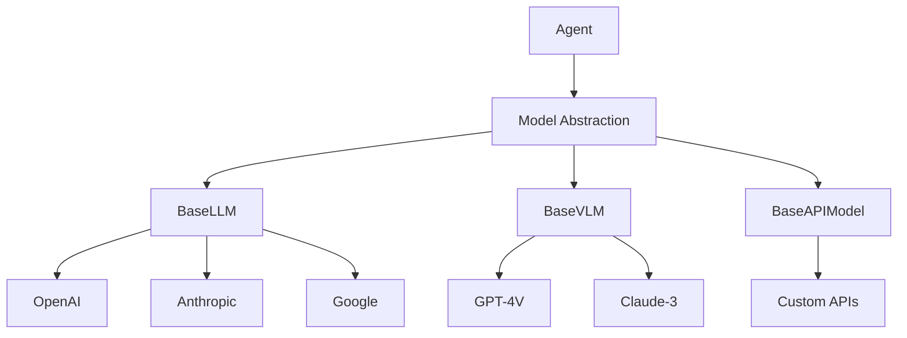

# Models

Models are the AI backends that power agent intelligence. The framework provides a unified abstraction layer for different model providers and types.

## Model Architecture



## Model Types

### Language Models (LLM)

Standard text-based models:

```python
from src.models.models import BaseLLM, ModelConfig

# Create OpenAI model
model_config = ModelConfig(
    provider="openai",
    model_name="gpt-4",
    temperature=0.7,
    max_tokens=2000
)

# Model is created internally by Agent
```

### Vision-Language Models (VLM)

Models that can process both text and images:

```python
from src.models.models import ModelConfig
from src.agents.memory import Message

# Create vision model config
vlm_config = ModelConfig(
    provider="openai",
    model_name="gpt-4-vision-preview",
    max_tokens=4096
)

# Include image in message
messages = [
    Message(
        role="user",
        content=[
            {"type": "text", "text": "What's in this image?"},
            {"type": "image_url", "image_url": {"url": image_data}}
        ]
    )
]
```

### API Models

Custom model endpoints:

```python
from src.models.models import BaseAPIModel

class CustomModel(BaseAPIModel):
    async def run(
        self,
        messages: List[Message],
        tools: Optional[List[Dict]] = None,
        output_json: bool = False
    ) -> Dict[str, Any]:
        # Custom API implementation
        response = await self._call_api(messages)
        return self._format_response(response)
```

## Model Configuration

### ModelConfig

Central configuration for all models:

```python
@dataclass
class ModelConfig:
    provider: str                    # "openai", "anthropic", "google"
    model_name: str                  # Specific model identifier
    api_key: Optional[str] = None    # API key (defaults to env var)
    temperature: float = 0.7         # Creativity level
    max_tokens: int = 2000          # Maximum response length
    base_url: Optional[str] = None   # Custom endpoint
    timeout: int = 120              # Request timeout
    
    def __post_init__(self):
        # Auto-load API key from environment
        if not self.api_key:
            self.api_key = os.getenv(f"{self.provider.upper()}_API_KEY")
```

### Provider-Specific Configs

```python
# OpenAI
openai_config = ModelConfig(
    provider="openai",
    model_name="gpt-4-turbo-preview",
    temperature=0.7,
    max_tokens=4096
)

# Anthropic
anthropic_config = ModelConfig(
    provider="anthropic",
    model_name="claude-3-opus-20240229",
    temperature=0.5,
    max_tokens=4096
)

# Google
google_config = ModelConfig(
    provider="google",
    model_name="gemini-pro",
    temperature=0.8,
    max_tokens=2048
)
```

## Model Features

### Tool Calling

Models support OpenAI-compatible function calling:

```python
tools = [
    {
        "type": "function",
        "function": {
            "name": "get_weather",
            "description": "Get weather information",
            "parameters": {
                "type": "object",
                "properties": {
                    "location": {"type": "string"}
                },
                "required": ["location"]
            }
        }
    }
]

response = await model.run(messages, tools=tools)

# Check for tool calls
if "tool_calls" in response:
    for tool_call in response["tool_calls"]:
        # Execute tool
        result = await execute_tool(tool_call)
```

### JSON Mode

Force structured output:

```python
response = await model.run(
    messages,
    output_json=True,
    system_message="Respond with valid JSON only"
)

# Response will be valid JSON
data = json.loads(response["content"])
```

### Streaming

Stream responses for real-time output:

```python
async for chunk in model.stream(messages):
    if chunk.get("content"):
        print(chunk["content"], end="", flush=True)
```

## Model Selection

### Choosing the Right Model

| Use Case | Recommended Model | Reasoning |
|----------|-------------------|-----------|
| General conversation | GPT-4 | Best overall performance |
| Code generation | Claude-3 | Strong coding abilities |
| Quick responses | GPT-3.5-turbo | Fast and cost-effective |
| Image analysis | GPT-4V | Vision capabilities |
| Long context | Claude-3 (100k) | Extended context window |

### Performance Considerations

```python
from src.agents import Agent
from src.models.models import ModelConfig

# Fast model for simple tasks
fast_agent = Agent(
    name="fast_assistant",
    model_config=ModelConfig(
        provider="openai",
        model_name="gpt-3.5-turbo",
        temperature=0.3
    )
)

# Powerful model for complex tasks
smart_agent = Agent(
    name="smart_assistant",
    model_config=ModelConfig(
        provider="openai",
        model_name="gpt-4-turbo-preview",
        temperature=0.7
    )
)
```

## Error Handling

Models handle errors gracefully:

```python
from src.agents.memory import Message

try:
    response = await model.run(messages)
except RateLimitError as e:
    # Handle rate limiting
    await asyncio.sleep(e.retry_after)
    response = await model.run(messages)
except APIError as e:
    # Return error as Message
    return Message(
        role="error",
        content=f"API Error: {str(e)}",
        name=model.config.model_name
    )
```

## Model Abstraction Benefits

1. **Provider Independence**: Switch providers without changing agent code
2. **Consistent Interface**: All models follow the same API
3. **Automatic Retries**: Built-in retry logic for transient failures
4. **Error Standardization**: Consistent error handling across providers
5. **Configuration Management**: Centralized configuration

## Advanced Usage

### Custom Model Wrapper

```python
from src.models.models import BaseLLM, ModelConfig

class CustomLLM(BaseLLM):
    def __init__(self, config: ModelConfig):
        super().__init__(config)
        self.client = self._init_client()
    
    async def run(
        self,
        messages: List[Message],
        tools: Optional[List[Dict]] = None,
        output_json: bool = False
    ) -> Dict[str, Any]:
        # Convert messages to provider format
        formatted_messages = self._format_messages(messages)
        
        # Make API call
        response = await self.client.chat(
            messages=formatted_messages,
            model=self.config.model_name,
            temperature=self.config.temperature
        )
        
        # Convert to standard format
        return self._standardize_response(response)
```

### Model Pooling

```python
class ModelPool:
    def __init__(self, configs: List[ModelConfig]):
        self.models = [
            self._create_model(config) 
            for config in configs
        ]
        self.current = 0
    
    async def run(self, messages: List[Message]) -> Dict[str, Any]:
        """Round-robin through models."""
        model = self.models[self.current]
        self.current = (self.current + 1) % len(self.models)
        
        return await model.run(messages)
```

### Model Caching

```python
from functools import lru_cache
import hashlib

class CachedModel(BaseLLM):
    def __init__(self, base_model: BaseLLM, cache_size: int = 128):
        self.base_model = base_model
        self.cache = {}
    
    async def run(self, messages: List[Message], **kwargs) -> Dict[str, Any]:
        # Create cache key
        cache_key = self._create_cache_key(messages, kwargs)
        
        # Check cache
        if cache_key in self.cache:
            return self.cache[cache_key]
        
        # Run model
        response = await self.base_model.run(messages, **kwargs)
        
        # Cache response
        self.cache[cache_key] = response
        return response
    
    def _create_cache_key(self, messages: List[Message], kwargs: Dict) -> str:
        content = json.dumps([m.to_llm_dict() for m in messages])
        content += json.dumps(kwargs, sort_keys=True)
        return hashlib.sha256(content.encode()).hexdigest()
```

## Best Practices

1. **Choose Appropriate Models**: Use powerful models only when needed
2. **Set Reasonable Timeouts**: Prevent hanging on slow responses
3. **Handle Rate Limits**: Implement exponential backoff
4. **Monitor Costs**: Track token usage across models
5. **Test Fallbacks**: Have backup models for critical paths

## Next Steps

- Learn about [Registry](registry.md) - How agents discover models
- Explore [Tools](tools.md) - Extending model capabilities
- See [Advanced Patterns](../ - Complex model usage
