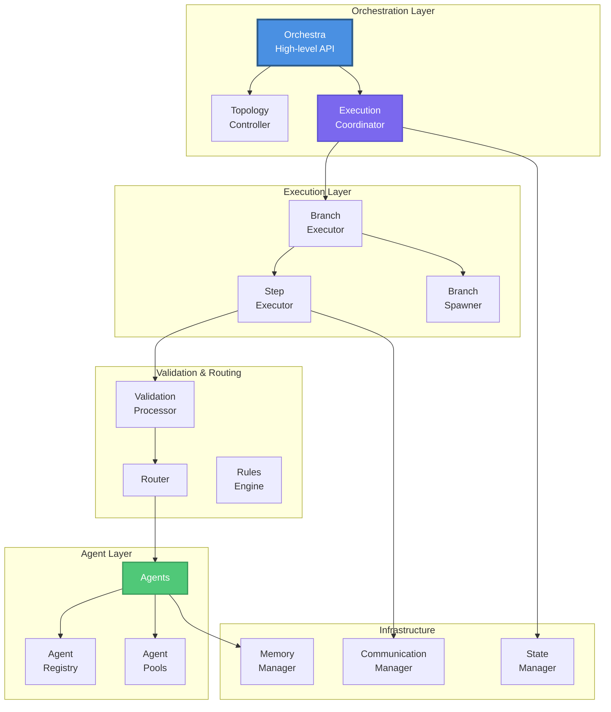

# Core Concepts

Understand the fundamental architecture and components that power the MARSYS framework.

## 🎯 Overview

MARSYS is built on a layered architecture where each component has a specific responsibility. Understanding these core concepts will help you build sophisticated multi-agent systems effectively.

## 🏗️ Architecture Overview



## 📚 Concept Categories

### 🎯 Core Components

These are the fundamental building blocks of every MARSYS application:

<div class="grid cards" markdown="1">

- :material-robot:{ .lg .middle } **[Agents](agents/)**

    ---

    The autonomous units that perform tasks and make decisions

- :material-brain:{ .lg .middle } **[Memory](memory/)**

    ---

    How agents store and recall information across conversations

- :material-tools:{ .lg .middle } **[Tools](tools/)**

    ---

    Functions and capabilities that extend agent abilities

- :material-api:{ .lg .middle } **[Models](models/)**

    ---

    LLM configurations and provider integrations

- :material-database:{ .lg .middle } **[Registry](registry/)**

    ---

    Global agent discovery and management system

- :material-message:{ .lg .middle } **[Messages](messages/)**

    ---

    Standardized communication format between components

- :material-account-multiple:{ .lg .middle } **[Communication](communication/)**

    ---

    Inter-agent and user interaction patterns

</div>

### 🚀 Advanced Topics

Advanced concepts for building sophisticated systems:

<div class="grid cards" markdown="1">

- :material-graph:{ .lg .middle } **[Topology System](advanced/topology/)**

    ---

    Define complex agent interaction patterns and workflows

- :material-alert:{ .lg .middle } **[Error Handling](error-handling/)**

    ---

    Comprehensive error recovery and retry strategies

- :material-web:{ .lg .middle } **[Browser Automation](browser-automation/)**

    ---

    Web scraping and interaction capabilities

- :material-school:{ .lg .middle } **[Learning Agents](learning-agents/)**

    ---

    Agents that adapt and improve through fine-tuning

- :material-memory:{ .lg .middle } **[Memory Patterns](memory-patterns/)**

    ---

    Advanced strategies for knowledge retention

- :material-code-tags:{ .lg .middle } **[Custom Agents](custom-agents/)**

    ---

    Building specialized agent types for specific needs

</div>

## 🎓 Learning Path

### For Beginners
1. Start with **[Agents](agents/)** to understand the basic building blocks
2. Learn about **[Memory](memory/)** and how agents retain information
3. Explore **[Tools](tools/)** to extend agent capabilities
4. Understand **[Communication](communication/)** patterns

### For Intermediate Users
1. Master **[Topology System](advanced/topology/)** for complex workflows
2. Implement **[Error Handling](error-handling/)** for production systems
3. Explore **[Memory Patterns](memory-patterns/)** for advanced use cases
4. Learn **[Custom Agents](custom-agents/)** development

### For Advanced Users
1. Build **[Learning Agents](learning-agents/)** with adaptation
2. Implement **[Browser Automation](browser-automation/)** for web tasks
3. Design complex topologies with dynamic branching
4. Optimize performance with agent pools

## 🔑 Key Design Principles

### 1. **Pure Agent Logic**
Agents implement pure `_run()` methods without side effects:

```python
async def _run(self, prompt, context, **kwargs):
    # Pure logic - no memory manipulation
    # No logging, no state changes
    # Just process and return
    messages = self._prepare_messages(prompt)
    response = await self.model.run(messages)
    return Message(role="assistant", content=response.content)
```

### 2. **Centralized Validation**
All response processing happens in one place:

```python
# ValidationProcessor handles ALL parsing
- JSON responses
- Structured data
- Tool calls
- Agent invocations
- Error classification
```

### 3. **Dynamic Branching**
Branches created at runtime for parallel execution:

```python
# Agents decide parallelism dynamically
{
    "next_action": "parallel_invoke",
    "agents": ["A", "B", "C"],  # Spawns 3 branches
    "agent_requests": {...}
}
```

### 4. **Branch Isolation**
Each branch maintains independent state:

- Separate memory contexts
- Individual execution traces
- Isolated metadata
- Independent status tracking

### 5. **Topology-Driven Routing**
All routing decisions based on topology:

```python
topology = {
    "nodes": ["A", "B", "C"],
    "edges": ["A -> B", "B -> C"],  # Defines allowed paths
    "rules": [...]  # Additional constraints
}
```

## 💡 Core Execution Flow

Understanding the execution flow is crucial:

### 1. **Task Submission**
```python
result = await Orchestra.run(task, topology)
```

### 2. **Topology Analysis**
- Identify entry points
- Detect convergence nodes
- Validate agent permissions
- Apply rules

### 3. **Branch Creation**
- Initial branches at entry points
- Dynamic spawning for parallel work
- Parent-child relationships

### 4. **Step Execution**
```
Validate → Route → Execute → Process → Continue
```

### 5. **Convergence**
- Wait for child branches
- Aggregate results
- Resume parent execution

### 6. **Completion**
- Extract final response
- Return OrchestraResult

## 🔄 Agent Communication Patterns

### Sequential
```
A → B → C → Final
```

### Parallel
```
    ┌→ B →┐
A →─┼→ C →┼→ E
    └→ D →┘
```

### Conversation
```
A ⟷ B (multiple rounds)
```

### Hierarchical
```
     Manager
    /        \
  Lead1      Lead2
  /   \      /   \
W1    W2    W3    W4
```

## 🛡️ Error Recovery Strategies

MARSYS provides multiple levels of error handling:

### 1. **Step-Level Retry**
Automatic retry with exponential backoff

### 2. **Error Classification**
Different strategies for different error types:
- **Rate Limits**: Wait and retry
- **Invalid Input**: Route to user
- **API Errors**: Fallback models
- **Timeouts**: Cancel and recover

### 3. **User Recovery**
Route errors to User node for manual intervention

### 4. **Graceful Degradation**
Continue with partial results when possible

## 📊 Performance Considerations

### Agent Pools
Use pools for true parallelism:
```python
pool = AgentPool(agent_class=BrowserAgent, num_instances=3)
```

### Memory Management
Choose appropriate retention:
- `single_run`: Stateless, minimal memory
- `session`: Balanced for most use cases
- `persistent`: Long-term learning

### Timeout Configuration
Set appropriate timeouts:
- Step timeout: Individual operations
- Branch timeout: Complete workflows
- Convergence timeout: Parallel coordination

### Status Verbosity
Adjust output for performance:
- `QUIET`: Production (minimal overhead)
- `NORMAL`: Development
- `VERBOSE`: Debugging

## 🚦 Next Steps

Ready to dive deeper into specific concepts?

<div class="grid cards" markdown="1">

- :material-robot:{ .lg .middle } **[Learn About Agents](agents/)**

    ---

    Start with the fundamental building blocks

- :material-graph:{ .lg .middle } **[Explore Topologies](advanced/topology/)**

    ---

    Design complex interaction patterns

- :material-api:{ .lg .middle } **[API Reference](../api/)**

    ---

    Detailed class and method documentation

- :material-code-tags:{ .lg .middle } **[See Examples](../use-cases/)**

    ---

    Learn from real-world implementations

</div>

---

!!! tip "Best Starting Point"
    If you're new to MARSYS, start with the [Agents](agents/) documentation to understand the fundamental building blocks of the framework.