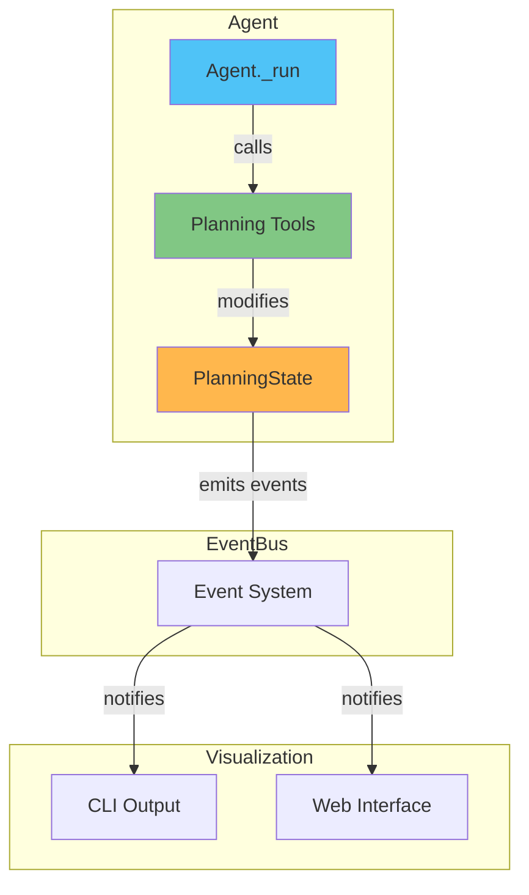
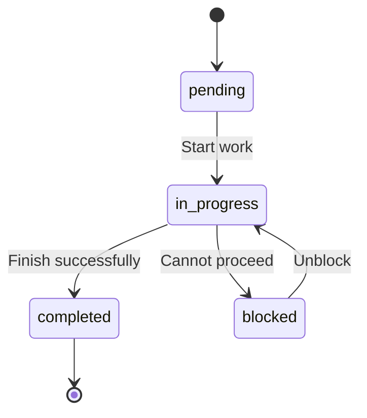

# Task Planning

Task planning enables agents to create, track, and manage structured task lists during complex multi-step operations.

!!! info "See Also"
    For the `plan_config` parameter details, see [Agent API Reference](../api/agent-class.md).

## Overview

Planning helps agents:

- **Track Progress**: Know what's done and what remains
- **Recover from Errors**: Reorient after failures using plan context
- **Provide Visibility**: Users can see agent progress via CLI/web status
- **Maintain Focus**: Prevents task drift in long-running operations

Planning is **enabled by default** for all agents but can be disabled when not needed.

## Architecture



## Quick Start

### Basic Usage (Default: Enabled)

```python
from marsys.agents import Agent
from marsys.models import ModelConfig

# Planning is enabled by default
agent = Agent(
    model_config=ModelConfig(
        type="api",
        name="anthropic/claude-haiku-4.5",
        provider="openrouter",
        max_tokens=12000
    ),
    name="Researcher",
    goal="Research and analyze topics",
    instruction="You are a thorough researcher..."
)

# Agent has access to planning tools automatically
result = await agent.auto_run("Research AI trends and summarize findings")
```

### Disabling Planning

```python
# Disable planning for simple, single-step agents
simple_agent = Agent(
    model_config=config,
    name="Calculator",
    goal="Perform calculations",
    instruction="...",
    plan_config=False  # Disable planning
)
```

### Custom Configuration

```python
from marsys.agents.planning import PlanningConfig, InjectionTrigger

custom_agent = Agent(
    model_config=config,
    name="Analyst",
    goal="Analyze complex datasets",
    instruction="...",
    plan_config=PlanningConfig(
        min_plan_items=3,
        max_plan_items=15,
        compact_mode=True,
        inject_triggers={
            InjectionTrigger.SESSION_START,
            InjectionTrigger.ERROR_RECOVERY,
        }
    )
)
```

## Configuration

### PlanningConfig

| Parameter | Type | Default | Description |
|-----------|------|---------|-------------|
| `enabled` | `bool` | `True` | Enable/disable planning |
| `min_plan_items` | `int` | `2` | Minimum items required for a valid plan |
| `max_plan_items` | `int` | `20` | Maximum allowed items |
| `max_item_content_length` | `int` | `500` | Max characters per item content |
| `inject_after_step` | `int` | `0` | Step number after which to start injecting plan context |
| `inject_triggers` | `Set[InjectionTrigger]` | `{SESSION_START, STEP_START, ERROR_RECOVERY}` | When to inject plan context |
| `compact_mode` | `bool` | `True` | Use compact display format |
| `max_items_in_compact` | `int` | `3` | Max items shown in compact view |
| `custom_instruction` | `Optional[str]` | `None` | Override default planning instruction |

### Injection Triggers

| Trigger | When Activated | Use Case |
|---------|----------------|----------|
| `SESSION_START` | First step of a fresh run | Provide full plan reminder |
| `STEP_START` | After N steps (configurable) | Compact reminder during work |
| `ERROR_RECOVERY` | During retry after an error | Help agent reorient |

```python
from marsys.agents.planning import InjectionTrigger

# Only inject at session start and errors (skip step-by-step)
config = PlanningConfig(
    inject_triggers={
        InjectionTrigger.SESSION_START,
        InjectionTrigger.ERROR_RECOVERY,
    }
)
```

## Planning Tools

When planning is enabled, agents have access to these tools:

| Tool | Description |
|------|-------------|
| `plan_create` | Create a new plan with items and goal |
| `plan_read` | Read current plan state |
| `plan_update` | Update item status, title, or content |
| `plan_add_item` | Add item to existing plan |
| `plan_remove_item` | Remove item from plan |
| `plan_clear` | Clear the entire plan |

### Tool Usage Examples

#### Creating a Plan

The agent creates a plan when receiving a complex task:

```python
# Agent calls plan_create tool with:
{
    "goal": "Build authentication system",
    "items": [
        {
            "title": "Design user schema",
            "content": "Create database tables for users and sessions",
            "active_form": "Designing user schema"
        },
        {
            "title": "Implement signup endpoint",
            "content": "Create POST /auth/signup with validation",
            "active_form": "Implementing signup endpoint"
        },
        {
            "title": "Add authentication tests",
            "content": "Write unit and integration tests",
            "active_form": "Writing authentication tests"
        }
    ]
}
```

#### Updating Progress

```python
# Mark item as in progress
plan_update(item_id="abc123", status="in_progress")

# Mark as completed when done
plan_update(item_id="abc123", status="completed")

# Update content if scope changes
plan_update(item_id="def456", content="Updated scope: also add OAuth support")
```

#### Reading Plan State

```python
# Agent calls plan_read to review current state
# Returns structured plan with all items and their statuses
```

## Plan Item States



| Status | Description | Rules |
|--------|-------------|-------|
| `pending` | Not yet started | Default state for new items |
| `in_progress` | Currently working | **Only ONE item at a time** |
| `completed` | Successfully finished | Must complete current before starting next |
| `blocked` | Cannot proceed | Should include reason |

!!! warning "One In-Progress Rule"
    Only one item can be `in_progress` at any time. Agents must complete the current item before starting the next one.

## Status Visualization

Planning events are displayed in CLI and web interfaces:

### CLI Output Examples

```
┌─ Plan Created ────────────────────────────────────
│ Goal: Research AI trends and create summary report
│ Items: 4
│   1. [pending] Search for recent AI papers
│   2. [pending] Analyze key findings
│   3. [pending] Synthesize insights
│   4. [pending] Write summary report
└───────────────────────────────────────────────────

[Researcher] ▸ Searching for recent AI papers...

┌─ Plan Updated ────────────────────────────────────
│ ✓ Search for recent AI papers → completed
│ ▸ Analyze key findings → in_progress
└───────────────────────────────────────────────────
```

### Verbosity Levels

| Level | What's Shown |
|-------|--------------|
| QUIET (0) | Nothing |
| NORMAL (1) | Status changes only |
| VERBOSE (2) | All updates including field changes |

## Event System Integration

Planning integrates with the EventBus for:

- **Memory Reset Sync**: Plans clear automatically when memory resets
- **Status Updates**: Events emit for CLI/web visualization

### Events Emitted

| Event | When Emitted |
|-------|--------------|
| `PlanCreatedEvent` | New plan created |
| `PlanUpdatedEvent` | Item status or fields changed |
| `PlanItemAddedEvent` | Item added to plan |
| `PlanItemRemovedEvent` | Item removed from plan |
| `PlanClearedEvent` | Plan cleared |

## State Persistence

Plans are saved alongside agent state:

```python
# Save agent state (includes plan)
agent.save_state("/path/to/state.json")

# Load state later (plan is restored)
new_agent = Agent(
    model_config=config,
    name="Researcher",
    goal="...",
    instruction="...",
    plan_config=True  # Must enable planning
)
new_agent.load_state("/path/to/state.json")
```

## Best Practices

### When to Use Planning

- Tasks with 2+ distinct steps
- Operations requiring progress tracking
- Tasks needing recovery from errors
- Long-running autonomous workflows

### When NOT to Use Planning

- Simple single-step operations
- Quick lookups or calculations
- Conversational interactions
- Agents that don't use `auto_run()`

### Effective Planning

1. **Create plan BEFORE starting work** - Plan first, then execute
2. **Mark items in_progress before working** - Shows what's currently happening
3. **Mark items completed IMMEDIATELY after finishing** - Don't batch completions
4. **Only ONE item in_progress at a time** - Maintains focus
5. **Use blocked status with clear reason if stuck** - Enables error recovery

## Example: Research Task with Planning

```python
from marsys.agents import Agent
from marsys.agents.planning import PlanningConfig
from marsys.models import ModelConfig

# Create agent with planning
researcher = Agent(
    model_config=ModelConfig(
        type="api",
        name="anthropic/claude-sonnet-4",
        provider="openrouter",
        max_tokens=12000
    ),
    name="Researcher",
    goal="Research topics thoroughly and provide comprehensive summaries",
    instruction="""You are a thorough researcher. When given a research task:

    1. Create a plan with clear steps
    2. Work through each step systematically
    3. Mark items complete as you finish them
    4. Provide a final summary when done

    Use your planning tools to stay organized.""",
    tools={"search_web": search_web, "fetch_url": fetch_url},
    plan_config=PlanningConfig(
        min_plan_items=2,
        max_plan_items=10,
        compact_mode=True
    )
)

# Run the research task
result = await researcher.auto_run(
    "Research the latest developments in quantum computing and summarize the key breakthroughs",
    max_steps=10
)
```

During execution, the agent:
1. Creates a plan with steps like "Search for quantum computing news", "Read key articles", "Summarize findings"
2. Marks each step in_progress as it works on it
3. Marks completed when done
4. Provides final response with research summary

## Related Documentation

- [Agents](agents.md) - Agent architecture
- [Memory](memory.md) - Memory management
- [State Management](state-management.md) - Persistence
- [Agent API Reference](../api/agent-class.md) - API details
