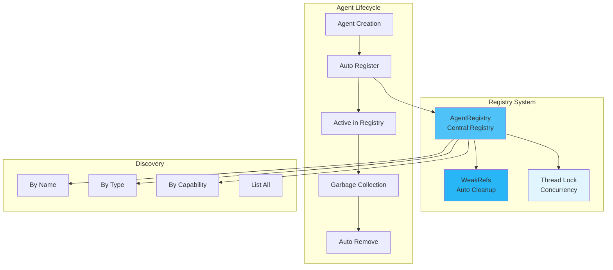

# Registry

The AgentRegistry is a central service discovery and lifecycle management system that enables dynamic agent registration, discovery, and communication in MARSYS workflows.

## 🎯 Overview

The registry system provides:

- **Service Discovery**: Find agents by name, capability, or type
- **Lifecycle Management**: Automatic registration and cleanup
- **Thread-Safe Operations**: Concurrent access with locking
- **Weak References**: Automatic garbage collection
- **Dynamic Communication**: Runtime agent discovery

## 🏗️ Architecture



## 📦 Core Registry

### AgentRegistry Class

```python
from marsys.agents.registry import AgentRegistry
from marsys.agents import Agent
from marsys.models import ModelConfig

# The registry is a singleton - no instantiation needed
# It's automatically used by all agents

# Create agents - they auto-register
agent1 = Agent(
    agent_name="data_processor",
    model_config=ModelConfig(
        type="api",
        provider="openrouter",
        name="anthropic/claude-haiku-4.5",
        max_tokens=12000
    ),
    description="Processes and analyzes data"
)

agent2 = Agent(
    agent_name="report_writer",
    model_config=config,
    description="Creates detailed reports"
)

# Check registration
print(AgentRegistry.list())  # ['data_processor', 'report_writer']

# Get specific agent
processor = AgentRegistry.get_agent("data_processor")
if processor:
    result = await processor.run("Analyze this data: ...")
```

### Automatic Registration

```python
class Agent(BaseAgent):
    """Agents automatically register on creation."""

    def __init__(self, agent_name: str = None, **kwargs):
        super().__init__(**kwargs)

        # Auto-registration happens in BaseAgent
        if agent_name:
            self.name = agent_name
            AgentRegistry.register_instance(self, agent_name)
        else:
            # Auto-generate unique name
            self.name = f"{self.__class__.__name__}_{id(self)}"
            AgentRegistry.register_instance(self, self.name)

# No manual registration needed!
agent = Agent(agent_name="assistant")  # Automatically in registry
```

### Registry Operations

```python
# Get agent by name
agent = AgentRegistry.get_agent("assistant")

# Check if agent exists
if AgentRegistry.has_agent("assistant"):
    print("Agent is available")

# List all agents
all_agents = AgentRegistry.list()
print(f"Active agents: {all_agents}")

# Get agents by type
assistants = AgentRegistry.get_agents_by_type(Agent)
browsers = AgentRegistry.get_agents_by_type(BrowserAgent)

# Count active agents
count = len(AgentRegistry.list())
print(f"Total agents: {count}")

# Clear registry (careful!)
AgentRegistry.clear()  # Removes all registrations
```

## 🎯 Discovery Patterns

### Service Discovery

```python
class CapabilityRegistry:
    """Extended registry with capability tracking."""

    _capabilities: Dict[str, Set[str]] = {}

    @classmethod
    def register_capability(cls, agent_name: str, capability: str):
        """Register agent capability."""
        if capability not in cls._capabilities:
            cls._capabilities[capability] = set()
        cls._capabilities[capability].add(agent_name)

    @classmethod
    def find_by_capability(cls, capability: str) -> List[str]:
        """Find agents with specific capability."""
        return list(cls._capabilities.get(capability, []))

    @classmethod
    def find_best_match(cls, capabilities: List[str]) -> Optional[str]:
        """Find agent with most matching capabilities."""
        scores = {}
        for cap in capabilities:
            for agent in cls._capabilities.get(cap, []):
                scores[agent] = scores.get(agent, 0) + 1

        if scores:
            return max(scores, key=scores.get)
        return None

# Usage
CapabilityRegistry.register_capability("translator_1", "translation")
CapabilityRegistry.register_capability("translator_1", "localization")
CapabilityRegistry.register_capability("writer_1", "content_creation")

# Find specialists
translators = CapabilityRegistry.find_by_capability("translation")
best_match = CapabilityRegistry.find_best_match(["translation", "localization"])
```

### Dynamic Agent Selection

```python
class SmartCoordinator(Agent):
    """Coordinator that dynamically selects agents."""

    async def delegate_task(self, task: str, task_type: str, context):
        """Delegate task to appropriate agent."""

        # Find suitable agents
        candidates = self._find_suitable_agents(task_type)

        if not candidates:
            return Message(
                role="error",
                content=f"No agents available for {task_type}",
                name=self.name
            )

        # Select best agent (could use various strategies)
        selected = self._select_best_agent(candidates, task)

        # Invoke selected agent
        return await self.invoke_agent(selected, task)

    def _find_suitable_agents(self, task_type: str) -> List[str]:
        """Find agents suitable for task type."""
        type_mapping = {
            "analysis": ["data_analyst", "researcher"],
            "writing": ["writer", "editor", "reporter"],
            "browsing": ["browser_agent", "scraper"]
        }

        agent_names = type_mapping.get(task_type, [])
        return [
            name for name in agent_names
            if AgentRegistry.has_agent(name)
        ]

    def _select_best_agent(self, candidates: List[str], task: str) -> str:
        """Select best agent from candidates."""
        # Could implement various strategies:
        # - Round-robin
        # - Load balancing
        # - Capability matching
        # - Performance history
        return candidates[0]  # Simple: first available
```

## 🔧 Advanced Registry

### Load Balancing

```python
class LoadBalancedRegistry:
    """Registry with load balancing capabilities."""

    _invocation_counts: Dict[str, int] = {}
    _active_tasks: Dict[str, int] = {}

    @classmethod
    def get_least_loaded(cls, agent_type: str = None) -> Optional[str]:
        """Get least loaded agent."""
        candidates = AgentRegistry.list()

        if agent_type:
            # Filter by type
            candidates = [
                name for name in candidates
                if name.startswith(agent_type)
            ]

        if not candidates:
            return None

        # Find least loaded
        return min(
            candidates,
            key=lambda n: cls._active_tasks.get(n, 0)
        )

    @classmethod
    def start_task(cls, agent_name: str):
        """Mark task start."""
        cls._active_tasks[agent_name] = cls._active_tasks.get(agent_name, 0) + 1
        cls._invocation_counts[agent_name] = cls._invocation_counts.get(agent_name, 0) + 1

    @classmethod
    def end_task(cls, agent_name: str):
        """Mark task end."""
        if agent_name in cls._active_tasks:
            cls._active_tasks[agent_name] = max(0, cls._active_tasks[agent_name] - 1)

    @classmethod
    def get_statistics(cls) -> Dict[str, Any]:
        """Get load balancing statistics."""
        return {
            "total_invocations": sum(cls._invocation_counts.values()),
            "active_tasks": dict(cls._active_tasks),
            "invocation_counts": dict(cls._invocation_counts)
        }
```

### Health Monitoring

```python
class HealthMonitor:
    """Monitor agent health and availability."""

    _health_status: Dict[str, Dict[str, Any]] = {}
    _last_check: Dict[str, datetime] = {}

    @classmethod
    async def check_agent_health(cls, agent_name: str) -> bool:
        """Check if agent is healthy."""
        agent = AgentRegistry.get_agent(agent_name)
        if not agent:
            return False

        try:
            # Simple ping test
            start = time.time()
            response = await agent.run("ping", timeout=5.0)
            latency = time.time() - start

            cls._health_status[agent_name] = {
                "healthy": True,
                "latency": latency,
                "last_check": datetime.now()
            }
            return True

        except Exception as e:
            cls._health_status[agent_name] = {
                "healthy": False,
                "error": str(e),
                "last_check": datetime.now()
            }
            return False

    @classmethod
    async def check_all_agents(cls) -> Dict[str, bool]:
        """Health check all registered agents."""
        results = {}
        for agent_name in AgentRegistry.list():
            results[agent_name] = await cls.check_agent_health(agent_name)
        return results

    @classmethod
    def get_healthy_agents(cls) -> List[str]:
        """Get list of healthy agents."""
        return [
            name for name, status in cls._health_status.items()
            if status.get("healthy", False)
        ]
```

### Registry Persistence

```python
class PersistentRegistry:
    """Registry with state persistence."""

    @classmethod
    def save_state(cls, filepath: str):
        """Save registry state to file."""
        state = {
            "timestamp": datetime.now().isoformat(),
            "agents": {}
        }

        for agent_name in AgentRegistry.list():
            agent = AgentRegistry.get_agent(agent_name)
            if agent:
                state["agents"][agent_name] = {
                    "type": type(agent).__name__,
                    "description": getattr(agent, 'description', ''),
                    "model": getattr(agent.model, 'name', 'unknown')
                }

        with open(filepath, 'w') as f:
            json.dump(state, f, indent=2)

    @classmethod
    def load_state(cls, filepath: str) -> Dict:
        """Load registry state from file."""
        with open(filepath, 'r') as f:
            return json.load(f)

    @classmethod
    def restore_agents(cls, state: Dict, model_configs: Dict[str, ModelConfig]):
        """Restore agents from saved state."""
        for agent_name, info in state.get("agents", {}).items():
            agent_type = info["type"]
            model_name = info.get("model", "anthropic/claude-haiku-4.5")

            # Get appropriate config
            config = model_configs.get(model_name)
            if not config:
                continue

            # Recreate agent based on type
            if agent_type == "Agent":
                Agent(agent_name=agent_name, model_config=config)
            elif agent_type == "BrowserAgent":
                BrowserAgent(agent_name=agent_name, model_config=config)
            # Add other agent types as needed
```

## 📋 Best Practices

### 1. **Unique Naming**

```python
# ✅ GOOD - Descriptive, unique names
agent1 = Agent(agent_name="financial_analyst_v2", model_config=config)
agent2 = Agent(agent_name="report_generator_q4_2024", model_config=config)

# ❌ BAD - Generic, collision-prone names
agent1 = Agent(agent_name="agent", model_config=config)
agent2 = Agent(agent_name="helper", model_config=config)
```

### 2. **Existence Checks**

```python
# ✅ GOOD - Always check before invoking
async def safe_delegate(agent_name: str, task: str):
    if not AgentRegistry.has_agent(agent_name):
        logger.warning(f"Agent {agent_name} not found")
        # Fallback logic
        return await use_fallback_agent(task)

    agent = AgentRegistry.get_agent(agent_name)
    return await agent.run(task)

# ❌ BAD - Assuming agent exists
async def unsafe_delegate(agent_name: str, task: str):
    agent = AgentRegistry.get_agent(agent_name)
    return await agent.run(task)  # Will fail if agent is None
```

### 3. **Resource Management**

```python
# ✅ GOOD - Agents cleaned up automatically via weak refs
async def process_batch(items):
    # Create temporary agent
    temp_agent = Agent(
        agent_name=f"batch_processor_{uuid.uuid4().hex[:8]}",
        model_config=config
    )

    results = []
    for item in items:
        result = await temp_agent.run(f"Process: {item}")
        results.append(result)

    return results
    # temp_agent automatically removed from registry when GC'd

# ❌ BAD - Creating agents without cleanup consideration
for i in range(1000):
    Agent(agent_name=f"worker_{i}", model_config=config)
    # Creates 1000 agents that stay in registry!
```

### 4. **Monitoring**

```python
# ✅ GOOD - Monitor registry health
async def monitor_registry():
    """Regular registry monitoring."""
    while True:
        agents = AgentRegistry.list()
        logger.info(f"Active agents: {len(agents)}")

        if len(agents) > 100:
            logger.warning("High agent count - possible leak")

        # Health checks
        for agent_name in agents[:10]:  # Sample check
            healthy = await HealthMonitor.check_agent_health(agent_name)
            if not healthy:
                logger.error(f"Agent {agent_name} unhealthy")

        await asyncio.sleep(60)  # Check every minute
```

## 🚦 Next Steps

<div class="grid cards" markdown="1">

- :material-robot:{ .lg .middle } **[Agents](agents.md)**

    ---

    Learn about agent creation

- :material-chat:{ .lg .middle } **[Communication](communication.md)**

    ---

    How agents communicate

- :material-network:{ .lg .middle } **[Topology](advanced/topology.md)**

    ---

    Agent organization patterns

- :material-api:{ .lg .middle } **[API Reference](../api/registry.md)**

    ---

    Complete registry API

</div>

---

!!! success "Registry System Ready!"
    You now understand the AgentRegistry in MARSYS. The registry provides robust service discovery and lifecycle management for dynamic multi-agent systems.