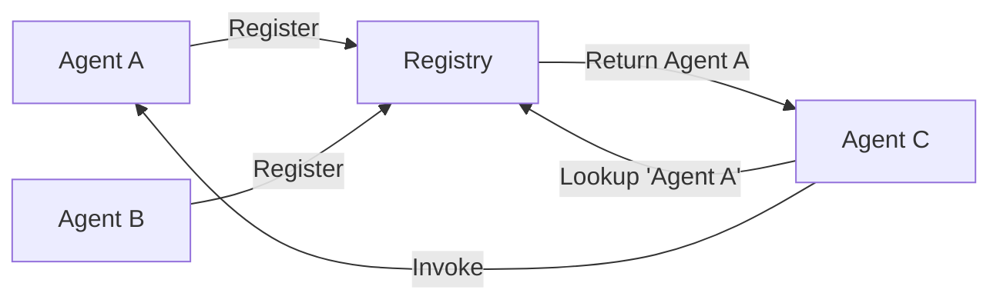

# Registry

The Registry is a central service discovery mechanism that allows agents to find and communicate with each other dynamically.

## What is the Registry?

The Registry acts as a phone book for agents:
- Agents register themselves with a unique name
- Other agents can look up registered agents
- Enables dynamic agent discovery and communication
- Manages agent lifecycle (registration/deregistration)

## How It Works



## Using the Registry

### Agent Registration

Agents can register automatically or manually:

```python
# Automatic registration
agent = Agent(
    name="data_processor",
    model_config=config,
    register=True  # Auto-register on creation
)

# Manual registration
agent = Agent(
    name="analyzer",
    model_config=config,
    register=False
)
agent.register()  # Register later
```

### Checking Registration

```python
from src.agents.registry import AgentRegistry

# Check if agent is registered
if AgentRegistry.get_agent("data_processor"):
    print("Agent is available")

# List all registered agents
all_agents = AgentRegistry.list_agents()
print(f"Registered agents: {all_agents}")
```

### Agent Discovery

Agents discover each other through the registry:

```python
# Inside an agent's code
async def collaborate_with_expert(self, topic: str):
    # Look up expert agent
    expert = AgentRegistry.get_agent("domain_expert")
    
    if not expert:
        return Message(
            role="error",
            content="Expert agent not available",
            name=self.name
        )
    
    # Invoke the expert
    return await self.invoke_agent(
        "domain_expert",
        f"Explain {topic} in detail"
    )
```

## Registry Implementation

### Thread-Safe Design

The registry uses thread-safe operations:

```python
class AgentRegistry:
    _agents: Dict[str, BaseAgent] = {}
    _lock = threading.Lock()
    
    @classmethod
    def register(cls, agent: BaseAgent) -> None:
        """Register an agent with thread safety."""
        with cls._lock:
            if agent.name in cls._agents:
                raise ValueError(f"Agent '{agent.name}' already registered")
            cls._agents[agent.name] = agent
    
    @classmethod
    def unregister(cls, agent_name: str) -> None:
        """Unregister an agent safely."""
        with cls._lock:
            cls._agents.pop(agent_name, None)
```

### Lifecycle Management

Agents automatically manage their registration:

```python
class BaseAgent:
    def __init__(self, name: str, register: bool = True, **kwargs):
        self.name = name
        # ... other initialization
        
        if register:
            self.register()
    
    def __del__(self):
        """Cleanup on deletion."""
        try:
            self.unregister()
        except:
            pass  # Ignore errors during cleanup
```

## Registry Patterns

### Service Discovery Pattern

Discover agents by capability:

```python
class CapabilityRegistry(AgentRegistry):
    _capabilities: Dict[str, List[str]] = {}
    
    @classmethod
    def register_capability(cls, agent_name: str, capability: str):
        """Register agent capability."""
        if capability not in cls._capabilities:
            cls._capabilities[capability] = []
        cls._capabilities[capability].append(agent_name)
    
    @classmethod
    def find_by_capability(cls, capability: str) -> List[str]:
        """Find agents with specific capability."""
        return cls._capabilities.get(capability, [])

# Usage
agent = Agent(name="translator", ...)
CapabilityRegistry.register_capability("translator", "translation")

# Find all translation agents
translators = CapabilityRegistry.find_by_capability("translation")
```

### Load Balancing Pattern

Distribute work across multiple agents:

```python
class LoadBalancedRegistry(AgentRegistry):
    _invocation_counts: Dict[str, int] = {}
    
    @classmethod
    def get_least_loaded(cls, agent_prefix: str) -> Optional[BaseAgent]:
        """Get the least loaded agent matching prefix."""
        matching_agents = [
            name for name in cls._agents 
            if name.startswith(agent_prefix)
        ]
        
        if not matching_agents:
            return None
        
        # Find agent with lowest invocation count
        least_loaded = min(
            matching_agents,
            key=lambda n: cls._invocation_counts.get(n, 0)
        )
        
        return cls._agents[least_loaded]
```

### Health Check Pattern

Monitor agent availability:

```python
class HealthCheckRegistry(AgentRegistry):
    @classmethod
    async def health_check(cls) -> Dict[str, bool]:
        """Check health of all registered agents."""
        health_status = {}
        
        for name, agent in cls._agents.items():
            try:
                # Simple ping test
                response = await agent.auto_run(
                    task="ping",
                    max_steps=1
                )
                health_status[name] = response.role != "error"
            except:
                health_status[name] = False
        
        return health_status
```

## Best Practices

### 1. Unique Names

Always use unique, descriptive names:

```python
# Good
agent1 = Agent(name="customer_support_specialist_1", ...)
agent2 = Agent(name="technical_documentation_writer", ...)

# Bad
agent1 = Agent(name="agent1", ...)
agent2 = Agent(name="helper", ...)
```

### 2. Registration Checks

Always check if an agent exists before invoking:

```python
async def safe_invoke(self, agent_name: str, task: str) -> Message:
    """Safely invoke an agent with existence check."""
    if not AgentRegistry.get_agent(agent_name):
        return Message(
            role="error",
            content=f"Agent '{agent_name}' not found",
            name=self.name
        )
    
    return await self.invoke_agent(agent_name, task)
```

### 3. Cleanup

Ensure proper cleanup:

```python
class ManagedAgent(Agent):
    async def __aenter__(self):
        """Context manager entry."""
        self.register()
        return self
    
    async def __aexit__(self, exc_type, exc_val, exc_tb):
        """Context manager exit."""
        self.unregister()

# Usage
async with ManagedAgent(name="temp_worker", ...) as agent:
    response = await agent.auto_run(task="...")
# Agent automatically unregistered
```

### 4. Registry Monitoring

Monitor registry state:

```python
def log_registry_state():
    """Log current registry state."""
    agents = AgentRegistry.list_agents()
    logger.info(f"Active agents: {len(agents)}")
    for agent_name in agents:
        logger.debug(f"  - {agent_name}")
```

## Common Issues and Solutions

### Name Conflicts

```python
try:
    agent = Agent(name="processor", register=True)
except ValueError as e:
    # Handle duplicate name
    agent = Agent(
        name=f"processor_{uuid.uuid4().hex[:8]}", 
        register=True
    )
```

### Missing Agents

```python
def get_or_create_agent(name: str, config: ModelConfig) -> BaseAgent:
    """Get existing agent or create new one."""
    agent = AgentRegistry.get_agent(name)
    if not agent:
        agent = Agent(name=name, model_config=config, register=True)
    return agent
```

### Registry Overflow

```python
class BoundedRegistry(AgentRegistry):
    MAX_AGENTS = 100
    
    @classmethod
    def register(cls, agent: BaseAgent) -> None:
        """Register with size limit."""
        with cls._lock:
            if len(cls._agents) >= cls.MAX_AGENTS:
                raise RuntimeError("Registry full")
            super().register(agent)
```

## Advanced Registry Features

### Registry Persistence

Save and restore registry state:

```python
class PersistentRegistry(AgentRegistry):
    @classmethod
    def save_state(cls, filepath: str):
        """Save registry state to file."""
        state = {
            name: {
                "type": type(agent).__name__,
                "config": agent.model_config.__dict__
            }
            for name, agent in cls._agents.items()
        }
        
        with open(filepath, 'w') as f:
            json.dump(state, f)
    
    @classmethod
    def load_state(cls, filepath: str):
        """Restore registry state from file."""
        with open(filepath, 'r') as f:
            state = json.load(f)
        
        # Recreate agents
        for name, info in state.items():
            # Agent recreation logic
            pass
```

### Registry Events

Implement event system for registry changes:

```python
class EventRegistry(AgentRegistry):
    _listeners: List[Callable] = []
    
    @classmethod
    def add_listener(cls, callback: Callable):
        """Add event listener."""
        cls._listeners.append(callback)
    
    @classmethod
    def register(cls, agent: BaseAgent) -> None:
        """Register with event notification."""
        super().register(agent)
        
        # Notify listeners
        for listener in cls._listeners:
            listener("register", agent.name)
```

## Next Steps

- Learn about [Agent Communication](communication.md) - How agents use the registry
- Explore [Topologies](topologies.md) - Complex registry patterns
- See [Examples](../use-cases/ - Registry usage in practice
