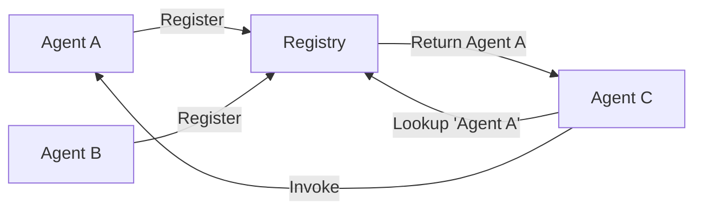

# Registry

The Registry is a central service discovery mechanism that allows agents to find and communicate with each other dynamically.

## What is the Registry?

The Registry acts as a phone book for agents:
- Agents register themselves with a unique name
- Other agents can look up registered agents
- Enables dynamic agent discovery and communication
- Manages agent lifecycle (registration/deregistration)

## How It Works



## Using the Registry

### Agent Registration

Agents register automatically when created:

```python
from src.agents import Agent

# Agents automatically register on creation
agent = Agent(
    agent_name="data_processor",
    model_config=config
)

# All agents are automatically registered with the registry
# No manual registration needed
```

### Checking Registration

```python
from src.agents.registry import AgentRegistry

# Check if agent is registered
if AgentRegistry.get("data_processor"):
    print("Agent is available")

# List all registered agents
all_agents = AgentRegistry.all()
print(f"Registered agents: {all_agents}")
```

### Agent Discovery

Agents discover each other through the registry:

```python
from src.agents.memory import Message

# Inside an agent's code
async def collaborate_with_expert(self, topic: str):
    # Look up expert agent
    expert = AgentRegistry.get("domain_expert")
    
    if not expert:
        return Message(
            role="error",
            content="Expert agent not available",
            name=self.name
        )
    
    # Invoke the expert
    return await self.invoke_agent(
        "domain_expert",
        f"Explain {topic} in detail"
    )
```

## Registry Implementation

### Thread-Safe Design

The registry uses thread-safe operations with weak references:

```python
import weakref
import threading
from typing import TYPE_CHECKING

if TYPE_CHECKING:
    from src.agents.agents import BaseAgent

class AgentRegistry:
    _agents: weakref.WeakValueDictionary[str, "BaseAgent"] = weakref.WeakValueDictionary()
    _lock = threading.Lock()
    
    @classmethod
    def register(cls, agent, name=None, prefix="BaseAgent") -> str:
        """Register an agent with automatic name generation."""
        with cls._lock:
            if name is None:
                name = f"{prefix}_{len(cls._agents)}"
            
            if name in cls._agents:
                raise ValueError(f"Agent '{name}' already registered")
            
            cls._agents[name] = agent
            return name
    
    @classmethod
    def get(cls, name: str):
        """Get a registered agent by name."""
        return cls._agents.get(name)
    
    @classmethod  
    def all(cls):
        """Get all registered agent names."""
        return list(cls._agents.keys())
```

### Lifecycle Management

Agents automatically register during initialization:

```python
class BaseAgent:
    def __init__(self, agent_name: str = None, **kwargs):
        # Automatic registration during initialization
        self.name = AgentRegistry.register(
            self, 
            name=agent_name, 
            prefix=self.__class__.__name__
        )
        # ... other initialization
    
    # Weak references in registry handle cleanup automatically
    # No manual unregistration needed
```

## Registry Patterns

### Service Discovery Pattern

Discover agents by capability:

```python
from typing import Dict, List
from src.agents.registry import AgentRegistry

class CapabilityRegistry(AgentRegistry):
    _capabilities: Dict[str, List[str]] = {}
    
    @classmethod
    def register_capability(cls, agent_name: str, capability: str):
        """Register agent capability."""
        if capability not in cls._capabilities:
            cls._capabilities[capability] = []
        cls._capabilities[capability].append(agent_name)
    
    @classmethod
    def find_by_capability(cls, capability: str) -> List[str]:
        """Find agents with specific capability."""
        return cls._capabilities.get(capability, [])

# Usage
from src.agents import Agent
agent = Agent(agent_name="translator", model_config=config)
CapabilityRegistry.register_capability("translator", "translation")

# Find all translation agents
translators = CapabilityRegistry.find_by_capability("translation")
```

### Load Balancing Pattern

Distribute work across multiple agents:

```python
from typing import Optional
from src.agents import BaseAgent

class LoadBalancedRegistry(AgentRegistry):
    _invocation_counts: Dict[str, int] = {}
    
    @classmethod
    def get_least_loaded(cls, agent_prefix: str) -> Optional[BaseAgent]:
        """Get the least loaded agent matching prefix."""
        matching_agents = [
            name for name in cls._agents 
            if name.startswith(agent_prefix)
        ]
        
        if not matching_agents:
            return None
        
        # Find agent with lowest invocation count
        least_loaded = min(
            matching_agents,
            key=lambda n: cls._invocation_counts.get(n, 0)
        )
        
        return cls._agents[least_loaded]
```

### Health Check Pattern

Monitor agent availability:

```python
class HealthCheckRegistry(AgentRegistry):
    @classmethod
    async def health_check(cls) -> Dict[str, bool]:
        """Check health of all registered agents."""
        health_status = {}
        
        for name, agent in cls._agents.items():
            try:
                # Simple ping test
                response = await agent.auto_run(
                    initial_request="ping",
                    max_steps=1
                )
                health_status[name] = response.role != "error"
            except:
                health_status[name] = False
        
        return health_status
```

## Best Practices

### 1. Unique Names

Always use unique, descriptive names:

```python
# Good
agent1 = Agent(agent_name="customer_support_specialist_1", model_config=config)
agent2 = Agent(agent_name="technical_documentation_writer", model_config=config)

# Bad
agent1 = Agent(agent_name="agent1", model_config=config)
agent2 = Agent(agent_name="helper", model_config=config)
```

### 2. Registration Checks

Always check if an agent exists before invoking:

```python
async def safe_invoke(self, agent_name: str, task: str) -> Message:
    """Safely invoke an agent with existence check."""
    if not AgentRegistry.get(agent_name):
        return Message(
            role="error",
            content=f"Agent '{agent_name}' not found",
            name=self.name
        )
    
    return await self.invoke_agent(agent_name, task)
```

### 3. Cleanup

Ensure proper cleanup:

```python
# Agents are automatically cleaned up via weak references
# No manual cleanup needed - just let the agent go out of scope

async def temporary_task():
    """Example of automatic cleanup."""
    agent = Agent(agent_name="temp_worker", model_config=config)
    response = await agent.auto_run(initial_request="...")
    return response
    # Agent automatically removed from registry when garbage collected

# Usage
result = await temporary_task()
# No manual cleanup required
```

### 4. Registry Monitoring

Monitor registry state:

```python
def log_registry_state():
    """Log current registry state."""
    agents = AgentRegistry.all()
    logger.info(f"Active agents: {len(agents)}")
    for agent_name in agents:
        logger.debug(f"  - {agent_name}")
```

## Common Issues and Solutions

### Name Conflicts

```python
try:
    agent = Agent(agent_name="processor", model_config=config)
except ValueError as e:
    # Handle duplicate name
    agent = Agent(
        agent_name=f"processor_{uuid.uuid4().hex[:8]}", 
        model_config=config
    )
```

### Missing Agents

```python
def get_or_create_agent(name: str, config: ModelConfig) -> BaseAgent:
    """Get existing agent or create new one."""
    agent = AgentRegistry.get(name)
    if not agent:
        agent = Agent(agent_name=name, model_config=config)
    return agent
```

### Registry Overflow

```python
class BoundedRegistry(AgentRegistry):
    MAX_AGENTS = 100
    
    @classmethod
    def register(cls, agent: BaseAgent) -> None:
        """Register with size limit."""
        with cls._lock:
            if len(cls._agents) >= cls.MAX_AGENTS:
                raise RuntimeError("Registry full")
            super().register(agent)
```

## Advanced Registry Features

### Registry Persistence

Save and restore registry state:

```python
class PersistentRegistry(AgentRegistry):
    @classmethod
    def save_state(cls, filepath: str):
        """Save registry state to file."""
        state = {
            name: {
                "type": type(agent).__name__,
                "config": agent.model_config.__dict__
            }
            for name, agent in cls._agents.items()
        }
        
        with open(filepath, 'w') as f:
            json.dump(state, f)
    
    @classmethod
    def load_state(cls, filepath: str):
        """Restore registry state from file."""
        with open(filepath, 'r') as f:
            state = json.load(f)
        
        # Recreate agents
        for name, info in state.items():
            # Agent recreation logic
            pass
```

### Registry Events

Implement event system for registry changes:

```python
class EventRegistry(AgentRegistry):
    _listeners: List[Callable] = []
    
    @classmethod
    def add_listener(cls, callback: Callable):
        """Add event listener."""
        cls._listeners.append(callback)
    
    @classmethod
    def register(cls, agent: BaseAgent) -> None:
        """Register with event notification."""
        super().register(agent)
        
        # Notify listeners
        for listener in cls._listeners:
            listener("register", agent.name)
```

## Next Steps

- Learn about [Agent Communication](communication.md) - How agents use the registry
- Explore [Topologies](topologies.md) - Complex registry patterns  
- See [Examples](../use-cases/) - Registry usage in practice
