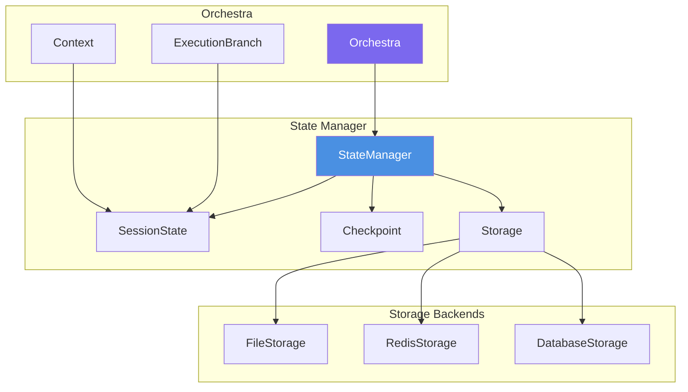

# State Management

Comprehensive state persistence, checkpointing, and session management for long-running workflows.

## 🎯 Overview

The state management system enables:
- **Pause and Resume**: Stop execution and continue later
- **Checkpointing**: Save snapshots at critical points
- **Session Recovery**: Recover from failures
- **State Persistence**: Long-term workflow storage
- **Distributed Execution**: Share state across systems

## 🏗️ Architecture



## 📦 Core Components

### StateManager

The main interface for state management:

```python
from src.coordination.state import StateManager, FileStorageBackend
from pathlib import Path

# Initialize with storage backend
storage = FileStorageBackend(Path("./state"))
state_manager = StateManager(
    storage=storage,
    auto_save_interval=30.0,  # Auto-save every 30 seconds
    compression=True,          # Compress state data
    encryption_key=None        # Optional encryption
)
```

### Storage Backends

#### FileStorageBackend

Local file system storage:

```python
from src.coordination.state import FileStorageBackend

storage = FileStorageBackend(
    base_path=Path("./state"),
    use_json=True,            # Human-readable format
    create_dirs=True,          # Auto-create directories
    file_extension=".state"   # File extension
)
```

#### RedisStorageBackend (Future)

Distributed Redis storage:

```python
from src.coordination.state import RedisStorageBackend

storage = RedisStorageBackend(
    host="localhost",
    port=6379,
    db=0,
    password=None,
    expire_time=86400,  # 24 hours
    key_prefix="marsys:"
)
```

#### DatabaseStorageBackend (Future)

SQL database storage:

```python
from src.coordination.state import DatabaseStorageBackend

storage = DatabaseStorageBackend(
    connection_string="postgresql://...",
    table_name="marsys_state",
    pool_size=10
)
```

## 🚀 Basic Usage

### Enable State Management

```python
from src.coordination import Orchestra
from src.coordination.state import StateManager, FileStorageBackend

# Create state manager
state_manager = StateManager(
    storage=FileStorageBackend("./state")
)

# Run with state management
result = await Orchestra.run(
    task="Long-running research task",
    topology=topology,
    state_manager=state_manager,
    context={"session_id": "research_2024"}
)
```

### Pause and Resume

```python
# Start execution
orchestra = OrchestraInstance(
    topology=topology,
    state_manager=state_manager
)

# Begin task
result = await orchestra.execute(
    task="Analyze large dataset",
    context={"session_id": "analysis_123"}
)

# Pause if needed (e.g., for manual review)
if result.metadata.get("needs_review"):
    await orchestra.pause_session(
        session_id="analysis_123",
        reason="Manual review required"
    )

    # Save current state
    state = await state_manager.get_session_state("analysis_123")
    await state_manager.save_session_state("analysis_123", state)

# Later: Resume execution
resumed_result = await orchestra.resume_session(
    session_id="analysis_123",
    additional_context={"review_complete": True}
)
```

## 🔄 Checkpointing

### Manual Checkpoints

Create checkpoints at critical points:

```python
# Create checkpoint before risky operation
checkpoint_id = await orchestra.create_checkpoint(
    session_id="session_123",
    checkpoint_name="before_data_processing"
)

try:
    # Risky operation
    result = await process_data()
except Exception as e:
    # Restore from checkpoint
    await orchestra.restore_checkpoint(checkpoint_id)
    # Try alternative approach
    result = await process_data_alternative()
```

### Automatic Checkpoints

Configure automatic checkpointing:

```python
from src.coordination.state import CheckpointConfig

checkpoint_config = CheckpointConfig(
    auto_checkpoint=True,
    checkpoint_interval=300,      # Every 5 minutes
    max_checkpoints=10,           # Keep last 10
    checkpoint_on_completion=True # Checkpoint on branch completion
)

state_manager = StateManager(
    storage=storage,
    checkpoint_config=checkpoint_config
)
```

### Checkpoint Management

```python
# List all checkpoints for a session
checkpoints = await state_manager.list_checkpoints("session_123")
for cp in checkpoints:
    print(f"Checkpoint: {cp.id}")
    print(f"  Name: {cp.name}")
    print(f"  Created: {cp.created_at}")
    print(f"  Size: {cp.size_bytes}")

# Get specific checkpoint
checkpoint = await state_manager.get_checkpoint("checkpoint_456")

# Delete old checkpoints
await state_manager.cleanup_checkpoints(
    session_id="session_123",
    keep_latest=5
)
```

## 📊 Session State

### SessionState Structure

```python
@dataclass
class SessionState:
    session_id: str
    status: SessionStatus
    branches: List[BranchState]
    context: Dict[str, Any]
    metadata: Dict[str, Any]
    created_at: datetime
    updated_at: datetime
    checkpoint_ids: List[str]

    # Execution metrics
    total_steps: int
    completed_steps: int
    failed_steps: int

    # Memory snapshots
    agent_memories: Dict[str, List[Message]]

    # Partial results
    intermediate_results: Dict[str, Any]
```

### BranchState Structure

```python
@dataclass
class BranchState:
    branch_id: str
    branch_type: BranchType
    status: BranchStatus
    parent_id: Optional[str]
    child_ids: List[str]

    # Execution trace
    steps: List[StepState]
    current_step_index: int

    # Branch-specific data
    memory: List[Message]
    metadata: Dict[str, Any]
    error: Optional[str]
```

## 🎯 Advanced Patterns

### Pattern 1: Long-Running Research

```python
async def long_research_workflow():
    # Configure for long-running execution
    state_manager = StateManager(
        storage=FileStorageBackend("./research_state"),
        auto_save_interval=60.0,  # Save every minute
        compression=True
    )

    # Define resumable topology
    topology = PatternConfig.pipeline(
        stages=[
            {"name": "collect", "agents": ["DataCollector"]},
            {"name": "analyze", "agents": ["Analyzer"]},
            {"name": "synthesize", "agents": ["Synthesizer"]},
            {"name": "report", "agents": ["Reporter"]}
        ]
    )

    # Run with state management
    result = await Orchestra.run(
        task="Research quantum computing applications",
        topology=topology,
        state_manager=state_manager,
        context={
            "session_id": "quantum_research_2024",
            "resumable": True
        }
    )

    return result
```

### Pattern 2: Fault-Tolerant Processing

```python
async def fault_tolerant_workflow():
    state_manager = StateManager(
        storage=FileStorageBackend("./fault_tolerant"),
        checkpoint_config=CheckpointConfig(
            auto_checkpoint=True,
            checkpoint_interval=120,      # Every 2 minutes
            checkpoint_on_error=True,     # Save on error
            max_checkpoints=20
        )
    )

    max_retries = 3
    retry_count = 0
    last_checkpoint = None

    while retry_count < max_retries:
        try:
            if last_checkpoint:
                # Restore from checkpoint
                await state_manager.restore_checkpoint(last_checkpoint)

            result = await Orchestra.run(
                task="Process critical data",
                topology=topology,
                state_manager=state_manager
            )

            return result

        except Exception as e:
            retry_count += 1
            # Get latest checkpoint
            checkpoints = await state_manager.list_checkpoints(
                session_id="critical_process"
            )
            if checkpoints:
                last_checkpoint = checkpoints[-1].id

            if retry_count >= max_retries:
                raise Exception(f"Failed after {max_retries} retries: {e}")
```

### Pattern 3: Distributed Execution

```python
# Machine A: Start execution
async def start_distributed_task():
    # Use shared storage (Redis/Database)
    storage = RedisStorageBackend(
        host="shared-redis.example.com",
        key_prefix="distributed_task:"
    )

    state_manager = StateManager(storage)

    result = await Orchestra.run(
        task="Part 1 of distributed task",
        topology=topology_part1,
        state_manager=state_manager,
        context={"session_id": "distributed_123"}
    )

    # Pause for handoff
    await state_manager.pause_execution(
        "distributed_123",
        metadata={"handoff_to": "machine_b"}
    )

# Machine B: Continue execution
async def continue_distributed_task():
    # Same shared storage
    storage = RedisStorageBackend(
        host="shared-redis.example.com",
        key_prefix="distributed_task:"
    )

    state_manager = StateManager(storage)

    # Resume from Machine A's state
    orchestra = OrchestraInstance(
        topology=topology_part2,
        state_manager=state_manager
    )

    result = await orchestra.resume_session(
        session_id="distributed_123",
        additional_context={"machine": "B"}
    )

    return result
```

### Pattern 4: Interactive Workflows

```python
async def interactive_workflow():
    state_manager = StateManager(
        storage=FileStorageBackend("./interactive")
    )

    # Start workflow
    orchestra = OrchestraInstance(
        topology=topology,
        state_manager=state_manager
    )

    # Phase 1: Initial processing
    result1 = await orchestra.execute(
        task="Prepare options for user",
        context={"session_id": "interactive_123", "phase": 1}
    )

    # Pause for user decision
    await orchestra.pause_session(
        "interactive_123",
        reason="Waiting for user selection"
    )

    # Show options to user
    print("Options:", result1.final_response)
    user_choice = input("Select option: ")

    # Phase 2: Continue with user input
    result2 = await orchestra.resume_session(
        session_id="interactive_123",
        additional_context={
            "phase": 2,
            "user_choice": user_choice
        }
    )

    return result2
```

## 🔧 Configuration Options

### StateManager Configuration

```python
from src.coordination.state import StateManagerConfig

config = StateManagerConfig(
    # Auto-save settings
    auto_save_enabled=True,
    auto_save_interval=30.0,      # Seconds
    auto_save_on_step=True,        # Save after each step

    # Compression and encryption
    compression_enabled=True,
    compression_level=6,           # 1-9
    encryption_enabled=False,
    encryption_key=None,

    # Cleanup settings
    auto_cleanup_enabled=True,
    max_session_age_days=30,
    max_checkpoint_age_days=7,
    max_storage_size_mb=10240,     # 10GB

    # Performance
    batch_save_enabled=True,       # Batch multiple saves
    batch_save_size=10,
    cache_enabled=True,            # Memory cache
    cache_size_mb=100
)

state_manager = StateManager(
    storage=storage,
    config=config
)
```

## 📊 Monitoring State

### State Metrics

```python
# Get session metrics
metrics = await state_manager.get_session_metrics("session_123")
print(f"Session: {metrics.session_id}")
print(f"Status: {metrics.status}")
print(f"Duration: {metrics.duration_seconds}s")
print(f"Steps completed: {metrics.steps_completed}")
print(f"Storage used: {metrics.storage_bytes / 1024 / 1024:.2f}MB")
print(f"Checkpoints: {metrics.checkpoint_count}")

# Get storage metrics
storage_metrics = await state_manager.get_storage_metrics()
print(f"Total sessions: {storage_metrics.total_sessions}")
print(f"Active sessions: {storage_metrics.active_sessions}")
print(f"Total storage: {storage_metrics.total_bytes / 1024 / 1024:.2f}MB")
```

### State Visualization

```python
# Export state for visualization
state = await state_manager.get_session_state("session_123")
visualization_data = state.to_visualization_format()

# Save as JSON for external tools
import json
with open("state_viz.json", "w") as f:
    json.dump(visualization_data, f, indent=2)
```

## 🎯 Best Practices

### 1. **Choose Appropriate Storage**
- **FileStorage**: Development, single-machine
- **RedisStorage**: Distributed, temporary state
- **DatabaseStorage**: Production, long-term persistence

### 2. **Configure Checkpointing**
- Checkpoint before expensive operations
- Limit checkpoint count to manage storage
- Use meaningful checkpoint names

### 3. **Handle State Size**
- Enable compression for large states
- Clean up old sessions regularly
- Monitor storage usage

### 4. **Security Considerations**
- Encrypt sensitive state data
- Use secure storage backends
- Implement access controls

### 5. **Performance Optimization**
- Batch save operations
- Use caching for frequently accessed state
- Async save operations

## 🚦 Next Steps

Master state management patterns:

<div class="grid cards" markdown="1">

- :material-pause-circle:{ .lg .middle } **[Pause/Resume Patterns](../use-cases/#pausable-workflows)**

    ---

    Learn pausable workflow patterns

- :material-backup-restore:{ .lg .middle } **[Checkpoint Strategies](../use-cases/#checkpoint-workflows)**

    ---

    Master checkpointing techniques

- :material-server-network:{ .lg .middle } **[Distributed Execution](../advanced/#distributed-execution)**

    ---

    Build distributed workflows

- :material-api:{ .lg .middle } **[State API Reference](../api/#state-management)**

    ---

    Complete API documentation

</div>

---

!!! success "State Management Ready!"
    You now understand state management in MARSYS. Use it to build resilient, long-running workflows with confidence.