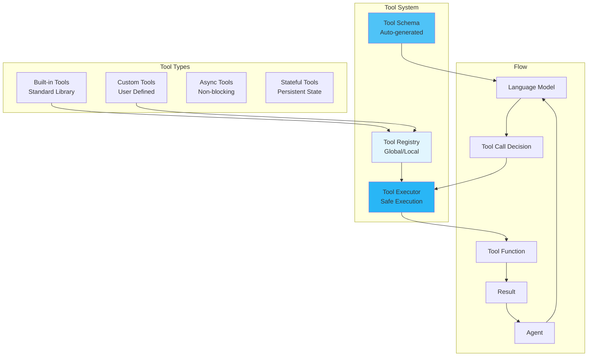

# Tools

Tools extend agent capabilities by providing access to external functions, APIs, and services, enabling agents to interact with the real world.

!!! info "See Also"
    For tool schema structure and API details, see [Tools API Reference](../api/tools.md). For built-in tools list, see [Built-in Tools Guide](../guides/built-in-tools.md).


## 🎯 Overview

Tools in MARSYS are Python functions that agents can invoke to:

- **Access External Services**: Web search, APIs, databases
- **Perform Calculations**: Mathematical operations, data analysis
- **Control Systems**: Browser automation, file operations
- **Process Data**: Text extraction, format conversion
- **Interact with Environment**: System commands, hardware control

The framework uses **OpenAI-compatible function calling** for seamless tool integration.

## 🏗️ Architecture



## 📦 Creating Tools

### Basic Tool Definition

Every tool needs:
1. **Type hints** on all parameters
2. **Comprehensive docstring** with Args and Returns
3. **Return type** annotation
4. **Descriptive** parameter names

```python
def search_database(
    query: str,
    database: str = "products",
    limit: int = 10,
    filters: Optional[Dict[str, Any]] = None
) -> List[Dict[str, Any]]:
    """
    Search database for matching records.

    Args:
        query: Search query string
        database: Database to search (products, users, orders)
        limit: Maximum number of results to return
        filters: Additional filters as key-value pairs

    Returns:
        List of matching records with all fields

    Raises:
        ConnectionError: If database is unavailable
        ValueError: If query is invalid
    """
    # Implementation
    results = perform_search(query, database, limit, filters)
    return results
```

### Automatic Schema Generation

The framework automatically generates OpenAI-compatible schemas:

```python
from marsys.environment.utils import generate_openai_tool_schema

# Automatic schema generation from function
schema = generate_openai_tool_schema(search_database)

# Generated schema:
{
    "type": "function",
    "function": {
        "name": "search_database",
        "description": "Search database for matching records.",
        "parameters": {
            "type": "object",
            "properties": {
                "query": {
                    "type": "string",
                    "description": "Search query string"
                },
                "database": {
                    "type": "string",
                    "description": "Database to search (products, users, orders)",
                    "default": "products"
                },
                "limit": {
                    "type": "integer",
                    "description": "Maximum number of results to return",
                    "default": 10
                },
                "filters": {
                    "type": "object",
                    "description": "Additional filters as key-value pairs"
                }
            },
            "required": ["query"]
        }
    }
}
```

## 🔧 Tool Registration

### Agent-Specific Tools

```python
from marsys.agents import Agent
from marsys.models import ModelConfig

agent = Agent(
    model_config=ModelConfig(
        type="api",
        name="anthropic/claude-haiku-4.5",
        provider="openrouter",
        max_tokens=12000
    ),
    name="DataAnalyst",
    goal="Expert data analyst with database access",
    instruction="You are a data analyst. Use your tools to search databases, analyze data, and export results.",
    tools={  # Dict mapping names to functions
        "db_search": search_database,
        "analyze": analyze_data,
        "export": export_results
    }
)
```

### Global Tool Registry

```python
from marsys.environment.tools import AVAILABLE_TOOLS

# Register globally
AVAILABLE_TOOLS["search_database"] = search_database
AVAILABLE_TOOLS["analyze_data"] = analyze_data

# Discover tools by category
WEB_TOOLS = {
    "search_web": search_web_func,
    "fetch_url": fetch_url_func,
    "scrape_page": scrape_page_func
}

DATA_TOOLS = {
    "analyze_csv": analyze_csv_func,
    "process_json": process_json_func,
    "transform_data": transform_data_func
}

# Combine categories
AVAILABLE_TOOLS.update(WEB_TOOLS)
AVAILABLE_TOOLS.update(DATA_TOOLS)
```

## 🎯 Tool Patterns

### Async Tools

For non-blocking operations:

```python
import aiohttp
import asyncio

async def fetch_api_data(
    endpoint: str,
    params: Optional[Dict[str, str]] = None,
    timeout: int = 30
) -> Dict[str, Any]:
    """
    Fetch data from API endpoint asynchronously.

    Args:
        endpoint: API endpoint URL
        params: Query parameters
        timeout: Request timeout in seconds

    Returns:
        API response data
    """
    try:
        async with aiohttp.ClientSession() as session:
            async with session.get(
                endpoint,
                params=params,
                timeout=aiohttp.ClientTimeout(total=timeout)
            ) as response:
                data = await response.json()
                return {
                    "status": response.status,
                    "data": data,
                    "headers": dict(response.headers)
                }
    except asyncio.TimeoutError:
        return {"error": "Request timed out", "timeout": timeout}
    except Exception as e:
        return {"error": str(e)}
```

### Stateful Tools

Tools that maintain state across calls:

```python
class DatabaseConnection:
    def __init__(self, connection_string: str):
        self.connection = self._connect(connection_string)
        self.query_cache = {}

    async def query(
        self,
        sql: str,
        params: Optional[tuple] = None,
        use_cache: bool = False
    ) -> List[Dict]:
        """
        Execute SQL query with optional caching.

        Args:
            sql: SQL query string
            params: Query parameters for prepared statement
            use_cache: Whether to use cached results

        Returns:
            Query results as list of dictionaries
        """
        cache_key = f"{sql}:{params}"

        if use_cache and cache_key in self.query_cache:
            return self.query_cache[cache_key]

        try:
            cursor = await self.connection.execute(sql, params or ())
            results = await cursor.fetchall()

            if use_cache:
                self.query_cache[cache_key] = results

            return results
        except Exception as e:
            return [{"error": str(e)}]

# Create instance and extract tool
db = DatabaseConnection("postgresql://...")
query_tool = db.query  # This method becomes the tool
```

### Composite Tools

Tools that combine multiple operations:

```python
async def research_topic(
    topic: str,
    depth: Literal["shallow", "medium", "deep"] = "medium",
    include_sources: bool = True
) -> Dict[str, Any]:
    """
    Comprehensive research on a topic from multiple sources.

    Args:
        topic: Topic to research
        depth: Research depth level
        include_sources: Whether to include source URLs

    Returns:
        Research summary with sources and key points
    """
    # Determine number of sources based on depth
    source_count = {"shallow": 3, "medium": 5, "deep": 10}[depth]

    # Phase 1: Web search
    search_results = await search_web(topic, max_results=source_count)

    # Phase 2: Fetch and analyze content
    contents = []
    for result in search_results:
        content = await fetch_url_content(result["url"])
        contents.append({
            "url": result["url"],
            "title": result["title"],
            "content": content
        })

    # Phase 3: Synthesize information
    key_points = extract_key_points(contents)
    summary = create_summary(key_points)

    response = {
        "topic": topic,
        "summary": summary,
        "key_points": key_points,
        "source_count": len(contents)
    }

    if include_sources:
        response["sources"] = [
            {"title": c["title"], "url": c["url"]}
            for c in contents
        ]

    return response
```

### Error-Handling Tools

Robust tools with proper error handling:

```python
from functools import wraps
from typing import Callable

def safe_tool(func: Callable) -> Callable:
    """Decorator for safe tool execution."""

    @wraps(func)
    async def async_wrapper(*args, **kwargs):
        try:
            result = await func(*args, **kwargs)
            return {"success": True, "result": result}
        except ValueError as e:
            return {"success": False, "error": f"Invalid input: {e}"}
        except TimeoutError as e:
            return {"success": False, "error": f"Operation timed out: {e}"}
        except Exception as e:
            return {"success": False, "error": f"Unexpected error: {e}"}

    @wraps(func)
    def sync_wrapper(*args, **kwargs):
        try:
            result = func(*args, **kwargs)
            return {"success": True, "result": result}
        except Exception as e:
            return {"success": False, "error": str(e)}

    if asyncio.iscoroutinefunction(func):
        return async_wrapper
    else:
        return sync_wrapper

# Usage
@safe_tool
async def risky_operation(param: str) -> str:
    """Operation that might fail."""
    if not param:
        raise ValueError("Parameter cannot be empty")
    # Risky operation here
    return f"Processed: {param}"
```

## 🚀 Built-in Tools

MARSYS includes a comprehensive tool library:

### Web Tools

```python
async def search_web(
    query: str,
    max_results: int = 5,
    search_engine: Literal["google", "bing", "duckduckgo"] = "google"
) -> List[Dict[str, str]]:
    """Search the web for information."""
    # Returns: [{"title": "...", "url": "...", "snippet": "..."}]

async def fetch_url_content(
    url: str,
    format: Literal["text", "markdown", "html"] = "text"
) -> str:
    """Fetch and extract content from URL."""
    # Returns formatted content

async def check_website_status(url: str) -> Dict[str, Any]:
    """Check if website is accessible."""
    # Returns: {"online": bool, "status_code": int, "response_time": float}
```

### Data Processing Tools

```python
def analyze_data(
    data: List[float],
    operations: List[Literal["mean", "median", "std", "min", "max"]]
) -> Dict[str, float]:
    """Perform statistical analysis on data."""
    # Returns: {"mean": 5.2, "std": 1.3, ...}

def transform_json(
    json_data: Dict,
    jq_filter: str
) -> Any:
    """Transform JSON using JQ-like syntax."""
    # Returns transformed data

def parse_csv(
    csv_text: str,
    delimiter: str = ",",
    has_headers: bool = True
) -> List[Dict[str, str]]:
    """Parse CSV text into records."""
    # Returns list of dictionaries
```

### File System Tools

```python
async def read_file(
    path: str,
    encoding: str = "utf-8",
    lines: Optional[Tuple[int, int]] = None
) -> str:
    """Read file contents."""
    # Returns file content

async def write_file(
    path: str,
    content: str,
    mode: Literal["write", "append"] = "write"
) -> Dict[str, Any]:
    """Write content to file."""
    # Returns: {"success": bool, "bytes_written": int}

async def list_directory(
    path: str = ".",
    pattern: Optional[str] = None
) -> List[Dict[str, Any]]:
    """List directory contents."""
    # Returns: [{"name": "...", "type": "file|dir", "size": int}]
```

### PDF Tools with Image Extraction

MARSYS supports extracting embedded images from PDFs using PyMuPDF, returning content as **ordered chunks** that preserve reading order.

#### Basic PDF Reading

```python
# Text-only extraction (default)
async def read_pdf_text(path: str) -> ToolResponse:
    from marsys.environment.file_operations import read_file_wrapper

    result = await read_file_wrapper(
        path="document.pdf",
        start_page=1,
        end_page=5
    )
    return result

# Returns: ToolResponse with text content only
```

#### PDF with Image Extraction

```python
# Extract text + images in reading order
async def read_pdf_with_images(path: str) -> ToolResponse:
    from marsys.environment.file_operations import read_file_wrapper

    result = await read_file_wrapper(
        path="paper.pdf",
        start_page=5,
        end_page=10,
        extract_images=True,  # Enable image extraction
        max_images_per_page=10,
        max_pixels=None  # Optional: downsample large images
    )
    return result

# Returns: ToolResponse with ordered text/image content blocks
```

#### What Gets Extracted

When `extract_images=True`:
- **Text blocks**: Paragraphs, headings, captions
- **Embedded images**: Figures, photos, diagrams, charts
- **Reading order**: Content sorted by Y-position (top-to-bottom) then X-position
- **Metadata**: Page numbers, bounding boxes, token estimates

**What does NOT get extracted**:
- Background images or watermarks (usually)
- Text rendered as images (use OCR separately)
- Vector graphics (converted to raster if possible)

#### Ordered Chunks Format

The framework creates `FileContent` with:

```python
FileContent(
    content="Text with placeholders:\n\nChapter 1...\n\n[IMAGE 1: 800x600, ~170 tokens, page 5]\n\n...",
    images=[ImageData(...), ImageData(...), ...],  # Ordered list
    metadata={
        'ordered_chunks': [
            {"type": "text", "text": "Chapter 1...", "page": 5, "block_num": 0},
            {"type": "image", "image_index": 0, "page": 5, "block_num": 1,
             "dimensions": "800x600", "tokens": 170},
            {"type": "text", "text": "Figure 1 shows...", "page": 5, "block_num": 2},
            ...
        ],
        'total_pages': 20,
        'pages_read': "5-10",
        'images_extracted': 3,
        'total_image_tokens': 510
    }
)
```

#### Conversion to ToolResponse

`FileContent.to_tool_response()` automatically converts ordered chunks to multimodal format:

```python
ToolResponse(
    content=[
        ToolResponseContent(type="text", text="Chapter 1: Introduction\n..."),
        ToolResponseContent(type="image", image_data="data:image/png;base64,iVBORw..."),
        ToolResponseContent(type="text", text="Figure 1: Architecture diagram\n..."),
        ToolResponseContent(type="image", image_data="data:image/jpeg;base64,/9j..."),
        ToolResponseContent(type="text", text="The system consists of...\n..."),
    ],
    metadata={
        "path": "paper.pdf",
        "partial": True,
        "total_pages": 20,
        "pages_shown": "5-10",
        "has_images": True,
        "image_count": 2,
        "total_image_tokens": 340
    }
)
```

#### Token Cost Comparison

| Extraction Method | Text Tokens | Vision Tokens | Cost (GPT-4o) |
|-------------------|-------------|---------------|---------------|
| **Text-only** | ~5,000 | 0 | $0.05 |
| **Images as base64 strings** | ~255,000 | 0 | **$2.55** ❌ |
| **Images with ToolResponse** | ~5,000 | ~425 | **$0.055** ✅ |

**Savings**: ~46x cheaper when using proper image extraction vs treating images as text!

#### Agent Tool Schema

When you register `read_file_wrapper` as an agent tool, include `extract_images` parameter:

```python
from marsys.environment.file_operations import FileOperationsManager
from marsys.agents import Agent

# Create file operations manager
file_ops = FileOperationsManager()

# Get tool wrappers (automatically includes extract_images parameter)
tools = file_ops.get_tool_wrappers()

agent = Agent(
    model_config=gpt4_vision_config,
    name="DocumentAnalyzer",
    tools=[tools['read_file']]  # Auto-generates schema with extract_images param
)

# Agent can now call:
{
    "tool": "read_file",
    "arguments": {
        "path": "report.pdf",
        "start_page": 10,
        "end_page": 15,
        "extract_images": true
    }
}
```

#### Requirements

**Dependencies**:
```bash
# Install with file operations support
pip install marsys[file-ops]

# Or manually
pip install PyMuPDF>=1.23.0
```

**Graceful Degradation**:
- If PyMuPDF not installed: PDF support will be disabled
- Warning logged: "PyMuPDF not installed. PDF support will be disabled."

#### Best Practices

✅ **DO**:
```python
# Use extract_images for documents with figures/diagrams
result = await read_file_wrapper("paper.pdf", extract_images=True)

# Set max_images_per_page to avoid overwhelming the model
result = await read_file_wrapper("paper.pdf", extract_images=True, max_images_per_page=5)

# Use vision-capable models (GPT-4V, Claude 3, Gemini Pro Vision)
agent = Agent(model_config=gpt4_vision_config, tools=[read_file_wrapper])
```

❌ **DON'T**:
```python
# Don't extract images with non-vision models
agent = Agent(model_config=gpt3_5_config, ...)  # No vision support!
result = await read_file_wrapper("paper.pdf", extract_images=True)  # Wasted extraction

# Don't extract too many pages at once (token limits)
result = await read_file_wrapper("book.pdf", end_page=500, extract_images=True)  # Too much!
```

#### Example: Research Paper Analysis

```python
from marsys.agents import Agent
from marsys.environment.file_operations import FileOperationsManager

# Create file operations manager
file_ops = FileOperationsManager()
tools = file_ops.get_tool_wrappers()

# Create vision-capable agent
analyst = Agent(
    model_config=gpt4_vision_config,
    name="PaperAnalyst",
    instruction="Analyze research papers including figures and tables.",
    tools=[tools['read_file']]
)

# Agent prompt
task = """
Read pages 5-10 of 'quantum_computing.pdf' with images.
Summarize the key findings and describe Figure 3.
"""

# Agent calls tool:
response = await analyst.run(task)

# Behind the scenes:
# 1. Tool call: read_file(path="quantum_computing.pdf", start_page=5, end_page=10, extract_images=True)
# 2. Framework extracts 6 pages with 4 embedded images
# 3. Returns ToolResponse with ordered text + image blocks
# 4. LLM receives multimodal message with properly typed images
# 5. LLM can "see" Figure 3 and describe it accurately
```

## 📋 Best Practices

### 1. **Clear Documentation**

```python
# ✅ GOOD - Comprehensive documentation
def process_invoice(
    invoice_data: Dict[str, Any],
    validation_level: Literal["basic", "strict"] = "basic",
    currency: str = "USD"
) -> Dict[str, Any]:
    """
    Process and validate invoice data.

    Args:
        invoice_data: Invoice information containing:
            - invoice_number (str): Unique invoice identifier
            - amount (float): Total amount
            - items (list): Line items
        validation_level: How strictly to validate
        currency: Currency code for amount conversion

    Returns:
        Processed invoice with:
            - status: "valid" or "invalid"
            - processed_amount: Converted amount
            - warnings: List of validation warnings

    Raises:
        ValueError: If invoice_data is malformed
        KeyError: If required fields are missing
    """
    # Implementation
    pass

# ❌ BAD - Poor documentation
def process(data, level="basic"):
    """Process data."""
    pass
```

### 2. **Input Validation**

```python
# ✅ GOOD - Validates inputs
def send_email(
    to: str,
    subject: str,
    body: str,
    cc: Optional[List[str]] = None
) -> Dict[str, Any]:
    """Send email with validation."""
    # Validate email format
    email_pattern = r'^[\w\.-]+@[\w\.-]+\.\w+$'
    if not re.match(email_pattern, to):
        raise ValueError(f"Invalid email address: {to}")

    # Validate CC addresses
    if cc:
        for addr in cc:
            if not re.match(email_pattern, addr):
                raise ValueError(f"Invalid CC address: {addr}")

    # Validate content
    if not subject.strip():
        raise ValueError("Subject cannot be empty")

    if len(body) > 100000:
        raise ValueError("Body too large (max 100KB)")

    # Send email
    return {"sent": True, "message_id": "..."}
```

### 3. **Consistent Returns**

```python
# ✅ GOOD - Always returns same structure
def database_query(sql: str) -> Dict[str, Any]:
    """Query database with consistent response."""
    try:
        results = execute_query(sql)
        return {
            "success": True,
            "data": results,
            "row_count": len(results),
            "error": None
        }
    except Exception as e:
        return {
            "success": False,
            "data": [],
            "row_count": 0,
            "error": str(e)
        }

# ❌ BAD - Inconsistent returns
def bad_query(sql: str):
    try:
        return execute_query(sql)  # Returns list
    except Exception as e:
        return str(e)  # Returns string
```

### 4. **Resource Management**

```python
# ✅ GOOD - Proper resource cleanup
async def process_large_file(
    file_path: str,
    chunk_size: int = 8192
) -> Dict[str, Any]:
    """Process large file with proper resource management."""
    file_handle = None
    try:
        file_handle = await aiofiles.open(file_path, 'r')
        total_lines = 0

        async for chunk in file_handle:
            # Process chunk
            total_lines += chunk.count('\n')

        return {"lines": total_lines, "status": "completed"}

    except Exception as e:
        return {"error": str(e), "status": "failed"}

    finally:
        if file_handle:
            await file_handle.close()
```

## 🎯 Advanced Patterns

### Complex Tool Returns with ToolResponse

!!! warning "Important: Understanding Tool Return Types"
    **What happens when you DON'T use ToolResponse:**

    - **Dictionaries** → Converted to JSON strings
      The LLM sees: `'{"key": "value"}'` instead of structured data

    - **Images (paths/URLs)** → Converted to strings
      The LLM sees: `'data:image/png;base64,iVBOR...'` as TEXT (not as an image!)
      **This wastes thousands of tokens** treating image data as text

    - **Lists** → Converted to string representations
      The LLM sees: `'[1, 2, 3]'` instead of structured data

    **Solution:** Use `ToolResponse` for complex returns!

#### When to Use ToolResponse

Use `ToolResponse` when your tool needs to return:

✅ **Structured data** (dicts, lists) that shouldn't be stringified
✅ **Images** that the LLM should actually SEE (not read as text)
✅ **Multimodal content** (text + images together)
✅ **Metadata** separate from main content

### Ordered Content Blocks (Multimodal Responses)

For multimodal responses that mix text and images in a specific sequence, use `List[ToolResponseContent]` as the content format.

#### ToolResponseContent Structure

```python
from marsys.environment import ToolResponseContent

# Text content
text_block = ToolResponseContent(
    type="text",
    text="Chapter 1: Introduction"
)

# Image from base64 data
image_block = ToolResponseContent(
    type="image",
    image_data="data:image/png;base64,iVBORw..."
)

# Image from file path (auto-converted to base64)
image_from_file = ToolResponseContent(
    type="image",
    image_path="/tmp/diagram.png"
)
```

#### Validation Rules

`ToolResponseContent` enforces strict validation:

- **Text blocks** (`type="text"`):
  - ✅ MUST have `text` field (str or dict)
  - ❌ CANNOT have `image_path` or `image_data`

- **Image blocks** (`type="image"`):
  - ✅ MUST have EITHER `image_path` OR `image_data` (not both)
  - ❌ CANNOT have `text` field
  - If `image_path` provided: automatically converted to base64 on `.to_dict()`

#### Creating Ordered Responses

```python
from marsys.environment import ToolResponse, ToolResponseContent

def analyze_document(path: str) -> ToolResponse:
    """Analyze document with text + image sections."""

    content_blocks = [
        ToolResponseContent(type="text", text="Section 1: Overview"),
        ToolResponseContent(type="text", text="The architecture consists of..."),
        ToolResponseContent(type="image", image_path="/tmp/architecture.png"),
        ToolResponseContent(type="text", text="Figure 1: System architecture"),
        ToolResponseContent(type="text", text="Section 2: Implementation"),
        # ... more blocks
    ]

    return ToolResponse(
        content=content_blocks,
        metadata={
            "sections": 2,
            "images": 1,
            "analysis_complete": True
        }
    )
```

#### How It Works

When you return `ToolResponse` with `List[ToolResponseContent]`:

1. Framework calls `.to_content_array()` on ToolResponse
2. Each `ToolResponseContent` converts to typed message format:
   - Text → `{"type": "text", "text": "..."}`
   - Image → `{"type": "image_url", "image_url": {"url": "data:..."}}`
3. LLM receives multimodal message with properly typed content
4. Images processed as VISION tokens (not text!)

#### Token Efficiency

| Content Type | Without ToolResponseContent | With ToolResponseContent |
|--------------|----------------------------|--------------------------|
| Small dict | ~25 tokens (stringified) | ~25 tokens (structured) |
| Image (50KB) | ~75,000 text tokens ❌ | ~85 vision tokens ✅ |
| PDF 5 pages | ~250,000 text tokens ❌ | ~425 vision tokens ✅ |

**Savings**: Up to **750x cheaper** for images!

#### Basic Usage

```python
from marsys.environment import ToolResponse

def analyze_document(file_path: str) -> ToolResponse:
    """
    Analyze a document and return structured results with images.

    Returns:
        ToolResponse with analysis data and document images
    """
    # Process the document
    analysis = {
        "word_count": 1523,
        "topics": ["AI", "Machine Learning", "Neural Networks"],
        "sentiment": "positive",
        "key_findings": [...]
    }

    # Extract images (as base64 data URLs)
    images = extract_images_as_base64(file_path)

    return ToolResponse(
        content=analysis,  # Dict stays as dict (NOT stringified!)
        metadata="Successfully analyzed 5-page technical document",
        images=images  # LLM will SEE these images
    )
```

#### How ToolResponse Works

The framework automatically uses the appropriate message pattern based on your `ToolResponse`:

**Two-Message Pattern** (used when):
- You provide `metadata` (usage guidance/context), OR
- Your `content` contains images (list of `ToolResponseContent`)

Messages created:
1. **Tool Message** (`role="tool"`):
   - Contains the `metadata` string you provided (if any)
   - If no metadata but has images: "Tool execution completed successfully. Content in next message."
   - This is where you put explanations, warnings, usage guidance
   - Example: "⚠️ PARTIAL CONTENT - Showing pages 1-5 of 20 total.\n📊 To read more: read_file(path, start_page=6, end_page=10)"

2. **User Message** (`role="user"`):
   - Contains the actual `content`
   - Can be text, dict, or list of `ToolResponseContent` blocks
   - For multimodal: Images appear as proper vision input (not text!)

**Single-Message Pattern** (used when):
- No `metadata` provided AND
- No images in `content` (simple text or dict)

Messages created:
1. **Tool Message** (`role="tool"`):
   - Contains the actual `content` directly

**Why two patterns?**
- Images must be in "user" messages for proper VLM handling
- OpenAI API requires `role="tool"` messages to contain string content only
- The two-message pattern lets you provide both context (metadata) and structured/multimodal content
- Keeps tool-specific logic in your tool, not in the framework

**Important for Tool Developers:**
- Build your metadata string in your tool (don't expect the framework to build it)
- If returning images, they will automatically use two-message pattern even without metadata
- step_executor is generic - it just passes your metadata string through
- See file operations tools for examples of building helpful metadata strings

#### ToolResponse Parameters

```python
@dataclass
class ToolResponse:
    content: Union[str, Dict, List[ToolResponseContent], Any]  # Your actual result
    metadata: Optional[str] = None  # Explanation string for agents
```

**Parameters:**

- **`content`** (required): The actual tool result
  - Can be: string, dict, list of `ToolResponseContent` blocks, or any type
  - **NOT stringified** - LLM sees the structure
  - For multimodal (text + images): Use `List[ToolResponseContent]`

- **`metadata`** (optional): Explanation/guidance string for agents
  - **Must be a STRING** - built by your tool, not by the framework
  - Used in first message (role="tool") to provide context/guidance
  - Should include: status, warnings, usage instructions, constraints
  - If None: Simple success message used ("Tool execution completed successfully.")

**Important**: `metadata` should be a **string** that your tool builds. The framework (step_executor) is generic and does not contain tool-specific logic. Build your explanation/guidance in the tool itself.

#### Examples

##### Example 1: Dictionary Return

```python
# ❌ WITHOUT ToolResponse
def get_weather(city: str) -> Dict:
    return {"temp": 72, "condition": "sunny", "humidity": 45}

# LLM receives: '{"temp": 72, "condition": "sunny", "humidity": 45}'
# Problem: It's a STRING, not structured data!

# ✅ WITH ToolResponse
def get_weather(city: str) -> ToolResponse:
    data = {"temp": 72, "condition": "sunny", "humidity": 45}
    return ToolResponse(
        content=data,
        metadata=f"Weather data for {city}"
    )

# LLM receives:
#   1. "Tool execution completed. Metadata: Weather data for Boston"
#   2. {"temp": 72, "condition": "sunny", "humidity": 45}  ← STRUCTURED!
```

##### Example 2: Images (Critical!)

```python
# ❌ WITHOUT ToolResponse
def capture_screenshot() -> str:
    img_base64 = "data:image/png;base64,iVBORw0KGgoAAAANS..."  # 50KB
    return img_base64

# LLM receives: "data:image/png;base64,iVBORw0KGgoAAAANS..." as TEXT
# Problem:
#   - LLM processes ~75,000 characters as TEXT tokens
#   - Costs ~$0.75 for a single image (at $0.01/1K tokens)
#   - LLM can't actually SEE the image!

# ✅ WITH ToolResponse
def capture_screenshot() -> ToolResponse:
    img_base64 = "data:image/png;base64,iVBORw0KGgoAAAANS..."
    return ToolResponse(
        content="Screenshot captured successfully",
        metadata="Screen capture at 1920x1080",
        images=[img_base64]
    )

# LLM receives: Screenshot as VISION INPUT (proper image tokens)
# Benefits:
#   - Uses vision tokens (~85 tokens for 1920x1080 image)
#   - Costs ~$0.001 vs $0.75 (750x cheaper!)
#   - LLM can actually SEE and analyze the image
```

##### Example 3: PDF with Text + Images

```python
from marsys.environment import ToolResponse
import base64

def read_pdf(file_path: str) -> ToolResponse:
    """Read PDF and return text + page images."""

    # Extract text
    extracted_text = extract_pdf_text(file_path)

    # Extract pages as images
    page_images = []
    for page in extract_pdf_pages(file_path):
        # Convert to base64 data URL
        img_bytes = page.to_bytes()
        img_base64 = base64.b64encode(img_bytes).decode('ascii')
        data_url = f"data:image/png;base64,{img_base64}"
        page_images.append(data_url)

    return ToolResponse(
        content={
            "text": extracted_text,
            "pages": len(page_images),
            "file_size": os.path.getsize(file_path)
        },
        metadata={
            "path": file_path,
            "total_pages": len(page_images),
            "partial": False
        },
        images=page_images
    )
```

##### Example 4: Using FileContent.to_tool_response()

The built-in `FileContent` class has a helper method:

```python
from marsys.environment.file_operations import read_file

def smart_read_file(path: str) -> ToolResponse:
    """Read any file and return as ToolResponse."""

    # read_file returns FileContent with text, images, metadata
    file_content = read_file(path)

    # Automatically converts to ToolResponse
    return file_content.to_tool_response()

# For PDFs, this automatically includes:
#   - content: {text, pages, encoding, etc.}
#   - metadata: {path, total_pages, pages_shown}
#   - images: [base64 page images]
```

#### Migration Guide

##### From Legacy Dict Format

```python
# OLD (Legacy format - still works but deprecated)
def old_tool(path: str) -> Dict:
    return {
        "result": "Some text",
        "images": ["path/to/image.png"],  # File paths
        "metadata": {"key": "value"}
    }

# NEW (Recommended)
def new_tool(path: str) -> ToolResponse:
    # Convert image to base64
    with open("path/to/image.png", "rb") as f:
        img_bytes = f.read()
    img_base64 = base64.b64encode(img_bytes).decode('ascii')
    img_url = f"data:image/png;base64,{img_base64}"

    return ToolResponse(
        content="Some text",
        metadata={"key": "value"},
        images=[img_url]  # Base64 data URLs
    )
```

##### Simple String Returns (Still Work!)

```python
# Simple string returns don't need ToolResponse
def simple_tool(query: str) -> str:
    return "Here is the answer"  # ✅ Works fine!

# Only use ToolResponse for complex returns
```

#### Best Practices

**✅ DO:**

```python
# Use ToolResponse for structured data
def analyze_data(data: List) -> ToolResponse:
    result = {"mean": 5.2, "std": 1.3, "count": 100}
    return ToolResponse(content=result, metadata="Analysis complete")

# Use ToolResponse for images
def take_photo() -> ToolResponse:
    img = capture_image_as_base64()
    return ToolResponse(
        content="Photo captured",
        images=[img]
    )

# Provide helpful metadata
def complex_operation() -> ToolResponse:
    return ToolResponse(
        content={...},
        metadata={
            "status": "success",
            "execution_time": 2.5,
            "items_processed": 150
        }
    )
```

**❌ DON'T:**

```python
# Don't return image URLs as strings
def bad_screenshot() -> str:
    return "data:image/png;base64,..."  # ❌ Wastes tokens!

# Don't return dicts without ToolResponse
def bad_analysis() -> Dict:
    return {"key": "value"}  # ❌ Gets stringified!

# Don't use file paths in images (use base64)
def bad_images() -> ToolResponse:
    return ToolResponse(
        content="...",
        images=["./local/path.png"]  # ❌ Won't work!
    )
```

#### Token Cost Comparison

| Return Type | Without ToolResponse | With ToolResponse | Savings |
|-------------|---------------------|-------------------|---------|
| **Small dict** (100 chars) | ~25 tokens | ~25 tokens | None |
| **Large dict** (5KB) | ~1,250 tokens | ~1,250 tokens | None |
| **Single image** (50KB base64) | ~75,000 text tokens<br/>**$0.75** | ~85 vision tokens<br/>**$0.001** | **750x cheaper** |
| **PDF with 5 pages** | ~250,000 text tokens<br/>**$2.50** | ~425 vision tokens<br/>**$0.005** | **500x cheaper** |

!!! danger "Critical: Image Token Cost"
    Returning base64 images WITHOUT ToolResponse can cost **hundreds of times more** in API usage. Always use ToolResponse for images!

#### Technical Details

**What happens internally:**

1. Your tool returns `ToolResponse(content=data, metadata=meta, images=[img])`
2. Framework creates TWO messages:
   ```python
   # Message 1 (role="tool")
   {
     "role": "tool",
     "content": "Tool execution completed. Metadata: {meta}",
     "tool_call_id": "...",
     "name": "your_tool"
   }

   # Message 2 (role="user")
   {
     "role": "user",
     "content": [
       {"type": "text", "text": "{data}"},  # Your content
       {"type": "image_url", "image_url": {"url": "{img}"}}  # Vision input
     ]
   }
   ```
3. LLM receives confirmation + structured data + images as vision input

**Provider compatibility:**
- ✅ OpenAI (GPT-4V, GPT-4o)
- ✅ Anthropic (Claude 3 Sonnet, Opus)
- ✅ Google (Gemini Pro Vision)
- ✅ OpenRouter (all vision models)

### Rate-Limited Tools

```python
from asyncio import Semaphore
from collections import defaultdict
import time

class RateLimiter:
    def __init__(self, calls: int, period: float):
        self.calls = calls
        self.period = period
        self.semaphore = Semaphore(calls)
        self.call_times = []

    async def acquire(self):
        async with self.semaphore:
            now = time.time()
            # Remove old calls outside the period
            self.call_times = [t for t in self.call_times if now - t < self.period]

            if len(self.call_times) >= self.calls:
                sleep_time = self.period - (now - self.call_times[0])
                await asyncio.sleep(sleep_time)

            self.call_times.append(time.time())

# Rate-limited API tool
rate_limiter = RateLimiter(calls=10, period=60)  # 10 calls per minute

async def api_call(endpoint: str, params: Dict) -> Dict:
    """Rate-limited API call."""
    await rate_limiter.acquire()
    # Make actual API call
    response = await make_request(endpoint, params)
    return response
```

### Cached Tools

```python
from functools import lru_cache
import hashlib
import json

class CachedTool:
    def __init__(self, ttl: int = 300):
        self.cache = {}
        self.ttl = ttl

    def _cache_key(self, *args, **kwargs):
        """Generate cache key from arguments."""
        key_data = json.dumps({"args": args, "kwargs": kwargs}, sort_keys=True)
        return hashlib.md5(key_data.encode()).hexdigest()

    async def expensive_operation(
        self,
        param1: str,
        param2: int,
        use_cache: bool = True
    ) -> Dict:
        """Expensive operation with caching."""

        cache_key = self._cache_key(param1, param2)

        # Check cache
        if use_cache and cache_key in self.cache:
            cached_time, cached_result = self.cache[cache_key]
            if time.time() - cached_time < self.ttl:
                return {"result": cached_result, "cached": True}

        # Perform expensive operation
        result = await self._do_expensive_work(param1, param2)

        # Cache result
        self.cache[cache_key] = (time.time(), result)

        return {"result": result, "cached": False}
```

## 🚦 Next Steps

<div class="grid cards" markdown="1">

- :material-robot:{ .lg .middle } **[Agents](agents.md)**

    ---

    How agents use tools

- :material-brain:{ .lg .middle } **[Models](models.md)**

    ---

    Model configurations for tool calling

- :material-web:{ .lg .middle } **[Browser Automation](browser-automation.md)**

    ---

    Web interaction tools

- :material-api:{ .lg .middle } **[Tool API Reference](../api/tools.md)**

    ---

    Complete tool API documentation

</div>

---

!!! success "Tool System Ready!"
    You now understand how to create and use tools in MARSYS. Tools are the bridge between AI intelligence and real-world actions.