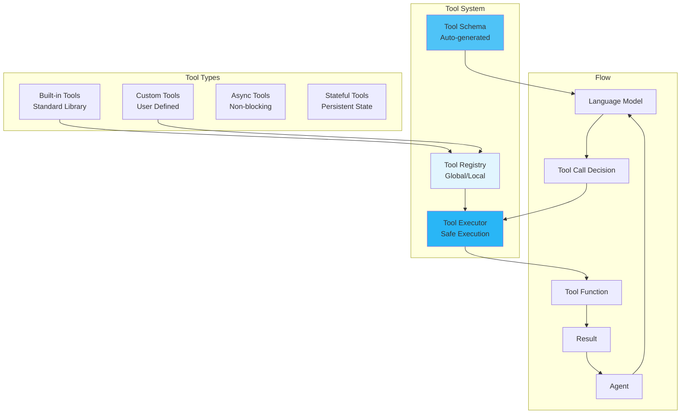

# Tools

Tools extend agent capabilities by providing access to external functions, APIs, and services, enabling agents to interact with the real world.

## 🎯 Overview

Tools in MARSYS are Python functions that agents can invoke to:

- **Access External Services**: Web search, APIs, databases
- **Perform Calculations**: Mathematical operations, data analysis
- **Control Systems**: Browser automation, file operations
- **Process Data**: Text extraction, format conversion
- **Interact with Environment**: System commands, hardware control

The framework uses **OpenAI-compatible function calling** for seamless tool integration.

## 🏗️ Architecture



## 📦 Creating Tools

### Basic Tool Definition

Every tool needs:
1. **Type hints** on all parameters
2. **Comprehensive docstring** with Args and Returns
3. **Return type** annotation
4. **Descriptive** parameter names

```python
def search_database(
    query: str,
    database: str = "products",
    limit: int = 10,
    filters: Optional[Dict[str, Any]] = None
) -> List[Dict[str, Any]]:
    """
    Search database for matching records.

    Args:
        query: Search query string
        database: Database to search (products, users, orders)
        limit: Maximum number of results to return
        filters: Additional filters as key-value pairs

    Returns:
        List of matching records with all fields

    Raises:
        ConnectionError: If database is unavailable
        ValueError: If query is invalid
    """
    # Implementation
    results = perform_search(query, database, limit, filters)
    return results
```

### Automatic Schema Generation

The framework automatically generates OpenAI-compatible schemas:

```python
from src.environment.utils import generate_openai_tool_schema

# Automatic schema generation from function
schema = generate_openai_tool_schema(search_database)

# Generated schema:
{
    "type": "function",
    "function": {
        "name": "search_database",
        "description": "Search database for matching records.",
        "parameters": {
            "type": "object",
            "properties": {
                "query": {
                    "type": "string",
                    "description": "Search query string"
                },
                "database": {
                    "type": "string",
                    "description": "Database to search (products, users, orders)",
                    "default": "products"
                },
                "limit": {
                    "type": "integer",
                    "description": "Maximum number of results to return",
                    "default": 10
                },
                "filters": {
                    "type": "object",
                    "description": "Additional filters as key-value pairs"
                }
            },
            "required": ["query"]
        }
    }
}
```

## 🔧 Tool Registration

### Agent-Specific Tools

```python
from src.agents import Agent
from src.models import ModelConfig

agent = Agent(
    model_config=ModelConfig(
        type="api",
        name="gpt-4",
        provider="openai"
    ),
    agent_name="DataAnalyst",
    description="Expert data analyst with database access",
    tools=[search_database, analyze_data, export_results]  # List of functions
    # OR
    tools={  # Dict with custom names
        "db_search": search_database,
        "analyze": analyze_data,
        "export": export_results
    }
)
```

### Global Tool Registry

```python
from src.environment.tools import AVAILABLE_TOOLS

# Register globally
AVAILABLE_TOOLS["search_database"] = search_database
AVAILABLE_TOOLS["analyze_data"] = analyze_data

# Discover tools by category
WEB_TOOLS = {
    "search_web": search_web_func,
    "fetch_url": fetch_url_func,
    "scrape_page": scrape_page_func
}

DATA_TOOLS = {
    "analyze_csv": analyze_csv_func,
    "process_json": process_json_func,
    "transform_data": transform_data_func
}

# Combine categories
AVAILABLE_TOOLS.update(WEB_TOOLS)
AVAILABLE_TOOLS.update(DATA_TOOLS)
```

## 🎯 Tool Patterns

### Async Tools

For non-blocking operations:

```python
import aiohttp
import asyncio

async def fetch_api_data(
    endpoint: str,
    params: Optional[Dict[str, str]] = None,
    timeout: int = 30
) -> Dict[str, Any]:
    """
    Fetch data from API endpoint asynchronously.

    Args:
        endpoint: API endpoint URL
        params: Query parameters
        timeout: Request timeout in seconds

    Returns:
        API response data
    """
    try:
        async with aiohttp.ClientSession() as session:
            async with session.get(
                endpoint,
                params=params,
                timeout=aiohttp.ClientTimeout(total=timeout)
            ) as response:
                data = await response.json()
                return {
                    "status": response.status,
                    "data": data,
                    "headers": dict(response.headers)
                }
    except asyncio.TimeoutError:
        return {"error": "Request timed out", "timeout": timeout}
    except Exception as e:
        return {"error": str(e)}
```

### Stateful Tools

Tools that maintain state across calls:

```python
class DatabaseConnection:
    def __init__(self, connection_string: str):
        self.connection = self._connect(connection_string)
        self.query_cache = {}

    async def query(
        self,
        sql: str,
        params: Optional[tuple] = None,
        use_cache: bool = False
    ) -> List[Dict]:
        """
        Execute SQL query with optional caching.

        Args:
            sql: SQL query string
            params: Query parameters for prepared statement
            use_cache: Whether to use cached results

        Returns:
            Query results as list of dictionaries
        """
        cache_key = f"{sql}:{params}"

        if use_cache and cache_key in self.query_cache:
            return self.query_cache[cache_key]

        try:
            cursor = await self.connection.execute(sql, params or ())
            results = await cursor.fetchall()

            if use_cache:
                self.query_cache[cache_key] = results

            return results
        except Exception as e:
            return [{"error": str(e)}]

# Create instance and extract tool
db = DatabaseConnection("postgresql://...")
query_tool = db.query  # This method becomes the tool
```

### Composite Tools

Tools that combine multiple operations:

```python
async def research_topic(
    topic: str,
    depth: Literal["shallow", "medium", "deep"] = "medium",
    include_sources: bool = True
) -> Dict[str, Any]:
    """
    Comprehensive research on a topic from multiple sources.

    Args:
        topic: Topic to research
        depth: Research depth level
        include_sources: Whether to include source URLs

    Returns:
        Research summary with sources and key points
    """
    # Determine number of sources based on depth
    source_count = {"shallow": 3, "medium": 5, "deep": 10}[depth]

    # Phase 1: Web search
    search_results = await search_web(topic, max_results=source_count)

    # Phase 2: Fetch and analyze content
    contents = []
    for result in search_results:
        content = await fetch_url_content(result["url"])
        contents.append({
            "url": result["url"],
            "title": result["title"],
            "content": content
        })

    # Phase 3: Synthesize information
    key_points = extract_key_points(contents)
    summary = create_summary(key_points)

    response = {
        "topic": topic,
        "summary": summary,
        "key_points": key_points,
        "source_count": len(contents)
    }

    if include_sources:
        response["sources"] = [
            {"title": c["title"], "url": c["url"]}
            for c in contents
        ]

    return response
```

### Error-Handling Tools

Robust tools with proper error handling:

```python
from functools import wraps
from typing import Callable

def safe_tool(func: Callable) -> Callable:
    """Decorator for safe tool execution."""

    @wraps(func)
    async def async_wrapper(*args, **kwargs):
        try:
            result = await func(*args, **kwargs)
            return {"success": True, "result": result}
        except ValueError as e:
            return {"success": False, "error": f"Invalid input: {e}"}
        except TimeoutError as e:
            return {"success": False, "error": f"Operation timed out: {e}"}
        except Exception as e:
            return {"success": False, "error": f"Unexpected error: {e}"}

    @wraps(func)
    def sync_wrapper(*args, **kwargs):
        try:
            result = func(*args, **kwargs)
            return {"success": True, "result": result}
        except Exception as e:
            return {"success": False, "error": str(e)}

    if asyncio.iscoroutinefunction(func):
        return async_wrapper
    else:
        return sync_wrapper

# Usage
@safe_tool
async def risky_operation(param: str) -> str:
    """Operation that might fail."""
    if not param:
        raise ValueError("Parameter cannot be empty")
    # Risky operation here
    return f"Processed: {param}"
```

## 🚀 Built-in Tools

MARSYS includes a comprehensive tool library:

### Web Tools

```python
async def search_web(
    query: str,
    max_results: int = 5,
    search_engine: Literal["google", "bing", "duckduckgo"] = "google"
) -> List[Dict[str, str]]:
    """Search the web for information."""
    # Returns: [{"title": "...", "url": "...", "snippet": "..."}]

async def fetch_url_content(
    url: str,
    format: Literal["text", "markdown", "html"] = "text"
) -> str:
    """Fetch and extract content from URL."""
    # Returns formatted content

async def check_website_status(url: str) -> Dict[str, Any]:
    """Check if website is accessible."""
    # Returns: {"online": bool, "status_code": int, "response_time": float}
```

### Data Processing Tools

```python
def analyze_data(
    data: List[float],
    operations: List[Literal["mean", "median", "std", "min", "max"]]
) -> Dict[str, float]:
    """Perform statistical analysis on data."""
    # Returns: {"mean": 5.2, "std": 1.3, ...}

def transform_json(
    json_data: Dict,
    jq_filter: str
) -> Any:
    """Transform JSON using JQ-like syntax."""
    # Returns transformed data

def parse_csv(
    csv_text: str,
    delimiter: str = ",",
    has_headers: bool = True
) -> List[Dict[str, str]]:
    """Parse CSV text into records."""
    # Returns list of dictionaries
```

### File System Tools

```python
async def read_file(
    path: str,
    encoding: str = "utf-8",
    lines: Optional[Tuple[int, int]] = None
) -> str:
    """Read file contents."""
    # Returns file content

async def write_file(
    path: str,
    content: str,
    mode: Literal["write", "append"] = "write"
) -> Dict[str, Any]:
    """Write content to file."""
    # Returns: {"success": bool, "bytes_written": int}

async def list_directory(
    path: str = ".",
    pattern: Optional[str] = None
) -> List[Dict[str, Any]]:
    """List directory contents."""
    # Returns: [{"name": "...", "type": "file|dir", "size": int}]
```

## 📋 Best Practices

### 1. **Clear Documentation**

```python
# ✅ GOOD - Comprehensive documentation
def process_invoice(
    invoice_data: Dict[str, Any],
    validation_level: Literal["basic", "strict"] = "basic",
    currency: str = "USD"
) -> Dict[str, Any]:
    """
    Process and validate invoice data.

    Args:
        invoice_data: Invoice information containing:
            - invoice_number (str): Unique invoice identifier
            - amount (float): Total amount
            - items (list): Line items
        validation_level: How strictly to validate
        currency: Currency code for amount conversion

    Returns:
        Processed invoice with:
            - status: "valid" or "invalid"
            - processed_amount: Converted amount
            - warnings: List of validation warnings

    Raises:
        ValueError: If invoice_data is malformed
        KeyError: If required fields are missing
    """
    # Implementation
    pass

# ❌ BAD - Poor documentation
def process(data, level="basic"):
    """Process data."""
    pass
```

### 2. **Input Validation**

```python
# ✅ GOOD - Validates inputs
def send_email(
    to: str,
    subject: str,
    body: str,
    cc: Optional[List[str]] = None
) -> Dict[str, Any]:
    """Send email with validation."""
    # Validate email format
    email_pattern = r'^[\w\.-]+@[\w\.-]+\.\w+$'
    if not re.match(email_pattern, to):
        raise ValueError(f"Invalid email address: {to}")

    # Validate CC addresses
    if cc:
        for addr in cc:
            if not re.match(email_pattern, addr):
                raise ValueError(f"Invalid CC address: {addr}")

    # Validate content
    if not subject.strip():
        raise ValueError("Subject cannot be empty")

    if len(body) > 100000:
        raise ValueError("Body too large (max 100KB)")

    # Send email
    return {"sent": True, "message_id": "..."}
```

### 3. **Consistent Returns**

```python
# ✅ GOOD - Always returns same structure
def database_query(sql: str) -> Dict[str, Any]:
    """Query database with consistent response."""
    try:
        results = execute_query(sql)
        return {
            "success": True,
            "data": results,
            "row_count": len(results),
            "error": None
        }
    except Exception as e:
        return {
            "success": False,
            "data": [],
            "row_count": 0,
            "error": str(e)
        }

# ❌ BAD - Inconsistent returns
def bad_query(sql: str):
    try:
        return execute_query(sql)  # Returns list
    except Exception as e:
        return str(e)  # Returns string
```

### 4. **Resource Management**

```python
# ✅ GOOD - Proper resource cleanup
async def process_large_file(
    file_path: str,
    chunk_size: int = 8192
) -> Dict[str, Any]:
    """Process large file with proper resource management."""
    file_handle = None
    try:
        file_handle = await aiofiles.open(file_path, 'r')
        total_lines = 0

        async for chunk in file_handle:
            # Process chunk
            total_lines += chunk.count('\n')

        return {"lines": total_lines, "status": "completed"}

    except Exception as e:
        return {"error": str(e), "status": "failed"}

    finally:
        if file_handle:
            await file_handle.close()
```

## 🎯 Advanced Patterns

### Rate-Limited Tools

```python
from asyncio import Semaphore
from collections import defaultdict
import time

class RateLimiter:
    def __init__(self, calls: int, period: float):
        self.calls = calls
        self.period = period
        self.semaphore = Semaphore(calls)
        self.call_times = []

    async def acquire(self):
        async with self.semaphore:
            now = time.time()
            # Remove old calls outside the period
            self.call_times = [t for t in self.call_times if now - t < self.period]

            if len(self.call_times) >= self.calls:
                sleep_time = self.period - (now - self.call_times[0])
                await asyncio.sleep(sleep_time)

            self.call_times.append(time.time())

# Rate-limited API tool
rate_limiter = RateLimiter(calls=10, period=60)  # 10 calls per minute

async def api_call(endpoint: str, params: Dict) -> Dict:
    """Rate-limited API call."""
    await rate_limiter.acquire()
    # Make actual API call
    response = await make_request(endpoint, params)
    return response
```

### Cached Tools

```python
from functools import lru_cache
import hashlib
import json

class CachedTool:
    def __init__(self, ttl: int = 300):
        self.cache = {}
        self.ttl = ttl

    def _cache_key(self, *args, **kwargs):
        """Generate cache key from arguments."""
        key_data = json.dumps({"args": args, "kwargs": kwargs}, sort_keys=True)
        return hashlib.md5(key_data.encode()).hexdigest()

    async def expensive_operation(
        self,
        param1: str,
        param2: int,
        use_cache: bool = True
    ) -> Dict:
        """Expensive operation with caching."""

        cache_key = self._cache_key(param1, param2)

        # Check cache
        if use_cache and cache_key in self.cache:
            cached_time, cached_result = self.cache[cache_key]
            if time.time() - cached_time < self.ttl:
                return {"result": cached_result, "cached": True}

        # Perform expensive operation
        result = await self._do_expensive_work(param1, param2)

        # Cache result
        self.cache[cache_key] = (time.time(), result)

        return {"result": result, "cached": False}
```

## 🚦 Next Steps

<div class="grid cards" markdown="1">

- :material-robot:{ .lg .middle } **[Agents](agents.md)**

    ---

    How agents use tools

- :material-brain:{ .lg .middle } **[Models](models.md)**

    ---

    Model configurations for tool calling

- :material-web:{ .lg .middle } **[Browser Automation](browser-automation.md)**

    ---

    Web interaction tools

- :material-api:{ .lg .middle } **[Tool API Reference](../api/tools.md)**

    ---

    Complete tool API documentation

</div>

---

!!! success "Tool System Ready!"
    You now understand how to create and use tools in MARSYS. Tools are the bridge between AI intelligence and real-world actions.