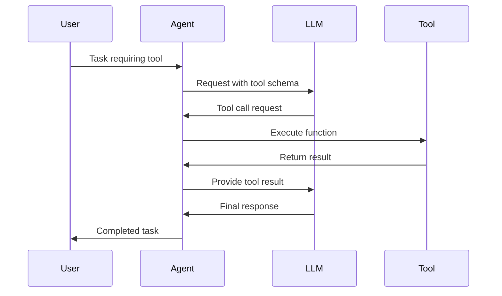

# Tools

Tools extend agent capabilities by providing access to external functions, APIs, and services. The framework uses OpenAI-compatible function calling for seamless tool integration.

## What are Tools?

Tools are Python functions that agents can call to:
- Perform calculations
- Access external APIs
- Interact with databases
- Control browser automation
- Execute system commands
- And much more

## Creating Tools

### Basic Tool Definition

```python
def get_weather(location: str, unit: str = "celsius") -> str:
    """
    Get current weather for a location.
    
    Args:
        location: City name or coordinates
        unit: Temperature unit (celsius or fahrenheit)
    
    Returns:
        Weather information as a string
    """
    # Implementation here
    return f"Weather in {location}: 22°{unit[0].upper()}, sunny"
```

Key requirements:
1. **Type hints** on all parameters
2. **Docstring** with description
3. **Return type** annotation
4. **Descriptive** parameter names

### Tool Registration

```python
from src.environment.tools import AVAILABLE_TOOLS

# Register globally
AVAILABLE_TOOLS["get_weather"] = get_weather

# Or provide to specific agent
from src.agents.agents import Agent
from src.models.models import ModelConfig

agent = Agent(
    agent_name="weather_bot",
    model_config=ModelConfig(
        type="api",
        provider="openai",
        name="gpt-4.1-mini
    ),
    description="A weather assistant agent",
    tools={"get_weather": get_weather}
)
```

## Tool Schemas

The framework automatically generates OpenAI-compatible schemas:

```python
# Generated schema example
{
    "type": "function",
    "function": {
        "name": "get_weather",
        "description": "Get current weather for a location.",
        "parameters": {
            "type": "object",
            "properties": {
                "location": {
                    "type": "string",
                    "description": "City name or coordinates"
                },
                "unit": {
                    "type": "string",
                    "description": "Temperature unit (celsius or fahrenheit)",
                    "default": "celsius"
                }
            },
            "required": ["location"]
        }
    }
}
```

## Built-in Tools

The framework includes several built-in tools:

### Web Search Tools

```python
async def web_search(
    query: str,
    max_results: int = 5,
    search_engine: Literal["google", "bing", "duckduckgo"] = "google",
) -> List[Dict[str, str]]:
    """Search the web for information using various search engines.

    Args:
        query: The search query string
        max_results: Maximum number of results to return
        search_engine: Which search engine to use

    Returns:
        List of search results, each containing title, url, and snippet
    """
    # Implementation uses existing Google search tools
```

### Mathematical Calculation Tool

```python
def calculate_math(
    expression: str, precision: int = 2, return_steps: bool = False
) -> Dict[str, Any]:
    """Safely evaluate mathematical expressions.

    Args:
        expression: Mathematical expression to evaluate
        precision: Decimal places for rounding
        return_steps: Whether to return calculation steps

    Returns:
        Dictionary containing result and optionally steps
    """
    # Safe evaluation with allowed operations only
```

### URL Content Fetching

```python
async def fetch_url_content(
    url: str, timeout: int = 30, include_metadata: bool = True
) -> Dict[str, Any]:
    """Fetch and extract content from a URL.

    Args:
        url: The URL to fetch
        timeout: Request timeout in seconds
        include_metadata: Whether to include metadata like title, description

    Returns:
        Dictionary containing content and optionally metadata
    """
    # Async implementation with aiohttp
```

### File Operations

```python
async def file_operations(
    operation: Literal["read", "write", "list", "info"],
    path: str,
    content: Optional[str] = None,
    encoding: str = "utf-8",
) -> Dict[str, Any]:
    """Perform file system operations.

    Args:
        operation: Type of operation to perform
        path: File or directory path
        content: Content for write operations
        encoding: File encoding

    Returns:
        Operation result with status and data
    """
    # Security-restricted to safe workspace directory
```

## Tool Execution Flow



## Advanced Tool Patterns

### Async Tools

```python
async def fetch_data(url: str, timeout: int = 30) -> Dict[str, Any]:
    """
    Fetch data from a URL asynchronously.
    
    Args:
        url: URL to fetch
        timeout: Request timeout in seconds
    
    Returns:
        Dictionary containing response data and metadata
    """
    import aiohttp
    
    try:
        async with aiohttp.ClientSession() as session:
            async with session.get(url, timeout=timeout) as response:
                content = await response.text()
                return {
                    "url": url,
                    "status_code": response.status,
                    "content": content,
                    "content_type": response.content_type
                }
    except Exception as e:
        return {"error": f"Failed to fetch URL: {str(e)}"}
```

### Stateful Tools

```python
class DatabaseTool:
    def __init__(self, connection_string: str):
        self.conn = self._connect(connection_string)
    
    async def query_database(self, query: str) -> Dict[str, Any]:
        """
        Execute a database query.
        
        Args:
            query: SQL query to execute
        
        Returns:
            Dictionary containing query results and metadata
        """
        try:
            cursor = await self.conn.execute(query)
            results = await cursor.fetchall()
            return {
                "query": query,
                "results": results,
                "row_count": len(results),
                "status": "success"
            }
        except Exception as e:
            return {"error": f"Database query failed: {str(e)}"}
    
    def get_tool(self):
        return self.query_database
```

### Composite Tools

```python
async def research_topic(
    topic: str,
    max_sources: int = 5,
    include_academic: bool = True
) -> Dict[str, Any]:
    """
    Research a topic from multiple sources.
    
    Args:
        topic: Topic to research
        max_sources: Maximum number of sources to check
        include_academic: Include academic sources
    
    Returns:
        Dictionary containing comprehensive research summary
    """
    results = []
    
    # Use actual framework tools
    web_results = await web_search(topic, max_sources)
    results.extend(web_results)
    
    # Additional processing would go here
    if include_academic:
        # Academic search implementation
        pass
    
    return {
        "topic": topic,
        "sources": results,
        "source_count": len(results),
        "summary": f"Research completed for: {topic}"
    }
```

## Tool Error Handling

```python
def safe_tool_execution(tool_func):
    """Decorator for safe tool execution."""
    @functools.wraps(tool_func)
    async def wrapper(*args, **kwargs):
        try:
            if asyncio.iscoroutinefunction(tool_func):
                result = await tool_func(*args, **kwargs)
            else:
                result = await asyncio.to_thread(
                    tool_func, *args, **kwargs
                )
            return result
        except Exception as e:
            return f"Tool error: {str(e)}"
    
    return wrapper

@safe_tool_execution
def risky_operation(param: str) -> str:
    """A tool that might fail."""
    # Implementation that could raise exceptions
    pass
```

## Tool Guidelines

### 1. **Clear Documentation**
```python
def good_tool(param1: str, param2: int = 10) -> dict:
    """
    Brief description of what the tool does.
    
    Args:
        param1: Clear description of this parameter
        param2: What this parameter controls (default: 10)
    
    Returns:
        Description of return value structure
    
    Raises:
        ValueError: When param1 is invalid
        TimeoutError: When operation times out
    """
    pass
```

### 2. **Input Validation**
```python
def validated_tool(email: str, age: int) -> str:
    """Send email with age verification."""
    # Validate email format
    if not re.match(r'^[\w\.-]+@[\w\.-]+\.\w+$', email):
        raise ValueError("Invalid email format")
    
    # Validate age
    if not 0 < age < 150:
        raise ValueError("Invalid age")
    
    # Process...
```

### 3. **Return Consistency**
```python
def consistent_tool(query: str) -> str:
    """Always return string, even for errors."""
    try:
        result = perform_operation(query)
        return json.dumps({"success": True, "data": result})
    except Exception as e:
        return json.dumps({"success": False, "error": str(e)})
```

## Tool Organization

### Tool Categories

```python
# src/environment/tools/__init__.py
CALCULATION_TOOLS = {
    "calculate": calculate,
    "convert_units": convert_units,
}

WEB_TOOLS = {
    "search_web": search_web,
    "fetch_url": fetch_url,
    "check_website": check_website,
}

FILE_TOOLS = {
    "read_file": read_file,
    "write_file": write_file,
    "list_files": list_files,
}

# Combine all tools
AVAILABLE_TOOLS = {
    **CALCULATION_TOOLS,
    **WEB_TOOLS,
    **FILE_TOOLS,
}
```

### Tool Discovery

```python
def discover_tools(category: str = None) -> Dict[str, callable]:
    """Discover available tools by category."""
    if category == "calculation":
        return CALCULATION_TOOLS
    elif category == "web":
        return WEB_TOOLS
    elif category == "file":
        return FILE_TOOLS
    else:
        return AVAILABLE_TOOLS
```

## Performance Considerations

1. **Async First**: Make tools async when possible
2. **Timeouts**: Always set reasonable timeouts
3. **Caching**: Cache expensive operations
4. **Rate Limiting**: Implement for external APIs
5. **Resource Management**: Clean up resources properly

```python
# Example with all considerations
class OptimizedTool:
    def __init__(self):
        self.cache = {}
        self.rate_limiter = RateLimiter(calls=10, period=60)
    
    async def fetch_with_cache(
        self,
        url: str,
        cache_duration: int = 300
    ) -> str:
        """Fetch URL with caching and rate limiting."""
        # Check cache
        if url in self.cache:
            cached_time, cached_data = self.cache[url]
            if time.time() - cached_time < cache_duration:
                return cached_data
        
        # Rate limit
        await self.rate_limiter.acquire()
        
        # Fetch with timeout
        try:
            async with aiohttp.ClientSession() as session:
                async with session.get(url, timeout=30) as response:
                    data = await response.text()
                    
            # Cache result
            self.cache[url] = (time.time(), data)
            return data
            
        except asyncio.TimeoutError:
            return "Request timed out"
```

## Next Steps

- Explore [Models](models.md) - How agents use models
- Learn about [Advanced Tool Patterns](../concepts/tools.md) - Complex tool scenarios
- See [Browser Automation](../concepts/browser-automation.md) - Web interaction tools

## Creating Custom Tools

```python
from typing import Dict, Any
import asyncio

async def my_custom_tool(param1: str, param2: int = 10) -> Dict[str, Any]:
    """
    Custom tool description that will appear in the schema.
    
    Args:
        param1: Description of param1
        param2: Description of param2 (default: 10)
    
    Returns:
        Dict containing the result
    """
    # Tool implementation
    await asyncio.sleep(0.1)  # Simulate async operation
    return {
        "result": f"Processed {param1} with value {param2}",
        "status": "success"
    }

# Add to agent
from src.agents import Agent
from src.models.models import ModelConfig

agent = Agent(
    name="tool_user",
    model_config=ModelConfig(
        type="api",
        provider="openai",
        name="gpt-4.1-mini
    ),
    tools={"my_custom_tool": my_custom_tool}
)
```

## Using Tools in Agents

```python
import asyncio
from src.agents.agents import Agent
from src.models.models import ModelConfig
from src.environment.tools import AVAILABLE_TOOLS

async def main():
    # Create agent with multiple tools
    agent = Agent(
        agent_name="multi_tool_agent",
        model_config=ModelConfig(
            type="api",
            provider="openai",
            name="gpt-4.1-mini
        ),
        tools={
            "calculate": AVAILABLE_TOOLS["calculate"],
            "search_web": AVAILABLE_TOOLS["search_web"],
            "my_custom_tool": my_custom_tool
        }
    )
    
    response = await agent.auto_run(
        initial_request="Calculate 25 * 4, then search for information about the result",
        max_steps=3
    )
    
    print(response)

asyncio.run(main())
```
