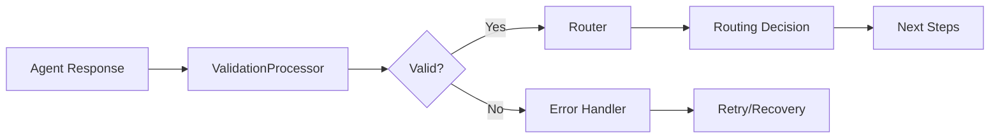

# Validation and Routing

Understanding how MARSYS validates agent responses and routes execution flow through the workflow.

## Overview

The validation and routing system is the brain of MARSYS coordination, ensuring all agent responses are properly parsed, validated against topology constraints, and routed to the appropriate next step.

## Core Components

### System Architecture



## Response Validation

### ValidationProcessor

The central hub for ALL response parsing:

```python
# All responses go through ValidationProcessor
validation_result = await validation_processor.validate_response(
    response=agent_response,
    agent_name="Coordinator",
    allowed_agents=["Worker1", "Worker2"],
    branch=current_branch
)
```

### Response Formats

MARSYS supports multiple response formats:

#### 1. Structured JSON
```python
{
    "thought": "I need to analyze this data",
    "next_action": "invoke_agent",
    "action_input": "DataAnalyzer"
}
```

#### 2. Parallel Invocation
```python
{
    "next_action": "parallel_invoke",
    "agents": ["Worker1", "Worker2"],
    "agent_requests": {
        "Worker1": "Task A",
        "Worker2": "Task B"
    }
}
```

#### 3. Tool Calls
```python
{
    "next_action": "call_tool",
    "tool_calls": [{
        "id": "call_123",
        "type": "function",
        "function": {
            "name": "search",
            "arguments": '{"query": "data"}'
        }
    }]
}
```

#### 4. Final Response
```python
{
    "next_action": "final_response",
    "content": "Analysis complete..."
}
```

### Validation Rules

#### Topology Validation
```python
# Check if agent can invoke target
if target_agent not in allowed_agents:
    return ValidationResult(
        is_valid=False,
        error_message=f"Agent {target_agent} not allowed"
    )
```

#### Format Validation
```python
# Validate required fields
required_fields = ["next_action"]
for field in required_fields:
    if field not in response:
        return ValidationResult(
            is_valid=False,
            error_message=f"Missing required field: {field}"
        )
```

#### Action Type Validation
```python
# Validate action type
valid_actions = [
    "invoke_agent",
    "parallel_invoke",
    "call_tool",
    "final_response",
    "error_recovery"
]

if action not in valid_actions:
    return ValidationResult(
        is_valid=False,
        error_message=f"Invalid action: {action}"
    )
```

## Routing System

### Router Component

Converts validation results into execution decisions:

```python
router = Router(topology_graph)

routing_decision = await router.route(
    validation_result=validation_result,
    current_branch=branch,
    routing_context=context
)
```

### Routing Decisions

#### Sequential Routing
```python
# Single agent invocation
RoutingDecision(
    next_steps=[
        ExecutionStep(
            step_type=StepType.AGENT_INVOCATION,
            target="Analyzer",
            data={"request": "Analyze data"}
        )
    ],
    should_continue=True
)
```

#### Parallel Routing
```python
# Multiple parallel branches
RoutingDecision(
    next_steps=[],  # Parent waits
    should_continue=False,  # Parent pauses
    branch_specs=[
        BranchSpec(agent="Worker1", request="Task1"),
        BranchSpec(agent="Worker2", request="Task2")
    ]
)
```

#### Tool Execution Routing
```python
# Tool call execution
RoutingDecision(
    next_steps=[
        ExecutionStep(
            step_type=StepType.TOOL_EXECUTION,
            target="search_tool",
            data={"arguments": {"query": "AI"}}
        )
    ],
    should_continue=True
)
```

### Routing Patterns

#### Pattern 1: Linear Chain
```
Agent1 → Agent2 → Agent3 → Final
```

#### Pattern 2: Branching
```
        → Worker1 →
Coordinator      → Aggregator
        → Worker2 →
```

#### Pattern 3: Conversation Loop
```
Agent1 ↔ Agent2 (max_turns=5)
```

#### Pattern 4: Error Recovery
```
Agent → Error → User → Retry/Skip/Abort
```

## Response Processing

### Response Processor Chain

Multiple processors handle different formats:

```python
class ProcessorChain:
    def __init__(self):
        self.processors = [
            StructuredJSONProcessor(priority=100),
            ToolCallProcessor(priority=90),
            TextResponseProcessor(priority=10)
        ]

    async def process(self, response):
        # Try processors in priority order
        for processor in sorted(self.processors,
                               key=lambda p: p.priority(),
                               reverse=True):
            if processor.can_process(response):
                return processor.process(response)
        return None
```

### Custom Response Processors

Create custom processors for special formats:

```python
class CustomProcessor(ResponseProcessor):
    def can_process(self, response):
        return isinstance(response, dict) and "custom_field" in response

    def process(self, response):
        return {
            "next_action": self.map_action(response["custom_field"]),
            "content": response.get("data")
        }

    def priority(self):
        return 80
```

## Error Handling

### Validation Errors

Different error types trigger different behaviors:

#### Permission Errors
```python
if "not allowed" in error_message:
    # Agent tried to invoke unauthorized target
    return RoutingDecision(
        next_steps=[],
        should_continue=False,
        error_action="terminate",
        error_message="Permission denied"
    )
```

#### Format Errors
```python
if "invalid format" in error_message:
    # Retry with steering
    return RoutingDecision(
        next_steps=[
            ExecutionStep(
                step_type=StepType.RETRY_WITH_STEERING,
                steering="Please respond with valid JSON format"
            )
        ]
    )
```

#### Recoverable Errors
```python
if error.is_recoverable():
    # Route to User for intervention
    return RoutingDecision(
        next_steps=[
            ExecutionStep(
                step_type=StepType.ERROR_RECOVERY,
                target="User",
                data={"error": error_details}
            )
        ]
    )
```

## Steering and Retry

### Steering Mechanism

Guide agents to correct responses:

```python
def generate_steering(validation_result):
    if not validation_result.is_valid:
        if "format" in validation_result.error_message:
            return """
            Please respond with a JSON object containing:
            - next_action: The action to take
            - action_input: The input for the action
            """
        elif "not allowed" in validation_result.error_message:
            return f"""
            You can only invoke these agents: {allowed_agents}
            Please choose from the allowed agents.
            """
    return None
```

### Retry Logic

```python
async def retry_with_steering(agent, steering, max_retries=3):
    for attempt in range(max_retries):
        # Add steering to prompt
        steered_prompt = f"{original_prompt}\n\n{steering}"

        response = await agent.run(steered_prompt)
        validation = await validate_response(response)

        if validation.is_valid:
            return validation

        # Update steering for next attempt
        steering = generate_steering(validation)

    return None  # Max retries exceeded
```

## Advanced Validation

### Schema Validation

Use schemas for structured validation:

```python
from pydantic import BaseModel

class AgentResponse(BaseModel):
    next_action: str
    action_input: Optional[str] = None
    agents: Optional[List[str]] = None
    agent_requests: Optional[Dict[str, str]] = None

# Validate with schema
try:
    validated = AgentResponse(**response)
except ValidationError as e:
    return ValidationResult(
        is_valid=False,
        error_message=str(e)
    )
```

### Conditional Validation

Apply different rules based on context:

```python
def validate_with_context(response, context):
    # Different validation for different branch types
    if context.branch_type == BranchType.CONVERSATION:
        # Allow end_conversation action
        valid_actions.append("end_conversation")

    if context.is_parallel_spawn:
        # Require agent_requests for parallel
        if "agent_requests" not in response:
            return False

    return True
```

## Routing Optimization

### Route Caching

Cache frequently used routes:

```python
class RouteCache:
    def __init__(self):
        self.cache = {}

    def get_route(self, key):
        return self.cache.get(key)

    def set_route(self, key, route):
        self.cache[key] = route
```

### Predictive Routing

Predict likely next steps:

```python
def predict_next_route(current_agent, history):
    # Analyze historical patterns
    common_sequences = analyze_patterns(history)

    # Find matching pattern
    for pattern in common_sequences:
        if pattern.matches(current_agent):
            return pattern.next_agent

    return None
```

## Monitoring and Debugging

### Validation Metrics

Track validation performance:

```python
metrics = {
    "total_validations": 0,
    "successful_validations": 0,
    "failed_validations": 0,
    "retry_count": 0,
    "steering_applications": 0
}
```

### Debug Logging

Enable detailed logging:

```python
import logging

logging.basicConfig(level=logging.DEBUG)

# Logs show:
# - Raw responses
# - Validation steps
# - Routing decisions
# - Error details
```

### Validation Trace

Access validation history:

```python
# Store validation history
validation_history = []

def track_validation(result):
    validation_history.append({
        "timestamp": time.time(),
        "agent": current_agent,
        "valid": result.is_valid,
        "action": result.action_type,
        "error": result.error_message
    })
```

## Best Practices

### ✅ DO:
- Validate ALL responses through ValidationProcessor
- Provide clear retry suggestions
- Use appropriate steering for errors
- Cache validation results when possible
- Monitor validation failures

### ❌ DON'T:
- Parse responses manually
- Skip topology validation
- Ignore validation errors
- Hard-code routing logic
- Mix validation with execution

## Common Issues

### Issue: Validation Always Fails

**Solution**: Check response format and ensure it matches expected structure.

### Issue: Routing Loops

**Solution**: Add max_turns rule and loop detection.

### Issue: Permission Errors

**Solution**: Verify topology edges and allowed_agents configuration.

### Issue: Slow Validation

**Solution**: Optimize processor chain and use caching.

## Related Documentation

- [Validation API](../api/validation.md) - Detailed API reference
- [Execution Flow](execution-flow.md) - Overall execution
- [Topology](advanced/topology.md) - Topology constraints
- [Error Handling](error-handling.md) - Error recovery patterns