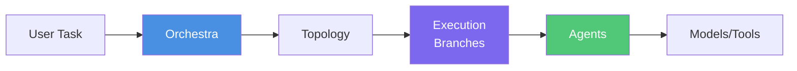

# Getting Started with MARSYS

Welcome to **MARSYS (Multi-Agent Reasoning Systems)** - a beta framework for building collaborative AI agent systems. This guide will help you understand what MARSYS offers and how to get started.

## 🎯 What You'll Build

With MARSYS, you can create sophisticated multi-agent systems where AI agents collaborate to solve complex problems. Here's what's possible:

<div class="grid cards" markdown="1">

- :material-robot:{ .lg .middle } **Collaborative Teams**

    ---

    Build teams of specialized agents that work together, like research teams, customer support systems, or development squads

- :material-graph-outline:{ .lg .middle } **Complex Workflows**

    ---

    Design intricate workflows with parallel execution, conditional routing, and automatic convergence

- :material-account-group:{ .lg .middle } **Human-AI Collaboration**

    ---

    Integrate human feedback seamlessly with User nodes for approval workflows and interactive systems

- :material-database-sync:{ .lg .middle } **Persistent Sessions**

    ---

    Create long-running workflows that can be paused, resumed, and checkpointed for reliability

</div>

## 🚀 Quick Overview

!!! info "API Keys Required for API Models"
    Set your API key by **environment variable** or directly in `ModelConfig(api_key="...")`. For local models, no API keys needed.

    **Quick setup** - Set OpenRouter API key (recommended for unified access):

    === "macOS/Linux"
        ```bash
        export OPENROUTER_API_KEY="your-api-key-here"
        ```

    === "Windows"
        ```cmd
        set OPENROUTER_API_KEY=your-api-key-here
        ```

    See [Installation Guide - Configure API Keys](installation/#3-configure-api-keys) for other providers and detailed setup.

MARSYS provides multiple ways to orchestrate agents. Here's the simplest approach using `allowed_peers`:

```python
from marsys.agents import Agent
from marsys.models import ModelConfig

# Create agents with same configuration
model_config = ModelConfig(
    type="api",
    name="anthropic/claude-sonnet-4.5",
    provider="openrouter"
)

# Define agents and their allowed interactions
researcher = Agent(
    model_config=model_config,
    name="Researcher",
    goal="Expert at finding and analyzing information",
    instruction="You are a research specialist. Find and analyze information thoroughly.",
    allowed_peers=["Writer"]  # Can invoke the Writer agent
)

writer = Agent(
    model_config=model_config,
    name="Writer",
    goal="Skilled at creating clear, engaging content",
    instruction="You are a skilled writer. Create clear, engaging content based on research.",
    allowed_peers=[]  # Cannot invoke other agents
)

# Run with automatic topology creation
result = await researcher.auto_run(
    task="Research AI trends and write a report",
    max_steps=20,
    verbosity=1  # Show progress
)

print(result)
```

This is just one of **four ways** to define multi-agent systems in MARSYS. As your needs grow, you can use more structured approaches with explicit topologies and pre-defined patterns.

## 📋 Prerequisites

Before you begin, ensure you have:

- **Python 3.12+** installed on your system
- **pip** or **conda** for package management
- **API keys** for your chosen AI providers (OpenAI, Anthropic, Google, etc.)
- Basic understanding of Python async/await (helpful but not required)

## 🗺️ Learning Path

Follow this recommended path to master MARSYS:

### 1️⃣ **Installation** (5 minutes)
Get MARSYS installed and configured on your system.
👉 [Installation Guide](installation/)

### 2️⃣ **Quick Start** (10 minutes)
Build your first multi-agent system with a simple example.
👉 [Quick Start Tutorial](quick-start/)

### 3️⃣ **Your First Agent** (15 minutes)
Create a custom agent with tools and memory management.
👉 [First Agent Guide](first-agent/)

### 4️⃣ **Configuration** (10 minutes)
Learn about execution configs, timeouts, and status management.
👉 [Configuration Reference](configuration/)

### 5️⃣ **Core Concepts** (30 minutes)
Understand topologies, execution flow, and agent communication.
👉 [Concepts Overview](../concepts/)

## ✨ Key Features at a Glance

### **Simple yet Powerful**
```python
# One-line execution for simple tasks
result = await Orchestra.run(
    task="Analyze this data",
    topology={"nodes": ["Analyst"], "edges": []}
)
```

### **Flexible Topologies**
```python
# Choose from 8 pre-defined patterns
topology = PatternConfig.pipeline(
    stages=[
        {"name": "collect", "agents": ["Collector"]},
        {"name": "process", "agents": ["Processor1", "Processor2"]},
        {"name": "report", "agents": ["Reporter"]}
    ],
    parallel_within_stage=True
)
```

### **Agent Pools for Parallelism**
```python
# True parallel execution with isolated agents
pool = AgentPool(
    agent_class=BrowserAgent,
    num_instances=3,
    name="BrowserPool"
)
```

### **State Persistence**
```python
# Long-running workflows with checkpoints
result = await Orchestra.run(
    task="Multi-day research project",
    topology=topology,
    state_manager=StateManager(storage)
)
```

## 🏗️ Framework Architecture

MARSYS uses a layered architecture for maximum flexibility:



**Key Components:**

- **Orchestra**: High-level coordination API
- **Topology**: Defines agent relationships and communication rules
- **Branches**: Parallel execution contexts with isolation
- **Agents**: Individual AI agents with specific capabilities
- **Tools**: Functions agents can call to interact with external systems

## 💡 Common Use Cases

<div class="grid" markdown="1">

### Research Systems
Build intelligent research assistants that gather, analyze, and synthesize information from multiple sources.

### Customer Support
Create multi-tier support systems with automatic escalation and specialized agents for different issues.

### Content Creation
Design content pipelines with agents for ideation, writing, editing, and formatting.

### Data Processing
Orchestrate complex data workflows with parallel processing and validation stages.

</div>

## 🎓 Example: Simple Research Team

Here's a complete example to get you started:

```python
import asyncio
from marsys.coordination import Orchestra
from marsys.agents import Agent
from marsys.models import ModelConfig

# Create a single model configuration
model_config = ModelConfig(
    type="api",
    name="anthropic/claude-sonnet-4.5",
    provider="openrouter"
)

# Create specialized agents
researcher = Agent(
    model_config=model_config,
    name="Researcher",
    goal="Expert at finding and analyzing information",
    instruction="You are a research specialist. Find and analyze information thoroughly."
)

writer = Agent(
    model_config=model_config,
    name="Writer",
    goal="Skilled at creating clear, engaging content",
    instruction="You are a skilled writer. Create clear, engaging content based on research."
)

# Define workflow
topology = {
    "nodes": ["Researcher", "Writer"],
    "edges": ["Researcher -> Writer"]
}

# Run the system
async def main():
    result = await Orchestra.run(
        task="Research quantum computing and write a beginner's guide",
        topology=topology
    )
    print(result.final_response)

asyncio.run(main())
```

## 🚦 Next Steps

Ready to build your first multi-agent system? Here's what to do:

<div class="grid cards" markdown="1">

- :material-package-variant:{ .lg .middle } **[Install MARSYS](installation/)**

    ---

    Get the framework installed and set up your environment

- :material-rocket-launch:{ .lg .middle } **[Quick Start Tutorial](quick-start/)**

    ---

    Build a working multi-agent system in 10 minutes

- :material-book-open:{ .lg .middle } **[Read the Concepts](../concepts/)**

    ---

    Understand the core ideas behind MARSYS

- :material-code-tags:{ .lg .middle } **[Explore Examples](../use-cases/)**

    ---

    See real-world implementations and patterns

</div>

## 🆘 Getting Help

If you run into issues:

- Check the [FAQ](../project/faq/) for common questions
- Browse [GitHub Issues](https://github.com/rezaho/MARSYS/issues) for similar problems
- Join our [Discord Community](https://discord.gg/marsys) for real-time help
- Review the [API Reference](../api/) for detailed documentation

---

!!! success "Ready to Start?"
    Jump into the [Installation Guide](installation/) to get MARSYS up and running on your system!