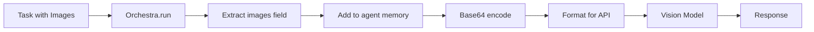

# Multimodal Agents Guide

A comprehensive guide to building agents that can process and reason about visual content alongside text.

## 🎯 Overview

MARSYS supports multimodal AI agents that can:

- **Process Images**: Analyze screenshots, photos, diagrams, charts
- **Read Documents**: Extract text and images from PDFs
- **Visual Reasoning**: Answer questions about visual content
- **Mixed Input**: Handle tasks with both text and images

This guide covers:
1. [Quick start](#quick-start)
2. [Creating multimodal tasks](#multimodal-tasks)
3. [Building multimodal tools](#multimodal-tools)
4. [Real-world examples](#real-world-examples)

## 🚀 Quick Start

### Basic Multimodal Task

```python
from marsys.coordination import Orchestra
from marsys.agents import Agent
from marsys.models import ModelConfig

# Create vision-enabled agent
vision_agent = Agent(
    model_config=ModelConfig(
        type="api",
        name="anthropic/claude-opus-4.6",
        provider="openrouter",
        api_key=os.getenv("OPENROUTER_API_KEY")
    ),
    name="VisionAnalyst",
    goal="Expert at analyzing visual content",
    instruction="You are an expert at analyzing images and providing detailed insights."
)

# Run with images
result = await Orchestra.run(
    task={
        "content": "What is shown in this image? Provide a detailed analysis.",
        "images": ["/path/to/screenshot.png"]
    },
    topology={"agents": ["VisionAnalyst"], "flows": []}
)

print(result.final_response)
```

### Model Configuration

```python
from marsys.models import ModelConfig

# OpenRouter with Claude Opus 4.6 for vision
claude_config = ModelConfig(
    type="api",
    name="anthropic/claude-opus-4.6",
    provider="openrouter",
    api_key=os.getenv("OPENROUTER_API_KEY"),
    temperature=0.7,
    max_tokens=2000
)

# Anthropic model with vision (Claude Opus 4.6)
anthropic_config = ModelConfig(
    type="api",
    name="claude-opus-4-6",
    provider="anthropic",
    api_key=os.getenv("ANTHROPIC_API_KEY")
)

# Google model with vision (Gemini 3 Pro Preview)
google_config = ModelConfig(
    type="api",
    name="gemini-3-pro-preview",
    provider="google",
    api_key=os.getenv("GOOGLE_API_KEY")
)
```

## 📋 Multimodal Tasks

### Task Format

Tasks with images use this format:

```python
task = {
    "content": "Text description of what you want",
    "images": ["path/to/image1.png", "path/to/image2.jpg"]
}
```

### Image Sources

The `images` field accepts multiple formats:

```python
# Local file paths
task = {
    "content": "Analyze these screenshots",
    "images": [
        "/home/user/screenshot1.png",
        "./downloads/image.jpg"
    ]
}

# URLs (if supported by model)
task = {
    "content": "What's in this image?",
    "images": ["https://example.com/photo.jpg"]
}

# Mixed sources
task = {
    "content": "Compare these images",
    "images": [
        "/local/path/image1.png",
        "https://example.com/image2.jpg"
    ]
}
```

When images come from tools (browser downloads, code execution, etc.), prefer the **virtual paths** they return (e.g., `./downloads/...`, `./outputs/...`, `./screenshots/...`) so other agents can access them consistently. See [Run Filesystem](../concepts/run-filesystem.md).

### How It Works

When you provide images in a task:

1. **Extraction**: Orchestra extracts the `images` field
2. **Memory Injection**: Images are added to the first agent's memory
3. **Base64 Encoding**: Framework automatically encodes local images
4. **API Format**: Message formatted per provider requirements
5. **Vision Model**: Model receives multimodal input



## 🛠️ Multimodal Tools

### ToolResponse: The Proper Way to Return Multimodal Content

Tools should return `ToolResponse` objects for multimodal content. This enables ordered sequences of text and images that map directly to LLM message content arrays.

```python
from marsys.environment.tool_response import ToolResponse, ToolResponseContent

def tool_read_pdf(pdf_path: str) -> ToolResponse:
    """
    Read PDF and return text + page images for vision analysis.

    Args:
        pdf_path: Path to PDF file

    Returns:
        ToolResponse with ordered text and image content blocks
    """
    # Extract text
    text = extract_text_from_pdf(pdf_path)

    # Convert pages to images
    page_images = convert_pdf_pages_to_images(pdf_path)

    # Build ordered content blocks
    content_blocks = [
        ToolResponseContent(text=f"Extracted {len(page_images)} pages from PDF.")
    ]

    # Add each page image with its text
    for i, (page_text, page_image) in enumerate(zip(text.split("---"), page_images), 1):
        content_blocks.append(ToolResponseContent(text=f"--- Page {i} ---"))
        content_blocks.append(ToolResponseContent(image_path=page_image))
        content_blocks.append(ToolResponseContent(text=page_text.strip()))

    return ToolResponse(
        content=content_blocks,
        metadata={"pages": len(page_images), "file": pdf_path}
    )
```

### ToolResponseContent Options

`ToolResponseContent` supports three content types:

```python
from marsys.environment.tool_response import ToolResponseContent

# 1. Text content (string)
ToolResponseContent(text="Hello world")

# 2. Text content (dict - will be JSON stringified)
ToolResponseContent(text={"key": "value", "count": 42})

# 3. Image with local file path (auto-converted to base64)
ToolResponseContent(image_path="/path/to/image.png")

# 4. Image with base64 data URL (already encoded)
ToolResponseContent(image_data="data:image/png;base64,iVBORw0KGgo...")
```

!!! warning "Mutually Exclusive"
    Each `ToolResponseContent` must have exactly ONE of: `text`, `image_path`, or `image_data`. You cannot combine them in the same content block.

### ToolResponse Content Formats

`ToolResponse` supports three content formats:

```python
from marsys.environment.tool_response import ToolResponse, ToolResponseContent

# 1. Simple string (for text-only results)
ToolResponse(content="File read successfully")

# 2. Dictionary (for structured data)
ToolResponse(content={"status": "success", "count": 42})

# 3. List of ToolResponseContent (for ordered multimodal content)
ToolResponse(
    content=[
        ToolResponseContent(text="Chapter 1"),
        ToolResponseContent(image_data="data:image/png;base64,..."),
        ToolResponseContent(text="Figure 1.1: System Architecture")
    ],
    metadata={"pages": "1-5", "images": 3}
)
```

### Tool Result Flow

The framework automatically handles `ToolResponse` processing:

```python
# 1. Agent calls tool
agent: "I need to read this PDF"
tool_call: tool_read_pdf("/path/to/document.pdf")

# 2. Tool returns ToolResponse with multimodal content
tool_result = ToolResponse(
    content=[
        ToolResponseContent(text="Extracted 3 pages."),
        ToolResponseContent(image_path="./outputs/page1.png"),
        ToolResponseContent(text="Page 1: Annual Report..."),
        ToolResponseContent(image_path="./outputs/page2.png"),
        ToolResponseContent(text="Page 2: Financial Data...")
    ]
)

# 3. Framework processes ToolResponse (tool_executor.py)
# - Detects ToolResponse object
# - Calls to_content_array() for proper LLM message format

# 4. Framework creates two-message pattern (step_executor.py)
# - role="tool": Metadata message about the tool execution
# - role="user": Actual multimodal content array

# 5. Agent receives properly formatted multimodal context
# Vision model sees ordered text + images with correct structure
```

### Complete Tool Example with ToolResponse

```python
import PyPDF2
from pdf2image import convert_from_path
from pathlib import Path
import tempfile
from marsys.environment.tool_response import ToolResponse, ToolResponseContent

def tool_analyze_document(
    file_path: str,
    extract_images: bool = True
) -> ToolResponse:
    """
    Analyze a document file (PDF, image, text).

    Args:
        file_path: Path to document
        extract_images: Whether to extract visual content

    Returns:
        ToolResponse with document content and optional images
    """
    file_path = Path(file_path)

    if not file_path.exists():
        return ToolResponse(
            content=f"Error: File not found: {file_path}",
            metadata={"error": "file_not_found"}
        )

    # Handle PDFs
    if file_path.suffix.lower() == '.pdf':
        content_blocks = []

        # Extract text
        text_parts = []
        with open(file_path, 'rb') as f:
            reader = PyPDF2.PdfReader(f)
            for i, page in enumerate(reader.pages, 1):
                page_text = page.extract_text()
                if page_text.strip():
                    text_parts.append((i, page_text.strip()))

        # Optionally convert pages to images
        image_paths = []
        if extract_images:
            temp_dir = Path(tempfile.mkdtemp(prefix="pdf_analysis_"))
            pdf_images = convert_from_path(str(file_path), dpi=200)

            for i, img in enumerate(pdf_images, 1):
                img_path = temp_dir / f"page_{i}.png"
                img.save(str(img_path), 'PNG')
                image_paths.append(str(img_path))

        # Build ordered content: text, then image for each page
        content_blocks.append(
            ToolResponseContent(text=f"Document: {file_path.name} ({len(text_parts)} pages)")
        )

        for i, (page_num, page_text) in enumerate(text_parts):
            content_blocks.append(
                ToolResponseContent(text=f"--- Page {page_num} ---\n{page_text}")
            )
            if i < len(image_paths):
                content_blocks.append(
                    ToolResponseContent(image_path=image_paths[i])
                )

        return ToolResponse(
            content=content_blocks,
            metadata={
                "pages": len(text_parts),
                "file_type": "pdf",
                "visual_pages": len(image_paths)
            }
        )

    # Handle image files
    elif file_path.suffix.lower() in ['.png', '.jpg', '.jpeg', '.gif', '.bmp']:
        return ToolResponse(
            content=[
                ToolResponseContent(text=f"Image file: {file_path.name}"),
                ToolResponseContent(image_path=str(file_path))
            ],
            metadata={"file_type": "image"}
        )

    # Handle text files
    else:
        try:
            with open(file_path, 'r', encoding='utf-8') as f:
                content = f.read()
            return ToolResponse(
                content=content,
                metadata={"file_type": "text", "chars": len(content)}
            )
        except Exception as e:
            return ToolResponse(
                content=f"Error reading file: {e}",
                metadata={"error": "read_failed"}
            )
```

## 💡 Real-World Examples

### Example 1: Screenshot Analysis

```python
from marsys.coordination import Orchestra
from marsys.agents import Agent
from marsys.models import ModelConfig

# Create agent
ui_analyst = Agent(
    model_config=ModelConfig(
        type="api",
        name="anthropic/claude-opus-4.6",
        provider="openrouter",
        api_key=os.getenv("OPENROUTER_API_KEY")
    ),
    name="UIAnalyst",
    goal="Expert at analyzing user interfaces",
    instruction="""You are a UI/UX expert. When analyzing screenshots:
    1. Identify all UI elements
    2. Assess usability and accessibility
    3. Note any design issues
    4. Suggest improvements"""
)

# Analyze screenshots
result = await Orchestra.run(
    task={
        "content": "Analyze these app screenshots and identify UI/UX issues",
        "images": [
            "./screenshots/login_screen.png",
            "./screenshots/dashboard.png",
            "./screenshots/settings.png"
        ]
    },
    topology={"agents": ["UIAnalyst"], "flows": []}
)

print(result.final_response)
```

### Example 2: Document Processing with Tools

```python
from marsys.coordination import Orchestra
from marsys.coordination.topology.patterns import PatternConfig

# Define tools
def tool_read_file(file_path: str) -> Dict[str, Any]:
    """Read file and extract images if applicable."""
    # Implementation from above
    return tool_analyze_document(file_path, extract_images=True)

# Create agents
coordinator = Agent(
    model_config=ModelConfig(
        type="api",
        name="anthropic/claude-opus-4.6",
        provider="openrouter",
        api_key=os.getenv("OPENROUTER_API_KEY")
    ),
    name="Coordinator",
    goal="Coordinates document analysis",
    instruction="You coordinate document analysis tasks between agents.",
    tools={"read_file": tool_read_file}
)

analyst = Agent(
    model_config=ModelConfig(
        type="api",
        name="anthropic/claude-opus-4.6",
        provider="openrouter",
        api_key=os.getenv("OPENROUTER_API_KEY")
    ),
    name="DocumentAnalyst",
    goal="Analyzes document content",
    instruction="You are an expert at analyzing documents and extracting key information."
)

# Define workflow
topology = PatternConfig.hub_and_spoke(
    hub="Coordinator",
    spokes=["DocumentAnalyst"]
)

# Execute
result = await Orchestra.run(
    task="Read the file report.pdf and extract all key metrics and charts",
    topology=topology
)
```

### Example 3: GAIA Benchmark Task

```python
# GAIA benchmark question with file attachment
gaia_question = {
    "question": "Based on the chart in the attached file, what was the growth rate in Q3?",
    "file_path": "./gaia_dataset/files/chart_q3.pdf",
    "answer": "15.2%"
}

# Setup GAIA tool
def tool_read_gaia_file(file_path: str) -> Dict[str, Any]:
    """Read GAIA question attachment."""
    return tool_analyze_document(file_path, extract_images=True)

# Create research agent with file reading capability
researcher = Agent(
    model_config=ModelConfig(
        type="api",
        name="anthropic/claude-opus-4.6",
        provider="openrouter",
        api_key=os.getenv("OPENROUTER_API_KEY"),
        temperature=0.0  # Deterministic for benchmarks
    ),
    name="GaiaResearcher",
    goal="Answers GAIA benchmark questions",
    instruction="""You are a helpful assistant that answers questions precisely.
    When files are provided, read them using the read_file tool.
    Extract information carefully and answer concisely.""",
    tools={"read_gaia_file": tool_read_gaia_file, "google_search": tool_google_search}
)

# Run GAIA task
result = await Orchestra.run(
    task=f"File: {gaia_question['file_path']}\nQuestion: {gaia_question['question']}",
    topology={"agents": ["GaiaResearcher"], "flows": []}
)

# Compare answer
predicted = result.final_response
expected = gaia_question["answer"]
correct = normalize_answer(predicted) == normalize_answer(expected)
```

### Example 4: Multi-Agent Vision Pipeline

```python
from marsys.coordination.topology.patterns import PatternConfig

# Create specialized agents
image_captioner = Agent(
    model_config=ModelConfig(
        type="api",
        name="anthropic/claude-opus-4.6",
        provider="openrouter",
        api_key=os.getenv("OPENROUTER_API_KEY")
    ),
    name="Captioner",
    goal="Creates detailed image captions",
    instruction="Generate detailed, accurate captions for images."
)

object_detector = Agent(
    model_config=ModelConfig(
        type="api",
        name="gemini-3-pro-preview",
        provider="google",
        api_key=os.getenv("GOOGLE_API_KEY")
    ),
    name="ObjectDetector",
    goal="Identifies objects in images",
    instruction="List all objects visible in images with confidence scores."
)

scene_analyzer = Agent(
    model_config=ModelConfig(
        type="api",
        name="claude-opus-4-6",
        provider="anthropic",
        api_key=os.getenv("ANTHROPIC_API_KEY")
    ),
    name="SceneAnalyzer",
    goal="Analyzes overall scene context",
    instruction="Analyze the overall scene, context, and relationships."
)

synthesizer = Agent(
    model_config=ModelConfig(
        type="api",
        name="anthropic/claude-opus-4.6",
        provider="openrouter",
        api_key=os.getenv("OPENROUTER_API_KEY")
    ),
    name="Synthesizer",
    goal="Synthesizes analysis from specialists",
    instruction="Combine insights from specialists into comprehensive report."
)

# Pipeline topology
topology = PatternConfig.pipeline(
    stages=[
        {"name": "analysis", "agents": ["Captioner", "ObjectDetector", "SceneAnalyzer"]},
        {"name": "synthesis", "agents": ["Synthesizer"]}
    ],
    parallel_within_stage=True  # Parallel analysis
)

# Execute
result = await Orchestra.run(
    task={
        "content": "Provide comprehensive analysis of these images",
        "images": ["./photos/scene1.jpg", "./photos/scene2.jpg"]
    },
    topology=topology
)
```

## 📋 Best Practices

### 1. Image Format and Size

```python
# ✅ GOOD - Optimize images before sending
from PIL import Image

def optimize_image(image_path: str, max_size: tuple = (2048, 2048)) -> str:
    """Resize large images to reduce API costs."""
    img = Image.open(image_path)

    if img.size[0] > max_size[0] or img.size[1] > max_size[1]:
        img.thumbnail(max_size, Image.Resampling.LANCZOS)

        # Save to temp location
        output_path = f"./outputs/optimized_{Path(image_path).name}"
        img.save(output_path, optimize=True, quality=85)
        return output_path

    return image_path

# ❌ BAD - Sending huge images wastes tokens and money
task = {
    "content": "Analyze this image",
    "images": ["./huge_8k_photo.jpg"]  # 8000x6000 pixels!
}
```

### 2. Provide Context

```python
# ✅ GOOD - Clear context
task = {
    "content": """Analyze these medical X-rays and identify:
    1. Any abnormalities
    2. Potential diagnoses
    3. Recommended follow-up tests

    Images are: chest X-ray (front), chest X-ray (side)""",
    "images": ["./xray_front.jpg", "./xray_side.jpg"]
}

# ❌ BAD - Vague context
task = {
    "content": "Look at these",
    "images": ["./xray_front.jpg", "./xray_side.jpg"]
}
```

### 3. Handle Tool Errors Gracefully

```python
from marsys.environment.tool_response import ToolResponse, ToolResponseContent

# ✅ GOOD - Robust error handling with ToolResponse
def tool_read_file(file_path: str) -> ToolResponse:
    """Read file with proper error handling."""
    try:
        if not Path(file_path).exists():
            return ToolResponse(
                content=f"Error: File not found: {file_path}",
                metadata={"error": "file_not_found"}
            )

        # Process file and return multimodal content
        return ToolResponse(
            content=[
                ToolResponseContent(text=f"Reading: {file_path}"),
                ToolResponseContent(image_path=file_path) if is_image(file_path) else None,
            ],
            metadata={"file": file_path}
        )

    except Exception as e:
        return ToolResponse(
            content=f"Error processing file: {str(e)}",
            metadata={"error": "processing_failed"}
        )

# ❌ BAD - Unhandled exceptions crash workflow
def tool_read_file(file_path: str) -> ToolResponse:
    file = open(file_path)  # Raises FileNotFoundError
    return ToolResponse(content=file.read())
```

### 4. Clean Up Temporary Files

```python
# ✅ GOOD - Clean up after processing with ToolResponse
import tempfile
import shutil
from marsys.environment.tool_response import ToolResponse, ToolResponseContent

def tool_process_pdf(pdf_path: str) -> ToolResponse:
    """Process PDF with cleanup."""
    temp_dir = Path(tempfile.mkdtemp(prefix="pdf_"))

    try:
        # Extract pages to temp_dir
        image_paths = extract_pdf_pages(pdf_path, temp_dir)

        # Build multimodal content
        content_blocks = [
            ToolResponseContent(text=f"Processed PDF: {len(image_paths)} pages")
        ]
        for i, img_path in enumerate(image_paths, 1):
            content_blocks.append(ToolResponseContent(text=f"Page {i}:"))
            content_blocks.append(ToolResponseContent(image_path=img_path))

        return ToolResponse(
            content=content_blocks,
            metadata={"pages": len(image_paths)}
        )

    finally:
        # Clean up after a delay (allow time for processing)
        import threading
        def cleanup():
            time.sleep(60)  # Wait 60s
            shutil.rmtree(temp_dir, ignore_errors=True)

        threading.Thread(target=cleanup, daemon=True).start()

# ❌ BAD - Temp files accumulate
def tool_process_pdf(pdf_path: str) -> ToolResponse:
    temp_dir = "./outputs/pdf_" + str(uuid.uuid4())
    extract_pdf_pages(pdf_path, temp_dir)
    # Never cleaned up!
```

## ⚙️ Configuration

### Memory Management

Vision models use more tokens due to image encoding:

```python
from marsys.agents import Agent

# Configure memory retention
vision_agent = Agent(
    model_config=vision_model_config,
    name="VisionAgent",
    goal="Analyze images and visual artifacts",
    instruction="Provide concise, evidence-based analysis of the supplied images.",
    memory_retention="single_run",  # Clear after each run
    max_tokens=4000  # Higher limit for vision
)
```

### Cost Optimization

```python
from marsys.coordination.config import ExecutionConfig

# Limit steps to control costs
result = await Orchestra.run(
    task=vision_task,
    topology=topology,
    max_steps=20,  # Prevent runaway costs
    execution_config=ExecutionConfig(
        step_timeout=60.0,  # Timeout per step
        convergence_timeout=300.0
    )
)
```

## 🔍 Debugging

### Check Image Encoding

```python
# Verify images are being added to memory
agent = vision_agent
messages = agent.memory.retrieve_all()

for msg in messages:
    if hasattr(msg, 'images') and msg.images:
        print(f"Message {msg.message_id} has {len(msg.images)} images")
```

### Inspect Tool Results

```python
from marsys.environment.tool_response import ToolResponse

# Check if tool is returning ToolResponse correctly
result = tool_read_file("test.pdf")
print(f"Result type: {type(result)}")

if isinstance(result, ToolResponse):
    print(f"Content type: {type(result.content)}")
    print(f"Has images: {result.has_images()}")
    if isinstance(result.content, list):
        text_count = sum(1 for c in result.content if c.type == "text")
        image_count = sum(1 for c in result.content if c.type == "image")
        print(f"Text blocks: {text_count}, Image blocks: {image_count}")
    print(f"Metadata: {result.metadata}")
else:
    print("Warning: Tool should return ToolResponse for multimodal content")
```

## 🚦 Next Steps

<div class="grid cards" markdown="1">

- :material-message:{ .lg .middle } **[Messages](../concepts/messages.md)**

    ---

    Learn about multimodal message structure

- :material-tools:{ .lg .middle } **[Tools](../concepts/tools.md)**

    ---

    Create custom multimodal tools

- :material-api:{ .lg .middle } **[Orchestra API](../api/orchestra.md)**

    ---

    Complete API reference for multimodal tasks

- :material-school:{ .lg .middle } **[Examples](../tutorials/basic-usage.md)**

    ---

    More multimodal examples

</div>

---

!!! success "Ready for Vision!"
    You now have everything you need to build powerful multimodal agents that can reason about visual content alongside text.
