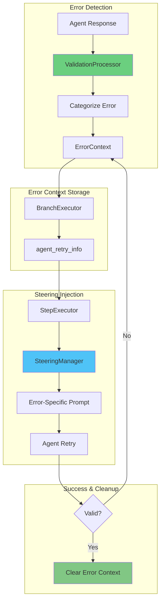

# Steering and Error Recovery

Intelligent guidance and error recovery system for agent retries in MARSYS.

## 🎯 Overview

The **Steering System** provides transient, context-aware prompts to guide agents during error recovery and retries, without polluting agent memory. It works in conjunction with the validation system to deliver targeted, error-specific guidance.

**Key Features:**

- ✅ **Error-Aware Prompts**: Different messages for different error types
- ✅ **Transient Guidance**: Steering messages don't persist in agent memory
- ✅ **Automatic Categorization**: ValidationProcessor classifies errors at source
- ✅ **Configurable Modes**: Control when guidance is injected
- ✅ **Statistics Tracking**: Monitor steering injection patterns
- ✅ **User Feedback Integration**: Clear error context on human intervention

---

## 🏗️ Architecture



---

## 📦 Components

### ValidationErrorCategory

Error categories for targeted steering prompts.

**Location:** `src/marsys/coordination/validation/types.py`

```python
from marsys.coordination.validation import ValidationErrorCategory

class ValidationErrorCategory(Enum):
    """Categories of validation errors for targeted steering."""
    FORMAT_ERROR = "format_error"           # JSON structure, parsing errors
    PERMISSION_ERROR = "permission_error"   # Agent permission denied
    ACTION_ERROR = "action_error"           # Invalid action type
    API_TRANSIENT = "api_transient"         # Rate limit, timeout, network
    API_TERMINAL = "api_terminal"           # Auth failure, invalid model
    TOOL_ERROR = "tool_error"               # Tool execution failure
    UNKNOWN = "unknown"
```

### SteeringManager

Centralized steering prompt construction.

**Location:** `src/marsys/coordination/steering/manager.py`

```python
from marsys.coordination.steering import SteeringManager, SteeringContext, ErrorContext

# Initialize (automatically done by StepExecutor)
steering_manager = SteeringManager()

# Get steering prompt
prompt = steering_manager.get_steering_prompt(context)

# Get statistics
stats = steering_manager.get_stats()
# {
#     "total_injections": 15,
#     "by_mode": {"error": 10, "auto": 3, "always": 2},
#     "by_category": {
#         "format_error": 8,
#         "permission_error": 3,
#         "action_error": 2
#     }
# }
```

---

## ⚙️ Configuration

### Steering Modes

Control when steering guidance is injected:

```python
from marsys.coordination import Orchestra
from marsys.coordination.config import ExecutionConfig

# Mode 1: "error" - Only inject when error occurred (DEFAULT, minimum interference)
result = await Orchestra.run(
    task="Your task",
    topology=topology,
    execution_config=ExecutionConfig(
        steering_mode="error"  # Only on validation/API errors
    )
)

# Mode 2: "auto" - Inject on any retry (balanced)
result = await Orchestra.run(
    task="Your task",
    topology=topology,
    execution_config=ExecutionConfig(
        steering_mode="auto"  # On all retries, error-specific when available
    )
)

# Mode 3: "always" - Inject on every step (maximum guidance)
result = await Orchestra.run(
    task="Your task",
    topology=topology,
    execution_config=ExecutionConfig(
        steering_mode="always"  # Every step, even without errors
    )
)
```

**Mode Comparison:**

| Mode | When Injected | Use Case | Interference Level |
|------|---------------|----------|-------------------|
| `"error"` | Only when error occurred | Production, well-tested agents | Minimal |
| `"auto"` | Any retry (error or exception) | Development, debugging | Balanced |
| `"always"` | Every agent step | Training new agents, testing | Maximum |

---

## 🎯 Error Categories & Prompts

### FORMAT_ERROR

**Triggered by:**
- Empty or None responses
- Invalid JSON structure
- Missing required fields
- Parsing failures

**Steering Prompt:**
```
Your previous response had an incorrect format.

Respond with a single JSON object in a markdown block:
```json
{
  "thought": "your reasoning",
  "next_action": "invoke_agent",
  "action_input": {...}
}
```

Available actions: 'invoke_agent', 'final_response', 'tool_calls'
```

**Example:**
```python
# Agent returns invalid JSON
{"thought": "I'll analyze", next_action: invoke_agent}  # Missing quotes

# ValidationProcessor detects FORMAT_ERROR
# SteeringManager provides JSON structure reminder
# Agent retries with correct format
```

---

### PERMISSION_ERROR

**Triggered by:**
- Invoking unavailable agents
- Using `final_response` without User access
- Topology violations

**Steering Prompt:**
```
Permission denied: Agent DataAnalyzer cannot invoke: ReportWriter

You can only use these actions: invoke_agent

Please choose a valid action from the list above.
```

**Example:**
```python
# Agent tries to invoke unavailable agent
{"next_action": "invoke_agent", "action_input": "ReportWriter"}

# ValidationProcessor checks topology, finds PERMISSION_ERROR
# SteeringManager shows available agents
# Agent retries with valid agent
```

---

### ACTION_ERROR

**Triggered by:**
- Missing `next_action` field
- Invalid action type
- Unsupported action

**Steering Prompt:**
```
Invalid action: unknown_action

Valid actions for this agent: invoke_agent, tool_calls, final_response

Please use one of the valid actions.
```

---

### API_TRANSIENT

**Triggered by:**
- Rate limit errors (429)
- Timeout errors
- Network errors
- Server errors (500-504)

**Steering Prompt:**
```
Previous API call failed: Rate Limit Error. Retrying automatically.

Please proceed with your intended action.
```

**Note:** Minimal guidance for API errors (no format instructions).

---

### API_TERMINAL

**Triggered by:**
- Authentication failures
- Invalid API keys
- Insufficient credits
- Invalid model names

**Steering Prompt:**
```
Critical API error: Authentication failed

This error typically requires configuration changes. Please check your API settings.
```

---

### TOOL_ERROR

**Triggered by:**
- Tool execution failures
- Invalid tool arguments
- Tool not found

**Steering Prompt:**
```
Tool execution failed: Function 'search' not found

Try a different tool or approach.
```

---

## 🔄 Lifecycle

### 1. Error Detection & Categorization

```python
# ValidationProcessor validates agent response
validation = await validator.process_response(
    raw_response=agent_response,
    agent=agent,
    branch=branch,
    exec_state=exec_state
)

# ValidationProcessor sets error_category
if not validation.is_valid:
    validation.error_category = ValidationErrorCategory.FORMAT_ERROR.value
    validation.error_message = "Invalid JSON structure"
    validation.retry_suggestion = "Ensure proper JSON formatting"
```

### 2. Error Context Storage

```python
# BranchExecutor stores error context for next attempt
if not validation.is_valid:
    branch.agent_retry_info[agent_name] = {
        "category": validation.error_category,  # From ValidationProcessor
        "error_message": validation.error_message,
        "retry_suggestion": validation.retry_suggestion,
        "retry_count": retry_count + 1,
        "failed_action": parsed_response.get("next_action")
    }
```

### 3. Steering Injection

```python
# StepExecutor retrieves error context and calls SteeringManager
error_context_dict = context.metadata.get("agent_error_context")

if error_context_dict:
    error_context = ErrorContext(
        category=ValidationErrorCategory(error_context_dict['category']),
        error_message=error_context_dict['error_message'],
        retry_suggestion=error_context_dict.get('retry_suggestion'),
        retry_count=error_context_dict['retry_count']
    )

# Build steering context
steering_ctx = SteeringContext(
    agent_name=agent_name,
    available_actions=["invoke_agent", "final_response"],
    error_context=error_context,
    is_retry=True,
    steering_mode="error"
)

# Get prompt from SteeringManager
steering_prompt = steering_manager.get_steering_prompt(steering_ctx)

# Inject as transient message (not persisted to memory)
run_context["steering_prompt"] = steering_prompt
```

### 4. Agent Retry

```python
# Agent receives steering as last user message
# Steering is transient - not added to permanent memory
agent_response = await agent.run_step(request, run_context)
```

### 5. Success & Cleanup

```python
# On successful validation
if validation.is_valid:
    # Clear error context
    if agent_name in branch.agent_retry_info:
        del branch.agent_retry_info[agent_name]
    logger.debug(f"Cleared error context for {agent_name}")

# On user feedback
if step_result.metadata.get("clear_error_context"):
    # User provided feedback - clear ALL error contexts
    branch.agent_retry_info.clear()
    logger.info("Cleared all error context after user feedback")
```

---

## 📊 Logging & Statistics

### Automatic Logging

SteeringManager logs all injections at INFO level:

```
INFO - Steering injected for DataAnalyzer (mode=error, category=format_error, retry=1)
INFO - Steering injected for ReportWriter (mode=auto, category=permission_error, retry=2)
INFO - Steering injected for Coordinator (mode=always, generic)
INFO - Cleared all error context after user feedback
```

### Statistics Collection

```python
# Access steering statistics
stats = step_executor.steering_manager.get_stats()

print(f"Total injections: {stats['total_injections']}")
print(f"By mode: {stats['by_mode']}")
print(f"By category: {stats['by_category']}")

# Example output:
# Total injections: 15
# By mode: {'error': 10, 'auto': 3, 'always': 2}
# By category: {'format_error': 8, 'permission_error': 3, 'action_error': 2}
```

---

## 🎓 Best Practices

### 1. Use "error" Mode in Production

```python
# ✅ GOOD - Minimal interference for production
config = ExecutionConfig(steering_mode="error")

# ❌ BAD - Too much guidance in production
config = ExecutionConfig(steering_mode="always")
```

### 2. Monitor Steering Statistics

```python
# Track steering patterns to identify problem areas
stats = steering_manager.get_stats()

if stats['by_category'].get('permission_error', 0) > 5:
    logger.warning("High permission errors - check topology configuration")

if stats['by_category'].get('format_error', 0) > 10:
    logger.warning("High format errors - improve agent prompts")
```

### 3. Clear Context on User Feedback

```python
# User feedback supersedes all previous errors
# System automatically clears error context when user interacts

# UserNodeHandler signals cleanup
return StepResult(
    agent_name="User",
    response=user_response,
    success=True,
    metadata={"clear_error_context": True}  # Automatic cleanup
)
```

### 4. Provide Specific Error Messages

```python
# ✅ GOOD - Specific error for better steering
if not invocations:
    return ValidationResult(
        is_valid=False,
        error_message="Missing invocations for agent invocation",
        retry_suggestion="You indicated 'invoke_agent' but didn't specify which agent.",
        error_category=ValidationErrorCategory.FORMAT_ERROR.value
    )

# ❌ BAD - Generic error
return ValidationResult(
    is_valid=False,
    error_message="Invalid response"
)
```

---

## 🔧 Advanced Usage

### Custom Steering Modes

For advanced use cases, you can extend SteeringManager:

```python
from marsys.coordination.steering import SteeringManager

class CustomSteeringManager(SteeringManager):
    """Custom steering with domain-specific logic."""

    def _build_error_prompt(self, context):
        """Override to add custom error handling."""
        error = context.error_context

        # Custom logic for your domain
        if error.category == ValidationErrorCategory.FORMAT_ERROR:
            if "medical" in context.agent_name.lower():
                return self._medical_format_prompt(context)

        # Fallback to default
        return super()._build_error_prompt(context)

    def _medical_format_prompt(self, context):
        """Domain-specific prompt for medical agents."""
        return """
Your previous response had an incorrect medical report format.

Please use this structure:
```json
{
  "diagnosis": "...",
  "treatment": "...",
  "confidence": 0.95
}
```
"""
```

### Conditional Steering

```python
# Apply different steering modes based on agent type
if agent.name.startswith("Experimental_"):
    steering_mode = "always"  # More guidance for experimental agents
elif agent.name in critical_agents:
    steering_mode = "error"  # Minimal interference for critical path
else:
    steering_mode = "auto"  # Balanced for others

config = ExecutionConfig(steering_mode=steering_mode)
```

---

## 🚦 Troubleshooting

### Issue: Too Much Steering

**Symptom:** Agents receive guidance on every step

**Solution:**
```python
# Change mode from "always" to "error"
config = ExecutionConfig(steering_mode="error")
```

---

### Issue: Not Enough Guidance

**Symptom:** Agents fail repeatedly without help

**Solution:**
```python
# Use "auto" mode for more guidance
config = ExecutionConfig(steering_mode="auto")

# Or check if errors are being categorized
logger.setLevel(logging.DEBUG)  # See steering injection logs
```

---

### Issue: Stale Error Context

**Symptom:** Old error messages persist

**Solution:**
```python
# Error context should auto-clear on success
# If not, check:
# 1. Is validation.is_valid being set correctly?
# 2. Is error_context being cleared in BranchExecutor?
# 3. Are you using User node feedback to clear context?

# Manual reset (for debugging only)
branch.agent_retry_info.clear()
```

---

### Issue: Wrong Error Category

**Symptom:** Steering provides incorrect guidance

**Solution:**
```python
# ValidationProcessor should set error_category
# Ensure error messages are specific:

# ✅ GOOD - Clear permission error
"Agent DataAnalyzer cannot invoke: ReportWriter"

# ❌ BAD - Ambiguous error
"Invalid response"

# Check categorization logic in ValidationProcessor
```

---

## 📋 API Reference

### SteeringContext

```python
@dataclass
class SteeringContext:
    agent_name: str
    available_actions: List[str]
    error_context: Optional[ErrorContext] = None
    is_retry: bool = False
    steering_mode: str = "error"
```

### ErrorContext

```python
@dataclass
class ErrorContext:
    category: ValidationErrorCategory
    error_message: str
    retry_suggestion: Optional[str] = None
    retry_count: int = 0
    classification: Optional[str] = None  # For API errors
    failed_action: Optional[str] = None
```

### SteeringManager Methods

```python
class SteeringManager:
    def get_steering_prompt(self, context: SteeringContext) -> Optional[str]:
        """Get steering prompt for given context."""

    def get_stats(self) -> dict:
        """Get steering injection statistics."""

    def _build_error_prompt(self, context: SteeringContext) -> str:
        """Build error-category-specific prompt."""

    def _build_generic_prompt(self, context: SteeringContext) -> str:
        """Build generic steering prompt."""
```

---

## 🚀 Next Steps

<div class="grid cards" markdown="1">

- :material-alert:{ .lg .middle } **[Error Handling](../concepts/error-handling.md)**

    ---

    Comprehensive error handling system

- :material-cog:{ .lg .middle } **[Configuration](../api/configuration.md)**

    ---

    Complete configuration reference

- :material-check:{ .lg .middle } **[Validation](../api/validation.md)**

    ---

    Response validation system

- :material-account:{ .lg .middle } **[User Recovery](../concepts/communication.md)**

    ---

    Human-in-the-loop error handling

</div>

---

!!! success "Steering System Ready!"
    You now understand MARSYS steering and error recovery. Use error-specific guidance to improve agent reliability and reduce retry failures.
