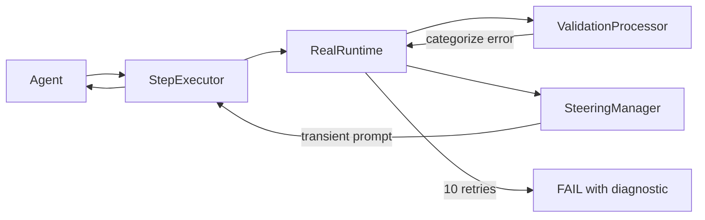

# Steering and Error Recovery

!!! warning "Deprecated terminology on this page"
    This page references APIs that were renamed or removed in **MARSYS v0.3.0**. The legacy JSON `next_action` response format is gone; agents now emit native tool calls. See the [terminology migration table](../architecture/framework/decisions/ADR-006-deprecation-timeline.md#migration-table) for canonical replacements.

Intelligent guidance and error recovery for agent retries. The steering system pushes transient, context-aware prompts at agents when validation or runtime issues occur, without polluting agent memory.

## Overview

When an agent's response fails validation — most commonly because it produced text content but no coordination tool call — the orchestrator must decide what to do next. Three things happen, in order:

1. **`ValidationProcessor`** classifies the failure into a `ValidationErrorCategory` (action, permission, format, transient, terminal, tool).
2. **`SteeringManager`** constructs a **transient prompt** tailored to the error category and retry count. The prompt rides along on the next step but is not added to the agent's persistent memory.
3. If the agent keeps producing content-only responses despite steering, **`RealRuntime`** enforces a hard limit (`CONTENT_ONLY_HARD_LIMIT = 10`). After 10 consecutive content-only responses, the branch fails with a structured diagnostic.

## Architecture


```mermaid
flowchart LR
    Agent --> Step[StepExecutor]
    Step --> RT[RealRuntime]
    RT --> VP[ValidationProcessor]
    VP -->|categorize error| RT
    RT --> SM[SteeringManager]
    SM -->|transient prompt| Step
    Step --> Agent
    RT -->|10 retries| Fail[FAIL with diagnostic]
```

`RealRuntime.step()` (source: `src/marsys/coordination/execution/real_runtime.py:69`) drives one branch tick and is responsible for the steering escalation.

## Retry-tiered steering messages

The most common failure mode in MARSYS is an agent emitting an assistant message with text content but no coordination tool call. `SteeringManager._action_error_prompt` (source: `src/marsys/coordination/steering/manager.py:157`) responds with **three escalating tiers** keyed off the retry count.

### Tier 1: retries 1–2 — generic

Names the available coordination tools and asks the agent to pick one:

```
Action error: <validation message>

Available coordination tools: invoke_agent, terminate_workflow
Please call one of these to advance the workflow.
```

### Tier 2: retry 3 — emphasizes tool choice

```
Still no coordination tool call detected. You must select one of these tools and invoke it: invoke_agent, terminate_workflow.
Pick the one that matches your task and call it now — text content alone does not advance the workflow.
```

### Tier 3: retry 4+ — names the specific peer

Built from the agent's topology neighbors:

```
Repeated content-only response (retry 4). You are agent 'Researcher'. Your peer is 'Coordinator'; send your output via `invoke_agent(target='Coordinator', request=<your output>)`. Available coordination tools: invoke_agent.
```

For agents with `terminate_workflow` access (edge to End det-node) but no peer:

```
Repeated content-only response (retry 4). You are agent 'Coordinator'. Call `terminate_workflow(answer=<your final answer>)` to deliver the workflow's final answer. Available coordination tools: terminate_workflow.
```

For agents with `ask_user` access (edge to User det-node):

```
Repeated content-only response (retry 4). You are agent 'Assistant'. Call `ask_user(question=<your question>)` to query the user. Available coordination tools: ask_user.
```

The tiered escalation prevents LLMs from "repetition collapse" — re-emitting the same content with the same generic hint indefinitely.

## The hard limit

After `CONTENT_ONLY_HARD_LIMIT = 10` consecutive content-only responses (constant at `src/marsys/coordination/execution/real_runtime.py:34`), `RealRuntime` fails the branch with a structured diagnostic from `_build_content_only_diagnostic` (line 273):

```
Content-only loop detected: agent 'Researcher' produced 10 consecutive responses with no
coordination tool call. Available coordination tools: ['invoke_agent']. Available regular
tools: ['web_search']. Last assistant content snippet: 'Here are my findings about ...'.
Likely cause: the agent's instruction asks for an action that doesn't match its available
coordination tools, or the topology has no edge that exposes the right tool. Review the
agent's instruction and the topology gating.
```

The diagnostic includes:

- The agent name and the consecutive-failure count.
- The **coordination tools the agent actually had** (driven by topology gating — see [Coordination Tools](../concepts/coordination-tools.md)).
- The **regular tools the agent had** (from its `tools_schema`).
- A **snippet of the last assistant content** (truncated to 200 chars).
- A pointer at the likely root cause: instruction-topology mismatch.

When you see this diagnostic, the fix is almost always one of:

1. **Instruction-topology mismatch** — the agent's instruction asks it to "respond with a final_response" but there's no edge from the agent to `End`, so `terminate_workflow` is not in its tool schema.
2. **Naming drift** — the instruction names a peer that doesn't have an outgoing edge from this agent.
3. **Missing det-node** — the workflow has no `EndNode`, so no agent can terminate the workflow.

## Error categories

`ValidationErrorCategory` (source: `src/marsys/coordination/validation/types.py`) classifies errors so steering can be targeted:

| Category | Trigger | Steering response |
|---|---|---|
| `ACTION_ERROR` | Agent produced text but no coordination tool call | Retry-tiered (above) |
| `PERMISSION_ERROR` | Agent invoked a target it doesn't have a topology edge to, or used a coordination tool gated off its outgoing edges | Lists available coordination tools and asks the agent to use one |
| `API_TRANSIENT` | Rate-limit (429), timeout, network, server (5xx) | Minimal prompt: "Previous API call failed: <classification>. Retrying automatically. Please proceed with your intended action." |
| `API_TERMINAL` | Auth failure, invalid key, insufficient credits, invalid model | Branch fails — not retried |
| `TOOL_ERROR` | Regular tool execution failure | Tool-specific guidance |
| `FORMAT_ERROR` | Reserved for legacy parser; rare under native tool calls | Generic format hint |

## Worked example: instruction-topology mismatch

The most common failure path. A user writes:

```python
researcher = Agent(
    name="Researcher",
    instruction="Research the topic and respond with a final_response containing your findings.",
)

topology = Topology(
    nodes=[Node("Start", kind="start"), Node("Coordinator"), Node("Researcher"), Node("End", kind="end")],
    edges=[
        Edge("Start", "Coordinator"),
        Edge("Coordinator", "Researcher"),
        Edge("Researcher", "Coordinator"),
        Edge("Coordinator", "End"),
    ],
)
```

Researcher has **no edge to `End`**, so `terminate_workflow` is **not** in its tool schema. But the instruction tells it to "respond with a final_response". The agent will keep emitting text content; tier-1 → tier-2 → tier-3 steering kicks in but the agent has no `terminate_workflow` to call. After 10 retries, the branch fails with the diagnostic above.

**Fix:** rewrite the instruction so it matches the topology gating:

```python
researcher = Agent(
    name="Researcher",
    instruction=(
        "Research the topic. When done, call `invoke_agent` with target='Coordinator' "
        "and the findings as the request to send your results back."
    ),
)
```

Now Researcher's instruction names `invoke_agent("Coordinator", ...)` — a tool it actually has, pointing at a peer it actually has an edge to.

## Configuration

Three steering modes (`ExecutionConfig.steering_mode`):

| Mode | When injected | Use case |
|---|---|---|
| `"error"` | Only when the previous step had a validation error (default) | Production, well-tested agents |
| `"auto"` | On any retry — error-specific when available, otherwise generic | Development, debugging |
| `"always"` | Every step, even without errors | Training new agents, regression testing |

```python
from marsys.coordination.config import ExecutionConfig

config = ExecutionConfig(steering_mode="auto")
```

Modes are aliased: `"never"` → `"error"`.

## Statistics

`SteeringManager` tracks injection counts:

```python
stats = step_executor.steering_manager.get_stats()
# {
#     "total_injections": 15,
#     "by_mode": {"error": 10, "auto": 3, "always": 2},
#     "by_category": {
#         "action_error": 8,
#         "permission_error": 3,
#         "api_transient": 2,
#     },
# }
```

Use these to spot systemic problems: a high `action_error` count usually means an agent's instruction doesn't match its topology gating.

## API reference

### SteeringContext

```python
@dataclass
class SteeringContext:
    agent_name: str
    available_actions: List[str]               # From topology
    error_context: Optional[ErrorContext] = None
    is_retry: bool = False
    steering_mode: str = "error"
    topology_neighbors: List[str] = None       # Peer agents reachable
```

Source: `src/marsys/coordination/steering/manager.py:29`.

### ErrorContext

```python
@dataclass
class ErrorContext:
    category: ValidationErrorCategory
    error_message: str
    retry_suggestion: Optional[str] = None
    retry_count: int = 0
    classification: Optional[str] = None       # API error subclass
    failed_action: Optional[str] = None        # Which action attempted
```

### Configurable thresholds

| Name | Default | ExecutionConfig field | Module fallback |
|------|---------|----------------------|-----------------|
| Steering threshold | `2` | `content_only_steering_threshold` | `real_runtime.py:33` (`CONTENT_ONLY_STEERING_THRESHOLD`) |
| Hard limit | `10` | `content_only_hard_limit` | `real_runtime.py:34` (`CONTENT_ONLY_HARD_LIMIT`) |

Both values are configurable per-workflow via `ExecutionConfig` (added in commit `73ee5a3`). `RealRuntime` reads the values from `self.execution_config`, falling back to the module constants when the config field is missing (test-friendly default). `ExecutionConfig.__post_init__` validates that `content_only_steering_threshold < content_only_hard_limit`.

```python
config = ExecutionConfig(
    content_only_steering_threshold=3,   # delay steering one more round
    content_only_hard_limit=15,          # give the agent more chances
)
```

The threshold controls when steering activates; the hard limit controls when the branch fails.

## Related documentation

- [Validation API](../api/validation.md) — `ValidationProcessor` and `ActionType`.
- [Coordination Tools](../concepts/coordination-tools.md) — topology gating that determines `available_actions`.
- [Det-nodes](../concepts/det-nodes.md) — `Start`, `End`, `User` and how their edges expose coordination tools.
- [Communication](../concepts/communication.md) — human-in-the-loop recovery.
- [ADR-006: Deprecation timeline](../architecture/framework/decisions/ADR-006-deprecation-timeline.md).
