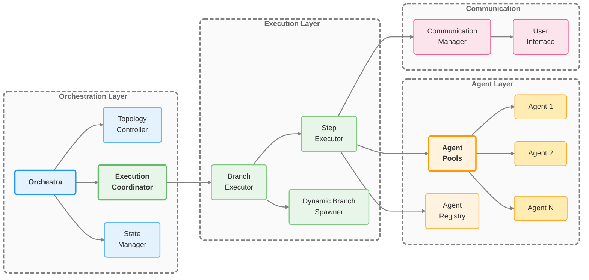

# MARSYS - Multi-Agent Reasoning Systems

<div class="hero-section" markdown="1">

## 🤖 Build Powerful AI Systems with Collaborative Agents

A beta Python framework for creating, orchestrating, and training multiple AI agents that work together to solve complex tasks.

<div class="hero-buttons">
  <a href="getting-started/" class="md-button md-button--primary">🚀 Get Started</a>
  <a href="https://github.com/rezaho/MARSYS" class="md-button">💻 View on GitHub</a>
  <a href="getting-started/quick-start/" class="md-button">⚡ Quick Start</a>
</div>

</div>

---

## What is MARSYS?

**MARSYS (Multi-Agent Reasoning Systems)** is a beta framework for building intelligent systems where multiple AI agents collaborate to solve complex problems. Unlike single-agent approaches, MARSYS enables:

- **🔄 Dynamic Agent Coordination**: Runtime parallel execution with automatic convergence
- **🧠 Intelligent Routing**: Graph-based agent communication and permission management
- **💾 State Persistence**: Pause, resume, and checkpoint long-running workflows
- **🔌 Universal Model Support**: Works with OpenAI, Anthropic, Google, and local models
- **🌐 Browser Automation**: Built-in web interaction capabilities with Playwright
- **👥 Human-in-the-Loop**: Seamless integration of human feedback and decisions

## Key Features

<div class="grid cards" markdown="1">

- :material-shield-check:{ .lg .middle } **Error Recovery & Observability**

    ---

    Comprehensive error handling, automatic retries, detailed logging, and execution observability

- :material-graph:{ .lg .middle } **Flexible Workflows**

    ---

    Support for virtually any multi-agent pattern with runtime modification and dynamic branching

- :material-scale-balance:{ .lg .middle } **Concurrent Agents**

    ---

    Run multiple agents concurrently with isolated instances and automatic resource management

- :material-database:{ .lg .middle } **Workflow Persistence**

    ---

    Save, pause, and resume long-running workflows with automatic checkpointing and recovery

- :material-tools:{ .lg .middle } **Automatic Tool Integration**

    ---

    Convert any Python function to an agent tool with automatic schema generation from signatures

- :material-account-group:{ .lg .middle } **Human-in-the-Loop**

    ---

    Integrate human feedback and decisions at any point in the workflow with rich interfaces

</div>

## Quick Start

### 1️⃣ Install MARSYS
```bash
pip install marsys
# or from source
git clone https://github.com/rezaho/MARSYS.git
cd MARSYS
pip install -e .
```

### 2️⃣ Run Your First Multi-Agent System
```python
from src.coordination import Orchestra
from src.agents import Agent
from src.models import ModelConfig

# Create specialized agents
model_config = ModelConfig(
    type="api",
    name="gpt-5",
    provider="openai"
)

researcher = Agent(
    model_config=model_config,
    agent_name="Researcher",
    description="Expert at finding and analyzing information"
)

writer = Agent(
    model_config=model_config,
    agent_name="Writer",
    description="Skilled at creating clear, engaging content"
)

# Define agent connections
topology = {
    "nodes": ["Researcher", "Writer"],
    "edges": ["Researcher -> Writer"]
}

# Run the multi-agent system
result = await Orchestra.run(
    task="Research AI trends and write a summary",
    topology=topology
)

print(result.final_response)
```

## Architecture Overview



## Documentation

!!! tip "New to MARSYS?"
    Start with our [Quick Start Guide](getting-started/quick-start/) to build your first multi-agent system in minutes!

| Section | Description | Best For |
|---------|-------------|----------|
| **[Getting Started](getting-started/)** | Installation, setup, first steps | New users |
| **[Concepts](concepts/)** | Core ideas and architecture | Understanding the framework |
| **[Tutorials](tutorials/)** | Step-by-step guides | Learning by doing |
| **[API Reference](api/)** | Complete API documentation | Implementation details |
| **[Use Cases](use-cases/)** | Real-world examples | Inspiration and patterns |
| **[Contributing](contributing/)** | Development guide | Contributors |

## Why MARSYS?

### **For Developers**
- 🎯 **Simple API**: Start with one line, scale to complex workflows
- 🔧 **Extensible**: Custom agents, tools, and communication channels
- 📝 **Well-Documented**: Comprehensive guides with real examples
- 🧪 **Tested**: 100% test coverage with integration tests

### **For Teams**
- 💼 **Robust Error Handling**: Recovery mechanisms, retries, and monitoring built-in
- 📊 **Observable**: Rich status updates and event broadcasting
- 🔐 **Secure**: Permission-based agent communication
- 📈 **Scalable**: From single agents to complex multi-agent systems

### **For Research**
- 🧠 **Learning Capabilities**: PEFT fine-tuning support
- 🔬 **Experimentation**: Multiple workflow patterns to test
- 📊 **Metrics**: Built-in performance tracking
- 🔄 **Reproducible**: State persistence and checkpointing


## Community & Support

<div class="grid cards" markdown="1">

- :material-github:{ .lg .middle } **GitHub**

    ---

    [Report issues, request features, and contribute](https://github.com/rezaho/MARSYS)

- :fontawesome-brands-discord:{ .lg .middle } **Discord**

    ---

    [Join our community for discussions and help](https://discord.gg/marsys)

- :material-file-document:{ .lg .middle } **Documentation**

    ---

    [Comprehensive guides and API reference](https://marsys.io/docs)


</div>

## Ready to Build?

<div class="hero-buttons" style="text-align: center; margin: 2em 0;">
  <a href="getting-started/installation/" class="md-button md-button--primary">📦 Install MARSYS</a>
  <a href="getting-started/quick-start/" class="md-button md-button--primary">⚡ Quick Start Guide</a>
  <a href="concepts/" class="md-button">📚 Learn Concepts</a>
</div>

---

<div style="text-align: center; color: var(--md-default-fg-color--light);">
  <p>Built with ❤️ by the MARSYS Team | MIT License | v0.1-beta</p>
</div>