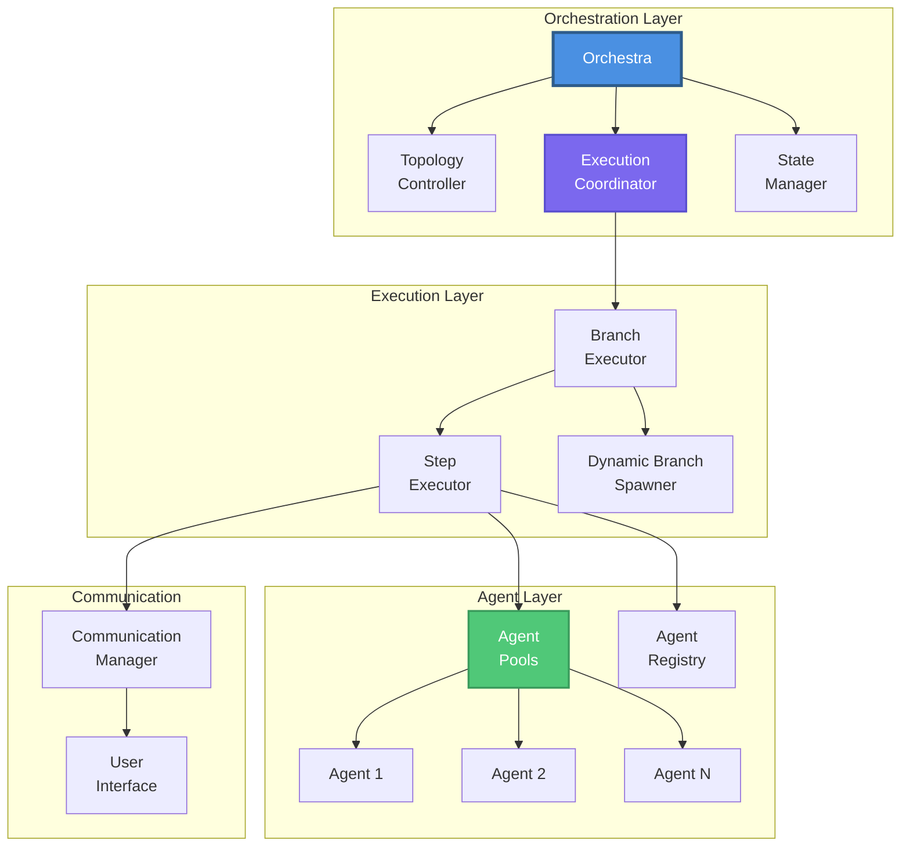

# MARSYS - Multi-Agent Reasoning Systems

<div class="hero-section" markdown="1">

## 🤖 Build Powerful AI Systems with Collaborative Agents

A beta Python framework for creating, orchestrating, and training multiple AI agents that work together to solve complex tasks.

<div class="hero-buttons">
  <a href="getting-started/" class="md-button md-button--primary">🚀 Get Started</a>
  <a href="https://github.com/rezaho/MARSYS" class="md-button">💻 View on GitHub</a>
  <a href="getting-started/quick-start/" class="md-button">⚡ Quick Start</a>
</div>

</div>

---

## What is MARSYS?

**MARSYS (Multi-Agent Reasoning Systems)** is a beta framework for building intelligent systems where multiple AI agents collaborate to solve complex problems. Unlike single-agent approaches, MARSYS enables:

- **🔄 Dynamic Agent Orchestration**: Runtime parallel execution with automatic convergence
- **🧠 Intelligent Routing**: Topology-driven agent communication and permission management
- **💾 State Persistence**: Pause, resume, and checkpoint long-running workflows
- **🔌 Universal Model Support**: Works with OpenAI, Anthropic, Google, and local models
- **🌐 Browser Automation**: Built-in web interaction capabilities with Playwright
- **👥 Human-in-the-Loop**: Seamless integration of human feedback and decisions

## Key Features

<div class="grid cards" markdown="1">

- :material-shield-check:{ .lg .middle } **Error Recovery & Observability**

    ---

    Comprehensive error handling, automatic retries, detailed logging, and execution observability

- :material-graph:{ .lg .middle } **Flexible Topologies**

    ---

    8 pre-defined patterns: hub-and-spoke, pipeline, mesh, hierarchical, and more

- :material-scale-balance:{ .lg .middle } **True Parallelism**

    ---

    Agent pools with isolated execution contexts for genuine concurrent processing

- :material-database:{ .lg .middle } **State Management**

    ---

    Built-in persistence with checkpointing, pause/resume, and session recovery

- :material-tools:{ .lg .middle } **Rich Tool System**

    ---

    Automatic schema generation, flexible tool integration, and browser automation

- :material-account-group:{ .lg .middle } **User Interaction**

    ---

    Multiple communication channels with rich formatting and interactive dialogues

</div>

## Quick Example

```python
from src.coordination import Orchestra
from src.agents import Agent
from src.models import ModelConfig

# Create specialized agents with same model configuration
model_config = ModelConfig(
    type="api",
    name="gpt-5",
    provider="openai"
)

researcher = Agent(
    model_config=model_config,
    agent_name="Researcher",
    description="Expert at finding and analyzing information"
)

writer = Agent(
    model_config=model_config,
    agent_name="Writer",
    description="Skilled at creating clear, engaging content"
)

# Define workflow - Researcher analyzes, then Writer summarizes
topology = {
    "nodes": ["Researcher", "Writer"],
    "edges": ["Researcher -> Writer"]
}

# Run the multi-agent system
result = await Orchestra.run(
    task="Research AI trends and write a summary",
    topology=topology
)

print(result.final_response)
```

## Architecture Overview



## Learn MARSYS

<div class="feature-grid" markdown="1">

<div class="feature-card" markdown="1">

### 🏁 [Getting Started](getting-started/)

Installation, configuration, and your first multi-agent system

- [Installation Guide](getting-started/installation/)
- [Quick Start Tutorial](getting-started/quick-start/)
- [Your First Agent](getting-started/first-agent/)
- [Configuration Options](getting-started/configuration/)

</div>

<div class="feature-card" markdown="1">

### 🧩 [Core Concepts](concepts/)

Understand the framework's architecture and components

- [Agents & Memory](concepts/agents/)
- [Topology System](concepts/advanced/topology/)
- [Execution Model](concepts/index/)
- [Communication](concepts/communication/)

</div>

<div class="feature-card" markdown="1">

### 💡 [Use Cases](use-cases/)

Real-world applications and example implementations

- Research Assistant Teams
- Customer Support Systems
- Data Pipeline Automation
- Collaborative Development

</div>

<div class="feature-card" markdown="1">

### 📖 [API Reference](api/)

Complete documentation of classes and methods

- [Orchestra API](api/overview/)
- [Agent Classes](api/agent-class/)
- [Model Configurations](api/models/)
- [Topology Patterns](api/overview/#topology)

</div>

</div>

## Why MARSYS?

### **For Developers**
- 🎯 **Simple API**: Start with one line, scale to complex workflows
- 🔧 **Extensible**: Custom agents, tools, and communication channels
- 📝 **Well-Documented**: Comprehensive guides with real examples
- 🧪 **Tested**: 100% test coverage with integration tests

### **For Teams**
- 💼 **Robust Error Handling**: Recovery mechanisms, retries, and monitoring built-in
- 📊 **Observable**: Rich status updates and event broadcasting
- 🔐 **Secure**: Permission-based agent communication
- 📈 **Scalable**: From single agents to complex multi-agent systems

### **For Research**
- 🧠 **Learning Capabilities**: PEFT fine-tuning support
- 🔬 **Experimentation**: Multiple topology patterns to test
- 📊 **Metrics**: Built-in performance tracking
- 🔄 **Reproducible**: State persistence and checkpointing

## Quick Start in 3 Steps

### 1️⃣ Install MARSYS
```bash
pip install marsys
# or from source
git clone https://github.com/rezaho/MARSYS.git
cd MARSYS
pip install -e .
```

### 2️⃣ Create Your First Agent
```python
from src.agents import Agent
from src.models import ModelConfig

agent = Agent(
    model_config=ModelConfig(
        type="api",
        name="gpt-4",
        provider="openai"
    ),
    agent_name="Assistant",
    description="A helpful AI assistant"
)
```

### 3️⃣ Run a Multi-Agent Workflow
```python
from src.coordination import Orchestra

result = await Orchestra.run(
    task="Research and summarize AI trends",
    topology={
        "nodes": ["Researcher", "Writer"],
        "edges": ["Researcher -> Writer"]
    }
)
```

## Documentation Structure

!!! tip "New to MARSYS?"
    Start with our [Quick Start Guide](getting-started/quick-start/) to build your first multi-agent system in minutes!

| Section | Description | Best For |
|---------|-------------|----------|
| **[Getting Started](getting-started/)** | Installation, setup, first steps | New users |
| **[Concepts](concepts/)** | Core ideas and architecture | Understanding the framework |
| **[Tutorials](tutorials/)** | Step-by-step guides | Learning by doing |
| **[API Reference](api/)** | Complete API documentation | Implementation details |
| **[Use Cases](use-cases/)** | Real-world examples | Inspiration and patterns |
| **[Contributing](contributing/)** | Development guide | Contributors |


## Community & Support

<div class="grid cards" markdown="1">

- :material-github:{ .lg .middle } **GitHub**

    ---

    [Report issues, request features, and contribute](https://github.com/rezaho/MARSYS)

- :fontawesome-brands-discord:{ .lg .middle } **Discord**

    ---

    [Join our community for discussions and help](https://discord.gg/marsys)

- :material-file-document:{ .lg .middle } **Documentation**

    ---

    [Comprehensive guides and API reference](https://marsys.io/docs)


</div>

## Ready to Build?

<div class="hero-buttons" style="text-align: center; margin: 2em 0;">
  <a href="getting-started/installation/" class="md-button md-button--primary">📦 Install MARSYS</a>
  <a href="getting-started/quick-start/" class="md-button md-button--primary">⚡ Quick Start Guide</a>
  <a href="concepts/" class="md-button">📚 Learn Concepts</a>
</div>

---

<div style="text-align: center; color: var(--md-default-fg-color--light);">
  <p>Built with ❤️ by the MARSYS Team | MIT License | v1.0.0</p>
</div>