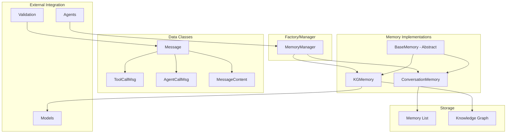
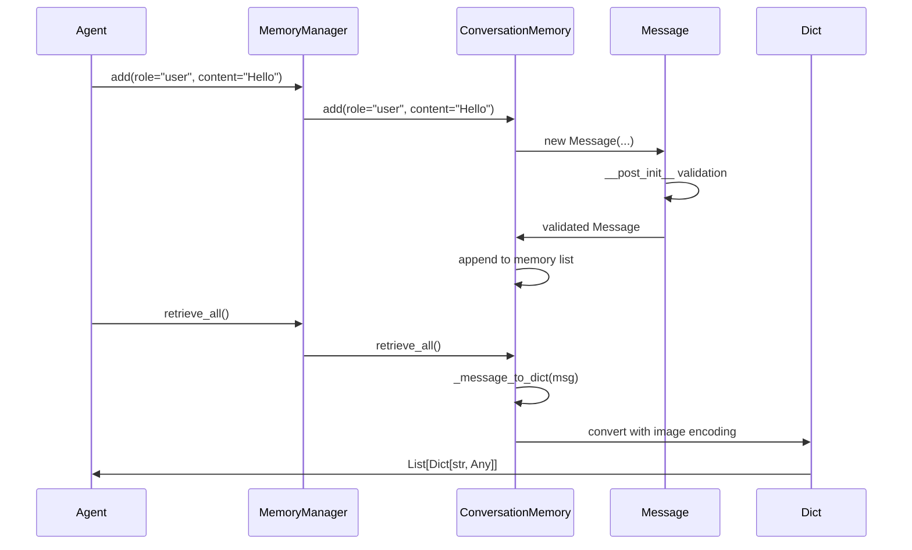
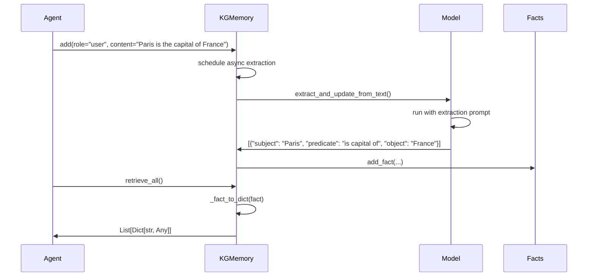

# Memory Module Documentation

## Overview

The Memory module provides a flexible and extensible system for managing conversation history and knowledge in multi-agent AI systems. It implements a clean abstraction layer that separates storage/retrieval concerns from formatting, enabling agents to maintain context, store facts, and retrieve information in a format ready for AI models.

## System Architecture

### Core Components



### Data Flow

#### 1. Message Creation and Storage



**Input/Output Specification:**
- **Input**: Raw data (role, content, tool_calls, etc.) or Message object
- **Output**: `List[Dict[str, Any]]` with standardized format:
  ```python
  {
      "role": "user",
      "content": "Hello",
      "name": "optional_name",
      "tool_calls": [...],  # If present
      "images": [...]       # Base64 encoded if present
  }
  ```

#### 2. Knowledge Graph Flow



### Memory Storage Architecture

The memory module uses different storage strategies based on the memory type:

```python
class BaseMemory(ABC):
    """Abstract base defining the memory contract"""
    
    @abstractmethod
    def add(self, message: Optional[Message] = None, **kwargs) -> str:
        """Add new message to memory and return message ID"""
        pass
    
    @abstractmethod
    def update(self, message_id: str, **kwargs) -> None:
        """Update existing message by ID"""
        pass
    
    @abstractmethod
    def retrieve_all(self) -> List[Dict[str, Any]]:
        """Retrieve all messages as dicts"""
        pass
    
    @abstractmethod
    def retrieve_recent(self, n: int = 1) -> List[Dict[str, Any]]:
        """Retrieve n most recent messages"""
        pass
```

## Component Cards

### Message

**Purpose**: Core data structure for storing conversation messages with validation

**Key Features**:
- Automatic validation of structure
- Support for multimodal content (text + images)
- Tool call and agent call representations
- Unique message IDs
- Image path to base64 conversion

**Structure**:
```python
@dataclass
class Message:
    """Represents a single message in a conversation, with a unique ID."""
    role: str  # "user", "assistant", "system", "tool"
    content: Optional[Union[str, Dict[str, Any]]] = None  # Can be string or dict
    message_id: str = field(default_factory=lambda: str(uuid.uuid4()))
    name: Optional[str] = None  # For tool name or assistant/agent name
    tool_calls: Optional[List[ToolCallMsg]] = None  # Assistant requesting tools
    agent_calls: Optional[List[AgentCallMsg]] = None  # Assistant requesting agents
    structured_data: Optional[Dict[str, Any]] = None  # Structured data from agents
    images: Optional[List[str]] = None  # Image paths/URLs for vision models
    # Note: metadata field removed for coordination system compatibility
```

**Key Methods**:
- `__post_init__()`: Validates and converts dict inputs to proper dataclasses
- `_encode_image_to_base64()`: Converts image paths to base64 for API consumption
- `from_response_dict()`: Factory method for creating from API responses

### ConversationMemory

**Purpose**: Linear conversation history storage

**Key Features**:
- Maintains message order
- System message preservation
- Efficient retrieval by recency, role, or ID
- Automatic dict conversion for AI models
- Image encoding on retrieval

**Configuration**:
```python
memory = ConversationMemory(
    description="You are a helpful assistant"  # Optional system message
)
```

**Key Methods**:
- `add()`: Add new message to conversation and return message ID
- `update()`: Update existing message by ID
- `retrieve_recent(n)`: Get n most recent messages
- `retrieve_by_role(role)`: Filter messages by role
- `reset_memory()`: Clear while preserving system message

### KGMemory

**Purpose**: Knowledge graph memory for fact storage

**Key Features**:
- Stores facts as (subject, predicate, object) triplets
- Automatic fact extraction from text using LLM
- Timestamp-based ordering
- Role-based fact filtering

**Configuration**:
```python
memory = KGMemory(
    model=llm_instance,  # Required for fact extraction
    description="Initial system context"
)
```

**Key Methods**:
- `add()`: Add raw content and schedule fact extraction, returns message ID
- `add_fact()`: Directly add structured fact triplet
- `extract_and_update_from_text()`: Extract facts from text using LLM
- `retrieve_recent(n)`: Get n most recent facts
- `retrieve_by_role(role)`: Filter facts by source role

### MemoryManager

**Purpose**: Factory and delegation layer for memory implementations

**Key Features**:
- Unified interface for different memory types
- Automatic memory type selection
- Consistent API across implementations

**Configuration**:
```python
# Conversation memory
manager = MemoryManager(
    memory_type="conversation_history",
    description="System prompt"
)

# Knowledge graph memory
manager = MemoryManager(
    memory_type="kg",
    model=llm_instance,
    description="System context"
)
```

**Key Methods**:
- `add()`: Delegates to underlying memory's add method, returns message ID
- `update()`: Delegates to underlying memory's update method
- `retrieve_all()`: Get all messages/facts as dicts
- `retrieve_recent()`: Get recent messages/facts
- `reset_memory()`: Clear memory while preserving system messages

## Data Classes

### ToolCallMsg

**Purpose**: Represents a tool/function call request

**Structure**:
```python
@dataclass
class ToolCallMsg:
    id: str
    call_id: str
    type: str
    name: str
    arguments: str  # JSON string
```

### AgentCallMsg

**Purpose**: Represents an agent invocation request

**Structure**:
```python
@dataclass
class AgentCallMsg:
    agent_name: str
    request: Any
```

### MessageContent

**Purpose**: Structured content for agent actions (deprecated in favor of direct dict usage)

**Structure**:
```python
@dataclass
class MessageContent:
    thought: Optional[str] = None
    next_action: Optional[str] = None  # "call_tool", "invoke_agent", "final_response"
    action_input: Optional[Dict[str, Any]] = None
```

## API Reference

### ConversationMemory.add()

```python
def add(
    self,
    message: Optional[Message] = None,
    *,
    role: Optional[str] = None,
    content: Optional[Union[str, Dict[str, Any]]] = None,
    name: Optional[str] = None,
    tool_calls: Optional[List[Union[Dict[str, Any], ToolCallMsg]]] = None,
    agent_calls: Optional[List[Union[Dict[str, Any], AgentCallMsg]]] = None,
    images: Optional[List[str]] = None,
) -> str:
    """
    Adds a new message to the conversation history and returns the message ID.
    
    Args:
        message: Pre-created Message object (takes precedence)
        role: Message role ("user", "assistant", "system", "tool")
        content: Message content (str or dict)
        name: Optional name field
        tool_calls: List of tool calls
        agent_calls: List of agent calls
        images: List of image file paths
    
    Returns:
        str: The auto-generated message ID (UUID)
    
    Raises:
        MessageError: If neither message nor role is provided
    """
```

### KGMemory.add()

```python
def add(
    self,
    message: Optional[Message] = None,
    *,
    role: Optional[str] = None,
    content: Optional[Union[str, Dict[str, Any]]] = None,
    name: Optional[str] = None,
    tool_calls: Optional[List[Union[Dict[str, Any], ToolCallMsg]]] = None,
    agent_calls: Optional[List[Union[Dict[str, Any], AgentCallMsg]]] = None,
    images: Optional[List[str]] = None,
) -> str:
    """
    Adds raw content to KG memory and schedules fact extraction.
    
    Stores the content as a raw fact entry and asynchronously extracts
    structured facts using the configured LLM.
    
    Returns:
        str: The message ID of the raw fact entry
    """
```

### MemoryManager.add()

```python
def add(
    self,
    message: Optional[Message] = None,
    *,
    role: Optional[str] = None,
    content: Optional[Union[str, Dict[str, Any]]] = None,
    name: Optional[str] = None,
    tool_calls: Optional[List[Union[Dict[str, Any], ToolCallMsg]]] = None,
    agent_calls: Optional[List[Union[Dict[str, Any], AgentCallMsg]]] = None,
    images: Optional[List[str]] = None,
) -> str:
    """
    Delegates to the underlying memory module's add method.
    
    Returns:
        str: The message ID from the underlying memory implementation
    """
```

## Advanced Features

### Multimodal Support

The memory module handles images through automatic base64 encoding:

```python
# Add message with images
msg_id = memory.add(
    role="user",
    content="What's in these images?",
    images=["path/to/image1.png", "path/to/image2.jpg"]
)
# msg_id is the auto-generated message ID

# Retrieved format includes base64 encoded images
result = memory.retrieve_recent(1)
# result[0]["content"] = [
#     {"type": "text", "text": "What's in these images?"},
#     {"type": "image_url", "image_url": {"url": "data:image/png;base64,..."}}
# ]
```

### Message Updates

Update existing messages while preserving history:

```python
# Add message and get ID
msg_id = memory.add(
    role="user",
    content="Original content"
)
# msg_id is the auto-generated UUID

# Update specific fields
memory.update(
    message_id=msg_id,
    content="Updated content"
)
```

### Tool Result Handling

Special handling for tool response messages:

```python
# Tool call response
tool_msg_id = memory.add(
    role="tool",
    content='{"tool_call_id": "call_123", "output": "Result data"}',
    name="calculator"
)
# Returns the message ID for the tool response

# Automatically extracts tool_call_id for proper formatting
```

## Integration with Other Components

### Models Module Integration

Memory works seamlessly with model responses:

```python
from src.models.models import BaseAPIModel

model = BaseAPIModel(provider="openai", model_name="gpt-4")
messages = memory.retrieve_all()

# Direct usage - memory returns AI-ready format
response = model.run(messages)

# Store response and get message ID
response_id = memory.add(
    role=response["role"],
    content=response["content"],
    tool_calls=response.get("tool_calls")
)
```

### Agent Integration

Agents use memory for context management:

```python
class MyAgent(BaseAgent):
    def __init__(self):
        self.memory = MemoryManager(
            memory_type="conversation_history",
            description="Agent system prompt"
        )
    
    async def process_request(self, request):
        # Add user request and get ID
        request_id = self.memory.add(role="user", content=request)
        
        # Get context for model
        messages = self.memory.retrieve_all()
        response = await self.model.run(messages)
        
        # Store response and get ID
        response_id = self.memory.add(
            role="assistant",
            content=response["content"]
        )
```

### Validation Module Integration

The validation module extracts actions from Message objects:

```python
# In coordination/validation.py
def extract_action_from_message(message: Message) -> Optional[Dict[str, Any]]:
    if message.tool_calls:
        return {
            "next_action": "call_tool",
            "action_input": {"tool_calls": [tc.to_dict() for tc in message.tool_calls]}
        }
    # ... other action extraction logic
```

## Best Practices

### 1. Memory Type Selection

- **ConversationMemory**: Use for chat-based interactions, sequential context
- **KGMemory**: Use for fact storage, knowledge accumulation

### 2. Message ID Management

```python
# Let system generate IDs and return them
msg_id = memory.add(role="user", content="Hello")
# msg_id is an auto-generated UUID string

# Now use the returned ID to update the message
memory.update(message_id=msg_id, content="Updated content")
```

### 3. Image Handling

```python
# Store paths, not base64
memory.add(
    role="user",
    content="Analyze this",
    images=["local/path/image.png"]  # Path, not base64
)

# Memory handles encoding on retrieval
messages = memory.retrieve_all()  # Images auto-encoded
```

### 4. Error Handling

```python
from src.agents.exceptions import MessageError

try:
    memory.update(message_id="unknown_id", content="New")
except MessageError as e:
    # Handle missing message
    print(f"Update failed: {e}")
```

### 5. Memory Persistence

For long-running applications:

```python
# Periodic memory cleanup
recent_messages = memory.retrieve_recent(100)
memory.reset_memory()
for msg in recent_messages[-50:]:  # Keep last 50
    memory.add(message=Message(**msg))
```

## Testing

The module includes comprehensive manual tests covering:

- Message creation and validation
- ConversationMemory CRUD operations
- Image handling and encoding
- Tool and agent call processing
- Memory persistence and reset
- Error handling scenarios

Test execution:
```bash
python tests/memory/test_memory_manual.py
# Logs saved to: tests/memory/test_memory_YYYYMMDD_HHMMSS.log
```

## Migration Notes

### From Previous Version

The memory module has been simplified:

1. **Removed Methods**:
   - `to_llm_format()` → Use `retrieve_all()` directly
   - `to_action_dict()` → Moved to validation module
   - `to_llm_dict()` → Handled by `_message_to_dict()`

2. **API Changes**:
   - `update_memory()` → `add()` for new messages
   - New `update()` method for modifying existing messages
   - All retrieve methods now return dicts, not Message objects

3. **Simplifications**:
   - No transformation/processor logic
   - No formatting concerns in memory
   - Direct dict output ready for AI models

## Future Enhancements

1. **Persistence Backend**: Add database storage options
2. **Memory Compression**: Implement semantic compression for long conversations
3. **Vector Search**: Add embedding-based retrieval for KGMemory
4. **Streaming Support**: Handle streaming message updates
5. **Memory Policies**: Configurable retention and cleanup policies
6. **Distributed Memory**: Support for multi-agent shared memory