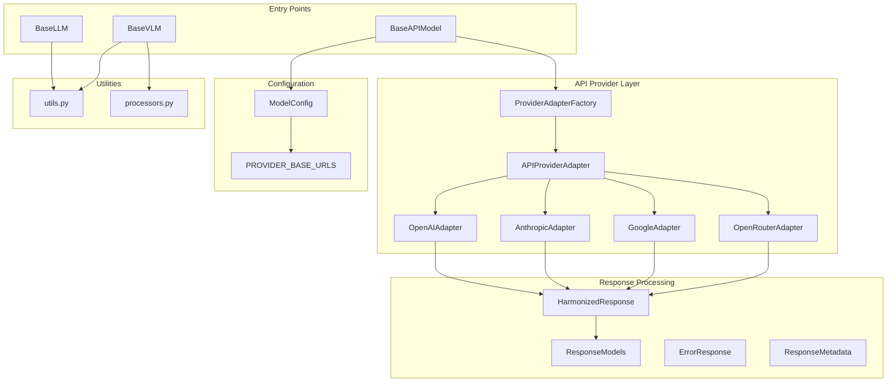
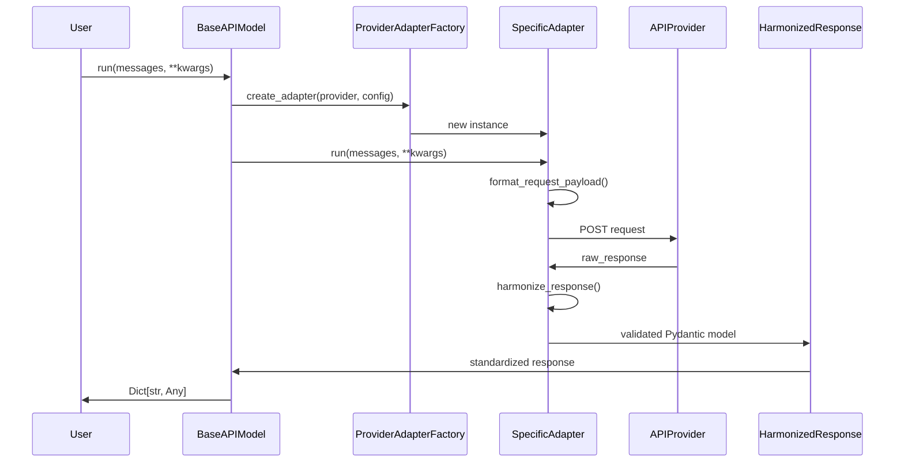
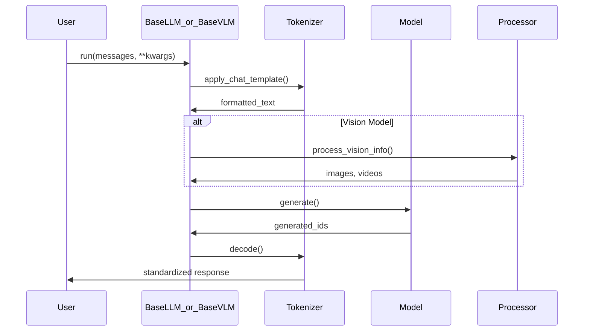

# Models Module Documentation

## Overview

The Models module provides a unified interface for interacting with both local and API-based language models. It implements a clean adapter pattern that harmonizes responses from different providers into a consistent format using Pydantic models for validation and type safety.

## System Architecture

### Core Components



### Data Flow

#### 1. API Model Flow (Primary Path)



**Input/Output Specification:**
- **Input**: `messages: List[Dict[str, str]]`, optional parameters (`tools`, `json_mode`, etc.)
- **Output**: `Dict[str, Any]` with standardized format:
  ```python
  {
      "role": "assistant",
      "content": "Response text",
      "tool_calls": [...],  # List of ToolCall objects
      "reasoning": "...",   # Optional reasoning trace
      "thinking": "...",    # Optional thinking content
      "metadata": {         # Rich provider-specific metadata
          "provider": "openai",
          "model": "gpt-4o",
          "usage": {...},
          "finish_reason": "stop",
          ...
      }
  }
  ```

#### 2. Local Model Flow



**Input/Output Specification:**
- **Input**: `messages: List[Dict[str, str]]`, optional parameters
- **Output**: `Dict[str, Any]` with consistent format:
  ```python
  {
      "role": "assistant",
      "content": "Generated text",
      "tool_calls": []  # Local models don't support tools yet
  }
  ```

### Provider Adapter Architecture

The adapter pattern enables seamless integration of multiple API providers while maintaining a consistent interface:

```python
class APIProviderAdapter(ABC):
    """Abstract base class defining the adapter contract"""
    
    @abstractmethod
    def get_headers(self) -> Dict[str, str]:
        """Provider-specific headers"""
        pass
    
    @abstractmethod
    def format_request_payload(self, messages: List[Dict], **kwargs) -> Dict[str, Any]:
        """Convert standard format to provider-specific payload"""
        pass
    
    @abstractmethod
    def get_endpoint_url(self) -> str:
        """Provider-specific endpoint URL"""
        pass
    
    @abstractmethod
    def harmonize_response(self, raw_response: Dict[str, Any], request_start_time: float) -> HarmonizedResponse:
        """Convert provider response to standardized format"""
        pass
```

Each provider adapter implements these methods to handle:
- Authentication headers
- Request payload formatting
- Response parsing and harmonization
- Error handling

## Model Cards

### BaseAPIModel

**Purpose**: Unified interface for API-based language models

**Key Features**:
- Multi-provider support (OpenAI, Anthropic, Google, OpenRouter, Groq)
- Automatic response harmonization
- Tool calling support
- JSON mode support
- Rich metadata collection
- Custom response processing

**Configuration**:
```python
model = BaseAPIModel(
    model_name="gpt-4o",
    api_key="sk-...",
    base_url="https://api.openai.com/v1/",
    provider="openai",
    max_tokens=1024,
    temperature=0.7,
    thinking_budget=2000,  # For Google/OpenRouter
    response_processor=custom_processor  # Optional
)
```

**Supported Providers**:
- **OpenAI**: GPT-4, GPT-3.5, o1 models
- **Anthropic**: Claude 3.5 Sonnet, Claude 3 Haiku
- **Google**: Gemini Pro, Gemini Flash
- **OpenRouter**: 200+ models with thinking support
- **Groq**: Fast inference for Llama, Mixtral models

### BaseLLM

**Purpose**: Local text-based language model wrapper

**Key Features**:
- HuggingFace Transformers integration
- Chat template support
- Configurable generation parameters
- Device mapping and quantization support

**Configuration**:
```python
model = BaseLLM(
    model_name="mistralai/Mistral-7B-Instruct-v0.1",
    max_tokens=1024,
    torch_dtype="bfloat16",
    device_map="auto"
)
```

**Supported Models**: Any HuggingFace model with chat template support

### BaseVLM

**Purpose**: Local vision-language model wrapper

**Key Features**:
- Vision + text processing
- Image and video support
- Multiple image formats (URL, file, base64)
- Smart image resizing
- Video frame extraction

**Configuration**:
```python
model = BaseVLM(
    model_name="Qwen/Qwen2.5-VL-7B-Instruct",
    max_tokens=1024,
    torch_dtype="bfloat16",
    device_map="auto"
)
```

**Supported Input Formats**:
- Images: URLs, file paths, base64, PIL Image objects
- Videos: Local files with automatic frame extraction
- Mixed text + vision conversations

### ModelConfig

**Purpose**: Pydantic schema for model configuration validation

**Key Features**:
- Automatic API key resolution from environment
- Provider-specific base URL mapping
- Validation of required fields
- Support for both local and API models

**Configuration Schema**:
```python
config = ModelConfig(
    type="api",  # or "local"
    name="gpt-4o",
    provider="openai",  # Auto-sets base_url
    max_tokens=1024,
    temperature=0.7,
    thinking_budget=2000
)
```

## Response Models

### HarmonizedResponse

**Purpose**: Standardized response format with validation

**Structure**:
```python
class HarmonizedResponse(BaseModel):
    role: str = "assistant"
    content: Optional[str] = None
    tool_calls: List[ToolCall] = []
    reasoning: Optional[str] = None  # o1 models
    thinking: Optional[str] = None   # Gemini/OpenRouter
    metadata: ResponseMetadata
```

**Key Methods**:
- `has_tool_calls()`: Check for function calls
- `has_reasoning()`: Check for reasoning traces
- `get_text_content()`: Get all text content combined

### ResponseMetadata

**Purpose**: Rich metadata about API responses

**Structure**:
```python
class ResponseMetadata(BaseModel):
    provider: str
    model: str
    usage: Optional[UsageInfo] = None
    finish_reason: Optional[str] = None
    response_time: Optional[float] = None
    # Provider-specific fields...
```

**Provider-Specific Fields**:
- **OpenAI**: `request_id`, `created`
- **Anthropic**: `stop_reason`, `stop_sequence`
- **Google**: `safety_ratings`, `candidates_count`
- **OpenRouter**: `reasoning_effort`, `site_info`

## Advanced Features

### Tool Calling

All API providers support standardized tool calling:

```python
tools = [
    {
        "type": "function",
        "function": {
            "name": "get_weather",
            "description": "Get weather information",
            "parameters": {...}
        }
    }
]

response = model.run(messages, tools=tools)
if response.get("tool_calls"):
    # Process tool calls
    pass
```

### JSON Mode

Request structured JSON output:

```python
response = model.run(messages, json_mode=True)
# Response content will be valid JSON
```

### Thinking/Reasoning Support

For providers that support thinking:

```python
# Google Gemini
model = BaseAPIModel(
    model_name="gemini-1.5-pro",
    provider="google",
    thinking_budget=2000  # Token budget for thinking
)

# OpenRouter with reasoning
model = BaseAPIModel(
    model_name="qwen/qwen3-14b:free",
    provider="openrouter",
    reasoning_effort="high"  # high/medium/low
)
```

### Error Handling

Comprehensive error handling with provider-specific details:

```python
try:
    response = model.run(messages)
except Exception as e:
    # Detailed error information available
    error_response = ErrorResponse(
        error=str(e),
        provider=model.provider,
        model=model.model_name
    )
```

## Integration with Other Components

### Memory Module Integration

The models module provides standardized responses that integrate seamlessly with the memory system:

```python
from src.memory.memory import Memory

memory = Memory()
response = model.run(messages)

# Memory can directly consume harmonized responses
memory.update_memory(
    role=response["role"],
    content=response["content"],
    tool_calls=response.get("tool_calls", []),
    metadata=response["metadata"]
)
```

### Agent Integration

Agents use models through the standardized interface:

```python
class MyAgent(BaseAgent):
    def __init__(self):
        self.model = BaseAPIModel(
            model_name="gpt-4o",
            provider="openai",
            api_key=os.getenv("OPENAI_API_KEY")
        )
    
    async def _run(self, messages, request_context, run_mode, **kwargs):
        """Pure _run() method - NO side effects."""
        # Model returns HarmonizedResponse (dict)
        response = await self.model.run(messages)
        
        # Return Message object for coordination system
        return Message(
            role="assistant",
            content=response["content"],
            # Optional fields from response
            tool_calls=response.get("tool_calls"),
            name=self.name
        )
```

⚠️ **Important**: The pure `_run()` method should return a `Message` object, NOT the raw HarmonizedResponse dict. The coordination system expects Message objects in the branch memory.

### Coordination System Integration

The coordination system expects harmonized responses:

```python
# In coordination/validation.py
def process_response(raw_response: Dict[str, Any]) -> ValidationResult:
    # raw_response is already harmonized by models module
    if raw_response.get("tool_calls"):
        return ValidationResult(
            is_valid=True,
            action_type="call_tool",
            parsed_response=raw_response
        )
```

## Best Practices

### 1. Provider Selection

- **OpenAI**: Best for general-purpose tasks, excellent tool calling
- **Anthropic**: Strong reasoning, good for complex analysis
- **Google**: Fast inference, good thinking support
- **OpenRouter**: Access to many models, cost-effective
- **Groq**: Fastest inference for supported models

### 2. Configuration Management

```python
# Use ModelConfig for validation
config = ModelConfig(
    type="api",
    name="gpt-4o",
    provider="openai",
    # API key auto-loaded from OPENAI_API_KEY
)

model = BaseAPIModel(**config.dict())
```

### 3. Error Handling

```python
try:
    response = model.run(messages)
except requests.exceptions.RequestException as e:
    # Handle network errors
    pass
except ValidationError as e:
    # Handle response validation errors
    pass
```

### 4. Performance Optimization

- Use appropriate `max_tokens` to avoid unnecessary generation
- Set `temperature=0` for deterministic outputs
- Use `thinking_budget` wisely for Google/OpenRouter models
- Consider local models for privacy-sensitive applications

## Testing

The module includes comprehensive tests covering:

- All API providers with real API calls
- Response harmonization accuracy
- Error handling scenarios
- Tool calling functionality
- JSON mode validation
- Local model integration

Test results are logged with timestamps for analysis and debugging.

## Future Enhancements

1. **Streaming Support**: Add streaming response support for all providers
2. **Caching**: Implement response caching for identical requests
3. **Rate Limiting**: Add built-in rate limiting for API providers
4. **Batch Processing**: Support batch API calls where available
5. **Model Comparison**: Add utilities for comparing responses across providers
6. **Fine-tuning Integration**: Extend local model support for fine-tuned models 