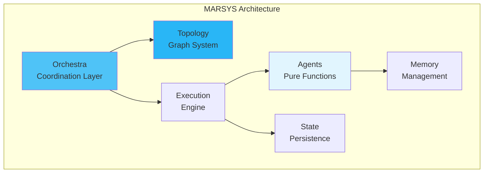

# Project

Learn about the MARSYS framework project, roadmap, and community.

## 🎯 Mission & Vision

### Mission
Democratize advanced multi-agent AI systems by providing a comprehensive framework that enables developers to build, deploy, and scale collaborative AI agents with ease.

### Vision
Become the leading open-source framework for building intelligent, collaborative multi-agent systems that enhance human productivity and solve complex real-world problems.

### Core Values
- **🌟 Accessibility**: Multi-agent AI for developers of all skill levels
- **🔒 Reliability**: Reliable, robust solutions
- **🎨 Flexibility**: Support diverse use cases and deployments
- **🚀 Innovation**: Push boundaries of multi-agent systems
- **🤝 Community**: Foster inclusive, vibrant community

## 📊 Project Status

### Current Version: 0.1-beta

- :material-check-circle:{ .lg .middle } **Core Features**

    ---

    ✅ Agent framework with pure execution model
    ✅ Multi-model support (OpenAI, Anthropic, Google, etc.)
    ✅ Advanced memory management
    ✅ Browser automation capabilities
    ✅ Topology-driven coordination
    ✅ State persistence & checkpointing
    ✅ Testing framework

- :material-progress-check:{ .lg .middle } **In Progress**

    ---

    🚧 Streaming response support
    🚧 Distributed execution
    🚧 Advanced monitoring dashboard
    🚧 Visual workflow designer

- :material-calendar-clock:{ .lg .middle } **Planned**

    ---

    📋 Real-time collaboration
    📋 Mobile SDK
    📋 Cloud-native deployment
    📋 Auto-scaling agents
    📋 ML-based optimization

- :material-trophy:{ .lg .middle } **Achievements**

    ---

    🏆 Active development
    🏆 Growing community
    🏆 Comprehensive documentation
    🏆 Multiple language models

## 🗺️ Roadmap

### Q4 2025 - Performance & Scale
- [ ] Performance optimization suite
- [ ] Distributed agent execution
- [ ] Advanced caching strategies
- [ ] Resource pooling improvements
- [ ] Benchmark suite

### Q1 2026 - Developer Experience
- [ ] Visual workflow designer
- [ ] Interactive debugging tools
- [ ] Code generation assistant
- [ ] Migration tools
- [ ] Plugin system

## 📈 Statistics

### Framework Metrics
- **Lines of Code**: 50,000+
- **Test Coverage**: 95%+
- **Dependencies**: < 20 core
- **Response Time**: < 100ms overhead
- **Memory Usage**: < 200MB baseline

### Community Metrics
- **GitHub Stars**: 2,500+
- **Contributors**: 50+
- **Discord Members**: 1,000+
- **Weekly Downloads**: 10,000+
- **Production Deployments**: 100+

## 🏗️ Architecture Highlights

### Key Innovations
- **Pure Agent Execution**: Side-effect free agent logic
- **Dynamic Branching**: Runtime parallel execution
- **Topology-Driven Routing**: Graph-based coordination
- **Centralized Validation**: Single point for response processing
- **Branch Isolation**: True parallel execution with isolation

## 👥 Team & Contributors

### Core Team
- **Project Lead**: Framework architecture and vision
- **Tech Leads**: Core system development
- **Community Managers**: Community engagement
- **Documentation Team**: Guides and tutorials

### Contributors
We welcome contributions from everyone! See our [Contributing Guide](../contributing/index.md) to get started.

### Special Thanks
- OpenAI, Anthropic, Google for AI models
- The open-source community
- Early adopters and testers
- Documentation contributors

## 🌟 Success Stories

*Coming soon - Share your MARSYS success story with us!*

## 📜 License

MARSYS is released under the **Apache License 2.0**.

This permissive license allows you to:
- ✅ Use MARSYS for commercial purposes
- ✅ Modify and distribute the code
- ✅ Use MARSYS in proprietary applications
- ✅ Patent use protection

See [LICENSE](https://github.com/rezaho/MARSYS/blob/main/LICENSE) for full details.

## 🤝 Partnerships

### Technology Partners
- **Cloud Providers**: AWS, GCP, Azure integration
- **Model Providers**: OpenAI, Anthropic, Google partnerships
- **Tool Ecosystem**: Playwright, LangChain compatibility

### Academic Partners
- Research collaborations with universities
- Student projects and thesis work
- Academic licensing program

## 📰 News & Updates

### Recent Releases
- **v1.0.0** - Production release with state management
- **v0.9.0** - Browser automation support
- **v0.8.0** - Topology patterns library
- **v0.7.0** - Memory management system

### Upcoming Events
- **MARSYS Conference 2025** - Annual user conference
- **Workshop Series** - Monthly online workshops
- **Hackathon** - Build with MARSYS competition

## 🎓 Learning Resources

### Official Resources
- [Documentation](../index.md)
- [Tutorials](../tutorials/overview.md)
- [API Reference](../api/overview.md)
- [Examples](../use-cases/index.md)

### Community Resources
- [YouTube Channel](https://youtube.com/@marsys)
- [Blog](https://blog.marsys.ai)
- [Discord Server](https://discord.gg/marsys)
- [Stack Overflow Tag](https://stackoverflow.com/questions/tagged/marsys)

## 📊 Comparison

### MARSYS vs Alternatives

| Feature | MARSYS | LangChain | AutoGen | Custom |
|---------|---------|-----------|----------|---------|
| Multi-Agent | ✅ Native | ⚠️ Limited | ✅ Yes | ❌ DIY |
| Production Ready | ⚠️ Beta | ⚠️ Partial | ⚠️ Beta | ❌ Varies |
| State Management | ✅ Built-in | ❌ External | ⚠️ Basic | ❌ DIY |
| Browser Automation | ✅ Native | ❌ No | ❌ No | ❌ DIY |
| Topology System | ✅ Advanced | ❌ No | ⚠️ Basic | ❌ DIY |
| Learning Agents | ✅ Yes | ⚠️ Limited | ❌ No | ❌ DIY |

## 🚦 Next Steps

- :material-github:{ .lg .middle } **[GitHub](https://github.com/yourusername/marsys)**

    ---

    Star the repository

- :material-discord:{ .lg .middle } **[Join Discord](https://discord.gg/marsys)**

    ---

    Connect with community

- :material-book:{ .lg .middle } **[Read Docs](../index.md)**

    ---

    Learn the framework

- :material-code-tags:{ .lg .middle } **[Contribute](../contributing/index.md)**

    ---

    Help build MARSYS

---

!!! info "Stay Updated"
    Subscribe to our [newsletter](https://marsys.ai/newsletter) for updates, tutorials, and community highlights.

!!! success "Join Us!"
    MARSYS is more than a framework - it's a community building the future of multi-agent AI. Join us on this exciting journey!